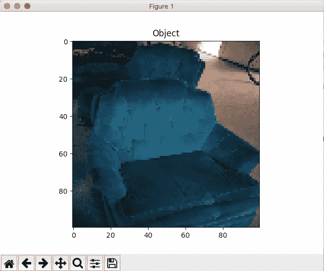
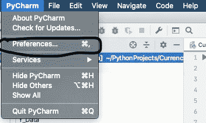
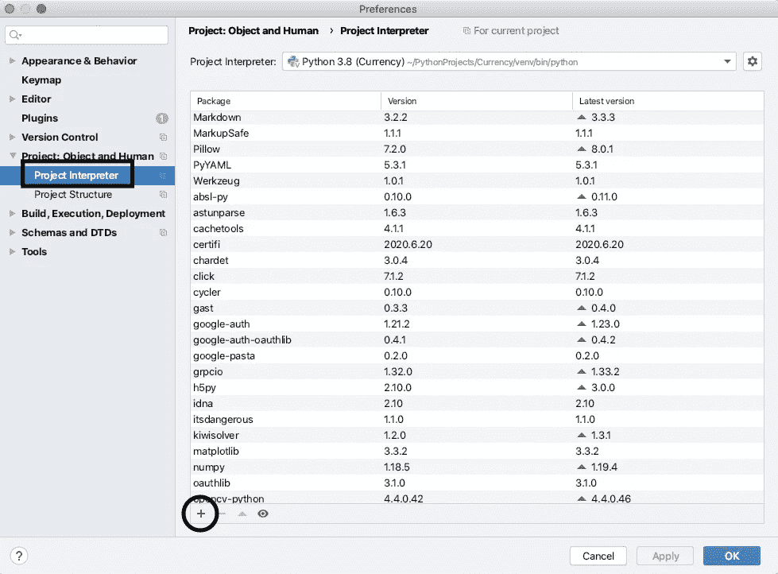
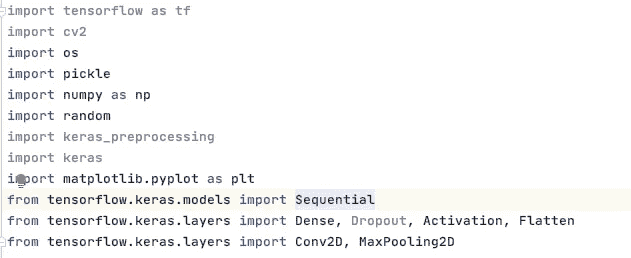
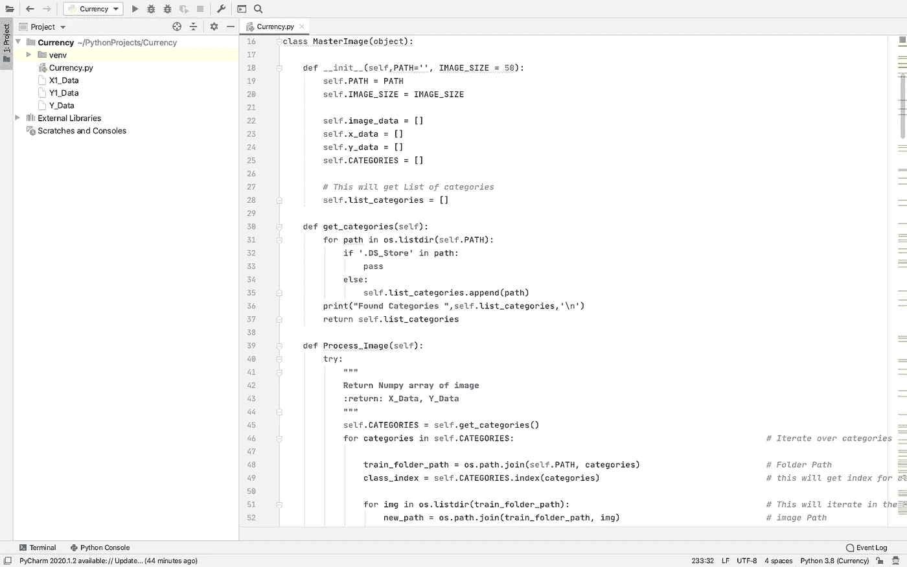
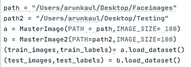
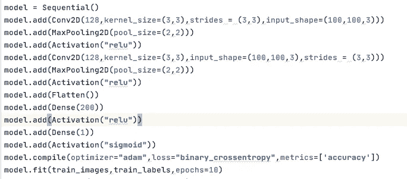
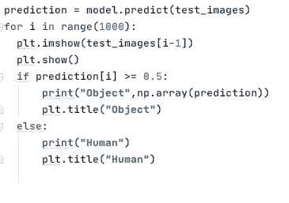

# 在 Pycharm 中制作您的第一个监督学习模型。(物体和人体图像分类器)

> 原文：<https://medium.com/analytics-vidhya/make-your-first-python-ml-model-using-pycharm-object-and-human-image-classification-809b766b3d81?source=collection_archive---------6----------------------->

上面的图像向你展示了我们的最终项目将会是什么样子，并识别人和物体。所以让我们一步一步开始:

# 步骤 1:下载库

A.点击 Pycharm，然后点击首选项:

B.添加库；打开你的项目解释器，点击+号来添加库

在代码中添加和导入这些库

# 步骤 2:使用这个类加载数据集

最后会给出这个类的代码

如何使用该类:

使用此语法中的类加载数据

请记住，您给出的路径必须同时包含对象和人类图像的文件夹。

第三步:制作机器学习模型

这是我做的机器学习模型，如果你愿意，你可以自己做

步骤 4:预测和图像

使用此代码来预测和显示图像

在哪里可以找到代码和图像数据集:

 [## Python 对象和人类分类器机器学习模型。

### 上面的图像向你展示了我们的最终项目将会是什么样子，并识别人和物体。所以让我们一步一步地开始…

www.thedataseller.com](https://www.thedataseller.com/post/python-object-and-human-classifier-machine-learning-model) 

你可以从我网站上的另一篇文章中下载代码。代码将以 doc 格式在文章的末尾给出，因此您可以复制粘贴它，并根据自己的方便进行编辑。

下载数据集:

你会在我的网站上找到免费的人类和物体数据集，所以你可以很容易地下载它。

 [## 开源机器学习数据集| DataSeller

### DataSeller 向您展示了使用我们的数据集很容易制作的机器学习教程。我们通知你…

www.thedataseller。](https://www.thedataseller.com/) 

你想学习如何在没有任何代码的情况下制作一个面具检测应用程序吗？

请务必观看这段视频:

感谢您阅读我的文章意义重大:)

## 一些对我有帮助的书籍和资源！：

1.Amazon.in 链接:[https://amzn.to/3tMN5Xf](https://www.youtube.com/redirect?event=video_description&redir_token=QUFFLUhqblBWV2lOU2FGQjJTMGd5Xzd0cjh6VlhmRy1KUXxBQ3Jtc0ttaWZ1NWNLaG04YUNJQjA1TU9zWkhVWGZFZHpLUkZrbkt3TTVqRjk1OVRPbkFpX2FFLVV1Wl9rQU1lUW5kZXF6X2h1WC1UeGlZODMzQmNqeTFFXzAxdnZ4R3JSalJfQmpPNnJxbzdndVRDTy1Xb0MzOA&q=https%3A%2F%2Famzn.to%2F3tMN5Xf)(针对初学者)

Amazon.com 链接:【https://amzn.to/3NruKa5 (针对初学者)

2.亚马逊链接:[https://amzn.to/35jTcZT](https://www.youtube.com/redirect?event=video_description&redir_token=QUFFLUhqbHA5TjQtSmdhM2JlcU9wVFRiMWcxeTRsRVp3d3xBQ3Jtc0trTzM1YWtLUEVQS1lPQVM0Y1cyMzlMNTJiTFVCa29RTlkzR0FETlNLSUlHdWxrbU85OXBSVV91bEVBeVlUNEdCNS1SdExwWjBBams0enVCbEcwQ1p5SXRmc29SQlZJVDYxakZ1WnRnSGVzNnhpY3VfSQ&q=https%3A%2F%2Famzn.to%2F35jTcZT)(高级)

Amazon.com 链接:【https://amzn.to/3JR1Kq1[(](https://amzn.to/3tLILaI)为高级)