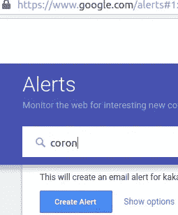
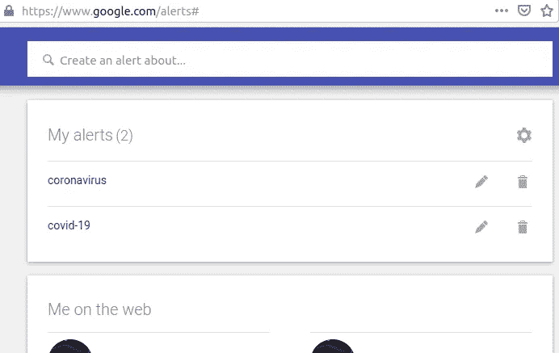
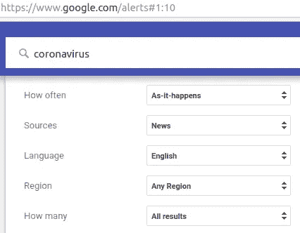
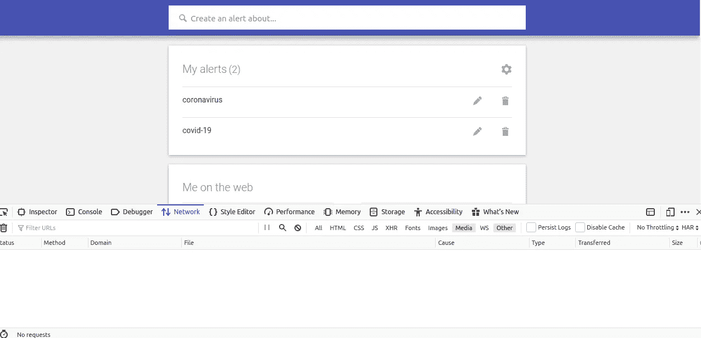
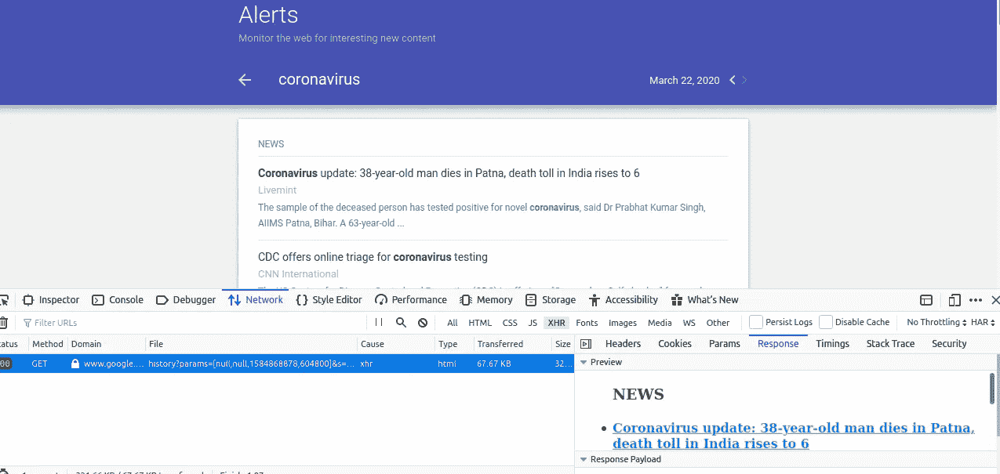
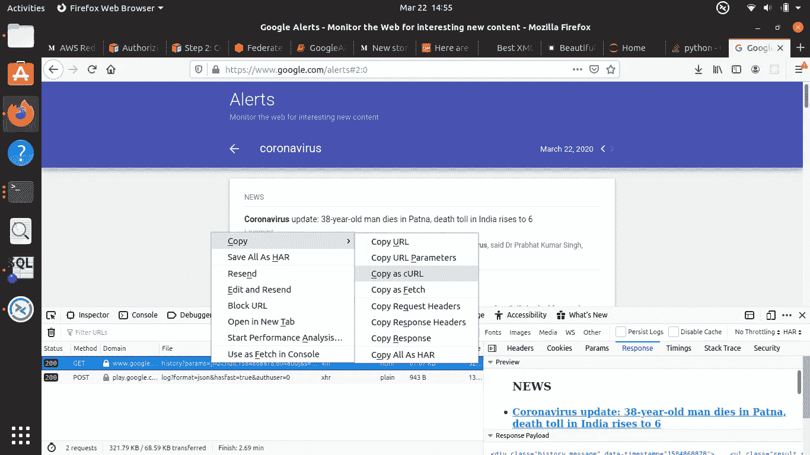
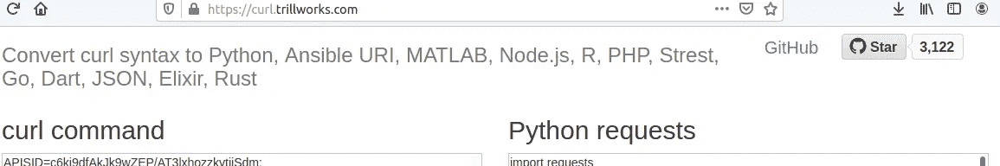
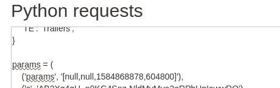
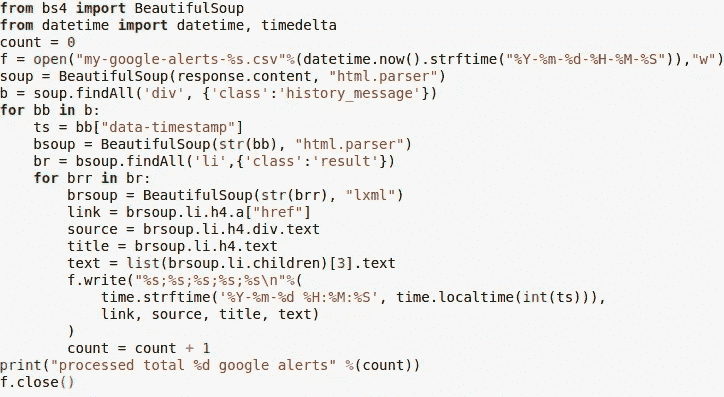
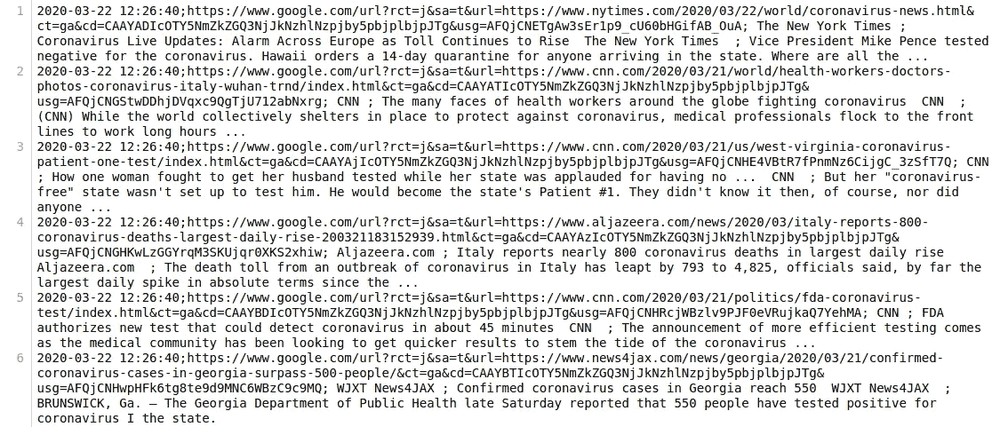

# 用谷歌快讯制作你自己的新冠肺炎实时数据

> 原文：<https://medium.com/analytics-vidhya/makeyourown-covid-19-realtime-data-with-google-alerts-e7ec70970cab?source=collection_archive---------10----------------------->

直奔主题——希望生成一个关于新型冠状病毒的实时知识反馈，就像它发生的那样。
首先，配置 Google Alerts —
点击【https://www.google.com/alerts】的[并登录。输入您想要配置这些警报的文本](https://www.google.com/alerts)



去寻找完全匹配的词，如冠状病毒，新冠肺炎等。

配置好警报后，看起来像是:



当你创建一个提醒时，进入“显示选项”并确保你有以下设置:



在“发送至”部分—选择您的“电子邮件 id ”,然后单击“创建提醒”

**#ShowMeTheCode** B-) :
接下来几个简单的步骤，通过 web 请求检索这些提醒。右键单击打开“检查元素”部分，如下所示，并移动到“网络”选项卡。查找“xhr ”,然后点击/单击那里。可选地单击“垃圾桶”图标有助于使其看起来像:



我在 Mozilla Firefox、谷歌 Chrome 开发工具上做这个，可能类似或有点细微差别。

单击任一警报。比方说我点击“冠状病毒”，我看到网络选项卡如下，接下来:



你看，在正常情况下，你在“新闻”下面看到的是用蓝色高亮显示的“GET”方法请求的响应。

右键单击它。并查找“复制为卷曲”。



您看到的头、Cookies 和参数都被压缩成一个 cURL 请求，我们刚刚为这个 GET 请求复制了这个请求。这个请求为我们带来了所示的响应。

蟒蛇男？我也是——哦，天哪！这些 [galerts](https://pypi.org/project/galerts/) 和 [googlealerts](https://pypi.org/project/google-alerts/) python 包，它们就是不工作。至少对我来说不是。无论如何，这是一个简单的提醒！

另一个方便的在线工具是“cURL to [Python Requests](https://pypi.org/project/requests/) ”转换器。启动[https://curl.trillworks.com/](https://curl.trillworks.com/)将复制的 cURL 请求转换成 Python 请求库代码。



下面没有显示文本，只是复制并粘贴 cURL 命令下的 teh cURL，并查找右边的“Python 请求”部分

试着将“Cookies”、“Headers”、“Params”部分与前面提到的“Inspect Element”网络标签中的部分区分开来，你就会意识到 web 请求是如何被制作成 python 源代码的。

注意 Python 请求部分的“params”元组——向下滚动就会发现。那里的 1584868878，实际上是当前的纪元时间。



保持其他参数不变。我们基本上需要明智地选择我们的时间纪元，以匹配当前的时间戳，即感兴趣的时间。

在 python 中，内置了“时间”包，您可以获得当前的时间戳，在我带您浏览时启动 python shell:


你在这里得到的这个值是当前的时间戳纪元，你可以在:[https://www.epochconverter.com/](https://www.epochconverter.com/)中输入这个纪元值来验证

现在，您至少已经完成了 Google Alerts 检索，只需粘贴代码片段就可以让我们进入同一页面:

```
import requests
import timecookies = {//your cookies under the “python request” section in curl.trillworks.com tab}headers={//your headers under the “python request” section in curl.trillworks.com tab}params = (
 (‘params’, ‘[null,null,%s,604800]’%(int(time.time()))),
 (‘s’, ‘<value-for-this-under-curl.trillworks.com tab python section>’),
)response = requests.get(‘[https://www.google.co.in/alerts/history'](https://www.google.co.in/alerts/history'), 
headers=headers, params=params, cookies=cookies)print(response.contents)
```

这个“response.contents”在打印时将显示一个很长的 html，从中可以找到所有这些警报。诀窍是通过用 int(time.time())替换“params”中的第三个参数来获得最新的警报，即当前纪元时间。

**接下来的回应是什么？**
到目前为止，我们已经自动检索了警报。但是这个响应还是一个 html，我们需要从中解析/挖掘所需的属性。我相信，挖掘新闻来源、网络链接、标题和文本应该是一个很好的开始。我们开始吧！

确保你已经安装了 Python 包、[bs4](https://pypi.org/project/bs4/)/[beautiful soup 4](https://pypi.org/project/beautifulsoup4/)和 [lxml](https://pypi.org/project/lxml/) 。你可以这样安装:pip 安装<包名>

虽然您可能尝试在另一个在线实用程序中粘贴和格式化“response . contents:[https://jsonformatter.org/xml-parser](https://jsonformatter.org/xml-parser)我有以下代码片段来帮助您解析我们想要的内容:



这将使您将这些警报的详细信息写入 csv 文件，以“；”分隔分号。

看起来像这样:



我们打印警报的 CSV 文件。

很好。很容易。搞定了。
虽然这是一篇博客要涵盖的大量工作，特别是对于 python /编码新手来说，但这仅仅是开始，我们期待将它扩展到:

>*自动化 google alerts 获取*:一个 cron-job 或一个调度的工作流来保持获取警报，并附加或创建每日 CSV。

>*重复数据删除*:下一次当您运行它时，它可能不仅会获取更新的提醒，还会带来这些已经处理过的旧的 google 提醒。我们可以根据标题哈希来维护提取/处理的警报，并且在我们的迭代中只支持 delta / new google alerts，这可能是“检索关于新冠肺炎/冠状病毒的 google alerts”的 v2.0 版本，采用了本博客中描述的策略。

>超越数据，深入洞察:可视化、文本挖掘，因为我们也将 html 解析扩展到新闻源链接，等等。这将使它成为一个成熟的工具，具有强大的功能和实用性，每个数据组织现在都试图受益于对冠状病毒和事态的见解！

敬请关注！