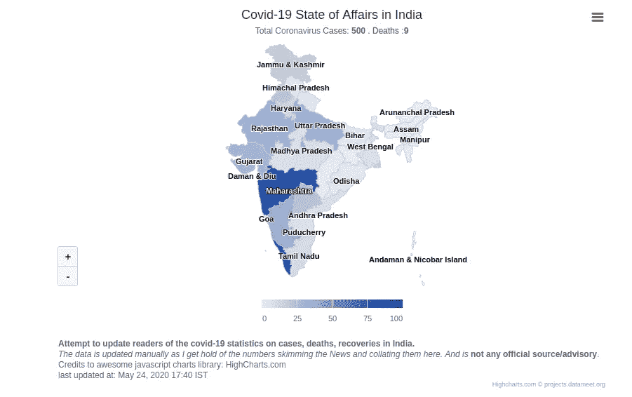
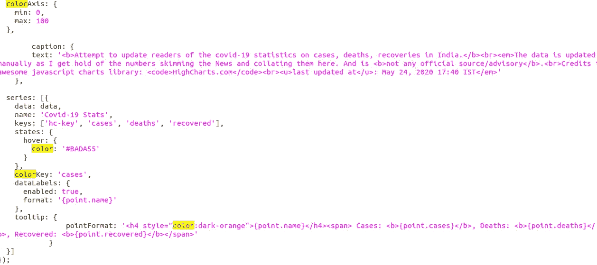

# 制作您自己的新冠肺炎统计(印度)地图

> 原文：<https://medium.com/analytics-vidhya/makeyourown-covid-19-stats-india-map-2300520c8a97?source=collection_archive---------23----------------------->

显示冠状病毒在印度各邦爆发的影响的地图可视化

我真的很赞赏这个令人敬畏的可视化库——https://www.highcharts.com/。受到启发，我想到建立一个项目，展示对印度冠状病毒爆发的国家分析。

让我快速向你们介绍一下我是如何制作的:

这并不像看起来那么难，就这件事而言非常容易——一旦掌握了 [HighCharts 文档](https://www.highcharts.com/docs/index)，即使对新手来说也只需要 4-5 个小时。

最起码，我们需要:

【index.html 

此处提供:[https://github . com/Bohemia 420/Bohemia 420 . github . io/blob/master/index . html](https://github.com/bohemia420/bohemia420.github.io/blob/master/index.html)该 html 文档的要点是:

这将调用 index.js 文件，如下所示:

[https://github . com/Bohemia 420/Bohemia 420 . github . io/blob/master/index . js](https://github.com/bohemia420/bohemia420.github.io/blob/master/index.js)

您将数据指定为数组的(json)数组，包含以下元素:

var data = [ ["安达曼&尼科巴岛"，0，0，0]，["古吉拉特"，29，1，0]，["比哈尔"，2，1，0]，… ]

这里，第一个(第零个)是州名，它必须是精确的州名(这些是由 HighCharts 库中的 HighMaps 类提供的)

> 接下来的元素分别是病例、死亡和康复。

跳到:

> Highcharts.mapChart('container '，{
> chart:{
> map:' countries/in/custom/in-all-disputed 3 '
> }，

这里，您调用的是从 html 中指定的 highcharts.js 导入的 HighCharts 类的 mapChart 函数，

在这里，最有争议的 3 是关于 J&K 以及它是最新的，关于:特伦甘纳河等。

添加/替换:

图表、标题、副标题、关键字、颜色关键字等。浏览这段 javascript 代码将有助于您轻松识别和连接这些点。

数据、键等字段在 series 参数中被引用:

这里是 index.js 的主要部分—仔细观察 colorKey、keys、tooltip 和 colorAxis 参数/对象

鳍。