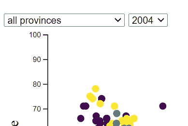

# 使 d3.js 散点图具有交互性—第二部分

> 原文：<https://medium.com/analytics-vidhya/making-a-d3-js-scatter-plot-interactive-part-two-f89bed0cb089?source=collection_archive---------17----------------------->

本教程是从[之前的](/@sabahatiqbal/making-a-d3-js-scatter-plot-interactive-19916fb10bb1)教程中挑选出来的。提醒一下，这是数据结构的样子:


贫困率是 y 轴值，最后一列中的指标是 x 轴值，随每个数据集而变化。

在上一个教程中，我们更改了省值，但在本教程中，我们将更新年份。(在 [Github](https://github.com/SabahatPK/Data4Pakistan_PovertyIndicator_INTERACTIVE_a) 上的所有代码和演示可在[这里](https://interactive-scatter-tutorial-2.netlify.app/)获得)。这意味着我们将需要调用`update` 选择，因为我们想要选择已经显示在页面上的数据点，并且 ***以某种方式改变*** (与调用从页面移除数据点的`exit` 或向页面添加数据点的`enter`相反)。

和前面的教程一样，我们必须首先“捕获”用户的选择，在本例中是`Year` 值。这可以通过多种方式实现，但我们将再次使用下拉元素，它位于省下拉列表的旁边:



现在，除了使用`Province`值，还使用`Year`值过滤数据。所有这些都是基本的 JS，所以这里没有什么新东西:

```
//Function that builds the right chart depending on user choice on website:
function updateChart(someData) {
 let dataAdultLit = d3
 .nest()
 .key(function (d) {
 return d[“Year”];
 })
 .entries(someData[0]);let selectedDate = new Date($(“#yearChoice”).val()).toString();let filteredData = dataAdultLit.filter(
 (each) => each.key === selectedDate
 )[0];filteredData =
 $(“#geographicChoice”).val() === “allProv”
 ? filteredData[“values”]
 : filteredData[“values”].filter(
 (each) => each[“Province”] === $(“#geographicChoice”).val()
 );//More code...}
```

添加一个函数来捕捉用户的选择，然后触发图表的更新。同样，没什么新鲜的:

```
//Add in event listener for Year choice.
$(“#yearChoice”).on(“change”, function () {
 updateChart(allData);
});
```

## d3 更新模式:进入、更新、退出

现在，我们需要考虑每当用户选择一个新的`Year`时，图表的哪些部分需要改变。显然，有了新的`Year`，唯一应该改变的元素是图表中的圆圈。不会改变的元素？x 轴、y 轴、轴标签、色标。最佳实践是从`updateChart`函数中取出该代码，因为我们不希望每次用户改变`Year`值时都重新创建这些元素。这有两个原因:

1.  性能—一般来说，不要重新运行不必要的代码。
2.  美观—如果 x 轴和 y 轴代码在每次更新`Year`时运行，我们将在页面上以多个轴相互叠加而结束。起初它们可能不明显，但过一会儿线条和刻度会变粗。这很糟糕。

所以，我们必须把东西移到`updateChart`之外。太好了。但是要小心。我们不应该移动那些链接到`updateChart`中的参数的代码行，在这里是数据集。

在我们的例子中，因为 x 轴、y 轴或色阶的属性都不使用数据集中的任何数据，所以我们可以安全地将所有代码移出函数。我们不能将代码移出函数的一个例子:例如，如果任一轴的`domain`属性依赖于数据集中的一个值(这是`updateChart`中的一个参数)

所以，现在我们知道我们想要更新图表上圆圈的位置。我们如何做到这一点？通过更新它们的`cx`和`cy`属性。所以心理模型是:

1.  用默认的`Year`值加载网页，即`2004`。
2.  将数据加入 SVG 元素，即`circle`。
3.  显示图表。这是 d3 更新模式的**输入**部分。
4.  用户选择新的`Year`值。
5.  所有现有的圆必须移动到新的`cx`和`cy` 位置。这是 d3 更新模式的**更新**部分。
6.  如果新的`Year`值没有特定圆的数据，即新的`Year`值缺少`District`的数据，则必须移除该圆。这是 d3 更新模式的**退出**部分。我们在上一个教程中看到了这一点。

所以我们知道我们必须运行每个部分:进入，更新，退出。只不过我们不按那个顺序来。相反，在数据连接之后:

```
// JOIN data to elements.
 let circles = svg.selectAll(“circle”).data(filteredData, function (d) {
 return d[“District”];
 });
```

1.  我们选择一个新的`Year`值，首先，**移除**任何不再需要出现在屏幕上的圆圈。这些基本上是在默认`Year`中有值的`Districts`，但是由于某种原因(通常是缺少数据)，相同的`District`没有新`Year`的数据。因此，运行`exit`步骤:

```
//EXIT old elements not present in new data.
 circles.exit().remove();
```

2.然后，我们运行更新步骤。注意:没有实际的更新关键字(就像`exit`和`enter`一样)。本质上，我们只是运行与`enter`相同的代码，但只改变那些需要根据新数据而改变的属性，即新的`Year,`:

```
//UPDATE existing elements to new position in graph:
 circles
 .attr(“cy”, function (d) {
 return y(d[“Poverty Rate (%)”]);
 })
 .attr(“cx”, function (d) {
 return x(
 d[
 “Adult literacy, 25 or more years old (% of population aged 25 or more)”
 ]
 );
 });
```

3.最后，我们运行`enter`步骤:

```
// ENTER new elements present in new data.
 circles
 .enter()
 .append(“circle”)
 .attr(“class”, “enter”)
 .attr(“fill”, function (d) {
 return color(d[“Province”]);
 })
 .attr(“cy”, function (d) {
 return y(d[“Poverty Rate (%)”]);
 })
 .attr(“cx”, function (d) {
 return x(
 d[
 “Adult literacy, 25 or more years old (% of population aged 25 or more)”
 ]
 );
 })
 .attr(“r”, 5);
}
```

当数据连接到 SVG 圆形元素时，它立即返回三个选择。我们可以看到这是我们在数据加入步骤后立即进行的`console.log(circles)`:


数据连接的结果。

`_enter`选择包括作为数据连接的结果而存在但未在图表上显示的所有数据元素。在 web 页面的初始启动阶段，这是唯一一个绑定了数据的页面。

`_exit`选择包括所有不再有数据元素链接的 SVG 元素。这在初始页面启动时是空的。

`_groups`选择包括图表上的所有 SVG 元素。这在初始页面启动时是空的。

每次数据更改时，这些选择都会更新，因此您可以对它们进行一些操作，例如，向页面添加具有特定属性的 SVG 元素，从页面中删除 SVG 元素，更改页面上已有的 SVG 元素的属性。

进入、更新、退出的概念很难理解。所以，如果你没有马上得到它，也不要担心。这需要练习。

如果你遇到任何问题，请留下评论。