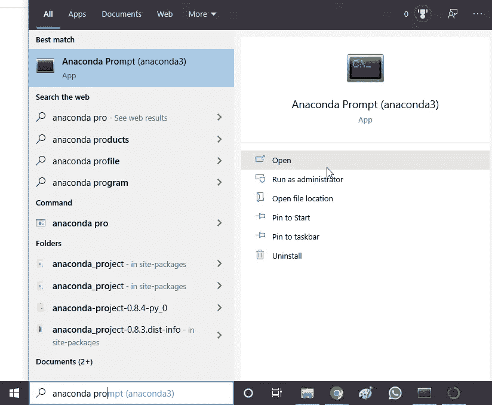
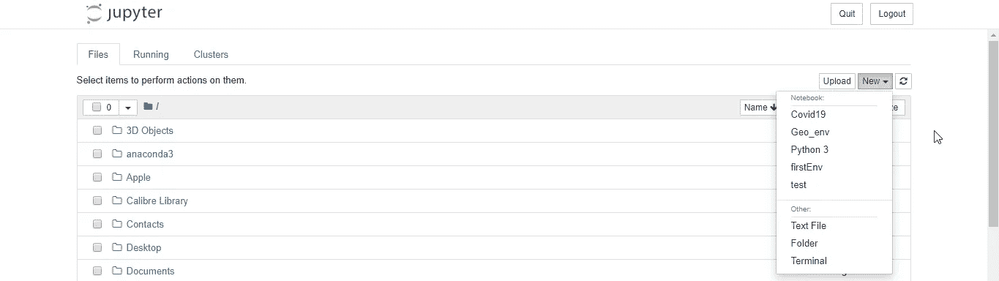

# 如何创建新的康达环境并与 Jupyter 笔记本配合使用？

> 原文：<https://medium.com/analytics-vidhya/making-a-new-conda-environment-and-using-it-inside-jupyter-notebook-3191e3362dc9?source=collection_archive---------4----------------------->


有时在基础环境中安装一些 python 包变得非常困难。我遇到了一个名为 Geopandas 的包。我想在地图上可视化新冠肺炎数据，并为此需要 geopandas，但安装它是如此困难，以至于 anaconda 在尝试解决环境问题时被困了几个小时。对于这样的时刻，康达环境变得很方便。我们可以准确地配置我们需要的软件包，并让事情为我们服务。在本教程中，我将向您展示如何从头开始创建一个新的 Conda 环境，然后在 Jupyter 笔记本中使用它。

第一部分是导航到 windows 开始菜单。我在这里假设您已经安装了 Anaconda 包管理器。如果没有，请用这个[链接](https://www.anaconda.com/products/individual#download-section)下载。这是一个非常简单的过程。回到开始菜单，搜索“Anaconda 提示符”。因为我使用的是 windows，所以所有的 anaconda 命令都需要经过 Anaconda 提示符。请参考下图:



使用 Anaconda 提示符建立新的 Conda 环境

点击“打开”，将会打开“Anaconda 提示”。现在我们需要逐一执行以下任务。

1.  创造新的康达环境。
2.  激活新创建的 conda 环境。
3.  安装所需的软件包。
4.  创建一个内核。
5.  启动 Jupyter 笔记本。

很明显，我们会从创造一个新的康达环境开始。

```
conda create --name Covid19
```

这段代码创建了一个名为“Covid19”的新 anaconda 环境。继续激活这个环境。

```
conda activate Covid19
```

该代码激活名为“Covid19”的 Conda 环境。请注意左侧的环境名称是如何从(base)变为(Covid19)的。这表明我们的环境“Covid19”现在已被激活。

现在我们需要安装我们需要的包，因为我正在寻找 Geopandas，我将使用下面的代码来安装 geopandas:

```
conda install -c conda-forge geopandas -y
```

这段代码将在环境中安装 geopandas。现在我们只剩下启动内核了。我们可以通过运行以下命令来做到这一点。

```
conda install nb_conda_kernels -y
```

应该差不多了。最后一个过程就是启动 jupyter 笔记本。我们只需输入就能旋转它

```
jupyter notebook
```

这样，一个新的 Jupyter 笔记本应该启动，这一次，新的选项卡应该有一个名为“geopandas-env”的新内核。点击这个内核，我们就有了一个安装了 geopandas 的环境。



我真的希望这能有所帮助。快乐编码。

如果你对 Covid19 全球可视化感兴趣，请点击[这里](/me/stats/post/52797b5dcc19)。