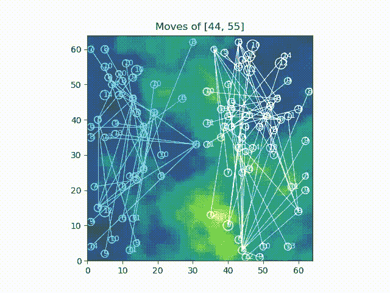

# 为开放式健身房创造自我游戏环境

> 原文：<https://medium.com/analytics-vidhya/making-a-self-play-environment-for-openai-gym-23486bc44d6f?source=collection_archive---------9----------------------->


# 序

首先，我要说的是，我的这篇文章面向所有人，而不仅仅是那些对 python 有丰富经验的人。我本人不是 python 专家，即使我喜欢用它编程。所以，如果你发现任何不清楚的地方，请在评论中告诉我，我会尽力澄清的！我也试图把这篇文章作为一个学习的经验，所以我道歉，如果我很慢！但是为了补偿，我把这篇文章变成了 TLDR！要了解我是如何解决这个问题的，请点击这里查看第 1 部分！

# 介绍

我最近用 python 做了一个可爱的小战术游戏。目标主要是复制历史上的军事战术。下面是用 matplotlib 绘制游戏每一帧的动画。我很喜欢制作它，我计划在将来的某个时候把它变成一个真正的游戏！



然而，就目前而言，我想制造一个可以玩这个游戏的 AI，并有希望展示一些军事战术！为此，我计划使用开放 AI 的基线，可以在[这里](https://github.com/openai/baselines)找到。在这里，我将讨论我是如何处理这个问题的，因为我无法在网上找到一个通用的方法！只是一个免责声明，但我不是专家数据科学家或类似的东西，所以请纠正我，如果我犯了错误或做了一些不好的做法，因为我真的很想学习！

# TLDR；

我发现 OpenAI 的基线不支持自我播放，所以我决定修改一下代码，让它可以接受自我播放！我计划在一个多部分的系列中讨论我是如何做到这一点的，因为当我最初写它时，它变得太长了。你可以在这里阅读[第一部](/@isamu.website/understanding-openai-baseline-source-code-and-making-it-do-self-play-part-1-9f30085a8c16)！

反正首先克隆我做的 git 库(我后面会说我改了什么！)通过

```
git clone [https://github.com/isamu-isozaki/baseline-selfplay.git](https://github.com/isamu-isozaki/baseline-selfplay.git)
```

或者点击[这里](https://github.com/isamu-isozaki/baseline-selfplay)进入！

我将在下面解释这个库是做什么的，这也在我的自述中。

# **基线-自玩**

这个库主要是为了让 OpenAI 的基线(可以在[这里](https://github.com/openai/baselines)找到)可以自己玩！这样，我使它现在可以通过与自己战斗来训练了！我在这里做的一件事是，我决定代理查看一个环境，执行他们的操作(或者什么都不做)，只有在他们都选择了他们的操作之后，环境才会更新。这是因为对于我的环境来说，我希望如此。

然而，如果有需求(来自我或用户)，我想我可能会添加一个选项，如果用户输入，环境更新！此外，我刚刚完成这个，所以如果你有任何问题，请在下面留下评论！

# **执行**

奔跑

```
python -m baselines.run — env=your_env_id — env_type=your_env_type
```

下面我将讨论你的 _env_id、你的 _env_type 以及你的 _module_name 的细节，我将在后面定义它们！

# **安装要求**

到目前为止，这个库只在 python 3.7.1 上测试过，但是它可能在其他版本上也能工作！无论如何，一旦你执行了

```
git clone [https://github.com/isamu-isozaki/baseline-selfplay.git](https://github.com/isamu-isozaki/baseline-selfplay.git)cd baseline-selfplaypip install -e .
```

它应该已经开始运行了！

# **环境要求**

我做这个是为了，我需要确认一下，但它不会影响任何一个普通的露天体育馆。所以，你仍然可以用它们做事情。

这些要求将包括定制环境的要求

但是，自我游戏环境的要求是

1.它一定是一门课

2.它有一个表示边数的边属性

3.必须有方法单步执行、重置和呈现

4.观察空间和动作空间必须在环境的 **__init__** 函数中定义为属性，如

```
from gym import spacesself.observation_space = spaces.Box(low=0.0, high=1.0, shape=[10,10,3], dtype=np.float32)self.action_space = spaces.Box(low=0.0, high=1.0, shape=[10], dtype=np.float32)
```

要查看空间列表，请点击[这里](https://github.com/openai/gym/tree/master/gym/spaces)！

# **步进功能要求**

1.阶跃函数必须接受一个一维的动作。

2.step 函数返回 None，None，None，None，如果某些边还没有更新，保存该边的动作。这是因为我想在各方都决定采取行动时才更新环境。一旦各方都设定了行动，该函数必须返回观察结果、奖励、环境是否完成、布尔值(真或假)和可选信息(字典)。

3.所有返回的值必须在列表或 numpy 数组中返回，其中基本索引表示给定的观察、奖励、完成和可选信息对应于哪一方。例如，obs[0]表示在进行动作和环境更新之后进行的观察侧 0。

4.step 函数必须将动作设置为当前侧。当前边的计算方法是将当前边加 1(从 0 开始)，然后用 self.sides 得到余数！

# **复位功能要求**

1.重置环境并以与上面相同的形式返回观察结果，但将其放在一个列表中。因此，如果我们调用返回值 obs，obs[0]对应于从阶跃函数返回的 obs

# **渲染功能要求**

1.  返回列表中的渲染图像。因此，img[0]将是图像。img[0][0]将是第 0 面的渲染图像。我在我的环境中使用 OpenCV 来实现这个函数，结果是这样的！


经过 10 分钟的训练

我想我需要把它做得让双方能更多地看到对方，不那么拥挤，但我认为它看起来很好！

# **环境类型要求**

这是将要安装环境的文件夹。环境模块的文件夹结构是这样的(感谢 [Ashish Poddar](/@apoddar573/making-your-own-custom-environment-in-gym-c3b65ff8cdaa) ！这些东西大部分是我从他那里学来的，所以请去看看他的文章吧！只需点击他的名字)

```
your_module_name/
  README.md
  setup.py
  your_module_name/
    __init__.py
    your_env_type/
      __init__.py
      env.py
```

这将是您的 _env_type 的来源。您的 _env_id 将来自

```
from gym.envs.registration import registerregister(
    id=your_env_id,
    entry_point=your_module_name.your_env_name:the_name_of_the_class_that_is_your_environment,
)
```

您的环境的类名必须是您的环境的类名。

请注意，您的 _env_id 需要采用 env_name-v0 的形式，或者您喜欢 regex，

```
^(?:[\w:-]+\/)?([\w:.-]+)-v(\d+)$ 
```

否则，将会出现错误。

当然，以上都需要是字符串。这将放在外层的 **__init__** 文件中。在内部的 **__init__** 文件中，你几乎只是导入了你的环境，但是它必须引用模块。我的意思是内部的 **__init__** 文件必须通过

```
import your_module_name.your_env_name.env import the_name_of_the_class_that_is_your_environment
```

然后，在 setup.py 中，只需编写如下代码

```
from setuptools import setupsetup(name=your_module_name,
      version='0.0.1',
      install_requires=[installation requirements]
)
```

安装要求应该如下所示

```
install_requires=[“tensorflow-model-optimization==0.1.1”,
“tqdm==4.39.0”,
“wincertstore==0.2”]
```

最后，只管去做

```
pip install -e .
```

在你目录的顶层，你有你自己的游戏环境。

然后，进入克隆的 git 存储库中的 baselines 文件夹。在其中，您应该可以找到 run.py

```
import tactic_game_gym
```

随着

```
import your_module_name
```

我想我可以让你的模块名成为一个参数并导入它，但是我在使用 importlib 的时候失败了，所以我现在正在考虑另一种方法。无论如何，直到那天，请坚持这个！

然后，通过键入以下命令进行安装

```
pip install -e .
```

在克隆的基线存储库中！然后，你应该都准备好了！

最后，跑

```
python -m baselines.run — env=your_env_id — env_type=your_env_type
```

而且应该开始训练了！

# 一些论点

1.env —您的环境 id，默认 ID 是 Reacher-v2。类型是字符串。

2.env_type —环境的类型，在无法自动确定环境类型时使用。我在这里设置了默认的战术游戏，但你可以改变它，如果你想！类型是字符串。

3.种子——这是你的 RNG 种子。默认值为 None，类型为 int。

4.alg —这是将要选择的算法。默认值为 ppo2。类型是字符串

5.num _ timesteps 时间步长的数量。有趣的是，类型是 float，默认值是 1e6，也就是一百万。这是代理训练的时间步数。

6.网络—这是网络类型(mlp、cnn、lstm、cnn_lstm、conv_only ),默认为无。对于 ppo2，如果将其设置为“无”，则选择 mlp(多层感知器)。我不确定其他的算法

7.gamestate —要加载的游戏状态(目前只在复古游戏中使用)。所以，除非你和他们一起工作，你可以忽略这一点

8.num_env —并行运行的环境副本的数量。未指定时，Atari 设置为 CPU 数量，Mujoco 设置为 1。默认值为 None，类型为 int！

9.奖励比例—奖励比例因子。这将在每个时间步长上用该因子乘以奖励。默认值为 1.0。类型是 float。

10.save _ path 这是保存已训练模型的路径。默认值为无。类型是字符串。

11.save_video_interval —每 x 步保存一次视频(0 =禁用)。默认值为 0。这会将视频保存在 log_path 中的 videos 文件夹中。类型是 int

12.save_video_length —录制视频的长度。默认值:200。这将在这么多的时间步切割视频，然后继续制作一个新的。类型是 int

13.log _ path 保存学习曲线数据的目录。默认值为 None，类型为 string。

14.播放—这将使代理在训练后真正开始播放，直到您停止播放。我想我会修改它，如果它是一个多人游戏。默认值为 false。

15.no_self_play —我加了这个参数。如果你不想让环境自我游戏，那就去做吧——不要自我游戏。默认值为 False。

# 然后

在下一篇文章中，我将讨论我是如何处理这个问题的！点击这里查看！