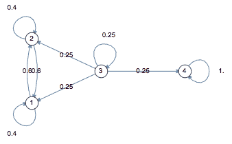
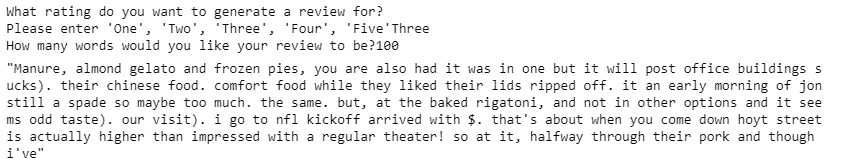

# 使用马尔可夫链制作文本生成器

> 原文：<https://medium.com/analytics-vidhya/making-a-text-generator-using-markov-chains-e17a67225d10?source=collection_archive---------2----------------------->

让计算机听起来像人，文本是自动生成的，这听起来像是未来。已经有了一些概念的小证据，比如当你写电子邮件时 Gmail 的预测文本，这个概念真正实现的时间可能会更早而不是更晚。

我完成的一个小项目，没有使用神经网络来生成文本，而是使用 Yelp 评论来生成使用马尔可夫链的新评论。生成的文本虽然不完美，但在捕捉典型用户撰写的评论的上下文、情感和风格方面做了令人难以置信的工作。

 [## hio watah/Yelp-评论-生成器

### 这个项目使用从 Yelp 上搜集的数据，通过自然语言处理和神经网络，我开发了…

github.com](https://github.com/hiowatah/Yelp-Review-Generator) 

# 什么是马尔可夫链？

马尔可夫链是从一种状态到另一种状态的数学系统。与这个宽泛的陈述相关的一些规则如下:下一个状态完全依赖于前一个状态。下一个状态是在概率基础上确定的。

Brilliant.org 马尔可夫链的示例图像

为了将它放到文本生成器的上下文中，想象一下您最近阅读的一篇文章。那篇文章包含 x 个单词，其中可能有许多单词被多次使用。对于文章中的每个单词，紧随其后的单词被组合在一起，出现频率越高的单词权重越大。当生成文本时，选择一个随机单词，并从单词列表中连续选择一个随机单词，直到达到期望的单词计数。

# 使用 Python 的示例

用 python 的术语来说，你可以为语料库中的每一个独特的单词创建一个字典。在那里，您可以将字典中的值制作成一个单词列表，出现在每个唯一的单词之后。一个单词出现得越频繁，它在文本生成器中被选中的概率就越高。

生成的示例文本

从上面可以看到，生成的文本从高层次上看，就像是人类写的一样。当你更深入地观察这些词时，你会发现它在整体上没有意义。解决这个问题的办法可能是给被选中单词的概率增加权重。

虽然这个概念很简单，但使用马尔可夫链创建生成器最难的部分是确保您的语料库中有足够的文本，这样您生成的文本就不会一遍又一遍地是相同的单词。

# 结论

马尔可夫链在生成模仿人类风格的文本方面非常有效。然而，为了有效地生成文本，您的语料库需要填充相似的文档。在上面的例子中，我从 Yelp 上获得了 3 颗星的评论。然而，它包含像粪肥、办公楼、nfl 和剧院这样的短语。这些通常是不相关的，不会在典型的评论中发布。为了纠正这一点，您需要在同一个语料库中保存讨论类似主题的文档(例如比萨饼店),并将其用于马尔可夫链。这样，生成的文本都将与披萨相关。也就是说，对于这样一个简单的执行，生成的文本结果是显著的，并且比经过大量训练的神经网络更容易获得！