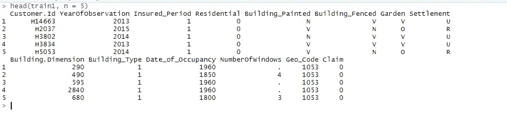
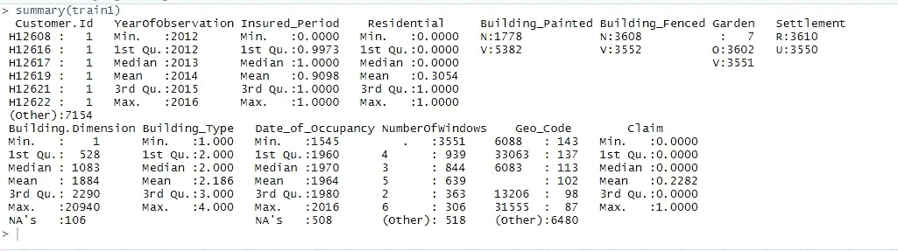
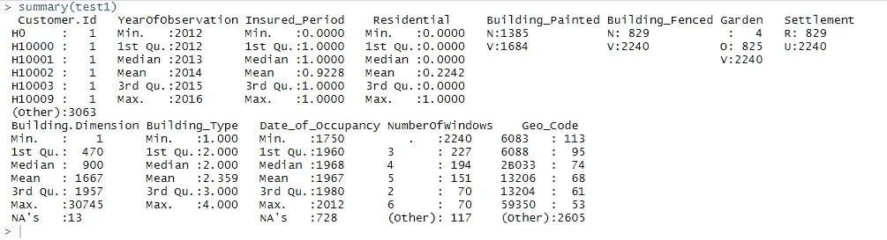
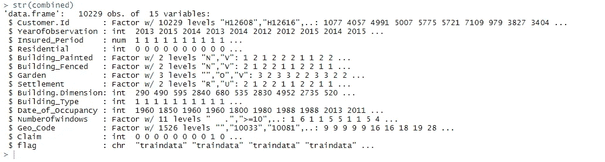

# 用 CatBoost 构建保险索赔预测模型

> 原文：<https://medium.com/analytics-vidhya/making-an-insurance-claims-prediction-model-with-catboost-in-r-2bd9ad756df4?source=collection_archive---------10----------------------->


克里斯托夫·杰施克在 [Unsplash](https://unsplash.com?utm_source=medium&utm_medium=referral) 上的照片

r 是一门美丽的语言。很多次我试图转向 Python，但是 R 的简单性把我拉了回来。

据 [CatBoost](https://catboost.ai/docs/concepts/about.html) 网站介绍，CatBoost 是一种机器学习算法，在决策树上使用梯度推进。它是一个开源库。

它支持许多语言，包括 Python 和 r。

这个软件包的奇妙之处在于它比 XGBOOST 或 Random Forest 提供了更高的精确度。

以前我在 Zindi 做过一个实际问题。这个网站有非常好的数据科学竞赛。在这里参加各种比赛可以学到很多东西。我在寻找保险领域的数据科学竞赛。我在 Kaggle 找到一个，问题出在保诚人寿保险评估上。这是一个风险评估/保险商的问题。

而在 Zindi 上，我发现了两个保险数据科学问题。有一个关于保险推荐的数据科学竞赛。我尝试了这个挑战。我没有得到很高的排名，但这是一次非常好的学习经历。

另一个竞赛是关于保险索赔，即一栋建筑在一定时期内是否有索赔权。以下是问题陈述的描述:

> **挑战描述:**
> 
> 最近，在尼日利亚的拉各斯和主要城市，建筑物倒塌的数量有所增加。Olusola 保险公司提供建筑保险政策，保护建筑物免受火灾或故意破坏、洪水或风暴造成的损害。
> 
> 您被任命为首席数据分析师，负责构建一个预测模型，以确定某栋建筑在某段时间内是否会有保险索赔。你必须预测在建筑物的保险期内至少有一次索赔的概率。
> 
> 该模型将基于建筑特征。目标变量 Claim 是一个:
> 
> 1 如果建筑物在保险期内至少有一项索赔。
> 
> 如果建筑物在保险期内没有索赔，则为 0。

**在 R 中安装 CatBoost**

在使用 CatBoost 包之前，您需要安装它。下面是在您的 Windows 系统上安装它的代码。如果需要，您可能需要更改版本号。更多详情，请 [*点击此处。*](https://catboost.ai/docs/installation/r-installation-binary-installation.html)

```
install.packages('devtools')
devtools::install_url('https://github.com/catboost/catboost/releases/download/v0.20/catboost-R-Windows-0.20.tgz', INSTALL_opts = c("--no-multiarch"))
```

让我们开始在 r 中构建这个模型。请在这里安装来自[的数据集](https://zindi.africa/competitions/data-science-nigeria-2019-challenge-1-insurance-prediction/data)。

首先设置工作目录并加载所需的包。并非所有这些包都可以使用。在功能工程或 EDA 的不同阶段可能需要这些，因此您可以根据您的 ussage 进行注释/取消注释。

```
setwd(“D:/Harish/Zindi/Nigeria_Insurance_Prediction”)
getwd()# load packages
library(dplyr)
library(readr)
library(stringr)
library(caret)
#library(data.table)
library(mltools)
library(plyr) # for rbind
#library(randomForest)
library(lubridate) # for dates
library(tidyr)
#library(tibble)
#library(purrr)
library(Matrix)
library(sqldf) # for running sql queries
library(catboost)
```

加载训练和测试数据集

```
train1 = read.csv(“train_data.csv”)
test1 = read.csv(“test_data.csv”)
head(train1, n = 5)
```

索赔是我们需要预测的响应变量，它的值为 0 或 1。



简单看一下数据集

```
summary(train1)
summary(test1)
```



NAs 主要存在于花园、建筑尺寸和入住日期中。窗口的数量有不同的值，其中一个是点“.”它具有最大行数。

#周围的窗口数量。价值 50%
左右的#楼。尺寸，NA 106，—取平均值
#Garden — NA 7 —替换为‘V’
# Geo code—102 空白—替换为模式。
#入住日期— 508 空白—替换为圆形(模式)

测试数据集中训练集的行数是 7160 和 3069。

```
nrow(train1) #7160
nrow(test1) # 3069
```

对于特征工程，我通过添加一个标志来区分两个数据集。将两个数据集结合起来进行 EDA 和特征工程总是一个好的做法，因为这可以使数据保持一致。

```
train1$flag <- 'traindata'
test1$flag <- 'testdata'
#combine both data sets
combined <- rbind.fill(train1, test1) 
summary(combined)
nrow(combined) #10229str(combined)
```



我在许多变量上做了特征工程。用模式和均值填充 NAs。我创建了一个新变量 dur 来计算 YearOfObservation 和 Date _ of _ Occupancy 之间的差异。将几个变量转换成因子。

Insured_Period 有各种小数值。所以我把它转换成一个新的可变频率。

```
unique(rnd)rnd <- replace(rnd, rnd == 0.0, 1)
rnd <- replace(rnd, rnd == 0.1, 2)
rnd <- replace(rnd, rnd == 0.2, 3)
rnd <- replace(rnd, rnd == 0.3, 4)
rnd <- replace(rnd, rnd == 0.4, 5)
rnd <- replace(rnd, rnd == 0.5, 6)
rnd <- replace(rnd, rnd == 0.6, 7)
rnd <- replace(rnd, rnd == 0.7, 8)
rnd <- replace(rnd, rnd == 0.8, 9)
rnd <- replace(rnd, rnd == 0.9, 10)
rnd <- replace(rnd, rnd == 1.0, 12)
combined$Frequency <- rnd
```

我把花园，建筑油漆，建筑围栏和定居点转换为 0 和 1。我还对一些数字变量进行了缩放，以使它们标准化。

我删除了下面的变量，因为我已经以其他方式使用了它们。

```
combined$YearOfObservation <- NULL
combined$Date_of_Occupancy <- NULL
combined$Insured_Period <- NULL
```

最后，我分离了训练和测试数据集:

```
Otrain <- subset(combined, flag==’traindata’)
Otest <- subset(combined, flag==’testdata’)
Otrain$flag <- NULL
Otest$flag <- NULL
```

当我的训练和测试数据集准备好时，我将训练数据集分成 70/30%的部分，并使用 CatBoost 找到了最佳模型。

一旦我确定我的模型可以在任何测试集上工作，我就在训练数据集上完全运行它。然后我做了变量重要性分析，找出影响准确性的主要变量。

我还尝试在 Zindi 网站上提交测试数据集，以检查我的分数是否有所提高，或者是否使用了许多排列和组合。

以下是 CatBoost 的最终代码:

```
Otrain$Customer.Id <- NULL # Remove customer id.TstCusId <- Otest$Customer.Id # we will use this value at the time of submissionOtest$Customer.Id <- NULL # Remove customer id.######Catboost model
# Using All fields after I ran variable importance and found below fields having maximum impact on accuracy of model.Otrain <- select(Otrain, Claim, Residential, Building.Dimension, Building_Type, dur, Frequency, Geo_Code,Settlement,NumberOfWindows)Otest <- select(Otest, Claim, Residential, Building.Dimension, Building_Type, dur, Frequency, Geo_Code,Settlement,NumberOfWindows)set.seed(7)y_train <- unlist(Otrain[c(‘Claim’)])
X_train <- Otrain %>% select(-Claim)
y_valid <- unlist(Otest[c(‘Claim’)])
X_valid <- Otest %>% select(-Claim)train_pool <- catboost.load_pool(data = X_train, label = y_train)
test_pool <- catboost.load_pool(data = X_valid, label = y_valid)params <- list(iterations=500,
 learning_rate=0.01,
 depth=10,
 loss_function=’RMSE’,
 eval_metric=’AUC’,
 random_seed = 55,
 od_type=’Iter’,
 metric_period = 50,
 od_wait=20,
 bootstrap_type = ‘Bernoulli’,
 use_best_model=TRUE)model <- catboost.train(learn_pool = train_pool, params = params)y_pred=catboost.predict(model,test_pool)
```

你可以使用下面的 bootstrap_type。我发现“伯努利”自举类型给出最好的准确性。

*   贝叶斯定理的
*   伯努利
*   MVS
*   泊松(仅支持 GPU)
*   不

你可以在这里找到所有训练参数[。](https://catboost.ai/docs/search/?query=bernoulli)

**使用以下代码提交**

```
#TstCusId <- as.data.frame(TstCusId)
#test_predictions_3 <- cbind(TstCusId, y_pred)#write.csv(test_predictions_3, file = ‘final_pred_Claim_CTBST_0110_BER_2.csv’, row.names = T)
```

使用下面的代码集合和可变的重要性。

```
#enssambling
#ber1 = read.csv(“final_pred_Claim_CTBST_0110_BER.csv”)
#ber2 = read.csv(“final_pred_Claim_CTBST_0110_BER_2.csv”)
#names(ber1)
#names(ber2)#ensm <- sqldf(“select ber1.TstCusId, ber1.y_pred, ber2.y_pred_2 from ber1, ber2 where ber1.TstCusId = ber2.TstCusId” )#ensm$y_pred_3 <- ensm$y_pred*.70 + ensm$y_pred_2*.30#ensm$y_pred <- NULL
#ensm$y_pred_2 <- NULL#write.csv(ensm, file = ‘final_pred_Claim_CTBST_0110_ENSM_3.csv’, row.names = T)#summary(ensm)#feature_importance
#catboost.get_feature_importance(model, 
# pool = NULL, 
# type = ‘FeatureImportance’,
# thread_count = -1)#####end of catboost
```

通过 CatBoost 模型，我的排名进入了前 100 名。

该代码不是最终版本。使用 CatBoost 和更多的 EDA 和功能扩展，您也可以在任何比赛中进入前 50 名。

你可以在我的 [Github 页面](https://github.com/harnagpal/Data-Science-Nigeria-2019-Challenge-1-Insurance-Prediction)找到完整的 R 代码和数据集

在 LinkedIn 这里与我联系。如有任何疑问，请在此给我发邮件[。](http://harnagpal@gmail.com)

看看我的其他几篇文章:

[](/analytics-vidhya/election-visualization-with-r-8b790250d889) [## 选举可视化与 R

### 你曾经在电视频道上观看选举结果吗？激动人心，戏剧性和动作是无与伦比的。是否…

medium.com](/analytics-vidhya/election-visualization-with-r-8b790250d889) [](/analytics-vidhya/corona-19-visualizations-with-r-and-tableau-595296894ca7) [## 使用 R 和 Tableau 的 Corona-19 可视化

### 在 2020 年 3 月 1 日之前，世界是一个快乐的地方，一个看不见的敌人从中国飞来，摧毁了整个…

medium.com](/analytics-vidhya/corona-19-visualizations-with-r-and-tableau-595296894ca7) [](/analytics-vidhya/data-science-use-cases-in-life-insurance-8cfbfd8b2fff) [## 人寿保险中的数据科学用例

### 数据科学是当今科技界的一个新现象。随着计算能力的增加，它已经改变了世界…

medium.com](/analytics-vidhya/data-science-use-cases-in-life-insurance-8cfbfd8b2fff)