# 为 YouTube 制作漂亮的赛车杆动画

> 原文：<https://medium.com/analytics-vidhya/making-beautiful-racing-bar-animations-for-youtube-869e55073547?source=collection_archive---------5----------------------->

在这个故事里，我会一步一步解释；从数据收集到 YouTube 上传和编辑，如何制作好看的，专业的赛车吧动画，你可以上传到 YouTube，甚至赚钱！

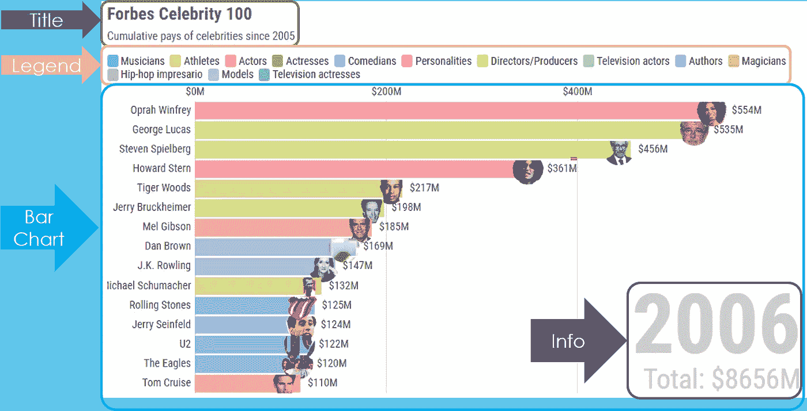

典型赛车条形图的分解

# 第一步:想法

首先，你必须找到一个可以用时间序列格式表示的动态主题，如名人历年的收入、有史以来得分最高的足球运动员、每个国家每天的 COVID19 病例数等。这一步取决于你的创造力和兴趣。你可以先在 YouTube 上看几个视频，了解一下其他人已经做了什么:

[数据是美丽的](https://www.youtube.com/channel/UCkWbqlDAyJh2n8DN5X6NZyg/videos) channel 是这种可视化的最好例子之一。这位小伙子(大学生)去年上传了近 60 个赛车酒吧视频，帮助他获得了 130 万订户，每年仅从这些视频中就赚了约 20 万美元。

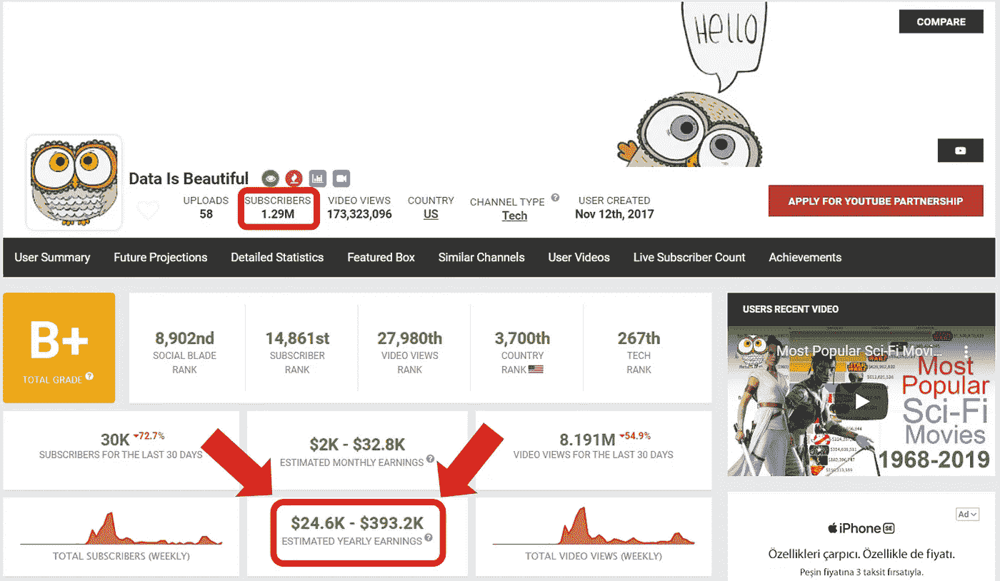

数据的社交刃页是漂亮的通道

其他一些数据可视化通道:

[奥迈尔·法鲁克·埃克](https://www.youtube.com/user/ekerfarukomer)

[动画统计](https://www.youtube.com/channel/UCLwluonD3CuhTaVLlmSQ-VQ)

[罗伊实验室统计数据](https://www.youtube.com/channel/UCDGiCfCZIV5phsoGiPwIcyQ)

[瓦瓦穆统计数据](https://www.youtube.com/channel/UCy0dKy89rZFR8OCbAT69wcQ)

你可以从 [Social Blade](https://socialblade.com/) 网站查看社交媒体渠道的预计收益。他们在那里放了一些有趣的统计数据，你也可以在那里比较频道。

# 步骤 2:数据收集

您定义了要可视化的主题，下一步是查找数据。来源很多， [Kaggle](https://www.kaggle.com/) 就是其中之一。您可以搜索、过滤和浏览约 40K 数据集，也可以对网站中的数据集进行统计。

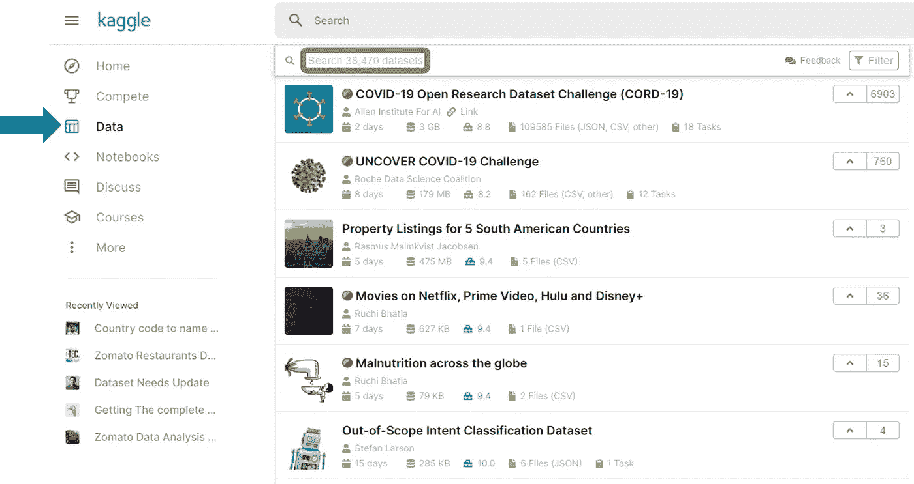

Kaggle 网页界面

[谷歌数据集搜索](https://datasetsearch.research.google.com/)，包含超过 2500 万个不同来源数据集的链接。

[UCI ML 知识库](http://mlr.cs.umass.edu/ml/)，是另一个数据来源，最古老的来源之一。

[DataUSA](https://datausa.io/) ，美国公共数据来源。

英国数据服务，英国最大的社会、经济和人口数据集合。

以上链接是一般用途的数据源；还有其他网站公开他们的数据，比如 T2 IMDb T3，这是你能在互联网上找到的最大的电影数据库。

另一个可能有帮助的来源是 Archive.org 的[网站，它可以让你浏览网页档案。例如，下面的页面列出了 2019 年收入最高的 100 名名人。](https://archive.org/)

[https://www.forbes.com/celebrities/list/](https://www.forbes.com/celebrities/list/)

但是要制作一个赛车酒吧聊天视频，你也需要访问前几年的列表。《福布斯》网站没有这方面的公开链接。Archive.org 在这里提供帮助，你可以从那里访问该页面的 2018 年和早期版本。

# 第三步:数据争论

现在您有了历史时间序列数据，下一步是数据管理，即将原始数据转换和映射为可用的格式。有许多选项可供你选择。如果没有编程背景，可以用 MS Excel 组织数据，进入下一步。此选项可能需要更多的劳动力，因为您必须手动转换数据。

如果你有编程背景，可以用你最熟悉的编程语言。 **Python** 和 **R** 语言是开源的，被大多数数据分析师/科学家使用。

**Jupyter Notebook** 是一个优秀的 Python 编码环境。这是一个基于网络的应用程序，允许您创建和共享包含实时代码、等式、可视化和叙述性文本的文档。该 IDE 支持 markdown，并使您能够将 HTML 组件从图像添加到视频。它还包括数据清理和转换、数值模拟、统计建模、数据可视化以及许多其他内容。

让我们以福布斯年度顶级名人薪酬为例。假设我们用 archive.org 和谷歌搜索了自 2005 年以来收入最高的 100 位名人。现在我们有一个 Excel 文件，其中包含从 2005 年开始的前 100 名名人的名单(没有找到前一年的名单)。

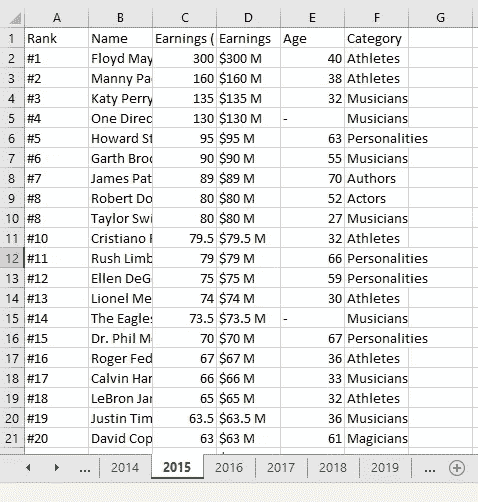

包含名人年薪信息的 Excel 文件

我们可以轻松地将文件加载到 Jupyter 笔记本环境中

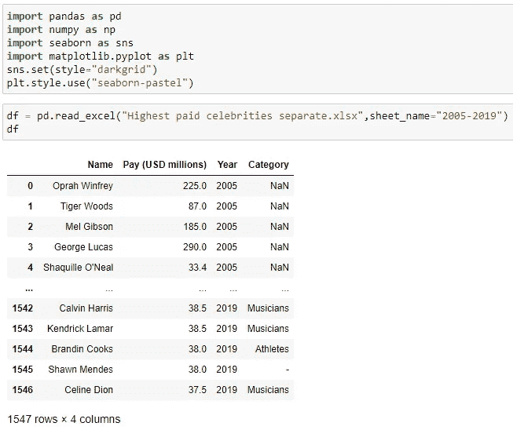

我不会深究数据的修正，因为这是另一个主题。假设我们清理了数据，纠正了错误，并填充了缺失的信息。

数据集包含来自不同类别的名人，您可以使用一行代码来可视化类别的分布，从而生成以下环形图:

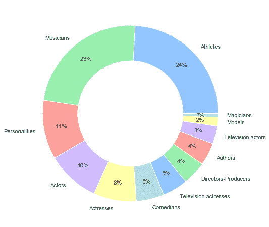

接下来，您需要将数据转换成数据透视表，其中列代表年份，行代表名人。同样，一行代码就可以做到。这张表给出了 2005 年至 2020 年间，福布斯 100 名人榜中的每个名人的年收入。

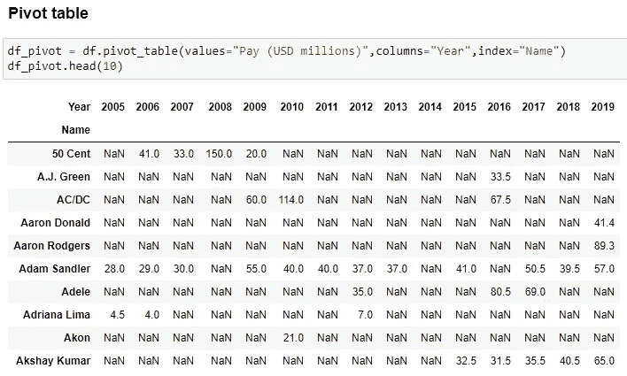

接下来，我们将以逗号分隔值(csv)格式保存该表，并继续下一步。

# 第四步:赛车酒吧视觉化

这一步我只说用的最多的选项，就是**荣景工作室**。你所要做的就是在那里创建一个免费账户，然后选择[条形图比赛模板](https://app.flourish.studio/templates)开始。

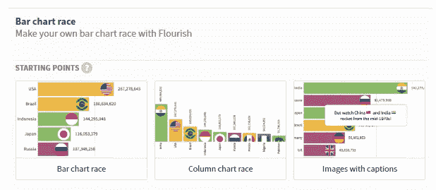

您可以在那里上传和编辑数据，选择将用作标签、值、类别(可选)和图像(可选)的列。

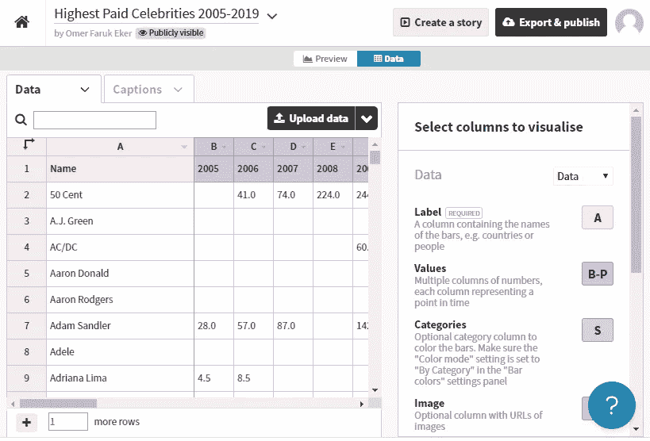

完成后，点击“预览”选项卡，并通过点击可折叠菜单做进一步的调整。在那里你可以调整条的数量，颜色，宽度等等。

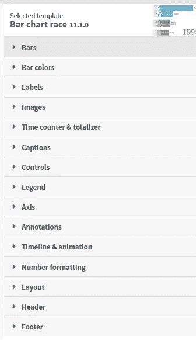

完成后，您可以在“预览”选项卡中播放动画。遗憾的是，免费选项没有将动画保存为视频文件的选项，这将我们带到了最后一步，录制屏幕以输出动画。

# 最后一步:YouTube

录制屏幕有很多选项，我用得最多的是 Atomi 的 [ActivePresenter](https://atomisystems.com/activepresenter/) 。尽管不是所有的功能都是免费的，但它可以让你顺利地捕获 fluorescent Studio 的屏幕，并将其保存为你想要的格式(mp4，wmv，mkv，avi，webm)。你所要做的就是开始捕捉并运行你的动画。您可以自定义将被捕获的屏幕聚焦区域。

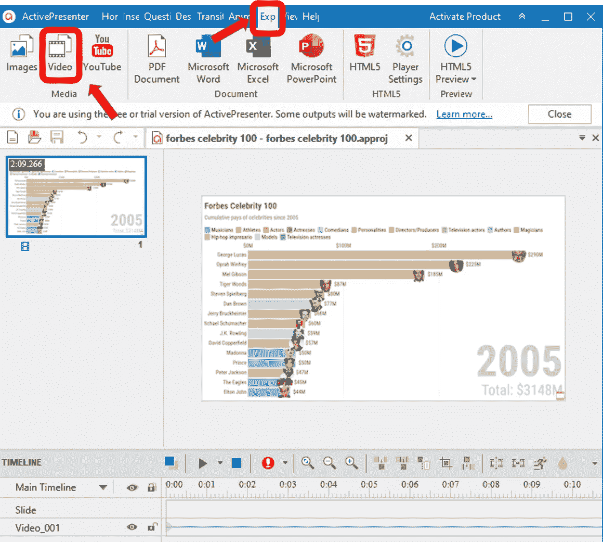

一旦你保存了你的视频。mkv 输出对我来说效果最好)，下一步就是把它上传到你的 YouTube 频道。YouTube 允许你使用他们的 **YouTube Studio Editor** 环境来编辑你的视频和添加音乐到后台播放的视频中。你可以从他们的免费歌曲数据库列表中选择背景音乐。

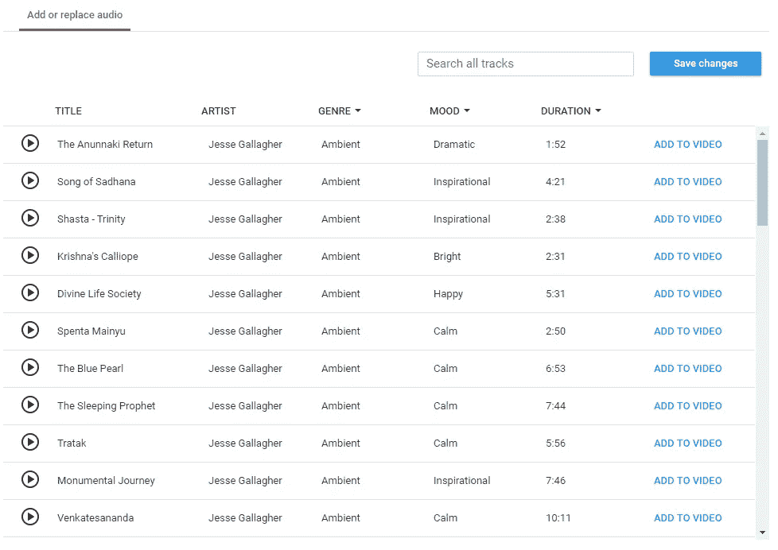

免费歌曲数据库

**搞定！**

现在你有了自己的赛车酒吧视频，并发布在 YouTube 上。下一次，遵循上面的步骤会更容易，如果你专注于第一步:想法，你将会产生大量高质量的内容

干杯