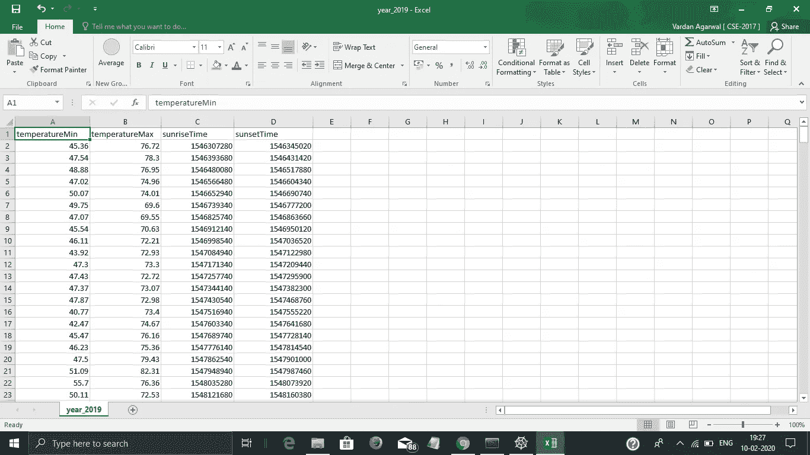

# 使用黑暗天空 API 调用生成任何地方的历史天气数据

> 原文：<https://medium.com/analytics-vidhya/making-historical-weather-data-for-any-place-using-dark-sky-api-calls-d5876de0ec01?source=collection_archive---------7----------------------->

日常天气对我们的生活影响很大。从那个地区种植的食物到我们选择的衣服和我们的交通方式都取决于天气。网上有很多关于天气如何影响我们健康和幸福的帖子。那么为什么不利用历史天气数据来预测未来的天气甚至我们的总体情绪呢？如今，如果有什么可以预测的话，那就是使用深度学习模型进行预测。深度学习模型需要什么？


因此，让我们开始收集使用 python 中的 API 调用的历史天气数据，并最终从中创建一个 CSV 文件。


黑暗天空的标志。摘自[此处](https://darksky.net/dev/img/logo.png)

我们将使用黑暗天空 API 来完成这项任务。它每天提供 1000 次免费的 API 调用，之后每次调用只需 0.0001 美元。鉴于我们必须创建一个数据集，我们将使它保持在每天 1000 个呼叫的限制内，如果我们用尽了我们的限制，我们可以等待第二天。我们可以用它来执行两种类型的 API 调用，它可以返回大量信息。从它的[文档](https://darksky.net/dev/docs):

> 天气 API 调用类型
> 
> 我们提供两种类型的 API 请求来检索世界上任何地方的天气:
> 
> [预报请求](https://darksky.net/dev/docs#forecast-request)返回下周的当前天气预报。
> 
> [Time Machine 请求](https://darksky.net/dev/docs#time-machine-request)返回过去或未来某一天的观测或预测天气情况。
> 
> 气象条件
> 
> 黑暗天空 API 以 39 种不同的语言提供完整的气象条件集合，包括:
> 
> 表观(感觉)温度
> 
> 大气压力
> 
> 云量
> 
> 露点
> 
> 湿度
> 
> 液体沉淀速率
> 
> 月相
> 
> 最近风暴距离
> 
> 最近的风暴方向
> 
> 臭氧
> 
> 沉淀类型
> 
> 降雪
> 
> 日出/日落
> 
> 温度
> 
> 文本摘要
> 
> 紫外线指数
> 
> 阵风
> 
> 风速
> 
> 风向

对于本文，我们将利用 Time Machine 请求，创建一个包含最低和最高温度以及日出和日落时间的 CSV 文件。您可以查看并选择您想要的任何天气属性。

在 python 中，我们使用`requests.get`来执行 API 调用，我们只需将我们的基本 URL 作为参数传递给它。基本 URL 如下所示:

```
[https://api.darksky.net/forecast/[key]/[latitude],[longitude],[time]](https://api.darksky.net/forecast/[key]/[latitude],[longitude],[time])
```

将 key 替换为您的私有 API key，从 google maps 获取您想要获取其天气数据的地点的纬度和经度，对于时间，我们将使用 UNIX 时间。

> **Unix** 时间(或 **Unix epoch** 或 POSIX time 或 **Unix timestamp** ) **是**一种用于描述时间点的系统，定义为自 1970 年 1 月 1 日午夜前协调世界时(UTC)起经过的秒数，不包括闰秒。

这个[站点](https://www.unixtimestamp.com/index.php)可以用来将任何日期和时间转换成 UNIX 时间。结果将是一个 JSON 文件。我们将使用*每日*获取所有特征。

我们将利用`namedtuple`将我们的数据附加到数据帧中。在`collections`中有一个`namedtuple`，它就像一个字典，增加了从键值和迭代中访问的选项。最后，当我们的数据集被创建时，我们可以向它添加我们的列名，并使用`df.to_csv`将我们的数据集转换成 CSV 文件。

```
import requests
import pandas as pd
from collections import namedtupledf1 = []
features = ['temperatureMin', 
            'temperatureMax',
            'sunriseTime',
            'sunsetTime']
DailySummary = namedtuple("DailySummary", features)
for unix in range(1546300800, 1577836800, 86400):
    BASE_URL = "[https://api.darksky.net/forecast/<API-KEY>/26.8371648,75.5625925](https://api.darksky.net/forecast/0d3b960fe7362e11cc9f6213b6fc192a/26.8371648,75.5625925)," + str(unix) + "?exclude=currently,flags,alerts,hourly"
    response = requests.get(BASE_URL)
    data = response.json()
    df = pd.DataFrame(data["daily"]["data"])
    df1.append(DailySummary(temperatureMin = df.at[0, 'temperatureMin'],
                            temperatureMax = df.at[0, 'temperatureMax'],
                            sunriseTime = df.at[0, 'sunriseTime'],
                            sunsetTime = df.at[0, 'sunsetTime']))
res = pd.DataFrame(df1, columns=features)
res.to_csv('year_2019.csv', index=False)
```

