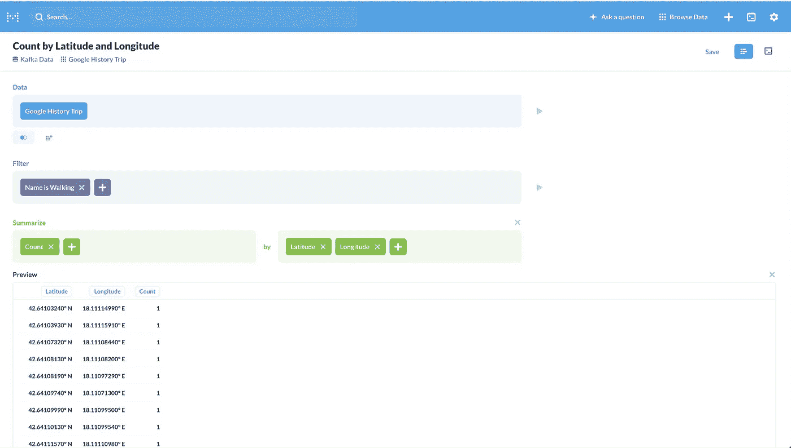

# 理解流数据

> 原文：<https://medium.com/analytics-vidhya/making-sense-of-stream-data-b74c1252a8f5?source=collection_archive---------9----------------------->


您是否曾经想过，在与 Kafka 合作时，如何向利益相关者展示您的项目，实时突出显示重要的过程和结果，而无需编写任何前端工具？

在这篇博文中，我将一步一步地指导你如何让 [Kafka](https://kafka.apache.org/) 在本地运行，将数据卸载到数据存储中，并利用 [Metabase](https://www.metabase.com/) 等工具通过图表和仪表盘来洞察你的数据。

如果您有 AWS 帐户，您也可以利用那里的服务。但是在这篇文章中，我将向你展示如何在你的本地机器上运行所有的东西。

# 阿帕奇卡夫卡

Kafka 是一个为高吞吐量而设计的分布式、可靠和可扩展的消息传递系统。如果你是卡夫卡的新手，我推荐你看一下[卡夫卡简介](https://docs.confluent.io/current/kafka/introduction.html)。Kafka 允许多个客户端同时连接，以大规模生产或消费数据。


## 在本地运行 Kafka

您可以使用[汇合平台](https://www.confluent.io/download/plans/)在本地运行 Kafka。下载 tar 文件后，您可以解压缩它，并遵循以下命令:

```
> cd confluent-5.2.1/bin
> ./confluent start
This CLI is intended for development only, not for production
https://docs.confluent.io/current/cli/index.html
​
Starting zookeeper
zookeeper is [UP]
Starting kafka
kafka is [UP]
Starting schema-registry
schema-registry is [UP]
Starting kafka-rest
kafka-rest is [UP]
Starting connect
connect is [UP]
Starting ksql-server
ksql-server is [UP]
Starting control-center
control-center is [UP]
```

一旦所有服务都在运行，您将有一个代理在端口 9092 上运行。

# 应用

对于这个演示，我将创建一个虚拟管道，它从 KML 文件中读取历史 Google 时间轴数据，并将其输出到一个名为`google_history_trip`的 Kafka 主题。你可以在这里下载你自己的谷歌时间轴数据。我使用的数据来自我去克罗地亚旅行时的个人时间表。我使用 Kafka connect 将这些数据转储到 SQL，并使用 Metabase 查询存储在 SQL server 上的数据。


## Kafka 应用

在这个虚拟的 Kafka 应用程序中，你可以在这里找到代码，我正在从我的谷歌时间线下载的谷歌 KML 文件中读取数据。我解析文件，并使用下面的 Avro 模式将数据推送到 Kafka。

```
{
   "type": "record",
       "name":"GoogleHistoryValue",
       "namespace": "example.googlehistory",
       "fields":[
         {
           "name":"user_id",
           "type":"string"
         },
         {
           "name": "start_time",
           "type": {
             "type": "long",
             "logicalType": "timestamp-millis"
           }
         },
         {
           "name": "end_time",
           "type": {
             "type": "long",
             "logicalType": "timestamp-millis"
           }
          },
          {
            "name":"name",
            "type":"string"
          },
          {
            "name":"latitude",
            "type":"double"
          },
          {
            "name":"longitude",
            "type":"double"
          }
       ]
}
```

# SQL Server

## 正在创建数据库

下面我将在本地启动一个 MySQL 服务器并创建一个数据库`kafka_offload`，我将用它将数据卸载到 SQL。

```
> mysql.server start
Starting MySQL.. SUCCESS!~ mysql -u root -pEnter password: *********
Welcome to the MySQL monitor.  Commands end with ; or \g.
Type 'help;' or '\h' for help. Type '\c' to clear the current input statement.mysql> CREATE DATABASE kafka_offload;
Query OK, 1 row affected (0.00 sec)mysql> use kafka_offload;
Database changedmysql> show tables;
Empty set (0.00 sec)
mysql>
```

# 卡夫卡连接

Kafka connect 允许我们从 Kafka 提取数据或向 Kafka 推送数据。有很多 Kafka 接口可供选择，你可以在 https://www.confluent.io/hub/[找到。](https://www.confluent.io/hub/)

我将使用`io.confluent.connect.jdbc.JdbcSinkConnector`将数据从 Kafka 主题卸载到 MySQL 服务器。我们可以通过发布以下查询来轻松使用它:

```
curl -X POST [http://localhost:8083/connectors](http://localhost:8083/connectors) -H "Content-Type: application/json" -d '
{
"name": "google_history_trip_connector",
  "config": {
  "connector.class": "io.confluent.connect.jdbc.JdbcSinkConnector",
  "tasks.max": "1",
  "topics": "google_history_trip",
  "connection.url": "jdbc:mysql://localhost/kafka_offload",
  "auto.create": "true",
  "connection.user": "root",
  "connection.password": "*******",
  "key.converter": "io.confluent.connect.avro.AvroConverter", "value.converter":"io.confluent.connect.avro.AvroConverter",
  "value.converter.schema.registry.url": "[http://localhost:8081](http://localhost:8001)", "key.converter.schema.registry.url": "[http://localhost:8081](http://localhost:8001)",
  "key.converter.schemas.enable":"true",
  "value.converter.schemas.enable":"true",
    "internal.key.converter":"org.apache.kafka.connect.json.JsonConverte r",   
     "internal.value.converter":"org.apache.kafka.connect.json.JsonConverter",
  "internal.key.converter.schemas.enable":"false",
  "internal.value.converter.schemas.enable":"false"
  }
}'
```

不要忘记更改`connection.password`字段。

这应该会启动一个 Kafka 连接，将数据卸载到数据库。您可以使用`[http://localhost:8083/connectors/google_history_topic/status](http://localhost:8083/connectors/google_history_topic/status)`来检查连接器的状态

# 元数据库

## 设置

*   您可以通过 docker 启动元数据库，也可以从[这里](https://www.metabase.com/start/)下载元数据库。

```
> docker run -d -p 3000:3000 — name metabase metabase/metabase
```

*   一旦元数据库启动，您应该会在 http://localhost:3000 看到以下屏幕


*   完成注册后，您可以连接到数据库


*   您现在应该会看到如下欢迎屏幕


*   您可以通过导航到 Kafka Data 您的主题名称来检查您的数据


## 查询数据

您可以使用笔记本功能来回答一些问题

*   让我们看看总数


*   让我们检查活动名称或类型为`Walking`的行数


*   让我们按纬度经度分组，并在地图上画出来(选择没有宁滨)



*   让我们对活动类型`Driving`进行同样的检查，显示我从斯普利特开车到杜布罗夫尼克


## SQL 查询

您还可以在元数据库中使用 SQL 查询

*   让我们计算一下我在每个地点花了多少时间

```
SELECT latitude, longitude, name, TIMESTAMPDIFF(minute, start_time, end_time) as duration FROM google_history_trip
```

*   大家算算我在哪里待了一个多小时

```
SELECT latitude, longitude, name, TIMESTAMPDIFF(minute, start_time, end_time)  as duration
FROM google_history_trip
WHERE (start_time >= timestamp('2019-09-21T00:00:00.000Z')
   AND start_time < timestamp('2019-09-22T00:00:00.000Z'))
HAVING duration > 60
```


您还可以将元数据库的仪表板功能用于变量。

使用 Kafka connect 的快速卸载功能，我们可以几乎实时地与主题生成的数据进行交互。

# 结论

在我们的 Kafka 主题中，我们已经看到了一种快速分析数据的方法，通过将数据导出到本地运行的 MySQL，并使用 Metabase 来可视化数据。这使我们能够以一种良好的、交互式的方式来验证我们的方法，这种方式可以与业务或产品所有者共享。

该解决方案目前使用 MySQL，这对于大型数据集来说可能并不理想。因此，这种快速方法对于生产来说并不理想。在我的下一篇博文中，我将解释我们如何将大型数据集从 Kafka 卸载到 AWS S3，并使用 AWS Glue 和 QuickSight 对我们的数据进行交互式查询。