# 使用 AWS 理解流数据

> 原文：<https://medium.com/analytics-vidhya/making-sense-of-stream-data-with-aws-954de8d542d?source=collection_archive---------12----------------------->


这篇文章是[在本地理解](/@ankushkhanna1988/making-sense-of-stream-data-b74c1252a8f5)的数据流的延续。

在这篇博客中，我将向你展示如何使用胶水和 Quicksights 用 Kafka 一步一步地构建分析仪表板。

# 自动警报系统

[亚马逊网络服务](https://aws.amazon.com/what-is-aws/)是亚马逊提供多种服务的云平台。如果您没有 AWS 帐户，您可以在这里[创建一个。我正在使用 AWS](https://aws.amazon.com/free/) 的所有[自由层特性。](https://aws.amazon.com/free/?all-free-tier.sort-by=item.additionalFields.SortRank&all-free-tier.sort-order=asc)

要关注这个博客，你需要 AWS 访问权限和一个密钥。请查看以下[步骤](https://aws.amazon.com/blogs/security/wheres-my-secret-access-key/)了解如何获得一个。

# 体系结构

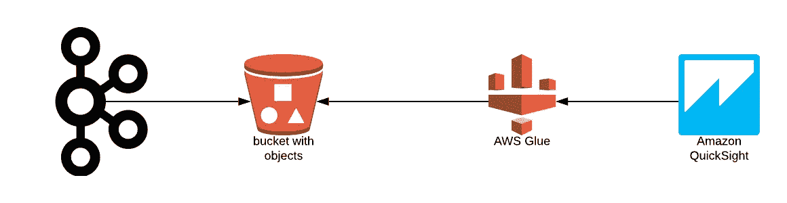

体系结构

我将使用来自我个人 [google timeline](https://www.google.com/maps/timeline?pb) 的数据，你可以在这里查看代码[关于如何将 google timeline 数据(通过 kml 文件)发布到 Kafka。](https://github.com/AnkushKhanna/kafka-google-timeline)

# 卡夫卡

## 在本地运行 Kafka

您可以使用[汇合平台](https://www.confluent.io/download/plans/)在本地运行 Kafka。下载 tar 文件后，您可以解压缩它，并遵循以下命令:

```
> export AWS_ACCESS_KEY=*********
> export AWS_SECRET_KEY=*********
> cd confluent-5.2.1/bin
> ./confluent start
This CLI is intended for development only, not for production
[https://docs.confluent.io/current/cli/index.html](https://docs.confluent.io/current/cli/index.html)Starting zookeeper
zookeeper is [UP]
Starting kafka
kafka is [UP]
Starting schema-registry
schema-registry is [UP]
Starting kafka-rest
kafka-rest is [UP]
Starting connect
connect is [UP]
Starting ksql-server
ksql-server is [UP]
Starting control-center
control-center is [UP]
```

请导出上面生成的 **AWS_ACCESS_KEY** 和 **AWS_SECRET_KEY** 。

# 卡夫卡连接

Kafka connect 允许我们从 Kafka 提取数据或向 Kafka 推送数据。有很多 Kafka 接口可供选择，你可以在 https://www.confluent.io/hub/[找到。在本教程中，我们将使用 S3 接收器连接器将 Kafka 流数据推送到 S3。](https://www.confluent.io/hub/)

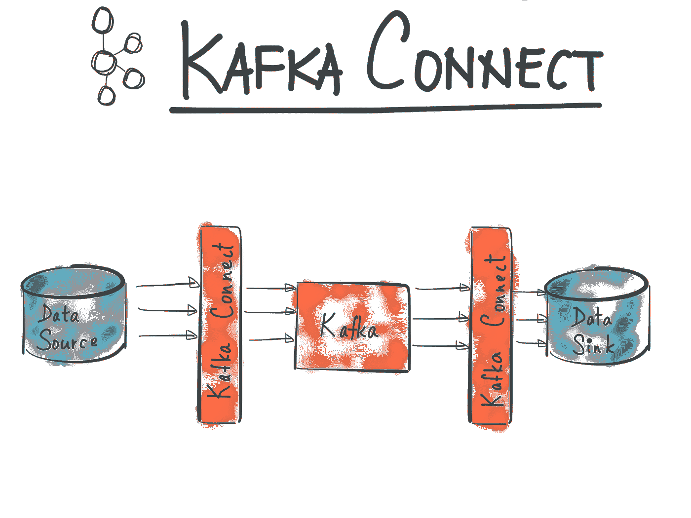

[https://www.confluent.io/](https://www.confluent.io/)

## 卡夫卡连接 S3

我们将使用`io.confluent.connect.s3.S3SinkConnector`。使用下面的命令，我们可以通过向我们的 Kafka connect 集群发送 http POST 请求来运行 Kafka 到 S3 连接器:

```
curl -X POST [http://localhost:8083/connectors](http://localhost:8083/connectors) -H "Content-Type: application/json" -d '
{
  "name": "google_timeline_connector_s3",
  "config": {
    "connector.class": "io.confluent.connect.s3.S3SinkConnector",
    "tasks.max": "1",
    "topics": "google_history_trip_s3",
    "s3.region": "eu-central-1",
    "s3.bucket.name": "kafkaoffload",
    "s3.part.size": "26214400",
    "flush.size": "100",
    "enhanced.avro.schema.support": "true",
    "partition.duration.ms": "60000",
    "locale": "UTC",
    "timezone": "UTC",
    "storage.class": "io.confluent.connect.s3.storage.S3Storage",
    "schema.generator.class": "io.confluent.connect.storage.hive.schema.DefaultSchemaGenerator",
    "partitioner.class": "io.confluent.connect.storage.partitioner.TimeBasedPartitioner",
    "partition.field.name":"start_time",
    "schema.compatibility": "FULL_TRANSITIVE",
    "timestamp.extractor": "RecordField",
    "timestamp.field": "start_time",
    "path.format": "YYYY-MM-dd",
    "rotate.schedule.interval.ms": "60000",
    "format.class": "io.confluent.connect.s3.format.avro.AvroFormat",
    "value.converter": "io.confluent.connect.avro.AvroConverter",
    "value.converter.schema.registry.url": "http://localhost:8081",
    "key.converter": "io.confluent.connect.avro.AvroConverter",
    "key.converter.schema.registry.url": "http://localhost:8081"
  }
}'
```

重要属性:

*   `s3.bucket.name` : `kafkaoffload`，我的 S3 桶名(在 AWS web 控制台创建一个 S3 桶)
*   `partitioner.class` : `TimeBasedPartitioner`，根据日期时间对数据进行分区
*   `timestamp.extractor` : `RecordField`，使用记录值内的一个字段
*   `timestamp.field` : `start_time`，使用 start_time 字段对数据进行分区

如果您的用例或数据不同，请修改以上字段。你可以点击查看完整配置[。](https://docs.confluent.io/current/connect/kafka-connect-s3/configuration_options.html)

这应该会启动 Kafka connect worker 将数据卸载到 s3。您可以使用`[http://localhost:8083/connectors/google_timeline_connector_s3/status](http://localhost:8083/connectors/google_timeline_connector_s3/status)`检查连接器的状态

# AWS 胶水

AWS Glue 是一个完全托管的提取、转换和加载(ETL)服务，使客户能够更轻松地准备和加载他们的数据进行分析。它可以从 S3 抓取数据，并创建表格，将相关元数据存储在 Glue 数据目录中。一旦编目，您的数据立即可以搜索和查询。

## 创建爬虫

使用 AWS web 控制台，搜索`AWS Glue`

*   点击`Add crawler`可以添加爬虫

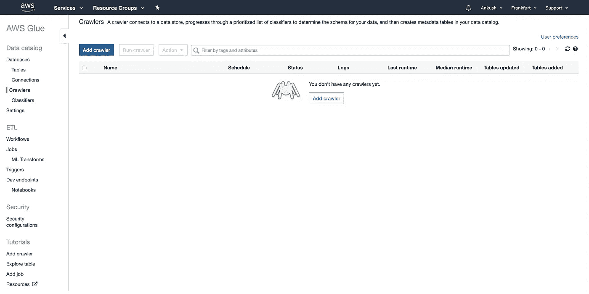

*   指定 S3 路径

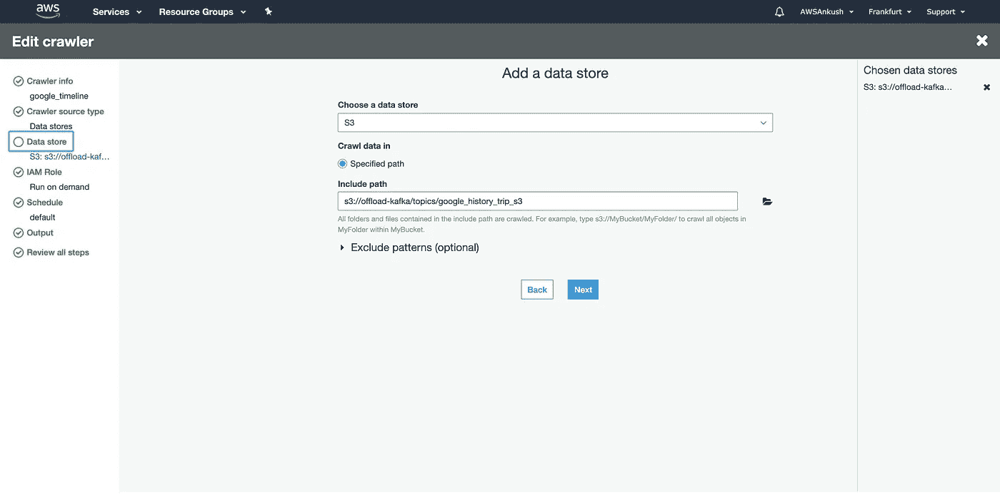

*   创建 IAM 角色

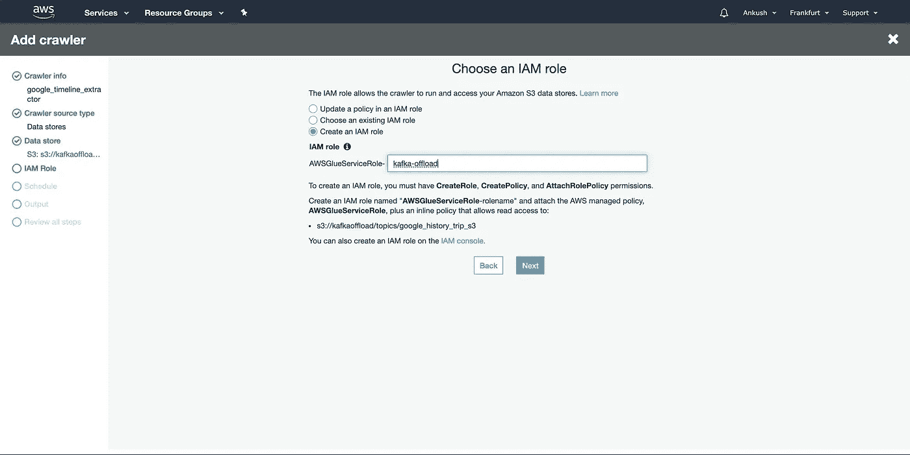

*   添加数据库名称

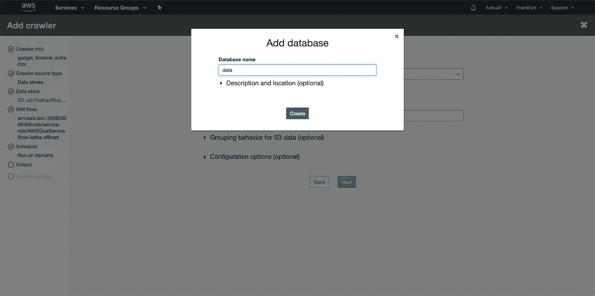

*   一旦创建了爬虫，我们就可以使用`Run crawler`来运行爬虫

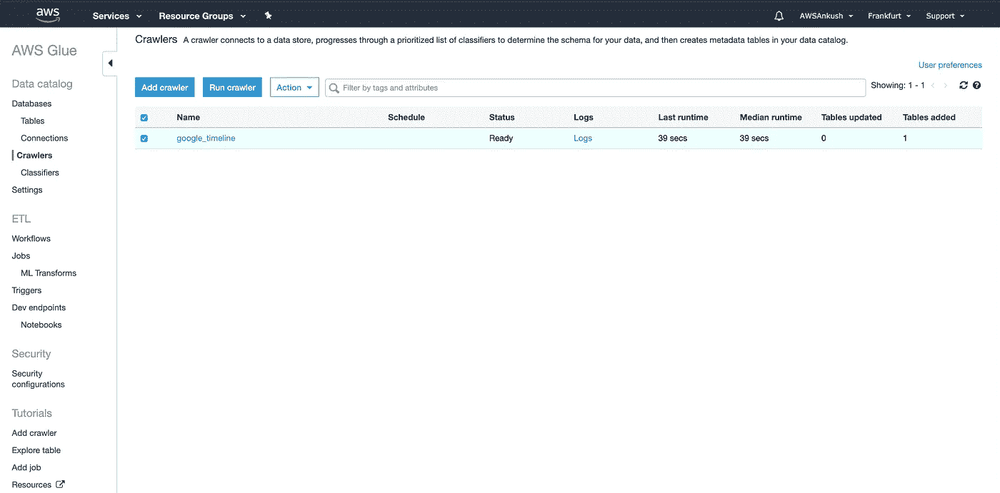

这将开始在 S3 铲斗上爬行。可能需要几分钟来索引数据。

您还可以安排 crawler 以特定的时间间隔运行。

## 粘合桌子

*   一旦爬虫完成，你可以在 AWS GLUE `Tables`部分看到一个表格

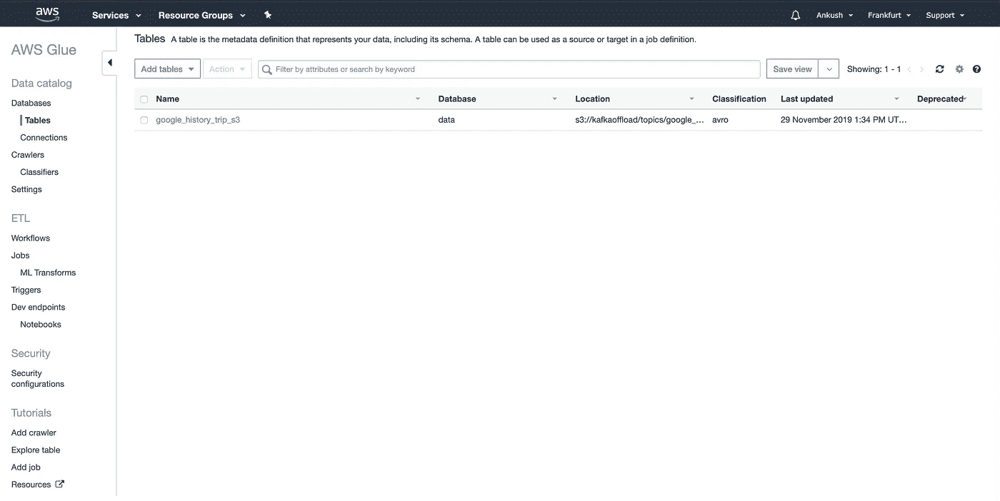

*   如果需要，您可以编辑模式，如下所示

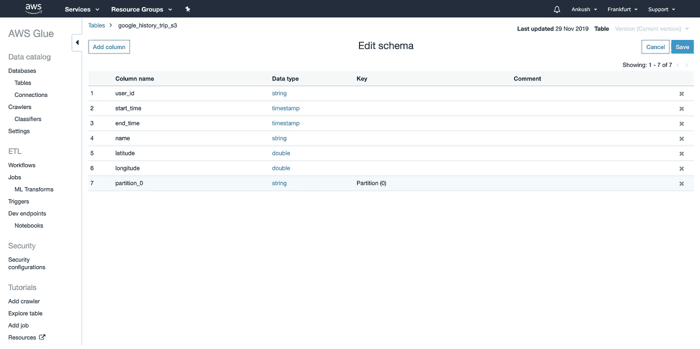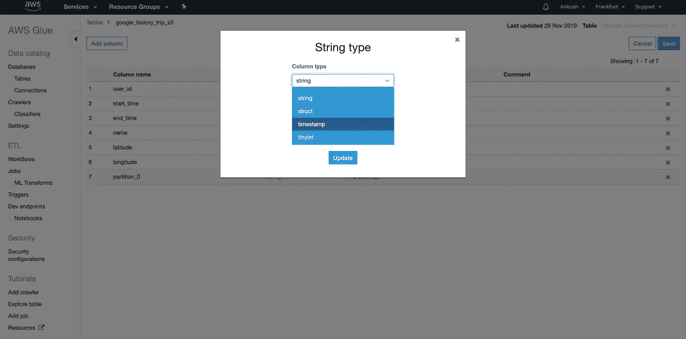

# AWS QuickSight

完成 AWS Glue 后，您可以使用 AWS QuickSight 来深入了解您的数据。

## 设置

转到 AWS web 控制台上的 QuickSight

*   装满`Create your QuickSight account`

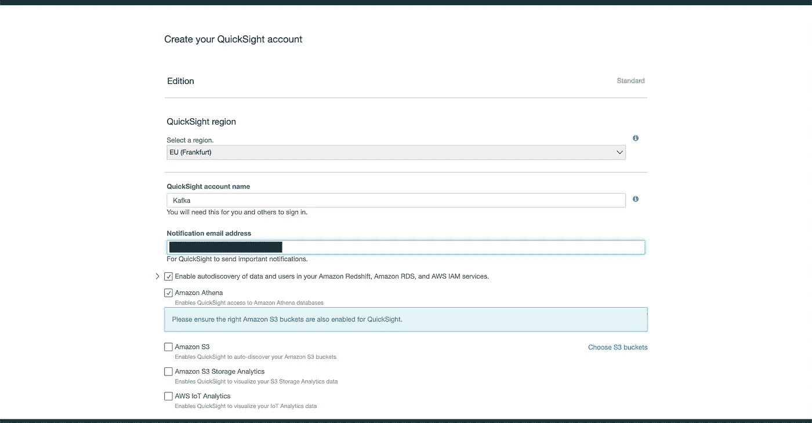

*   创建一个雅典娜`Data Set`

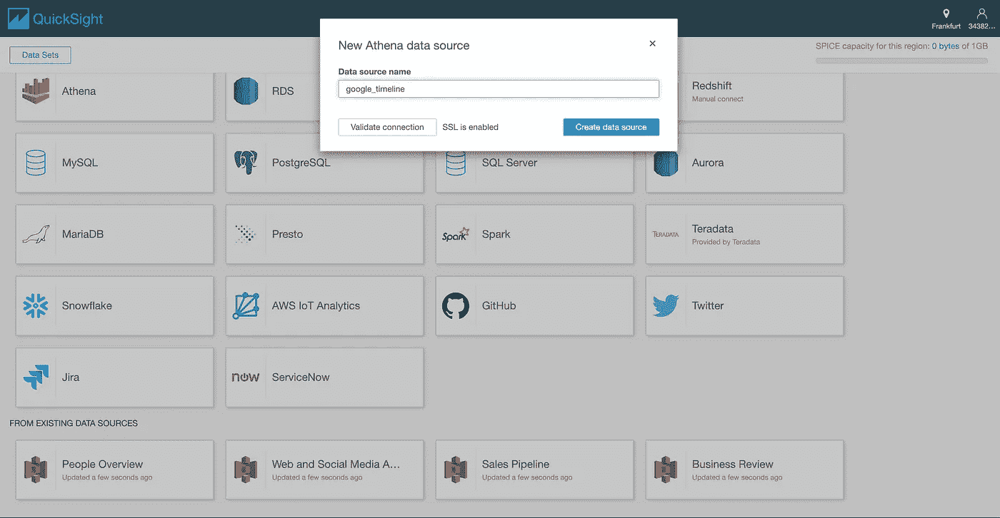

*   选择粘合台

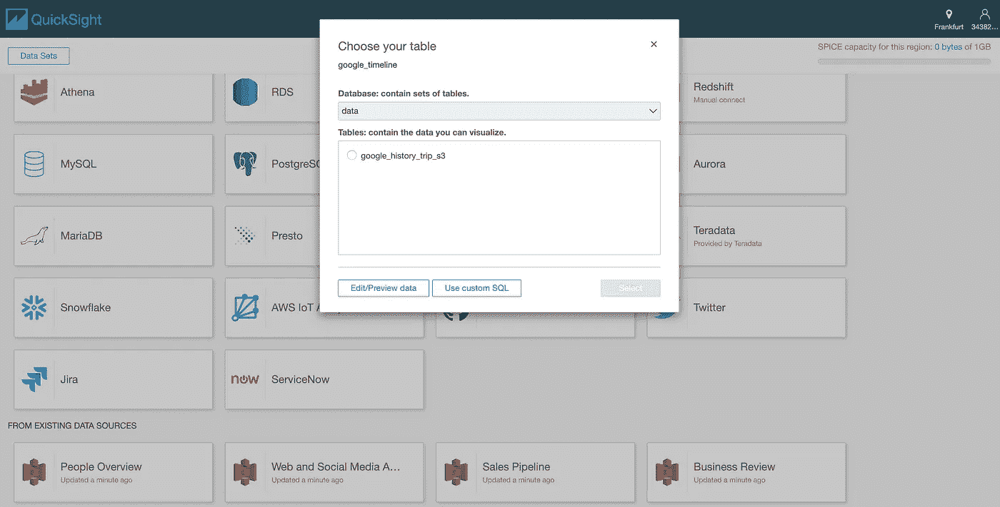

## 分析

*   您可以检查名称的分布

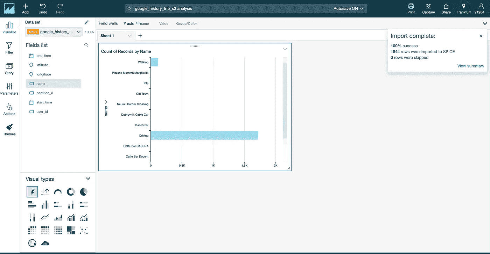

*   你可以过滤掉不同的值，在这个例子中我已经过滤掉了`Driving`和`Walking`

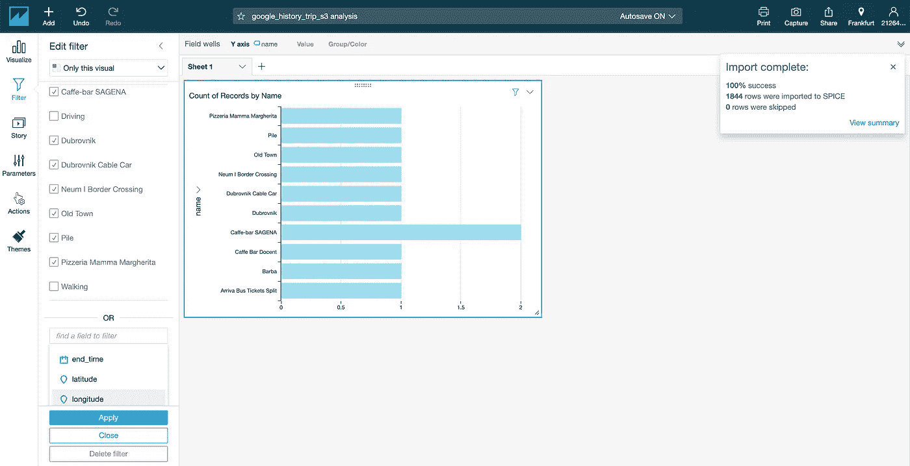

*   您可以在图形上绘制`latitude`和`longitude`

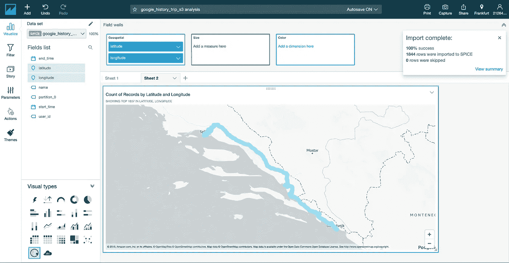

*   基于`partition_0`过滤掉

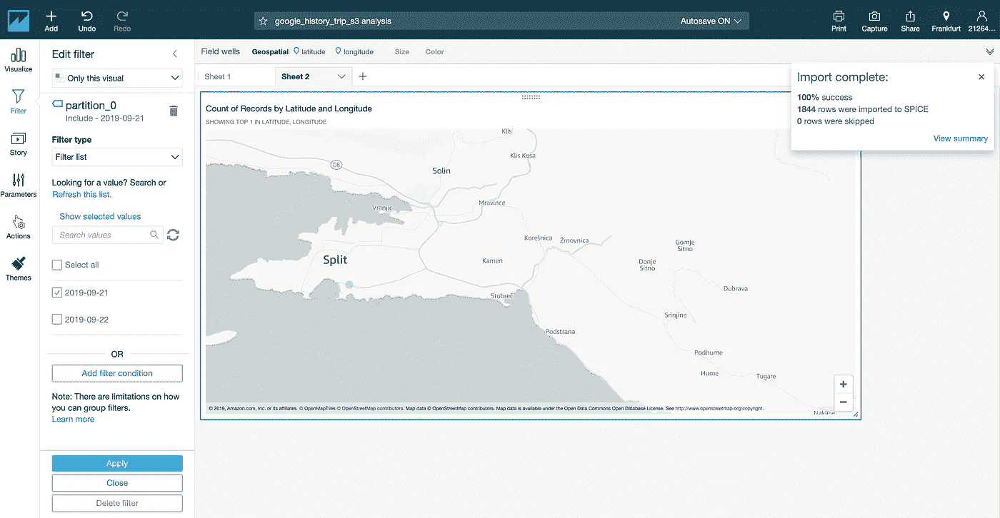

# 分区的作用

当使用 Athena 或 QuickSight 读取 S3 时，分区过滤起着至关重要的作用。

如果使用分区键进行过滤，则数据只能从相关文件夹中读取。否则，这是对 s3 存储桶的完整扫描，既慢又昂贵。

# 基于列的文件格式

列存储文件格式优于基于行的文件格式。基本思想是，它不是将一行中的所有值存储在一起，而是将一列中的所有值存储在一起。这有助于加快每列查询的过滤速度，更适合压缩，更适合分析任务。

目前，我们已经输出了 Avro 格式的数据。如果您希望加快查询速度，您可能会对使用 [parquet](https://parquet.apache.org/) 作为文件格式感兴趣。你可以在这里跟随 parquet kafka connect 更新[或者也可以使用 Glue ETL 将 Avro 文件转换成 parquet。](https://github.com/confluentinc/kafka-connect-storage-cloud/pull/241)