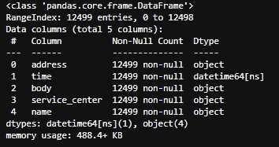
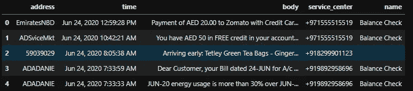
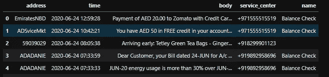
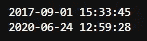
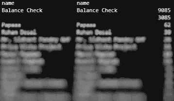
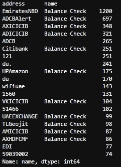
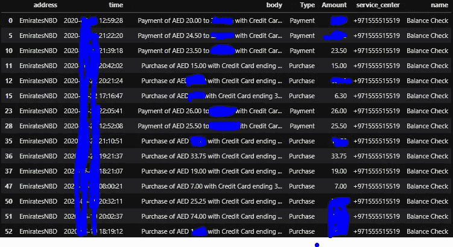
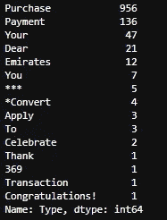
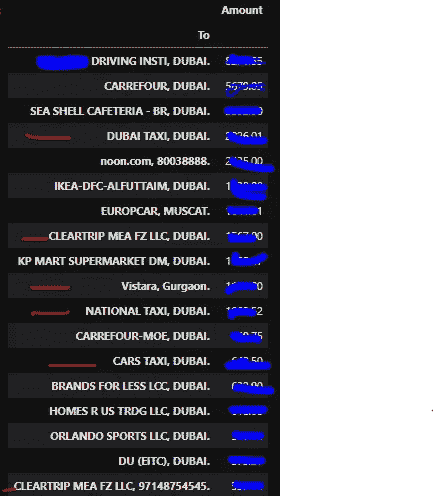

# 让短信再次变得有用

> 原文：<https://medium.com/analytics-vidhya/making-sms-useful-again-db94d92e3490?source=collection_archive---------13----------------------->

[梁杰森](https://unsplash.com/@ninjason?utm_source=unsplash&utm_medium=referral&utm_content=creditCopyText)在 [Unsplash](/s/photos/message?utm_source=unsplash&utm_medium=referral&utm_content=creditCopyText) 上的照片

短信已经失去了魅力。从一个通讯工具，现在变成了通知工具。随着廉价、快速和更具功能性的信息服务(Whatsapp 和 family)的出现，SMS 现在被更多地视为二等技术。它看起来仍然存在的唯一原因是，与其他工具不同，短信不需要互联网接入。短信有 70 多亿用户群，vs Whatsapp，15 亿左右。

我们每天都会收到数量惊人的信息。其中大部分是使用(较少)营销和促销，OTP，有些是联系人的简短回复，但还有一条重要的信息只是休眠在那里。我正在谈论来自银行的信息。更具体地说，信贷，借记，提款信息。

# 总是备份

我总是备份我的短信。虽然最近 4 年换了那么多次手机，但是 2017 年 9 月以来的所有消息我都还留着。

**为什么是**？为什么不呢？在那堆短信里，总会有一些有用的信息。我通常为银行相关消息保留它(大多数银行不会在网站上提供超过 12 或 6 个月的交易)，但也可能有其他好的理由保留它。而且短信里没有什么值得删除的(不像浏览历史或者 Whatsapp 消息；) )

**如何操作**:你可以使用 PlayStore 上的任何应用程序来完成这项工作。我通常以 XML 格式导出，这样便于操作。CSV 是下一个选项，但是因为消息可以包含逗号，所以解析是一场噩梦。

# 使用 Python 从 SMS 数据到有用的信息

我们将直接进入代码笔记本。下面是我们将遵循的高级流程:

1.  从手机导出短信数据。
2.  加载 Python 中的数据并将数据转换为 pandas 数据框类型(以便于操作)
3.  数据探索(外观和感觉)
4.  数据操作(添加新列，删除一些列)
5.  专注于一家特定的银行(我将专注于阿联酋 NBD 银行，一家总部位于阿联酋的银行，我有信用卡，我用它来完成大部分交易)
6.  使用数据创建一些有意义的信息。

**注意**:这只是一个学习应用程序，绝不是详尽和没有缺陷的。您可能无法按原样使用这段代码，因为这在很大程度上取决于您提取的信息的类型(所有银行都有自己的 SMS 格式，因此字符串操作完全不同)。

此外，由于这是财务数据，我会掩盖大部分我觉得接近敏感的信息。此外，我们将关注数据探索和操作。一旦你有了数据，你可以用 Python 的熊猫做大量的事情

## 从手机中提取短信数据。

我用 app [超级备份&还原。](https://play.google.com/store/apps/details?id=com.idea.backup.smscontacts&hl=en)注意，你可以使用任何你想要的应用程序。但是请注意，不同的应用程序将有自己的模式来创建提取。超级备份&恢复以下列格式创建导出:

XML 包含每个 SMS 的一行，它具有以下属性:

**用 Python 加载数据**

导入库:

## 读取 XML 并将其转换成 Pandas 数据帧

检查我们的数据框上的一些信息(所有黑色截图都是输出)。从下面我们可以看到:

1.  总共有 12，499 条消息(wohhhhh)。
2.  有 5 列。其中之一是数据类型为 dateTime64 的时间(2020 年 6 月 24 日，12:59:28 PM)。我们稍后将更改它，使其更有意义。
3.  数据使用的内存为 488.4 KB(与 XML 在磁盘上占用的实际内存相比:4 MB)。

**操纵数据**

将时间转换为时间格式(YYYY-mm-dd HH:mi:ss)

获取最早和最新的 SMS 日期时间:

现在我们来看看谁发的消息最多(猜:)。我们创建一个新的数据框，按名称分组，然后对其进行排序。

显而易见，9k plus 消息与余额检查(银行和其他金融机构)相关，3k 没有名称:这些是促销、OTP 等消息。剩下的都是接触来的(我爸是下一个)。

请注意，每一个输出前进将是模糊的。只有有用的部分才会被看到。

接下来，让我们只关注余额检查和空消息名。

一些顶级的是由阿联酋生产的。下一个是 ADCB。之后是 ICICI，我家乡的银行。还有一些其他的:Airtel，DU，Geogit 等。

现在让我们只关注阿联酋 NBD。由于全部信息都在**正文**列中，我们必须做一些字符串分析来获取信息。我们需要什么？交易类型(信用、借记、取款、付款等)。我们也需要相应的金额。你可以想到更多。

由于特定的银行有特定的方式发送任何类型的信息，我们可以利用这一点。以下代码创建一个新的数据框来保存 emirates_nbd。我们还进行一些字符串转换，以获得**交易类型**和**交易金额**

我们现在有两个新列。类型和数量。太棒了。

根据交易类型，我们有多少条消息:

第**次购买**的点数最高，其次是付款(这意味着我在向他们偿还:D)。我检查了其余的类型，这里是总结(为此，我必须阅读短信正文，然后作出结论)。

类型:Emirates 主要是声明，所以我们可以将其重命名为 Statement
类型:* * * *是分期付款购买的邀请，这对于大宗交易很有用，因为银行只在大宗交易时发送此消息。我们将不得不取消金额，以避免重复计算
类型:庆祝似乎是促销活动，可以取消
类型:申请似乎是促销活动，可以取消

只挑选有用的类型:

接下来，我们添加一个新列“To”。这是为了知道交易被过账给谁。

我们现在有一个名为 To 的列。我知道有些问题。佐玛托只是以佐玛的身份出现。我稍后会调试它😄。

您的数据框现在处于更好的状态。现在，您已经有足够的信息对数据进行任何操作(创建模型、图表、可视化等)。)

出于我的目的，我将只检查我花了最多钱的地方😎 🦊

所以大部分交易都与我的旅行有关(出租车和机票)。我用信用卡支付的最大一笔钱是付给这里的驾校的。

你可以对这些数据做更多的分析。例如:

1.  逐月支出。
2.  添加名为类别(旅游，教育，食品等)的新列。)
3.  创建漂亮的图表。
4.  按类型、类别等分析每月支出。
5.  找出一个月中你花费更多的时间。
6.  看看你的旅行费用，看看公共交通的花费是否比拥有一辆汽车还多？
7.  等等等等。

注意:如果使用的是阿联酋 NBD 信用卡，可以直接使用上面的代码，在 Python 中运行(我用的是 Juypter 笔记本)。

[Sudhendu](https://sudhendu.com/)