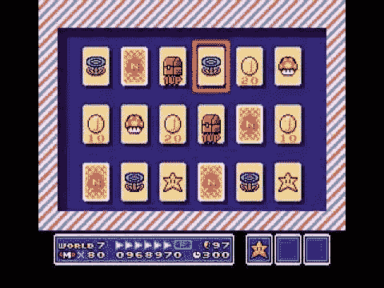
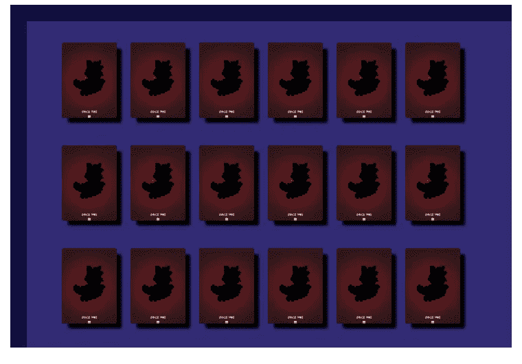
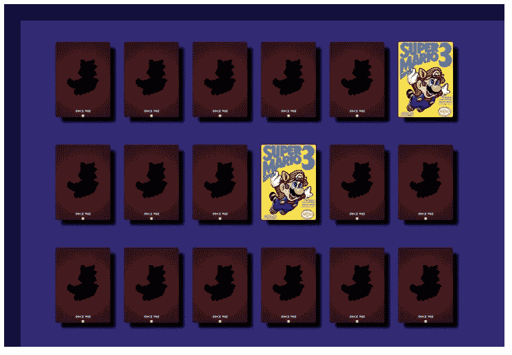

# 用 ReactJS 制作超级马里奥记忆游戏

> 原文：<https://medium.com/analytics-vidhya/making-super-marios-memory-game-with-reactjs-efffeb7249f?source=collection_archive---------13----------------------->



超级马里奥兄弟 3 卡内存小游戏

欢迎光临！你喜欢游戏和编程吗？这是给你的。

在本文中，我们将使用流行的 facebook 库 [ReactJS](https://reactjs.org/) 开发著名的超级马里奥卡片记忆游戏。

游戏在于让棋盘上所有的牌相遇。

开始吧！

## 第 1 部分:创建 react 应用程序

由于这是一个单页面应用程序，我建议使用 [create-react-app](https://github.com/facebook/create-react-app) CLI 来生成一个新项目，不需要其他配置，让我们专注于编码。打开终端并键入:

```
npx create-react-app my-game
```

使用您最喜欢的 IDE 并打开项目。

删除 index.css，把 App.js 和 App.css 里面的东西都去掉，在 App.js 里面我们来写一个初始类组件。

## 第 2 部分:用户界面

那么，有什么计划？我们应该创建哪些组件？

正如我们在上面的图片中看到的，游戏由格子上的卡片组成，所以，这些是我们的组件:**卡片**，**格子**。

**卡片**

我们的卡组件将获得 3 个道具:

*   项目:卡片的对象抽象。包含*类型*、*显示*、*解决*和 *bgImage* 等字段。
*   Index:一个数字，表示卡片在数组中的索引。
*   onClick:当卡片被点击时处理逻辑的函数。

这个组件本身没有逻辑，也不需要管理组件的生命周期，这就是为什么我们把它作为一个功能组件。

src/components/卡片/索引. jsx

**卡片样式**

src/components/Card/styles.css

**棋盘**

board 组件的独特职责是呈现一个包含 6 列的网格。

src/components/Board/index.jsx

**电路板样式**

src/components/Board/styles . CSS

## 第 3 部分:游戏资源

我们的组件已经准备好了，但是我们需要先生成电路板。

让我们在 *src* 中创建一个名为*实体*的新文件夹。在*实体*文件夹下创建一个 *js* 文件，名为 **Card.js** 。我们将导出一个卡片类，这将有助于我们填充或登机。

src/entities/Card.js

卡片属性:

*   **透露**:布尔型。指示卡是否正面朝上。
*   **类型**:字符串。表示卡的类型，即*“goomba”*卡。
*   **bgImage** :字符串。卡片背景。
*   **已解**:布尔型。表示该牌是否正确解出(遇到他的对子)。

现在，我们必须生成游戏资源(卡片)。为此，让我们在 *src* 文件夹中创建一个名为*游戏资源*的 *js* 文件:

卡片数组在内存中生成，并由此类导出。

所以，我们需要一个有随机卡片及其配对的板子。为此，让我们在 *src* 文件夹中创建一个名为 *BoardGenerator* 的新文件。

***generateBoard*** 是一个走卡长度乘以 2 并给每个位置分配一张随机卡的功能。为了避免相同类型的卡重复两次以上，它使用 *do while* 结构进行验证，并生成一张新卡。

## 第 4 部分:逻辑

让我们导入我们所做的组件和 *generateBoard* 函数。

并添加以下状态:

我们新的渲染函数是:

应用程序样式

此时，我们将能够看到一个带有卡片的纸板:



现在，让我们来制定游戏的逻辑。

我们需要处理卡上的点击，并验证两张卡是否匹配。

匹配卡



重置回合并翻牌

完整的 App.js 组件

回购环节:[https://github.com/zendostrike/match-the-cards](https://github.com/zendostrike/match-the-cards)

就这些了，感谢阅读！