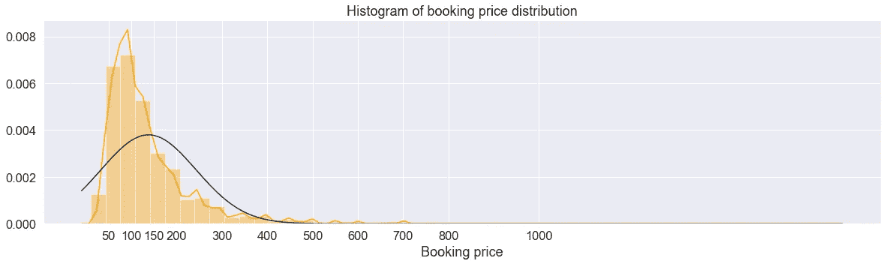
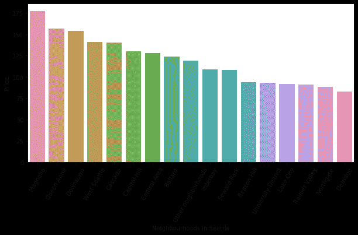
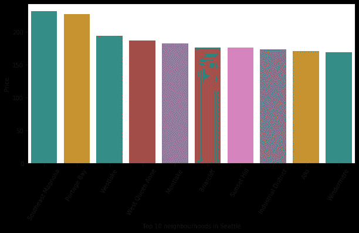
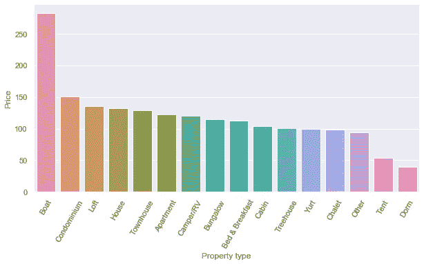
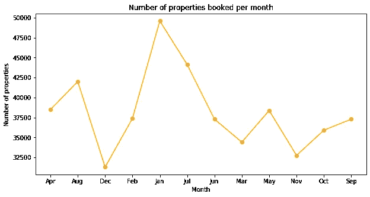
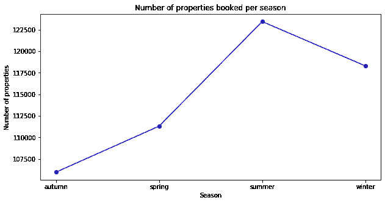

# 充分利用 Airbnb 西雅图数据

> 原文：<https://medium.com/analytics-vidhya/making-the-best-out-of-airbnb-seattle-data-d6c7533a6286?source=collection_archive---------20----------------------->

# 涵盖的主题:

1.  介绍
2.  商业理解
3.  数据理解
4.  摘要

# 介绍

在这篇博客中，我们将分析来自 Kaggle 的 [Airbnb 数据集，并回答各种利益相关者的几个问题。原始数据呈现在](https://www.kaggle.com/airbnb/seattle)[这里](http://insideairbnb.com/get-the-data.html)。以下是可以使用该数据集的各种利益相关方:

1.  已经在 Airbnb 上列出一处或多处房产的现有房东。
2.  想在 Airbnb 上添加自己房产的新主人。
3.  Airbnb 想知道所列房产在即将到来的月份/年度的表现如何。他们可以进一步使用它向用户提供建议或给出相关的搜索结果。
4.  由于这是公开数据，即使是 Airbnb 的客户也可以用它在 Airbnb 上以最优惠的价格预订一处房产，或者在西雅图找到最好的住宿地点。

# 商业理解

虽然可以对数据进行研究，以发现所有利益相关者的见解，但本博客主要关注想要添加新资产的利益相关者 1 和 2。我们将回答以下问题，以获得业务理解。

1.  Airbnb 西雅图所有房产的价格分布如何？
2.  西雅图最贵/最便宜的小区有哪些？
3.  某些类型的房产比其他类型的贵吗？
4.  每月的物业预订情况如何？
5.  Airbnb 的预订有旺季吗？
6.  我们如何预测新房产的预订价格？

# 数据理解

在深入研究数据的细节之前，让我们试着理解我们的数据是什么。我们手里有三份文件:

1.  **评论:**这个文件包含每个列表的所有评论。在这个项目中，我们将不会使用 reviews 文件，因为项目的重点是新的属性。
2.  **列表:**它包含列表的详细信息，比如房间数量、邻居详细信息、描述等等。
3.  **日历:**这是每日预订数据，每个列表有 365 条记录。该文件包含从 2016 年 4 月 1 日**到 2017 年 2 月 1 日**的数据。所以，文件有 **11 个月的数据**。当列表可供预订时，它会提到价格，否则为空。

***注:*** *在这个项目中，我关注了如何使用数据来帮助一个想要在 Airbnb 西雅图添加新房产的主人。因此，既没有使用 reviews 文件，也没有使用与清单文件中的 reviews 相关的列。*

现在，让我们看看如何使用给定的数据集回答开头提到的问题。

## **1。Airbnb 西雅图所有房产的价格分布如何？**

从上面的图像中，我们可以看到预订价格非常右偏。虽然大部分上市的房产标价在 100 美元左右，但也有一些非常昂贵的房产价格超过 1000 美元。我们需要对此进行更多的调查。

## **2。西雅图最贵/最便宜的小区有哪些？**

由于西雅图有许多地点/社区，我们可以看看哪些社区最贵。下图显示了西雅图每个社区组的平均房价。

木兰花是住宿最贵的地方，每晚平均价格超过 175 美元。安妮女王和市中心紧随其后，平均价格略高于 150 美元。德尔里奇租赁 Airbnb 房间/公寓的价格似乎非常便宜，均价刚刚超过 75 美元。雷尼尔谷和北门也很便宜。

假设一个街区比另一个更贵，那么周围一定会发生一些旅游事件，以下是西雅图十大值得呆的街区。

## **3。某些类型的房产比其他类型的贵吗？**

通过下面的图片，我们可以说住在船上是非常昂贵的，而宿舍是最便宜的。

## **4。每月的物业预订情况如何？**

我们没有使用记录 where available = 'f '进行预测，但我们可以使用它来了解何时酒店预订最多。

从上图可以推断，一月是大部分房产被预订的月份。12 月似乎是大部分房产可以预订的月份。

## **5。Airbnb 的预订有旺季吗？**

虽然 1 月份 Airbnb 的预订量最高，但 12 月和 2 月份的预订量并不多。因此，冬天不是西雅图 Airbnb 的旺季。相反，夏季似乎是 Airbnb 大多数房产被预订的时候。这可能是因为西雅图的雨季在六月、七月、八月会停止，游客可以去旅游，享受西雅图的自然美景。

## 6.我们如何预测新房产的预订价格？

为了预测预订价格，需要对数据进行结构化，为此，需要对数据进行清理。以下是数据清理的高级步骤:

1.  删除没有变化的数据(删除具有相同值的列)。
2.  删除 100%未填充的数据(删除全部为空值的列)。
3.  用平均值/模式替换未填充的数据(用数值列的平均值和分类列的模式填充空值)。
4.  使用现有数据添加有意义的新数据(使用一些现有列添加新列)。
5.  删除不相关的数据(因为不需要审查信息，所以删除所有与审查相关的列。因为没有使用文本挖掘，所以删除了所有包含大量文本的列，也不需要 url 信息)。

数据清理后，列表和日历文件被合并。在这个项目中，我使用了线性模型:线性回归和集合模型:随机森林回归。

随机森林回归器给出了更好的结果，因为它能够解释数据集中 99%的总方差。因此，它被用来预测预订价格。

根据随机森林模型，公寓的类型:是否有整个房间或公寓可供入住以及房间总数(卧室+浴室)是决定预订价格的最重要因素。

关于预测是如何完成的更详细的博客可以在[这里](https://hianjana.medium.com/predict-the-booking-price-for-a-new-property-on-airbnb-seattle-83b772922e39)找到。

# 摘要

1.  木兰花、安妮女王和市中心是西雅图 Airbnb 最贵的街区。德尔里奇酒店是最便宜的酒店。
2.  住在船上是最贵的，住在宿舍是最便宜的。
3.  一月份是预订的高峰期。
4.  夏季是预订的旺季。
5.  随机森林模型给出了此数据的最佳结果，可用于进一步的预测。

你可以在 Github 的这里找到完整的代码[。](https://github.com/hianjana/Seattle_Airbnb_Prediction)