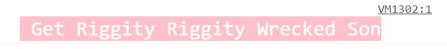

# 让您的控制台消息丰富多彩

> 原文：<https://medium.com/analytics-vidhya/making-your-console-messages-colorful-3d4ef4d4ea5b?source=collection_archive---------24----------------------->

有一大堆错误，厌倦了调试？这里有几个小技巧，让你的生活变得简单，同时你也可以给你的控制台消息增添情趣和阳光。

我们可以使用`%c`指令将 CSS 样式应用于控制台输出。这里有几种方法可以做到。

> 注意:将以下控制台命令粘贴到您的控制台窗口中(对于 windows，请按 ctrl +shift + j)

```
console.log('%c Get Riggity Riggity Wrecked Son', 'color: white; background: pink; font-size: 20px')
```



使用简单的%c 打印控制台消息

将 *%c* 指令作为前缀添加到您想要添加样式的字符串部分。

指令之前的文本不会受到影响，但是指令之后的文本将使用参数中的 CSS 声明来设置样式。

## 控制台消息的多种样式:

我们可以在同一个控制台命令中向多个字符串添加多种样式。

```
console.log("%cIM " + "%cPOSSIBLE", "color: purple; background: pink", "color: yellow; background: black")
```

## 设置错误和警告消息的样式:

用户也可以改变错误消息和警告的样式。

```
console.error('%cWubba Lubba Dub Dub!', 'color: whitesmoke; background: black')
console.warn('%c...To Live Is To Risk It All...', 'color: green; font-size: large')
```

## 将样式推送到数组中:

当我们有太多的字符串时，我们可以传递数组中的样式，并将其连接成一个字符串。

```
var styles = [
    'background: linear-gradient(green, #571402)'
    , 'color: white'
    , 'display: block'
    , 'line-height: 40px'
    , 'text-align: center'
    , 'font-weight: bold'
].join(';');console.log('%c The Universe Is Basically An Animal... ', styles);
```

## 使用%s 指令显示字符串，使用%c 指令设置其样式:

我们可以使用%s 字符串来传递字符串并对其应用样式。这就是你要做的。将需要打印的字符串和样式分别赋给变量，并在控制台命令中立即调用。

```
styles = 'font-weight: bold; font-size: 50px;color: red; text-shadow: 3px 3px 0 rgb(217,31,38) , 6px 6px 0 rgb(226,91,14) , 9px 9px 0 rgb(245,221,8) , 12px 12px 0 rgb(5,148,68) 'message = 'Wubba Lubba Dub Dub!'console.log('%c %s', styles, message)
```


同时使用%s 和%c 指令

今天到此为止。

## 参考资料:

1.  [*https://developer . Mozilla . org/en-US/docs/Web/API/console #用法*](https://developer.mozilla.org/en-US/docs/Web/API/console#Usage)
2.  [*https://www . Samantha Ming . com/tidbits/40-colorful-console-message/*](https://www.samanthaming.com/tidbits/40-colorful-console-message/)
3.  [*https://developers . Google . com/web/tools/chrome-devtools/console/console-write # styling _ console _ output _ with _ CSS*](https://developers.google.com/web/tools/chrome-devtools/console/console-write#styling_console_output_with_css)