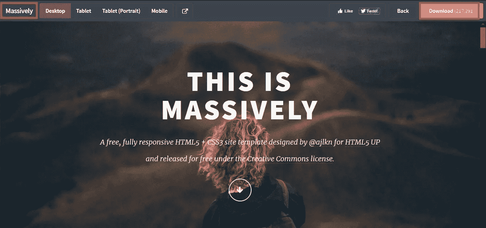
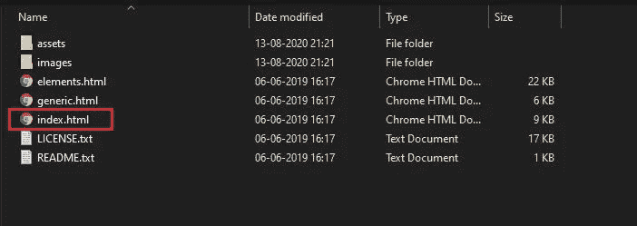
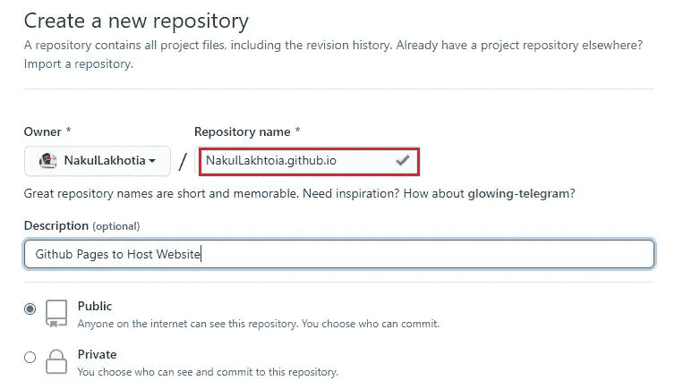
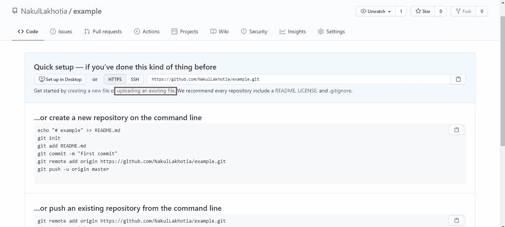
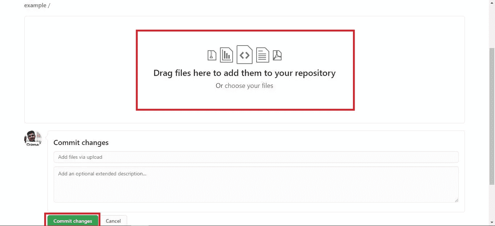

# 创建投资组合网站——变得简单

> 原文：<https://medium.com/analytics-vidhya/making-your-portfolio-website-for-free-35e29378603e?source=collection_archive---------5----------------------->

## 你还在等什么？

来源: [Unsplash](https://unsplash.com/s/photos/website)

作品集只被艺术家、设计师、作家和视觉专业人士用来展示他们的作品和技能的日子已经一去不复返了。如今，随着**所有行业**的竞争日益激烈，重要的是你在该领域的经验和熟练程度。还有什么能比创建一个作品集网站更好地推销你的技能呢？这个网站能突出并帮助你在工作社区中以一种有效的方式为目标受众建立信誉。

> *克拉克大学将档案袋定义为* " **体现你的信念、技能、资格、教育、培训和经历的材料汇编。它能洞察你的个性和职业道德。**”

当你想到创建一个网站时，你会想到什么，任何与此相关的网站？你认为要在网上托管你的网站，你必须买一个域名吗？如果是这样，我可以向你保证，你不是第一个这样想的人。老实说，当你为自己的个人和职业发展做事时，你不应该在乎钱。

## 但是，我们热爱自由，不是吗？

而且这也没有错！

在本文中，我将向您展示如何使用 [**GitHub Pages**](https://pages.github.com/) 创建您自己的作品集网站并免费在线托管。你所需要的只是一个 GitHub 账户，以及 HTML、CSS 和 JavaScript 的工作知识。

让我们开始吧。

1.  **给自己找一个免费的网站模板**:你可以在网上找到成千上万的免费网站模板。我用的是 [HTML5 UP](https://html5up.net/) 。该网站提供完全响应和可定制的模板。选择一个最适合你的设计并下载到你的电脑上。让我给你看一个例子。

模板示例

打开模板时，会打开上面的页面。点击右上角的下载按钮，网站模板以 zip 格式下载。提取新文件夹中的所有文件。几乎所有从该网站下载的文件都具有以下结构。

提取的文件夹和文件

“index.html”是你网站的主网页。“assets”文件夹中有 JavaScript 和 CSS 文件夹。

2.使用文本编辑器编辑模板:正如我上面提到的，你需要你的前端 web 开发技能来设计你的网站。我更喜欢[崇高文字编辑器](https://www.sublimetext.com/3)。万一你在某一点上遇到困难，你可以从 [W3Schools](https://www.w3schools.com/) 那里获得帮助。

3.**创建一个**[**GitHub**](https://github.com/)**账号**:你可以从这个[网站](https://www.wikihow.com/Create-an-Account-on-GitHub)获得帮助来创建你的账号。

4.**创建 GitHub 页面存储库**:登录 GitHub 后，创建一个新的存储库。按左上角的绿色按钮，上面写着“新建”。这将带您进入下一页。

创建新的存储库

请注意，我的存储库名称遵循语法— {Username}.github.io

这是创建 GitHub Pages 存储库时要执行的标准步骤。最后，单击“创建存储库”按钮。

> 您的 GitHub 页面存储库的最大存储容量为 1GB。这对于托管简单的网站来说绰绰有余。

5.**将您的文件夹上传到该存储库中**:一旦您创建了存储库，您将进入以下页面。

将文件上传到您的新存储库

点击“上传现有文件”。这将带你到这里:

上传您的文件夹

要上传您的网站文件夹，请拖放文件夹。所有文件上传后，点击“提交更改”按钮。

6.**打开你的网站**:要打开你的网站，在浏览器上粘贴网址:{ username . github . io }/{ foldername }/index . html

例: [**我的作品集**](https://nakullakhotia.github.io/portfolio/index.html)

这就对了，你的投资组合网站使用 GitHub 页面在线托管！！

***注*** *:本文中已经提到了开始工作所需的所有资源及其链接。希望你好好利用:)*

我真诚地希望这篇文章能激励你继续前进，创建一个你自己的网站。如果你喜欢读这篇文章，不要忘记点击下面的“拍手”图标。谢谢你的时间。