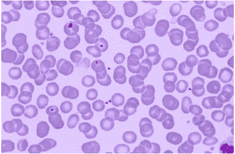
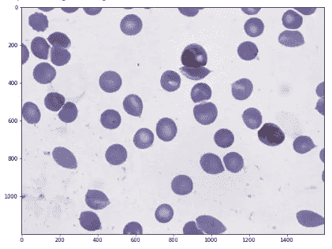

# 疟疾包围盒

> 原文：<https://medium.com/analytics-vidhya/malaria-bounding-boxes-41122bedf235?source=collection_archive---------9----------------------->

# 介绍

alaria 是一种由疟原虫寄生虫引起的疾病，它仍然是全球健康的主要威胁，每年影响 2 亿人并导致 40 万人死亡。

对于疟疾和其他微生物感染，由训练有素的显微镜专家人工检查厚血涂片和薄血涂片仍然是寄生虫检测和阶段确定的金标准，因为其试剂和仪器成本低且灵活性高。尽管手动检测的处理量极低，并且容易受到人为偏差的影响，但由于明视野显微镜图像的变化范围很大，自动计数软件在很大程度上仍未得到使用。

样本显微图像

为了克服这些问题，我建立了一个深度学习模型，将每个细胞分类为各自的感染或未感染细胞。

# 机器学习问题

我们可以把这个问题当作一个**物体检测问题，这里的**物体是血细胞。该模型以原始图像为输入，通过在细胞周围绘制包围盒并注明细胞类型来给出输出。

输入:

输出:

# 数据

我使用了来自 Kaggle 的[疟疾包围盒](https://www.kaggle.com/kmader/malaria-bounding-boxes)的数据，该数据由显微图像和注释(包围盒信息和图像中每个细胞的类别)组成。数据集由两类未感染细胞(红细胞和白细胞)和四类感染细胞(配子体、环、滋养体和裂殖体)组成。如果没有明确归类到某个细胞类别中，则将某些细胞标记为困难细胞。

注释以 JSON 格式给出。

我将 80%的数据用于训练，20%的数据用于测试。

数据的一个主要问题是阶级不平衡。这里**红细胞**类支配着其他类

给定的 JSON 格式不适合模型准备，所以我制作了一个数据框，包括图像名称、边界框信息和类标签。我们在每个图像中有许多单元格，所以相同的图像名称将出现在更多的行中

# 用更快的 RCNN 建模

为了训练，我决定使用一种流行的物体检测算法的**更快的 R-CNN。**

快速 R-CNN 由 3 个神经网络组成——特征网络、区域建议网络(RPN)和检测网络

## 特征网络:

特征网络通常是众所周知的预训练图像分类网络，例如 VGG 减去几个最后/顶层。该网络的功能是从图像中生成良好的特征。该网络的输出保持了原始图像的形状和结构(即，仍然是矩形，原始图像中的像素粗略地映射到相应的特征“像素”等)。)

## 区域提案网络(RPN):

RPN 通常是具有 3 个卷积层的简单网络。有一个共同的层，它分为两层，一层用于分类，另一层用于边界框回归。RPN 的目的是生成许多被称为感兴趣区域(ROI)的边界框，这些边界框具有包含任何对象的高概率。该网络的输出是由两个对角的像素坐标标识的多个边界框，以及一个值(1、0 或-1，分别指示对象是否在边界框中或者该框可以被忽略)。

## 检测网络:

检测网络(有时也称为 RCNN 网络)从特征网络和 RPN 获取输入，并生成最终的类和边界框。它通常由 4 个完全连接或致密的层组成。分类图层和边界框回归图层共享两个堆叠的公共图层。为了帮助它仅对边界框内部进行分类，将根据边界框裁剪要素。

由于我们的数据是高度不平衡的，我在整个数据集上训练更快的 R-CNN 后没有得到好的结果。无论细胞是什么，我们的模型预测它是红细胞，因为它在我们的数据集中占主导地位。为了克服这一点，我把这个问题分成两个阶段的分类问题。

## 一级分类:

*   首先，我创建了只有两个标签的数据集，RBC 和 Other(除了 RBC 以外的所有类)
*   基于该数据训练了更快的 R-CNN 模型，该模型预测边界框和两个类别标签 RBC 和 Other

## 二级分类:

*   我已经用其他类(除了 RBC)的地面真实边界框尺寸裁剪了图像。

*   针对所有其他类，在此裁剪图像上训练密集网络模型。

## 测试

*   原始图像将被发送到第一级分类器。

*   它用边界框预测类 RBC 和其他。该结果(图像名称、边界框坐标和类别标签)将保存为 CSV 文件。

*   在第二级中，再次获取原始图像并用预测的边界框尺寸裁剪其他类单元，最后馈送到模型 2。模型 2 将预测单元的原始类别标签。

## 地面真实图像:

## 结果

我使用地图作为模型的度量。关于地图的更多细节，请参考本文。

这是测试数据的结果

第一级分类器:在预测合适的包围盒以及分类红细胞和其他方面给出很好的结果

一级分类器后测试数据的结果

最终分类器:对于少数类别，模型性能较低，因此，总体而言，我的 MAP 为 0.78

最终分类器测试数据的结果

# 结论

*   一级分类器在分类感染和未感染细胞方面做得不错，但在分类未感染细胞(红细胞和红细胞)方面做得不太好
*   第二级分类器也工作良好，但由于内存问题，我拍摄的裁剪图像分辨率非常低。如果我们下定决心，我们还能得到更好的结果。
*   模型与“困难”类别有点混淆，因为实际上它不是一种感染的细胞类型，它只是因为我们不能将少数细胞分成 6 类中的任何一类而给出的。因此，我们的模型将预测正确的类而不是困难的类。

# 未来的工作

*   代替采用两个不同的分类器，我们可以通过创建次要类别的复制图像来平衡数据集，例如，我们可以使用 GAN(生成对抗网络)作为数据增强技术。

# 参考

[https://arxiv.org/pdf/1504.08083.pdf](https://arxiv.org/pdf/1504.08083.pdf)

【https://arxiv.org/ftp/arxiv/papers/1804/1804.09548.pdf 号

【https://github.com/kbardool/keras-frcnn 

[https://medium . com/@ what dhack/a-deeper-look-how-faster-rcnn-works-84081284 E1 CD](/@whatdhack/a-deeper-look-at-how-faster-rcnn-works-84081284e1cd)

你可以在我的 [Github 库](https://github.com/sandeepburra/Malaria-Bounding-Boxes)中找到完整的代码

希望你喜欢这个博客，欢迎在下面的评论区分享你的想法，或者通过 [LinkedIn](https://www.linkedin.com/in/sandeep-burra-a7635aa0/) 联系我