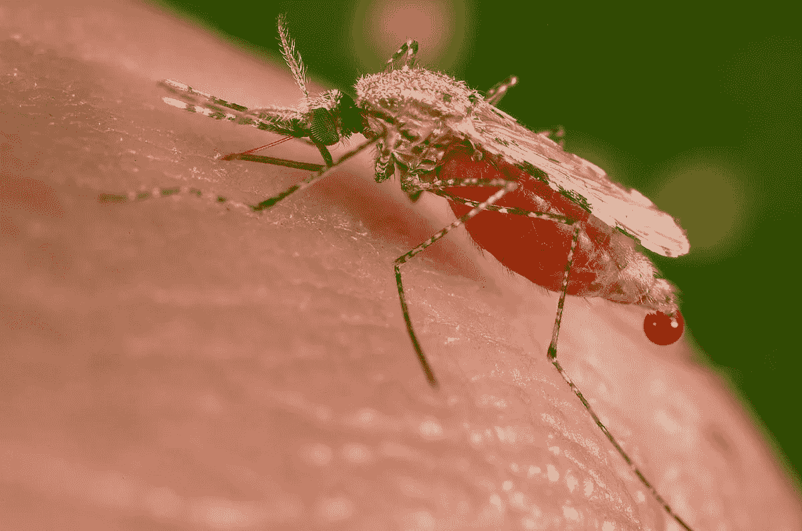
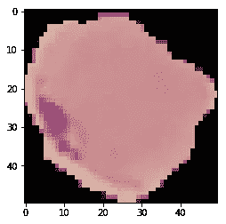
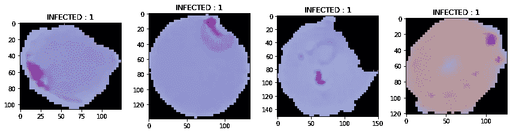
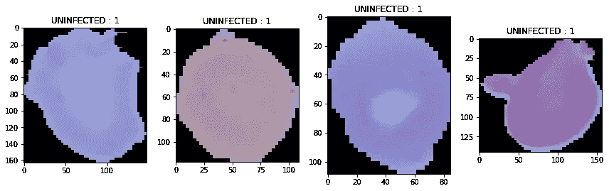
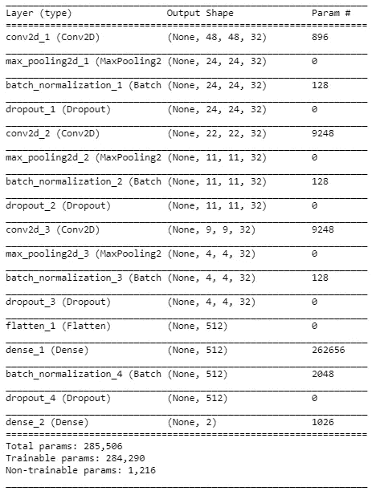
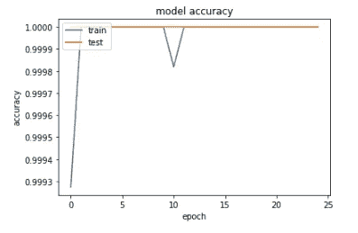
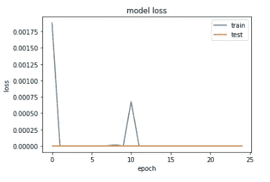
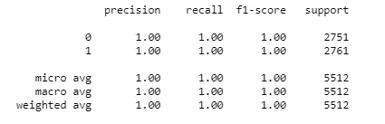
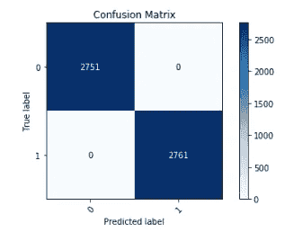

# 基于卷积神经网络的感染疟疾细胞图像分类

> 原文：<https://medium.com/analytics-vidhya/malaria-cell-image-classification-using-keras-89a324f52131?source=collection_archive---------0----------------------->

疟疾是一种威胁生命的疾病，由寄生虫引起，通过受感染的雌性疟蚊的叮咬传播给人类。它是可以预防和治愈的。疟疾引起的症状通常包括发烧、疲劳、呕吐和头痛。在严重的情况下，它会导致皮肤发黄、癫痫发作、昏迷或死亡。

人体皮肤中的按蚊

疟疾一直是非洲的主要死亡原因之一，能够使用卷积神经网络对感染疟疾的细胞图像进行分类对于疟疾的快速诊断至关重要。

总共收集了 27，558 张图像，用于开发深度学习模型，该模型可以准确预测感染疟疾的细胞和未感染疟疾的细胞。用于训练模型的图像总数为 22，076，用于验证模型的图像总数为 5，512。

疟疾感染细胞的图像

数据预处理中的一件重要事情是调整疟疾细胞图像的大小，因为图像具有不同的大小。这些图像的尺寸被调整为 50 乘 50。

疟疾感染细胞的图像

疟疾未感染细胞的图像

从感染疟疾的细胞图像和未感染的细胞图像中可以看出，可以观察到感染细胞的细胞图像内的小凝块，并且未感染的细胞是干净的，在细胞图像中没有任何凝块。

Keras 深度学习框架用于构建卷积神经网络。从 Keras 导入必要的库来训练模型。

卷积神经网络模型综述

用于训练该模型的优化器是“Adam ”,并且该模型在二十五(25)个时期内被训练和验证。

模型精度

模型损失

该模型在训练集上的精度为 1.00，在验证集上的精度为 1.00。这表明该模型预测并能够预测细胞是否感染了疟疾

分类报告

混淆矩阵

混淆矩阵和分类报告重申，该模型准确预测并且能够准确预测细胞是否感染疟疾。

整个编程是在 Kaggle 内核上完成的，因为它提供了免费的 GPU，而且不需要下载数据集，因为它已经在 Kaggle 上了。我会鼓励你使用 Kaggle 内核，因为它有免费的 GPU，或者你可以使用 Google Colab。代码的完整链接可以在[这里](https://github.com/KennyRich/Malaria-Cell-Classification-Using-CNN)找到，你可以在这里[访问 Kaggle 上的数据集。](https://www.kaggle.com/iarunava/cell-images-for-detecting-malaria)

感谢您阅读文章。请分享您的意见和反馈。