# 使用深度学习在血液样本图像中检测疟疾

> 原文：<https://medium.com/analytics-vidhya/malaria-detection-in-blood-sample-images-using-deep-learning-b28c736c827c?source=collection_archive---------10----------------------->

## 组块学习

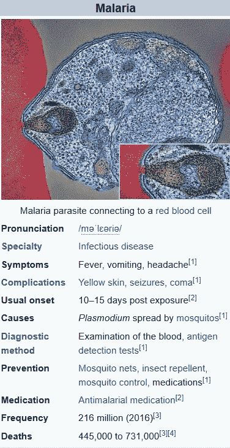

来源:维基百科

***疟疾*** *是一种蚊媒传染病，影响人类和其他动物。疟疾引起的症状通常包括发烧、疲劳、呕吐和头痛。在严重的情况下，它会导致皮肤发黄、癫痫发作、昏迷或死亡。症状通常在被受感染的蚊子叮咬 10 到 15 天后出现。*

**传播区域:**

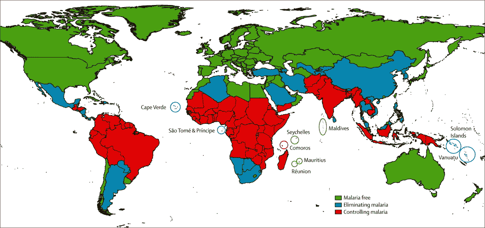

来源:必应搜索

**诊断:**

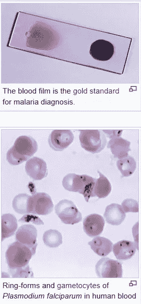

来源:维基百科

上面的图像为我收集血液图像样本铺平了道路，因为医生收集病人的血液样本是为了检测疾病。

因此，废话不多说，直接进入编码，今天我们将通过一个快速代码来了解血液样本图像中的疟疾检测，从在 Kaggle 数据集中找到这些数据，到构建一个简单而强大的分类器，再到血液图像中的寄生样本和未感染样本。

***继续之前注意:我一定会推荐你使用 Kaggle 内核而不是 Google Colab。为什么？见下文。***

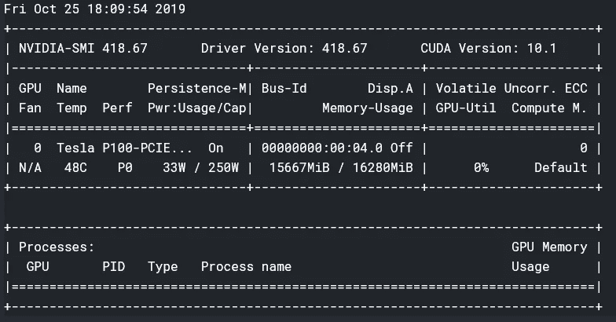

来源:Kaggle 内核(类型->！nvidia-smi) 16 GBs 的 GPU Ram 和 Nvidia Tesla P100

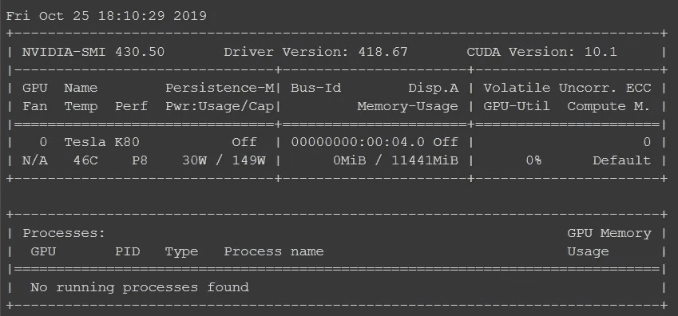

来源:Kaggle 内核(类型->！NVIDIA-SMI)11gb 的 GPU Ram 和特斯拉 K80

在 GPU 内存方面，P100 肯定大于 K80，这有助于 CNN 训练大型模型。

***代码:***

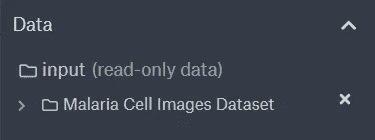

1.  [加载]Kaggle 内核中的数据(数据集在 ka ggle 数据集中可用)

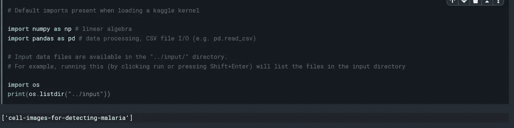

*   [默认]内核加载时很少导入，如果链接，则显示数据集。

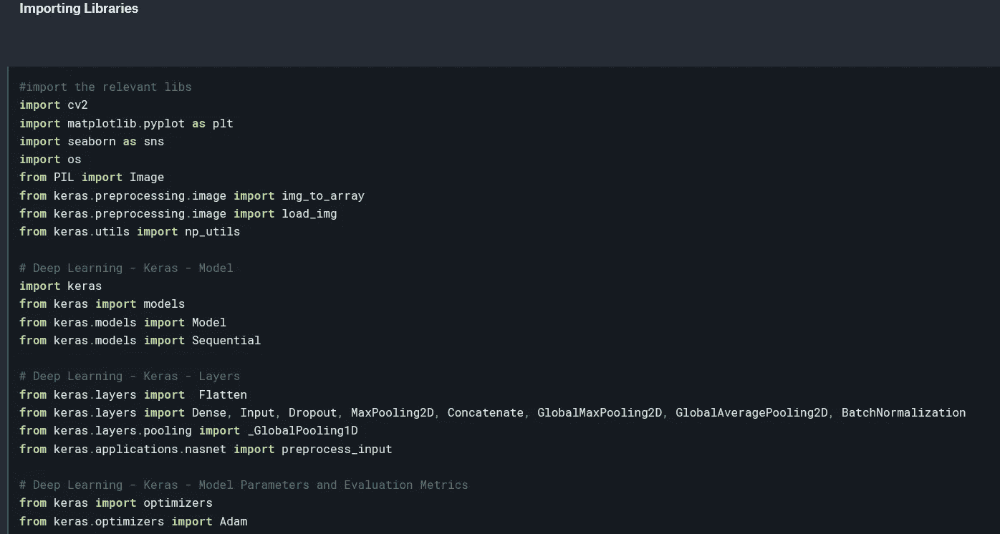

*   加载构建分类器所需的[库]。

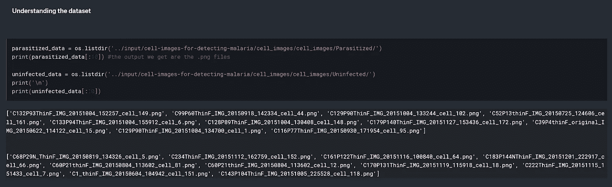

2.数据集开始加载并描述它们。png 格式图片]。

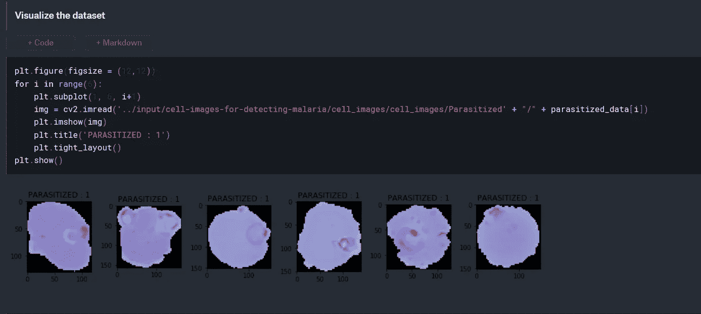

3.[可视化]寄生样本图像

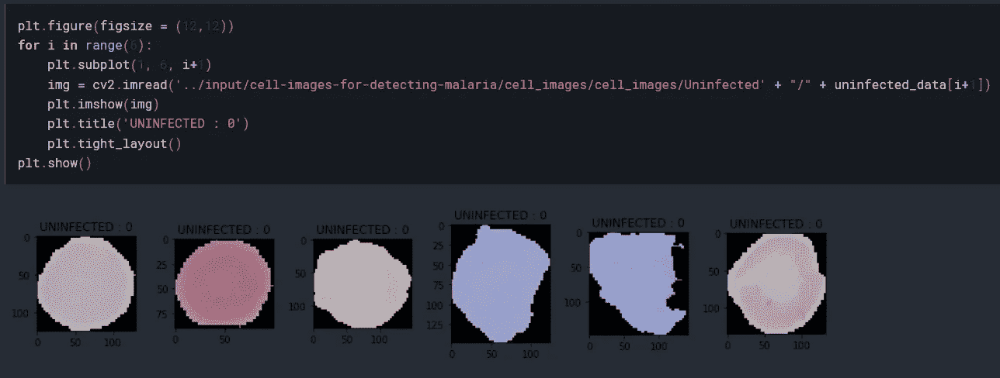

未受感染的样本图像

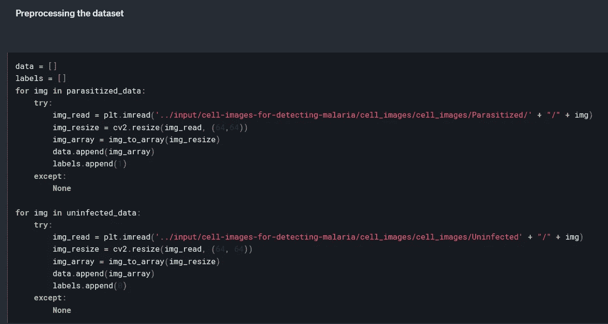

4.已将图像调整为 w-64、h-64；否则它可能会遇到内存错误(它发生在我 128，128 ),并将其转换为 Keras 图像数组格式。

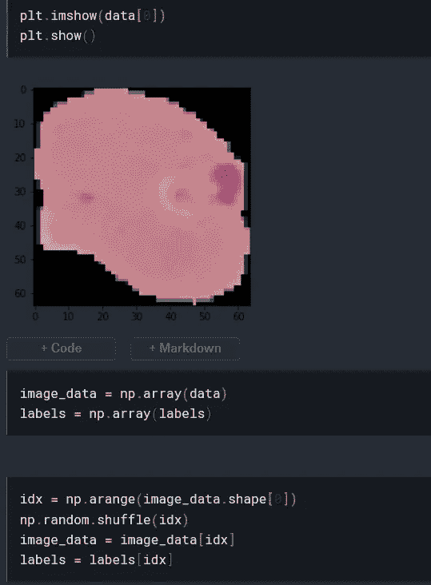

*   查看调整大小后的图像。

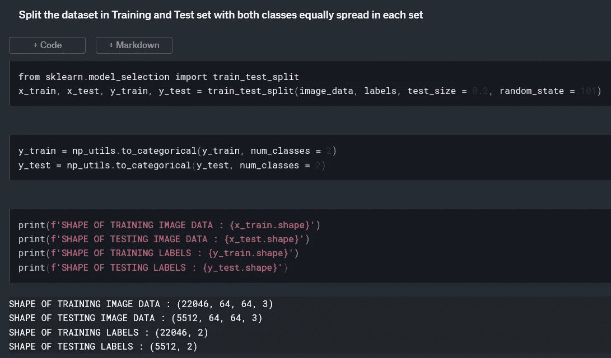

5.为训练过程拆分数据集。

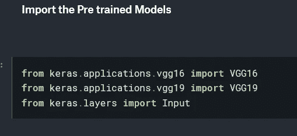

6.导入预训练(VGG16，19，ResNet，Inception Net，RetinaNet)模型，这样做是为了节省一些时间，并取得了良好的效果，因为我们知道预训练模型已经在大型数据集上进行了训练，获得了很好的洞察力，这将有助于更好地理解新数据集中的模式。

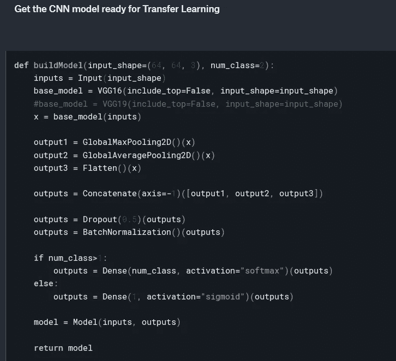

*   移除顶层(因为它们是在 1000 个 ImageNet 类上训练的，并将其修改为我们用于两个类)。

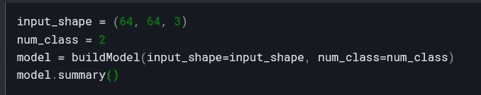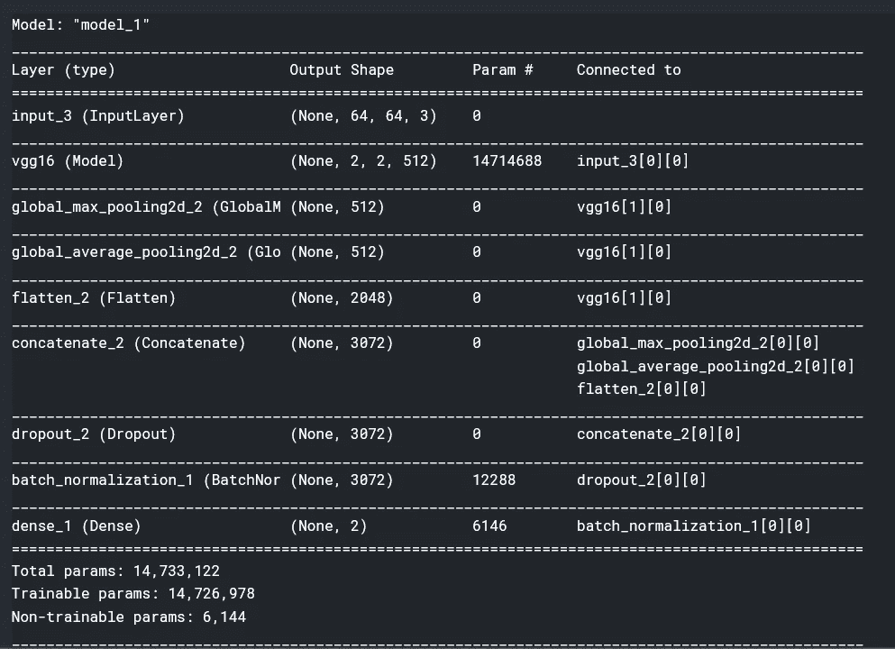

*   在调用带参数的模型时，结果也是摘要。

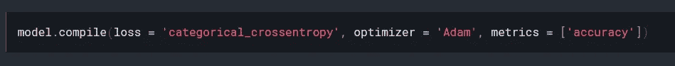

*   设置损失函数、优化器和精确度指标

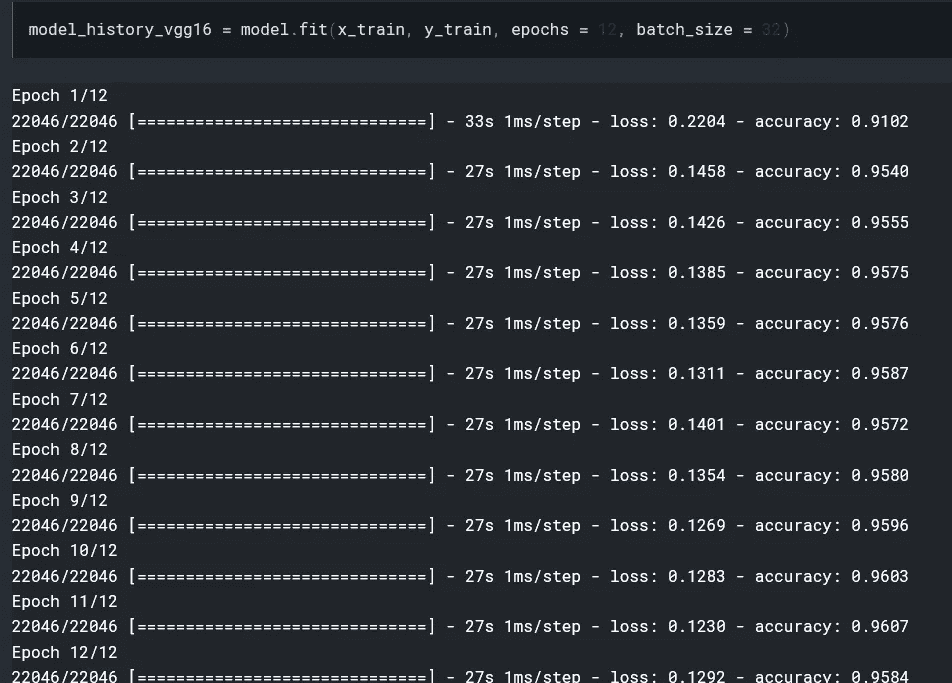

7.开始训练吧，看，我们达到了非常好的准确率，大约 96%。

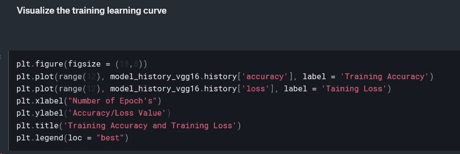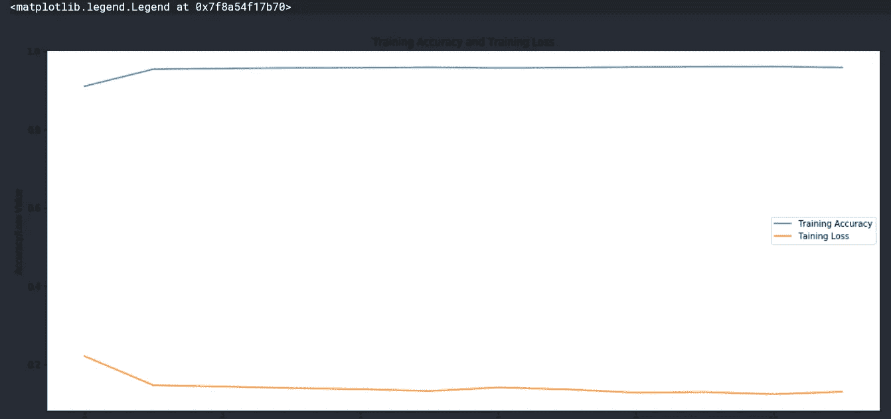

*   学习曲线也符合训练值

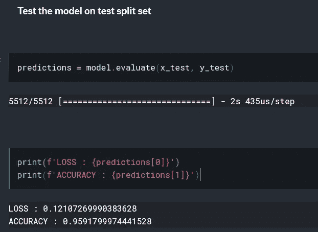

*   数据集的测试结果已经出来了。

***代码链接:***

*https://www . ka ggle . com/Susan T4 learning/malaria detection-in-blood samples？scriptVersionId=22550587*

*希望您对此感兴趣，在接下来的文章中，我们将介绍其他医学图像格式，并了解这些挑战以及解决这些挑战的不同 CNN 架构。*

**坚持学习！！！**