# 监控下的疟疾疾病检测

> 原文：<https://medium.com/analytics-vidhya/malaria-disease-detection-using-supervisely-7ff5ed253062?source=collection_archive---------24----------------------->

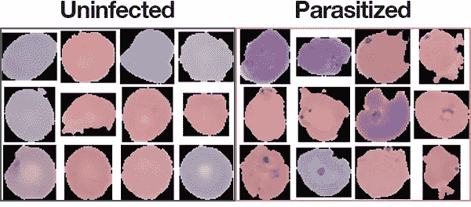

> 什么是超级监管？

**Supervisely** 是一个强大的计算机视觉开发平台，在这里，个人研究人员和大型团队可以用**数据集**和**神经网络**进行注释和实验。

> ***里面是什么？***

那么 Supervise.ly 到底能如何帮助我们的数据科学家同行呢？

*   **处理数据的在线服务**。借助备份和便捷的工具，随时随地保存和访问您的数据。
*   **数据集导入**。上传您自己的数据或自动转换流行的开源数据集-我们包括许多现成的配置。
*   **标注工具**。注释一幅图像需要 30 分钟:拥有一个方便实用的工具很重要。在基于网络的解决方案中，我们支持热键、矢量和位图图形、过滤和字幕等等。
*   **智能导出**。将数据集保存在一个地方，并一起准备它们！无需编码:使用简单明了的 JSON 配置进行过滤、调整大小、扩充、训练验证分割、将多个数据集合并为一个数据集，并将结果保存为流行的现成框架格式。
*   **统计数据**。对自己的数据了如指掌，训练时就不会面临意想不到的麻烦。如果你没有准备好，像阶级不平衡这样的问题会让你的日子变得更糟。
*   **角色管理**。企业用户会喜欢多个帐户、访问权限和活动日志。例如，为 m-turkers、内部注释和数据科学家配置不同的权限。
*   **集成**。将 Amazon Mechanical Turk 等知名工具的功能与 Supervisely 的功能结合起来。

> ***实现***

*   在[上登记并监督](https://www.google.com/search?q=supervisely&oq=su&aqs=chrome.1.69i59l2j69i60l5.1599j0j7&sourceid=chrome&ie=UTF-8#)。
*   创建一个团队，在这个团队下，我们的工作空间将被构建。

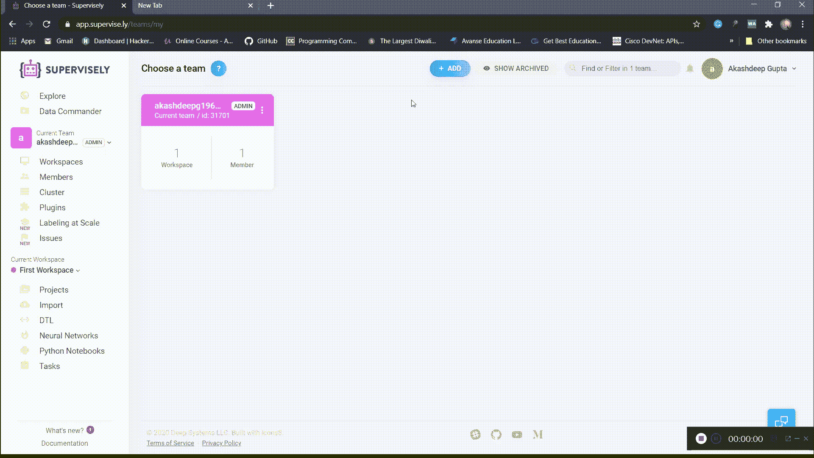

创建团队和工作区

*   现在转到数据集到工作区的导入部分。

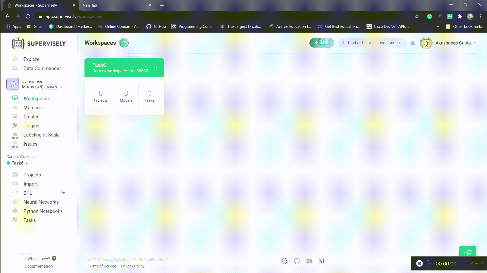

上传数据集

*   使用**监控注释工具对图像进行注释。**

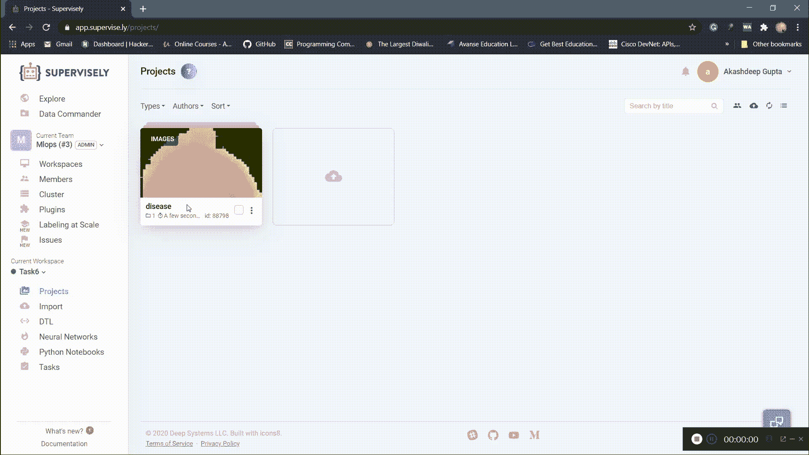

标注数据集

这里，我使用了**位图**工具进行标注。您可以尝试不同的工具来注释数据集。

> 培训的数据准备占用了数据科学家的大部分时间。此外，在执行这样的过程时，出现错误的可能性很高。

*   Supervisely 通过设计一种名为 **DTL** 的特殊语言解决了这个问题，这种语言允许我们完全自动化数据操作:合并项目和数据集，进行类映射，图像和注释的各种放大，保存为不同格式，等等。

这个过程是用基于 **JSON** 的配置文件定义的。

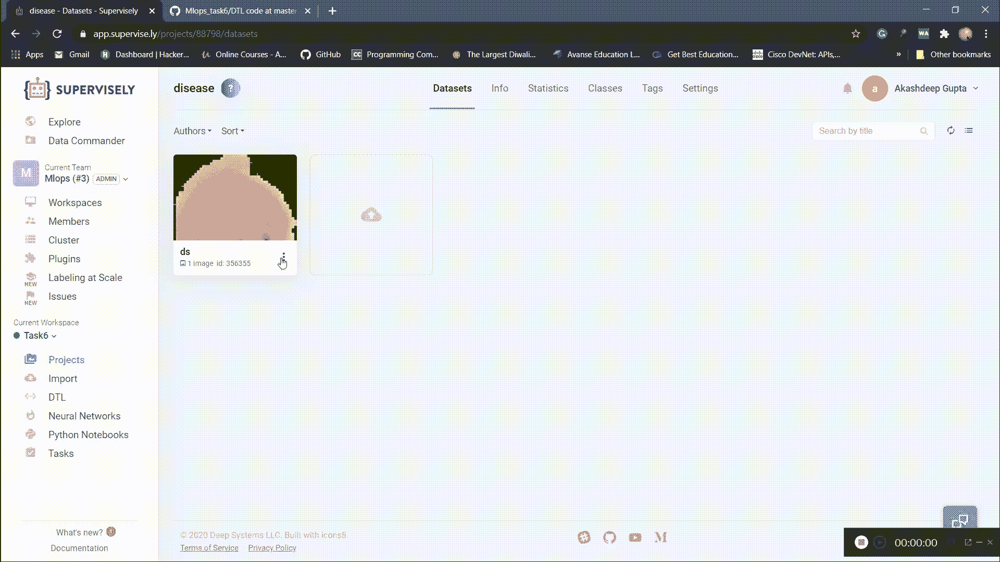

总杠杆系数

你可以清楚地看到只用 1 个数据集 **DTL** 的代码就创建了 5 个数据集，这是多么强大。同样，您可以用少量的数据集创建更大的数据集。

**DTL** 代码你可以从[这里得到*。*](https://github.com/Akashdeep-47/Mlops_task6.git)

*   现在，进入我们的主要部分训练我们的数据集。为此，我们必须在模型中添加一个神经网络。

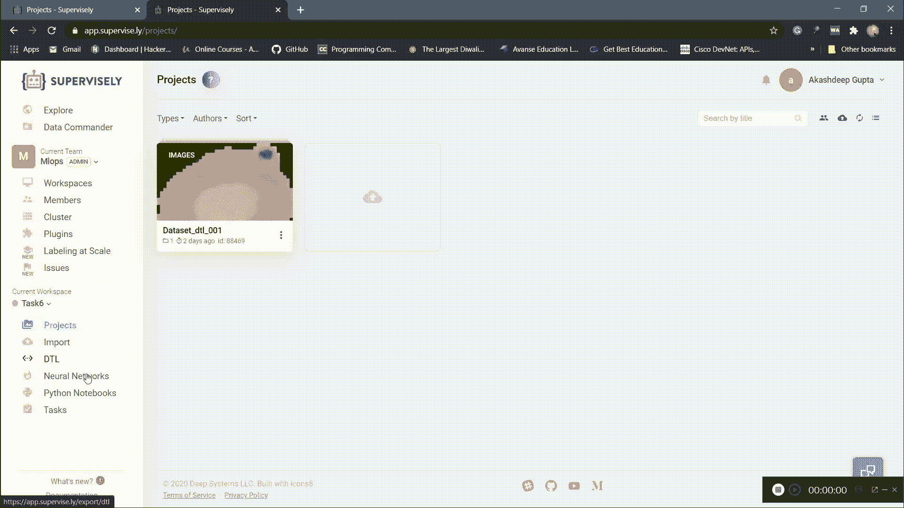

添加模型

我们已经成功地添加了模型，但最后，我们得到了一些**无代理**错误。为了解决这个错误，我们必须添加一个代理来训练我们的模型，如果它与 GPU 兼容，你可以使用自己的系统，否则就使用一些云服务。在这里，我使用的是 aws 云服务。

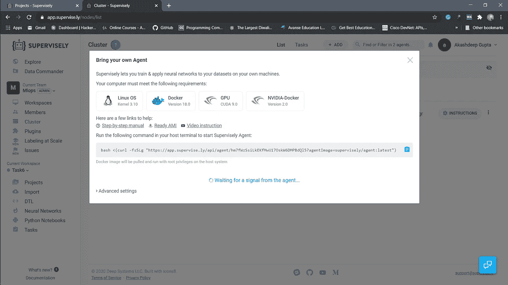

添加代理链接

将链接复制到您的系统终端，以便将其添加为用于训练模型的 supervisory 中的代理。

> **注意:-对于 aws，仅选择具有 LinuxOS、Docker、GPU(最有可能是 Nvidia)和 Nvidia-Docker 的映像。**

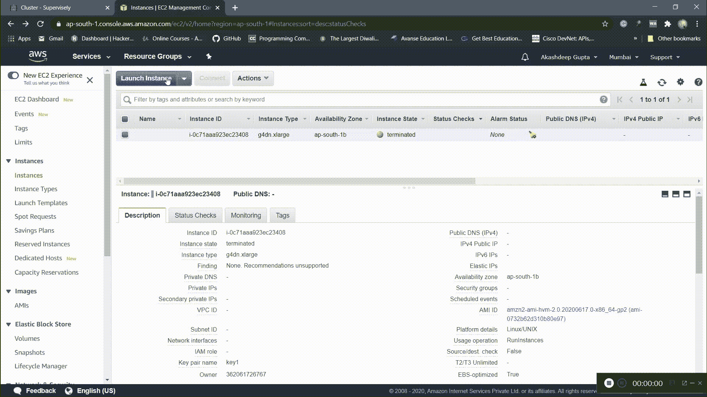

添加试剂

现在，简单地移动到**神经网络**部分并点击**训练**选项。

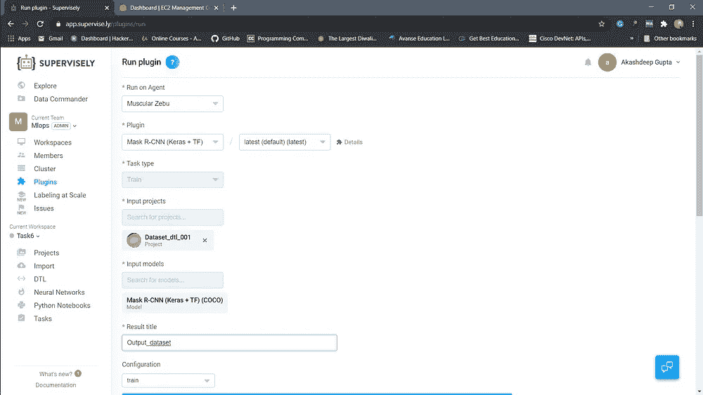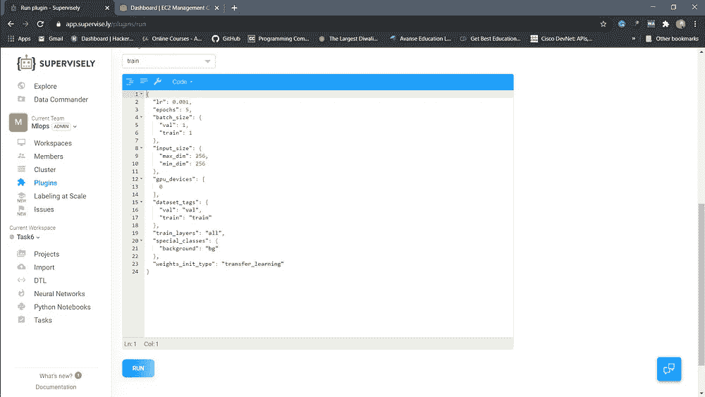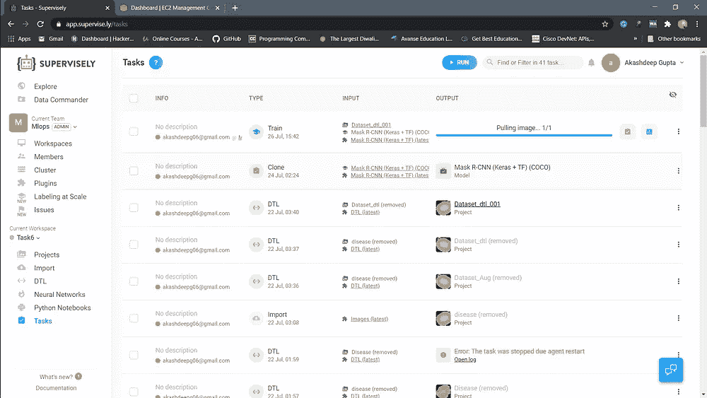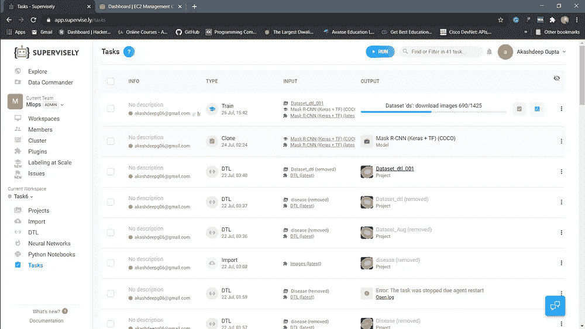

培训部分

快点！您已经成功训练了您的模型。现在，你可以用这个模型来检测疟疾疾病。

# 快乐学习！！

[https://in.linkedin.com/in/akashdeep-gupta-009183191?trk=profile-badge](https://in.linkedin.com/in/akashdeep-gupta-009183191?trk=profile-badge')