# 商场客户聚类分析

> 原文：<https://medium.com/analytics-vidhya/mall-customers-cluster-analysis-b2ece6effdaa?source=collection_archive---------0----------------------->

问题陈述:创建这个数据集只是为了学习客户细分概念，也称为购物篮分析。我将通过使用最简单的无监督 ML 技术(KMeans 聚类算法)来演示这一点。你欠一个超市购物中心，通过会员卡，你有一些关于你的客户的基本数据，如客户 ID，年龄，性别，年收入和消费分数。问题陈述您拥有该商场，并希望了解哪些客户可以很容易地与[目标客户]达成一致，这样营销团队就能获得这种感觉，并据此制定策略。

您可以点击以下链接获取数据:

 [## 商场客户细分数据

### 市场篮子分析

www.kaggle.com](https://www.kaggle.com/vjchoudhary7/customer-segmentation-tutorial-in-python) 

## 让我们看看我们的数据是怎样的:

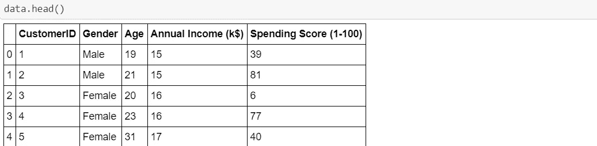

## 让我们检查数据的形状:

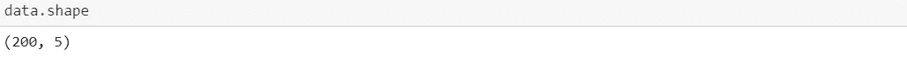

**在这里，我可以看到我有 200 个客户和 5 个特征的记录。**

## 让我们做 data.describe()来了解更多关于我们的数据。

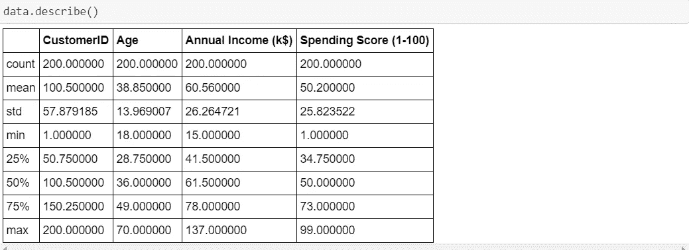

## 推论:

> 1)计数为 200 意味着我们有 200 个客户的记录。
> 
> 2)我们数据中客户的最小年龄为 18 岁，最大年龄为 70 岁。
> 
> 这里的平均数是 38，中位数是 36。这里的平均值>中位数意味着我们的数据有很高的异常值，即更多的年轻人喜欢去购物中心。
> 
> 3)客户的最低年收入为 1.5 万美元，最高为 13.7 万美元。T
> 
> 这里的均值和中值分别是 60k$和 61k$。
> 
> 4)支出分数是您根据您定义的参数(如客户行为和购买数据)分配给客户的分数。这里分配的最低消费分数是 1，最大范围是 99。平均值和中间值都是 50。

## 让我们检查一下我们的数据是否有空值？

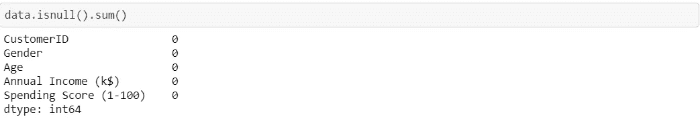

## 这里，我们没有空值。

## 商场中的性别分布。

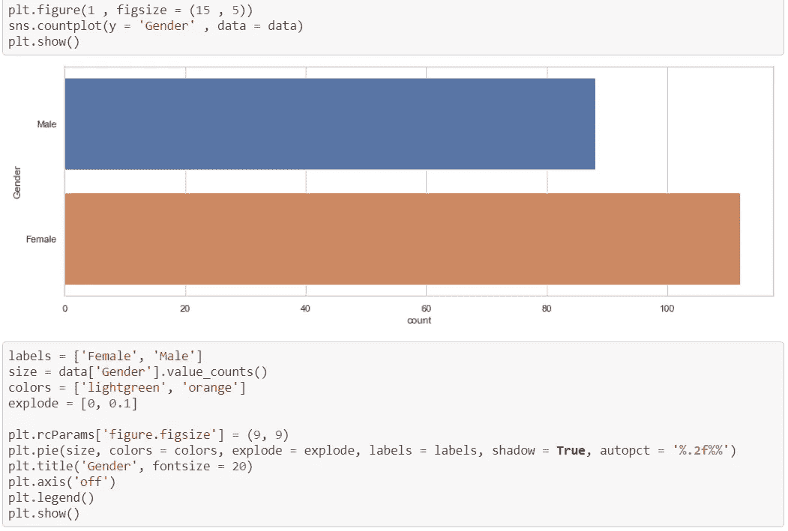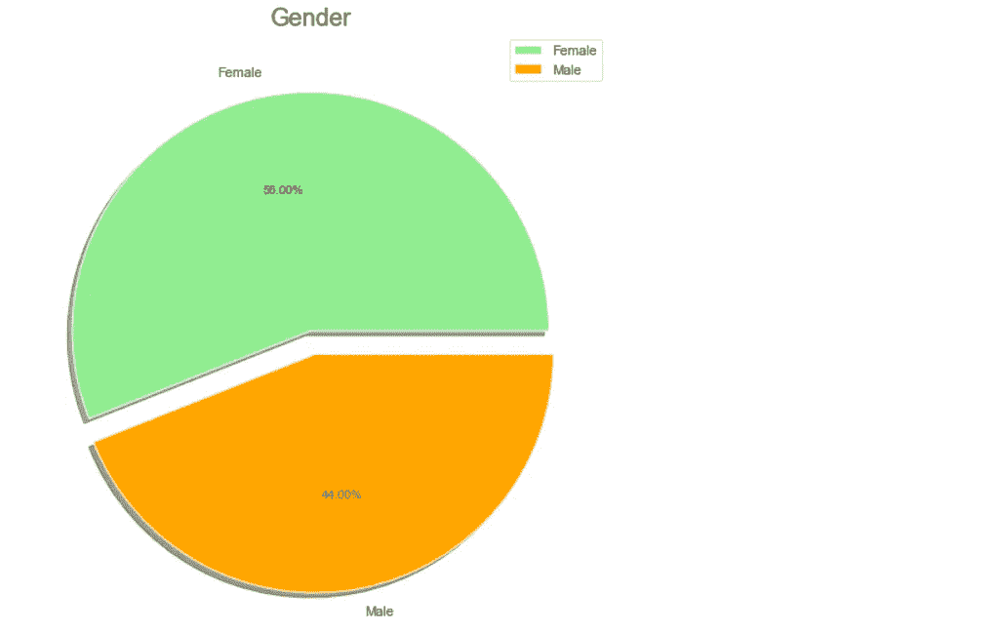

## 推论:

> 有趣的是，女性以 56%的份额领先，而男性的份额为 44%，这是一个巨大的差距，特别是当男性人口相对高于女性时。

## 年龄、年收入和支出分数的分布图。

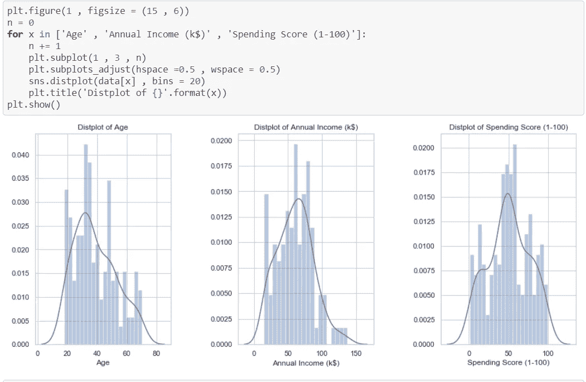

## 年龄分布

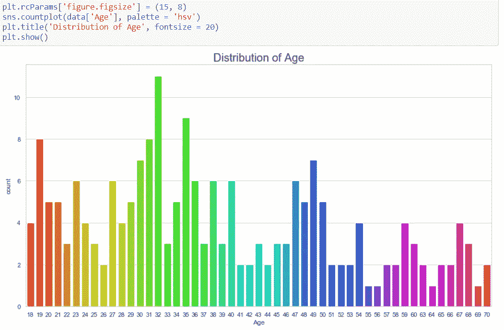

## 结论

> 可以看出，27 岁至 40 岁的人非常频繁地来到商场购物。55 岁、56 岁、69 岁和 64 岁的人很少去商场。32 岁的人是商场里最常光顾的人。

## 年收入分配

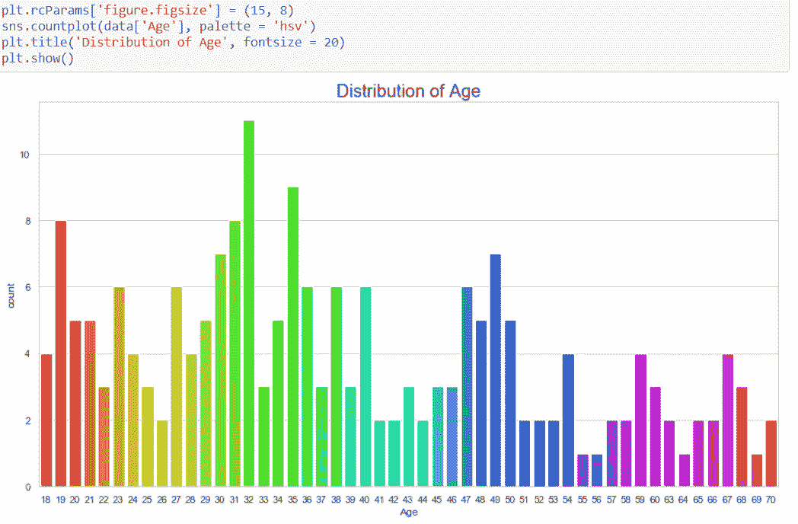

## 结论

> 这也是一个图表，更好地解释了每个收入水平的分布，有趣的是，商场中有很多顾客，他们的年收入从 15 美元到 137，000 美元不等。商场里有更多年收入在 54，000 美元或 78 美元的顾客。

## 年龄与年收入

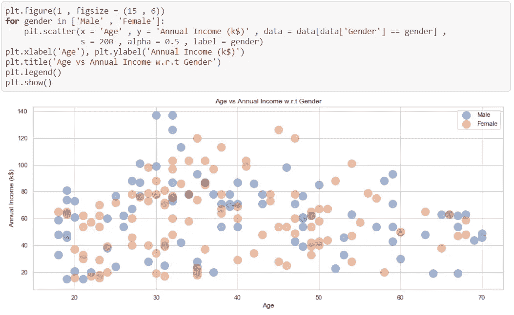

> 从散点图中我们可以看出，大多数人的年收入在 20 岁到 50 岁之间时会增加。

## 支出分数分布

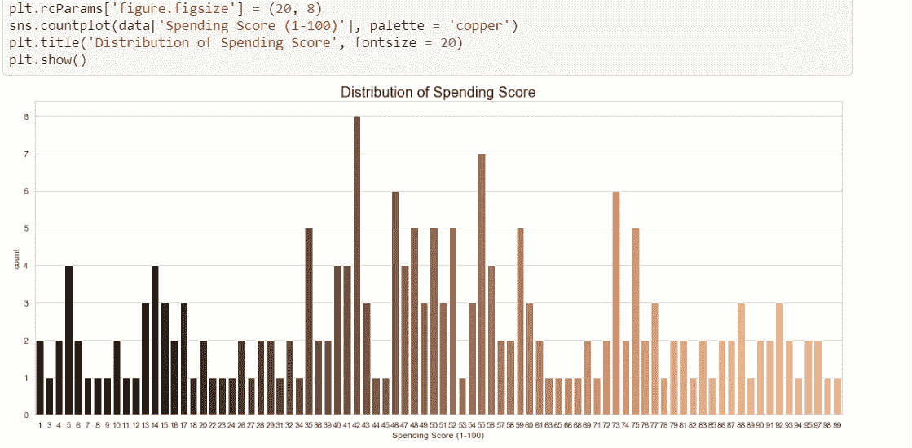

## 结论

> 从购物中心的角度来看，这是最重要的图表，因为对逛购物中心的顾客的消费分数有一些直觉和想法是非常重要的。
> 
> 总的来说，我们可以得出结论，大多数顾客的消费得分在 35-60 分之间。有趣的是，有些顾客的消费分数也是 1，消费分数也是 99，这表明购物中心迎合了购物中心中具有不同需求和要求的各种顾客。

## 让我们通过绘制肘形图来选择最佳的聚类数。

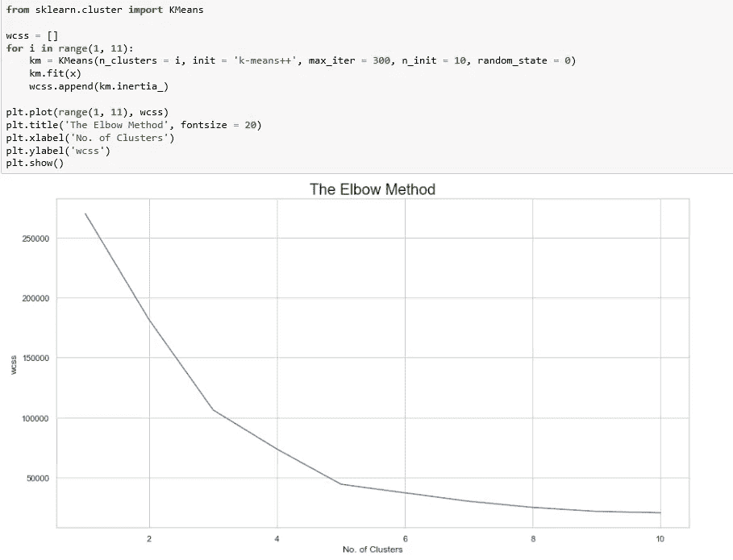

## 最佳聚类数是 5。

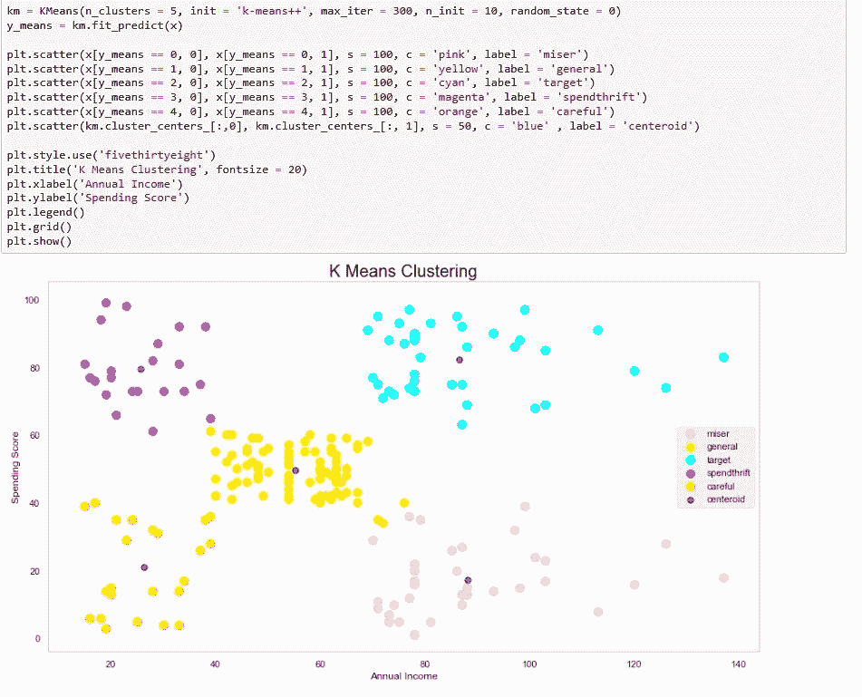

> 这种聚类分析让我们对商场中不同的顾客群体有了非常清晰的了解。根据他们的年收入和支出分数，显然有五个客户群，即吝啬鬼、普通客户、目标客户、挥霍客户、谨慎客户，据报道，这是确定购物中心客户群的最佳因素/属性。

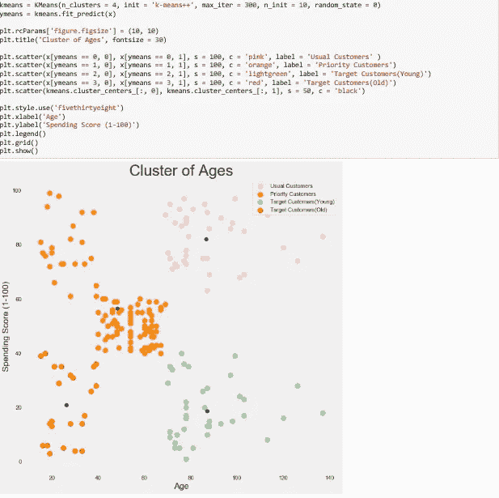

> 我将他们分为 4 个不同的类别，即普通客户、优先客户、老年目标客户、年轻目标客户。然后在得到结果后，我们可以相应地制定不同的营销策略和政策，以优化顾客在购物中心的消费分数。

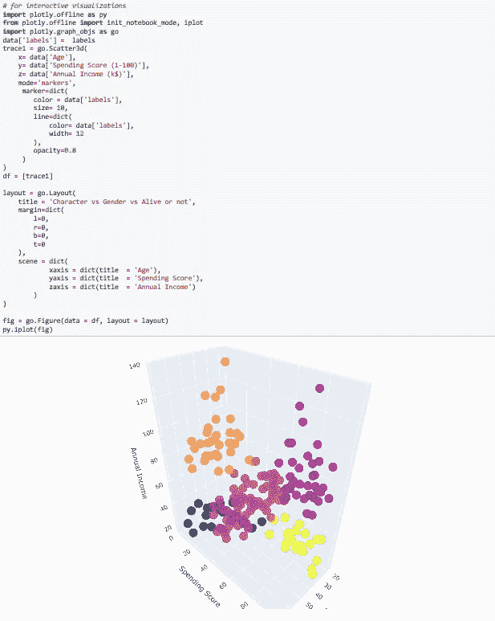

## 结论

现在我们有 4 个不同的群组，按年龄和消费分数分组。

> 分析显示，男性的得分集中度较低(0 到 25 分之间)。在女性中，与男性相比，我们在 75 和 100 之间的范围内有较高的浓度。一般来说，女性的消费得分高于男性。
> 
> 另一方面，年收入分布显示，一般而言，男性年收入高于女性。这两个分析结合在一起可以给购物中心管理者很好的洞察力。
> 
> 高级消费分数集中在中低值；在高分估价中，成年人的水平最高；在性别比较中，年轻和年长的女性比年轻和年长的男性有更高的消费分值。

## 谢谢，继续学习:)