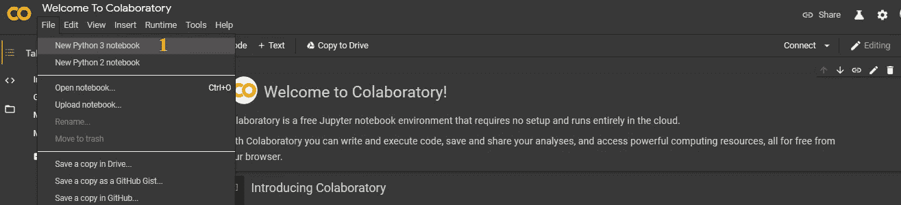
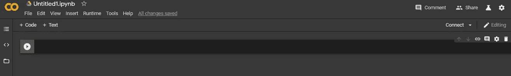
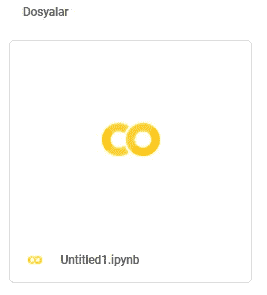
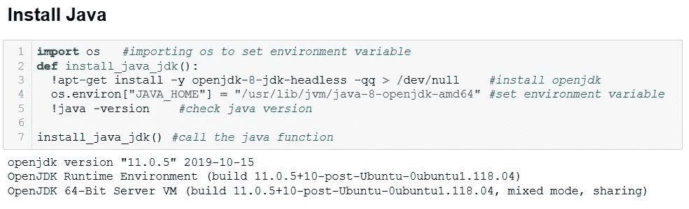
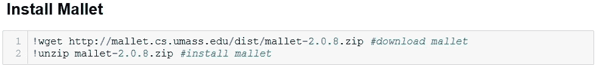
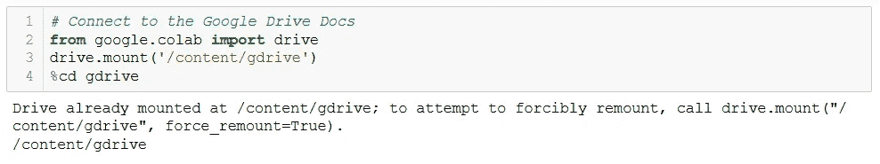
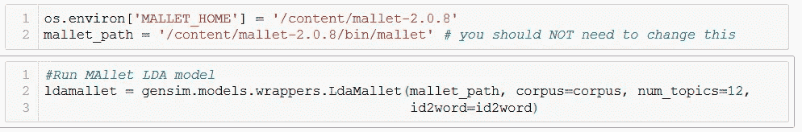

# MALLET(用于语言的机器学习工具包)-安装在 Google 联合实验室

> 原文：<https://medium.com/analytics-vidhya/mallet-machine-learning-for-language-toolkit-installation-on-google-colaboratory-80b75fe486cb?source=collection_archive---------13----------------------->

大家好，在这篇文章中我将告诉你如何通过谷歌实验室安装 MALLET。

> MALLET 是一个基于 Java 的包，用于统计自然语言处理、文档分类、聚类、主题建模、信息提取和其他对文本的机器学习应用。(资源:[http://mallet.cs.umass.edu/index.php](http://mallet.cs.umass.edu/index.php))

MALLET 帮助我们在自然语言处理过程中取得更好的结果。在尝试将 MALLET 添加到您的作品中时，您可能会遇到各种问题。我准备了这篇文章来帮助你解决安装 MALLET 时可能遇到的问题。希望有用…

**在谷歌联合实验室创建 Python 笔记本**

首先，您需要从您的 Google 帐户访问 Google 协作应用程序。

图 1:在 Google 联合实验室上创建 Python 笔记本

然后将出现欢迎使用协作页面。您可以在这里获得入门信息。从图 1 中的文件部分，我们将点击新的 Python 3 笔记本(1)并创建一个新的工作环境。

图 2: Python 3 笔记本新工作表

创建新的工作环境后，我们的 IPython 笔记本文件将如图 2 所示打开。当您创建这个工作文件时，名为 Colab Notebooks 的文件夹(图 3)将位于您的 Google Drive 帐户中。

图 3: Colab 笔记本(合作实验室笔记本)

单击名为 Colab Notebooks 的文件夹后，我们可以访问您创建的 python 笔记本文件(图 4)。要打开这个文件，我们可以右击它，用 Google Laboratory 打开。

图 4: Python 笔记本文件

**在谷歌合作实验室安装木槌**

对于 MALLET 的安装，在 Windows 安装中需要 Java JDK，因为 MALLET 是一个基于 Java 的包。

对于在谷歌联合实验室中安装 Java JDK 和 MALLET，我受益于在[https://github . com/pol sci/cola b-gensim-MALLET/blob/master/topic-modeling-with-cola b-gensim-MALLET . ipynb](https://github.com/polsci/colab-gensim-mallet/blob/master/topic-modeling-with-colab-gensim-mallet.ipynb)的工作。

图 5:在 Google 联合实验室中安装 Java JDK

运行图 5 中的代码块后，我们可以看到 Java JDK 安装已经完成。

图 Google 联合实验室上的 MALLET 设置

运行图 6 中的代码块后，MALLET 安装将会发生。

安装了 Java JDK 和 MALLET 之后，让我们将 Google Drive 与我们的 Python 笔记本文件连接起来。因此，我们可以在 Google Drive 中访问我们的文件(我们的数据集),并将它们添加到我们的工作中。

**重要提示:**如果在安装 Java JDK 和 MALLET 之前连接 Google Drive 并更改工作文件位置，可能会遇到问题。因此，我建议你在安装 Java JDK 和 MALLET 后连接 Google Drive。

图 7:连接到 Google Drive 文件

输入上述代码块后，您将看到访问您的 Google Drive 帐户的链接。点击此链接后，将会打开另一个窗口。在确认访问许可后，复制将要给您的访问代码，并将其粘贴到图 7 中执行的代码块中，然后按 Enter 键。

当我们在加载数据集和执行操作之后检查 MALLET 部分时，我们可以运行图 8 中的代码块，并将 MALLET 添加到我们的工作中。

图 8:在 Python Jupyter 笔记本上运行 MALLET

希望对你有用，祝你工作顺利。别忘了订阅我的 YouTube 频道。感谢您的关注。坚持科学与健康…

 [## 塞泽尔·乌 UZ

### 库尔登·萨纳塔、比利姆登·埃蒂梅、斯波尔丹·莱泽特·杜拉克拉拉纳、伊拉斯谟·坦·科萨·费尔勒、穆齐克勒登·基希弗勒……

www.youtube.com](https://www.youtube.com/c/sezeruguz)