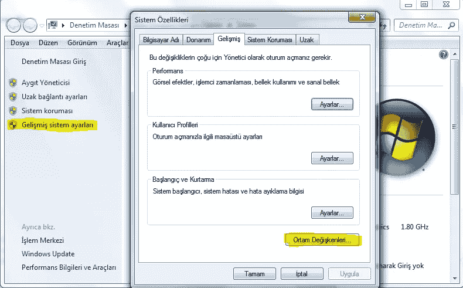
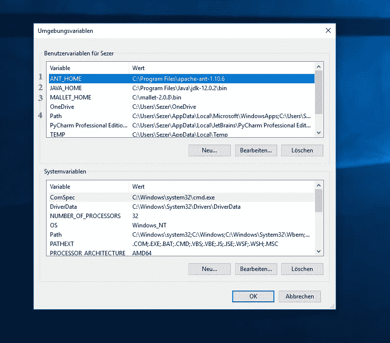
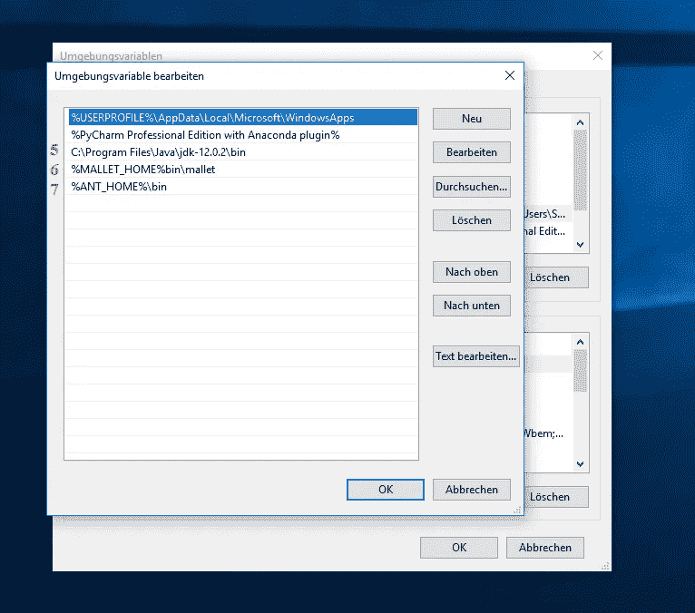
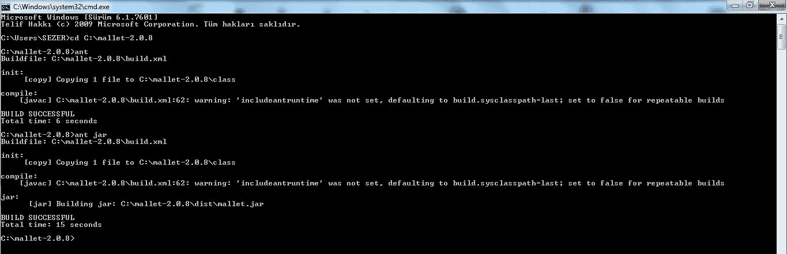
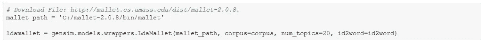

# MALLET(用于语言的机器学习工具包)—安装在 Windows 操作系统上

> 原文：<https://medium.com/analytics-vidhya/mallet-machine-learning-for-language-toolkit-installation-on-windows-operating-system-ebea44feb483?source=collection_archive---------5----------------------->

大家好，在这篇文章中，我将告诉你在 Windows 操作系统上安装 MALLET。在 Windows 7 和 Windows 10 上都进行了测试。

> MALLET 是一个基于 Java 的包，用于统计自然语言处理、文档分类、聚类、主题建模、信息提取和其他对文本的机器学习应用。(资源:[http://mallet.cs.umass.edu/index.php](http://mallet.cs.umass.edu/index.php))

MALLET 帮助我们在自然语言处理过程中取得更好的结果。在尝试将 MALLET 添加到您的作品中时，您可能会遇到各种问题。我准备了这篇文章来帮助你解决安装 MALLET 时可能遇到的问题。希望有用…

**槌锉**

从 http://mallet.cs.umass.edu/dist/mallet-2.0.8.zip[下载木槌的压缩文件](http://mallet.cs.umass.edu/dist/mallet-2.0.8.zip)后，解压到 c 盘。我们需要 Java JDK 和 Apache Ant 来运行 MALLET。

**Java JDK 安装**

您可以在[https://www . Oracle . com/tech network/Java/javase/downloads/JDK 13-downloads-5672538 . html](https://www.oracle.com/technetwork/java/javase/downloads/jdk13-downloads-5672538.html)下载并安装 Java JDK。我有 Java JDK 12.0.2 版本。

**Apache Ant 安装**

从[http://FTP . ITU . edu . tr/Mirror/Apache//Ant/binaries/Apache-Ant-1 . 10 . 7-bin . zip](http://ftp.itu.edu.tr/Mirror/Apache//ant/binaries/apache-ant-1.10.7-bin.zip)下载 Apache Ant 1.10.7 作为压缩文件后，解压到 C:/Program Files。

完成这些过程后，您需要在计算机的环境变量部分进行调整。

**编辑环境变量**

打开“Computer(计算机)”窗口后，单击“Properties(属性)”,然后单击左侧的“Advanced system settings(高级系统设置)”部分(图 1)。然后在打开的窗口中单击环境变量…按钮。

图 1:环境变量

然后在打开的窗口中，为您的用户名单击变量部分中的 New…按钮(图 2)。

图 2:添加环境变量

上面的第 1、2 和 3 行显示了我们的新变量和变量值。要创建数字 1、2 和 3 中的值，我们将单击“新建…”按钮并逐个创建它们。在打开的窗口中，如上所述，在*变量名*部分键入 **ANT_HOME** (1)后，我们将在将 Apache Ant 从压缩文件提取到 C:/Program Files/ file path 时写入*变量值*。假设我们从 zip 文件中提取的文件是 apache-ant-1.10.7。所以我们的文件路径，换句话说，我们的变量值将是**C:/Program Files/Apache-ant-1 . 10 . 7**。

同样，我们可以创建 **JAVA_HOME** (2)和 **MALLET_HOME** (3)变量名并指定它们的路径。

然后点击**路径** (4)并点击编辑…按钮。添加变量后，我们还需要编辑路径部分。

图 3:向路径部分添加变量

在打开的窗口中，我们指定如图 3 所示的**Java JDK**(5)**MALLET**(6)和 **Apache ANT** (7)文件路径。

最后一步是用 Apache Ant 编译 MALLET。

图 4:用 Apache Ant 编译 MALLET

运行命令提示符(cmd.exe)，然后键入 cd C:\mallet-2.0.8 并回车(我们已经到达 mallet 所在的文件路径)，然后键入 **ant** 并回车。在看到构建成功的文本后，在下一个控制台行写下 **ant jar** 并按 Enter，您将再次看到构建成功的文本。这样，我们就会圆满完成。

**Python Jupyter 笔记本上的跑槌**

图 5:在 Python Jupyter 笔记本上运行 MALLET

如图 5 所示，在将我们的 **mallet_path** 变量指定为相关的文件路径之后，我们可以在 LdaMallet 中执行我们的操作(如果您将下载到 C:/驱动器的 MALLET zip 文件解压缩，您将不需要更改图 5 中的文件路径)。

希望对你有用，祝你工作顺利。别忘了订阅我的 YouTube 频道。感谢您的关注。坚持科学与健康…

 [## 塞泽尔·乌 UZ

### 库尔登·萨纳塔、比利姆登·埃蒂梅、斯波尔丹·莱泽特·杜拉克拉拉纳、伊拉斯谟·坦·科萨·费尔勒、穆齐克勒登·基希弗勒……

www.youtube.com](https://www.youtube.com/c/sezeruguz)