# 利用深度学习检测恶意软件——最先进的——

> 原文：<https://medium.com/analytics-vidhya/malware-detection-with-deep-learning-state-of-the-art-177c81aa83ea?source=collection_archive---------10----------------------->

今天，深度学习被用于大多数人工智能应用中。作为这些应用之一，恶意软件检测受到了深度学习的影响。最初，研究人员试图证明基本模型适用于恶意软件分析。然后，其他研究人员已经表明，将不同的模型与几个层结合起来可能会加强结果。
本文概述了基于深度学习的恶意软件检测工作。首先，我们给出每项研究的细节，提及它对最先进水平的贡献和获得的结果(如果可能的话)。其次，我们提出了一个统计总结，强调使用的数据类型和模型。最后，我们讨论了在各种搜索中遇到的一些问题。请注意，这里讨论的文章只是通过分析 EXE 文件来处理 Windows 平台上的恶意软件检测任务。因此，我们排除了专注于另一项任务的所有其他贡献。

# 1.以前的工作

与机器学习技术不同，深度学习只是最近才进入恶意软件检测领域。第一个针对 Windows EXE 文件的研究出现在 **2013** 。 **Dahl 等人**使用 **3 克 API 调用**作为他们的主要特征类别。由于生成了大量的特征(大约 5000 万)，他们必须在将数据传递给模型之前减少这些特征。通过应用**互信息**技术，他们将这个数字减少到 179，000。最后，他们应用**随机投影**技术将它进一步减少到 4000。所使用的神经网络是简单的**前馈**架构，具有几种配置，这些配置根据层的**数量:1、2 或 3，每层的**节点**数量:1536、2048 或 1024，以及要使用的特征**的**数量:1000、2000、4000、8000 或 16000 而变化。他们的结果显示，最佳配置是**使用具有 4000 个特征的 1536 个节点的单层**。网络在**260 万个实例**上训练后，达到最小**误差约 0.49%** 。除了检测，他们还训练网络将恶意软件分成 135 个家族。下图描述了它们的分层架构:**

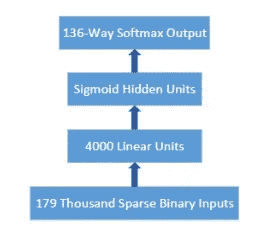

**Dahl 等人 2013 年使用的模型架构**

2014 年，Benchea & Gavriluţ 也使用了简单的架构。他们主要关注的是**误报**的问题。他们试图使用一个**感知器**来实现**零误报率**，感知器连接到一个 **RBM** 模型，该模型由各种类别的特征提供，包括**网络活动**、 **Windows 注册表**、**修改的文件**、**可执行大小**、**段数**、**熵** …该模型的架构如下图所示。输入向量的大小是 3299。研究人员发现，RBM 模型优于使用 **F2 分数**度量进行**特征选择**所获得的结果。

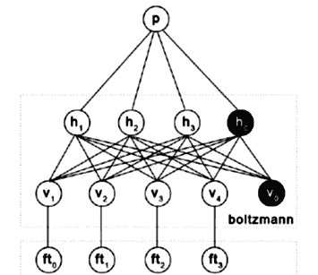

**benchea&gavriluţ2014**使用的模型架构

一年后， **Saxe & Berlin** 表明，合适的**数据表示**和**预测解释**提高了性能。他们的文章解释了他们如何使用**熵直方图**来合成更好的特征。萨克斯和柏林是第一个使用这种数学组合的人。除了字节，他们还提取了导入表、字符串直方图和元数据。对于每个数据类，他们提取 256 个不同的特征，这些特征通过串联构成了一个由 **1024 个属性**组成的向量。所使用的网络是一个**前馈**模型，具有**预路**节点的**两个隐含层**(参数整流线性单元)。输出层包含单个**s 形节点**。下图说明了建议模型的体系结构。此外，Saxe 和 Berlin 提出了一个 **Bayes 估计器**来给出预测类别的更精确的概率。

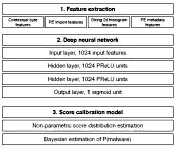

由 **Saxe &柏林 2015** 提出的模型架构

**Pascanu 等人(2015)** 提出了一种用于恶意软件检测的创新架构。他们是第一个在这样的任务中使用 RNN 的人。所研究的特征是 API 调用的**序列。这项工作证实了递归神经网络在处理序列的效率。递归层链接到单独训练的 **MLP 分类器**。**

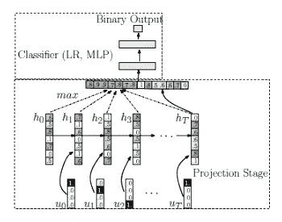

Pascanu 等人 2015 年**提出的模型架构**

**2016 年**，5 项研究使用深度学习解决了恶意软件检测的主题。**丁等人**基于操作码的 **n-grams 的向量，应用**(深度信念网络)模型对 EXE 文件进行分类。他们还使用 PEiD 定义的基础解决了打包和保护恶意软件的问题。 **RBM** 模型链接到**前馈**网络用于分类。下图说明了他们系统的架构。****

**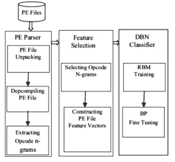**

**丁等**设计的系统概述 2016****

**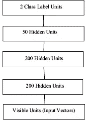**

**丁等**2016**使用的模型架构**

****Hardy 等人**使用 **SAE** s 从 **API 调用**中提取特征。SAE 以无人监督的方式进行训练，以构建 API 调用的编码。最后，分类层使用编码数据来学习检测。Hardy 等人率先静态检索 API 调用，以馈入深度学习模型。**

**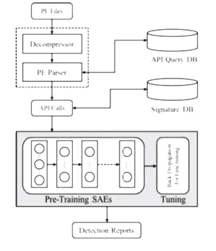**

**由 **Hardy 等人设计的系统架构 2016****

****黄&斯托克斯**讨论了一种类似 Dahl 等人的技术，他们利用 **API 调用**作为特征和随机投影对**进行降维**。除了检测之外，系统还将恶意软件分为大约 **100 个类别**。为了分类，他们尝试了具有 1、2、3 或 4 个隐藏层的前馈网络，每个网络包含 2000 个 ReLU(校正线性单元)节点。**单隐层**网络在学习过程中给出最高的错误率。然而，单层网络在测试阶段的表现优于所有其他配置。**

**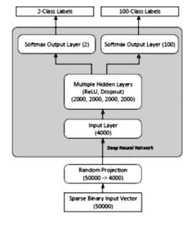**

**黄提出的系统架构**

****Tobiyama 等人的研究**结合**递归网络**和**卷积网络**来检测恶意软件。他们用序列分析器基于递归神经网络分析了 **API 调用序列**。RNN 的输出被转换成由 CNN 处理的图像。CNN 架构有两层卷积，每一层都有一个池操作。**

**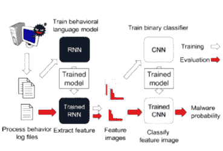**

**由 **Tobiyama 等人 2016 年提出的模型架构****

****叶，陈等**提出了一个异构深度学习框架，由一个**自动编码器**与**玻尔兹曼机**(**)和一个**联想记忆层组成。他们的系统利用了几种应用于 **API 调用**的代表性学习模型，这些模型由它们在主机系统中的标识符编码。DBN 网络有三层，每层 100 个节点，结果最好。**

****2018 年**，非常创新的作品由 **INVIDIA** 出版。Raff，Zak 等人提出了一种通过分析可执行文件的字节流来检测恶意软件的方法。这种直接使用原始数据(原始字节)的技术基于序列分析。他们为恶意软件检测和序列处理领域的发展做出了贡献，因为他们能够实现具有 200 万时间步能力的序列分析器。**

**同年，**周**在**、 **CNN** s 的基础上提出了结合**静态**和**动态**特征的模型，静态数据包括**字节直方图**、**熵直方图**、**截面信息**、**进出口信息**、**表头**和 ****API 调用**被用作由 **RNN** 分析的动态特征。这些数据用于构建可执行文件的映像，然后由 CNN 对其进行分析。******

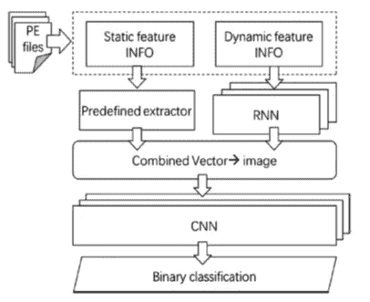

系统架构由**周提出 2018**

在 **2018** 的另一个作品是 **Le 等人**他们尝试了基于 **CNN** s 和 **RNN** s 的不同架构，他们从将一个可执行文件转换成一个双色图像(黑/白)馈入三个模型开始。第一个模型是一个 **CNN** 链接到一个**前馈**分类器。第二个模型用**单向 LSTM** 代替了前馈层。最后，第三个模型改进了第二个模型，允许双向序列处理(**双向 LSTM** )。后者表现最好。

**严等人**使用 **CNN** s 对**原始数据**(原始字节)**s 对**操作码序列**。**

2018 的最后一部作品是 **Sewak 等人**。他们使用**操作码**作为特征。他们提议将一个**自动编码器** (SAE)连接到一个**前馈** d 网络，以提取更好的数据表示。测试了各种配置，3 层 SAE 和 4 层 FNN 的性能最佳。

一年后，**肖等人**将用于特征提取的深度学习模型和应用于 API 调用的用于分类的机器学习模型结合起来。使用多级编码，他们将数据从 6000 维压缩到 500 维。

# **2。使用的数据**

研究中使用最多的是 **API 调用**特性，频率为 **38%** 。80%使用它的搜索都是动态获取的。**操作码序列**在研究中被广泛讨论，但很少被使用。**操作码序列**的处理类似于自然语言的处理，考虑到表达式的多样性和空间分散性，更加复杂。**割台**在工作中从不单独使用。它们总是与另一个特征相结合。 **75%** 的试卷使用一种**单一数据类型**。其他人用 3 或 4 级。下图说明了每种功能的使用率。

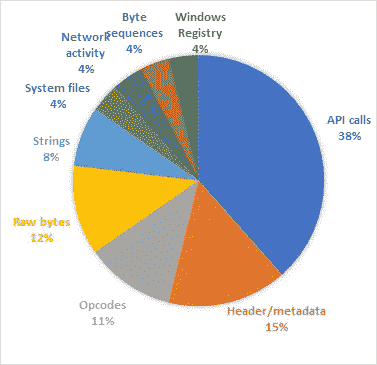

恶意软件检测工作中从 EXE 文件中提取的不同特征的使用频率

# **3。使用的型号**

**RNN** 网络是工程中最常用的，经常被调用来分类序列，比如 API 调用。 **FNN** 模型用于数据向量的分类。 **SAE** 是专门从事表征学习的无监督模型。 **CNN** 网络已经应用于图像甚至序列的分析。最后，**波尔兹曼机器**也是表征学习的模型。下图总结了不同型号的使用率。

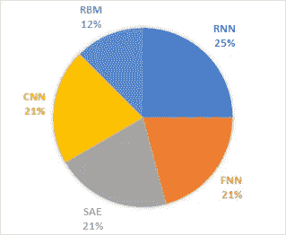

恶意软件检测工作中不同 DL 模型的使用率

# 4.问题和限制

大多数使用深度学习方法的网络安全研究都专注于算法在检测恶意软件方面的直接适用性。很少有作品试图研究与数据相关的参数。关于所用的数据，对所得结果的解释也是一个重要方面。通常，攻击者利用数字表示中的弱点，通过混淆或其他技术在数据上产生噪声。检测模型的发展在很大程度上取决于以下问题的解决。

**4.1。数据**

深度学习方法需要大量的数据来学习。模型建立的质量很大程度上取决于训练数据的质量和数量。数据集必须**真实地反映真实世界的**样本分布。它们需要随着时间的推移积极地**维护**和**更新**，与恶意软件行业保持同步。此外，大多数网络安全任务本质上是监督学习任务，往往缺乏标签。

## 4.2.构建模型的可解释性

DL 机型大部分都是**黑箱**。它们接收 X 作为输入，并使用人类难以理解的复杂操作序列产生 Y 作为输出。一个模型的可解释性决定了我们管理它，评估它的质量，甚至更正确地运行它的难易程度。

## 4.3.假阳性率

当算法将恶意标签与良性文件混淆时，就会出现误报。即使是一百万个良性文件中的一个误报也会给用户带来严重的后果。

## 4.4.适应反击的方法

在恶意软件检测领域之外，机器学习算法通常在不随时间变化的固定数据分布的假设下运行。然而，恶意软件创建者不断努力避免检测，并发布与学习阶段看到的版本明显不同的新版本。

## 4.5.问题可解吗？

一些安全供应商声称，他们基于机器学习的解决方案可以有效地分析任何样本**，而不会有任何错误的预测**。然而，正如艾伦·图灵所证明的，这在数学上是不可能的。他对一般情况的证明，被称为**停止问题**，适用于许多领域，包括网络安全。科恩提供了正式的证据，证明创造一个检测恶意软件的完美系统是不可能的**。**

****更新****

**你可以在这个[GitHub repo](https://github.com/islem-esi/DeepMalwareDetector):[https://github.com/islem-esi/DeepMalwareDetector](https://github.com/islem-esi/DeepMalwareDetector)中找到其中一些技术的实现以及 DeepMalware Detector 的 WebUI**

## **参考**

*   **Dahl，G. E .，Stokes，J. W .，Deng，l .，，Yu，D. (2013)。使用随机投影和神经网络的大规模恶意软件分类。2013 年 IEEE 声学、语音和信号处理国际会议，3422‐3426。**
*   **本切亚河和 Gavriluţ河(2014 年)。结合受限玻尔兹曼机和单侧感知器的恶意软件检测。概念结构国际会议，93‐103。**
*   **萨克斯，j .，&柏林，K. (2015)。使用二维二进制程序特征的基于深度神经网络的恶意软件检测。2015 年第十届恶意和不需要的软件(恶意软件)国际会议，11‐20。**
*   **r .帕斯卡努、J. W .斯托克斯、h .萨诺西安、m .马里涅斯库和 a .托马斯(2015 年)。基于递归网络的恶意软件分类。2015 年 IEEE 声学、语音和信号处理国际会议(ICASSP)，1916‐1920。**
*   **丁，杨，陈，徐(2016)。深度信念网络在基于操作码的恶意软件检测中的应用。2016 国际神经网络联合会议(IJCNN)，3901‐3908。**
*   **哈代，陈，李，侯，叶，李，(2016)。DL4MD:智能恶意软件检测的深度学习框架。数据挖掘国际会议录(DMIN)，61。**