# 恶意软件工程部分 0x2—为寄生虫寻找庇护所

> 原文：<https://medium.com/analytics-vidhya/malware-engineering-part-0x2-finding-shelter-for-parasite-751145dd18d0?source=collection_archive---------8----------------------->

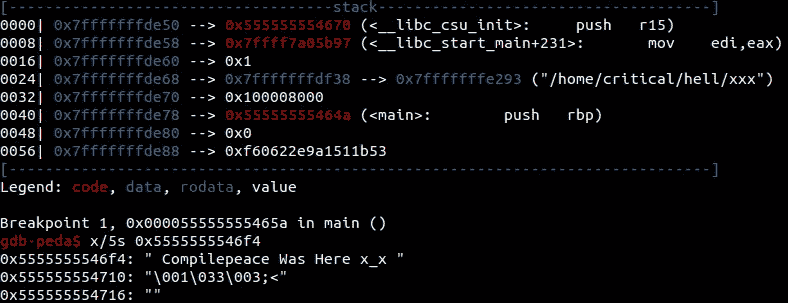

> 病毒是一种小的传染因子，它只能在生物体的活细胞内复制

这就是维基百科对生物病毒的简单定义。根据类比，计算机病毒属于恶意软件的范畴，它通过一些寄生代码注入技术来感染主机二进制文件(甚至是内存)。这里的寄生虫是被注入的代码，驻留在宿主二进制文件中，以接管宿主程序被劫持的代码流。感染后，宿主二进制被[植入](https://en.wikipedia.org/wiki/Trojan_horse_(computing))以达到更进一步的目的。特洛伊木马是一种具有恶意但伪装成合法程序的软件。病毒的基本思想是劫持程序的代码流，并将其交给寄生代码，寄生代码(在其恶意代码执行后)悄悄地将控制转移到主机二进制程序，恢复预期的代码执行。在这篇文章中，我们将讨论一种病毒设计的方法和用于感染过程的算法。

**注**:本文是《神奇精灵 恶意软件工程系列》的续篇，在该系列中，我们首次涉足精灵二进制文件的世界。

# 先决条件

*   必须了解 [ELF 文件格式](/@compilepeace/malware-engineering-part-0x1-that-magical-elf-5be3556ecb2b)。
*   Linux 下大量的 C 编程技能以及[系统编程](https://github.com/angrave/SystemProgramming/wiki)概念(链接用于快速学习)将极大地有助于全面理解本文。
*   此外，我们将使用在 [elf.h](https://github.com/torvalds/linux/blob/master/include/uapi/linux/elf.h) (位于本地 Linux 文件系统的`/usr/include/`目录中)中定义的数据结构，以编程方式访问和操作主机二进制文件的部分内容。因此，我鼓励读者浏览这些结构。或者，这些数据结构可以从 Linux 手册`$ man 5 elf`的*第 5 页*中引用。

# 在狙击手和手榴弹的世界里，我们打算制造什么？

可能是一把匕首。我们要设计的是一种带有某种毒素(寄生虫)的无声武器(传染程序),它可以在网络杀伤链的利用阶段之后，通过一些常用的特洛伊木马，在受害者机器上秘密地保持持久性。

在内存中，程序以段的形式排列(每个段由一个或多个部分组成)。让我们来看看`*/bin/ls*`实用程序的程序头表(PHT)(它列出了当前目录的内容)

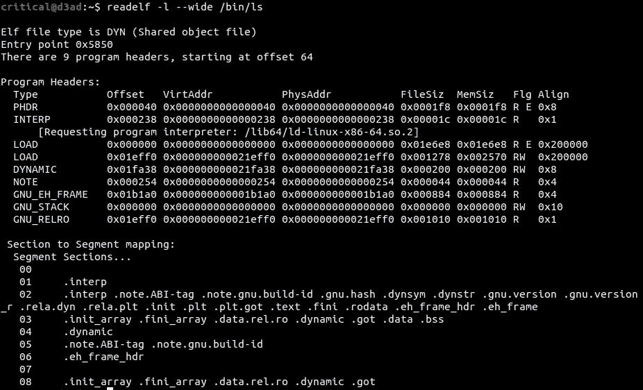

上面，我们看到有 2 个可加载段(标记为类型 LOAD ),段权限为 R-E(读-执行)和 RW-(读-写)。查看段到段的映射，可以推断它们分别是**代码/文本**和**数据**段。

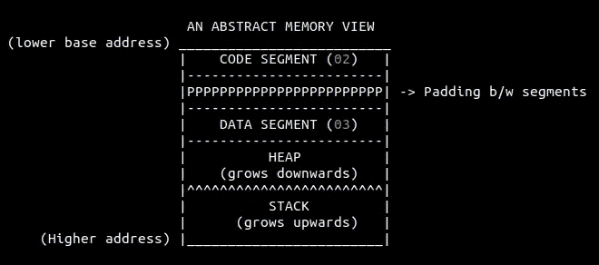

程序的抽象内存视图

在无害程序被加载到存储器中之后，段是页面对齐的，但是段(包括段)很少与页面边界对齐，从而在当前段和相邻段之间留下空间。当二进制文件加载到内存中时，这个空间由零字节填充。在上面的图片中，填充由一系列的`P`表示，这将导致分段对齐。我们将使用这种填料为寄生虫提供住所，因为它似乎是一个舒适的庇护所。但是，也有填充区域小于寄生虫大小的情况，在这种情况下，这种感染方法(在 UNIX 世界中称为 ***段填充感染*** ，在 windows 世界中称为 [***代码崩溃***](https://en.wikipedia.org/wiki/Code_cave)*)将无法感染该二进制文件。下面是传染机制的算法。*

```
***-x-x- Load parasite from file on-disk into memory**                       
1\. Get *parasite_size* and *parasite_code* address (location in allocated memory) 

**-x-x- Find the padding_size** (unused space) **between CODE segment and the NEXT segment after CODE segment**(usually data segment)                      
2\. In the CODE segment PHT entry, increase the following-                         
-> *p_filesz*   (by parasite size)                         
-> *p_memsz*    (by parasite size)Get and Set respectively,                         
->***padding_size***  = (offset of next segment (after CODE segment)) - (end of CODE segment)                        
->***parasite_offset*** = (end of CODE segment) or (end of last section of CODE segment)
-> **parasite_load_address** = virtual address (vaddr) + sizeof CODE segment (filesz) **-x-x- PATCH Host entry point**                       
3\. Save the *original_entry_point* of host binary.
4\. Alter the host entry to point to the location *parasite_offset*/*parasite_load_address* (i.e. the location where parasite is to be injected into the host binary) 

**-x-x- PATCH SHT**                       
5\. Find the last section in CODE Segment and increase -                                
-> *sh_size*    (by parasite size)

**-x-x- PATCH Parasite offset **                      
6\. Find and replace Parasite jmp-on-exit address/offset placeholder with *original_entry_point* 0x????????????????   

**-x-x- Inject Parasite to Host** (mapped @ host_mapping)                       
7\. Inject parasite code @ (*host_mapping + parasite_offset*), i.e. to the end of the last section (among all other sections in CODE segment)
8\. Write the infection to disk ×_×*
```

*注意:这个感染点有一个缺点。由于代码段是**而不是**具有写权限，所以自我修改的寄生代码不会起作用。*

# *让代码自己说话×_×*

*有了关于 ELF 和我们的黑色连帽衫的所有知识，是时候深入 C 编程语言中感染算法的实际实现了。我将浏览一下 [Kaal Bhairav](https://github.com/compilepeace/KAAL_BHAIRAV) 的感染[模块](https://github.com/compilepeace/KAAL_BHAIRAV/blob/master/evil_elf.c)的源代码。*

## *序言*

*首先，我们来声明一些变量。我希望上面的评论足以清楚地理解变量存储了什么。*

*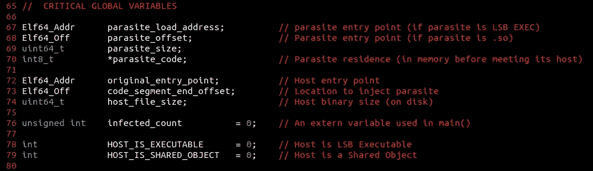*

*[拼用配料](https://github.com/compilepeace/KAAL_BHAIRAV/blob/master/evil_elf.c)*

*`*ElfParser()*` 接受一个名为 *filepath* (主机二进制文件的路径)的参数，并通过与其他实用函数协调来遵循感染算法的每个步骤。*

*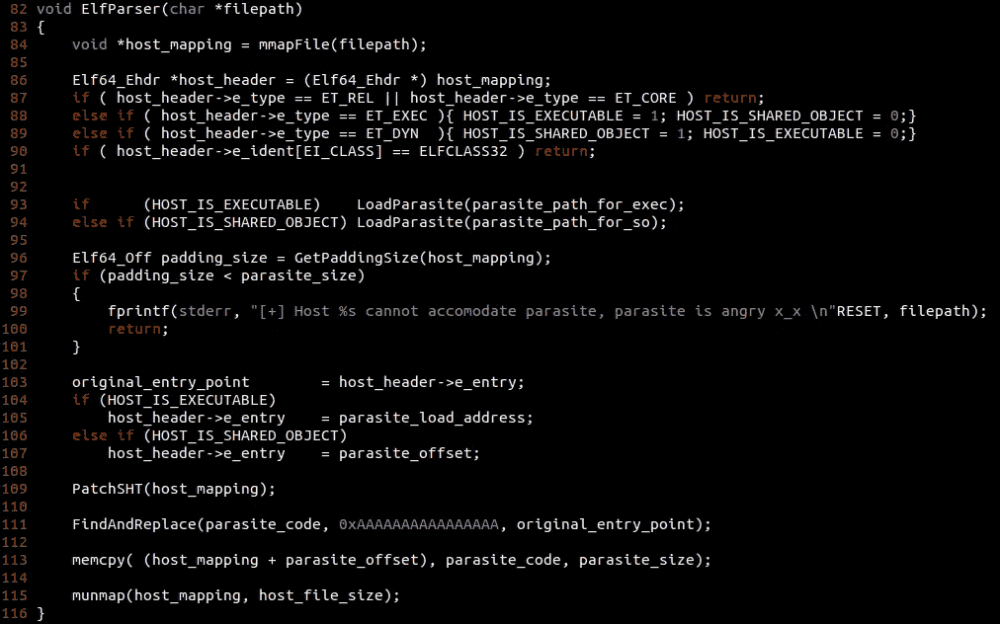*

*[邪恶精灵就这样诞生了](https://github.com/compilepeace/KAAL_BHAIRAV/blob/master/evil_elf.c)*

*   *(Line **84** )抽象使用`mmap()`将主机二进制文件映射到内存中，以便进一步修改。主机的第一个字节被映射到由 *host_mapping 指定的位置。**
*   *(Line**86**–**90**)将主机二进制文件的 Elf 头读入*host _ header*([Elf . h](https://linux.die.net/man/5/elf)中指定的`*struct Elf64_Ehdr*`类型)。它解析 **ET_EXEC** 和 **ET_DYN** (可执行和共享对象)类型的 64 位类二进制文件，跳过 **ET_REL** (可重定位)、 **ET_CORE** (核心)或类 **ELFCLASS32** (32 位二进制文件)的二进制文件。这里的 **ET_EXEC** 、 **ET_DYN** 、 **ET_REL** 、 **ET_CORE** 都是在 [elf.h](https://github.com/torvalds/linux/blob/master/include/uapi/linux/elf.h) 中定义的宏。*
*   *(Line**93**–**94**)调用`LoadParasite()` 将寄生虫放入内存，为其注入宿主做准备。制作寄生代码(对于 LSB 可执行文件和共享对象类型是不同的)将在下一篇文章中解释。*
*   *(Line**96**–**101**)调用`GetPaddingSize()`获取垫料尺寸(庇护所尺寸)并检查宿主是否能容纳寄生虫进入垫料。*
*   *(Line**103**–**107**)保存主机二进制文件的 *original_entry_point* ，并根据寄生虫被注入的位置修改主机入口点(由`GetPaddingSize()`设置的*寄生虫 _offset* 和*寄生虫 _load_address* )。可执行文件和共享对象二进制文件的寄生位置是不同的。在 ET_EXEC 主机中，入口点由地址指定，而在共享对象(ET_DYN)中，入口点由偏移量指定，因为它包含 PIC(**P**position**I**n dependent**C**ode)。*

*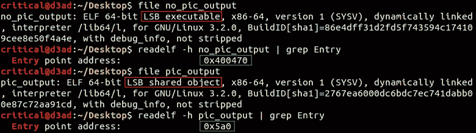*

*LSB 可执行文件和 LSB 共享对象*

*   *(Line**109**–**115**)`PatchSHT()`是我们的效用函数，对 **S** 截面 **H** 头部 **T** 进行修改，使其能够容纳寄生虫。然后我们使用`FindAndReplace()`用主机二进制的 *original_entry_point* 修补寄生虫代码的 jmp-on-exit 地址/偏移量，之后我们通过`memcpy()`将寄生虫注入主机，并使用`munmap()`取消二进制映射，将受感染的主机映射写到磁盘上。*

## *mmapFile() —与主机保持一臂的距离*

*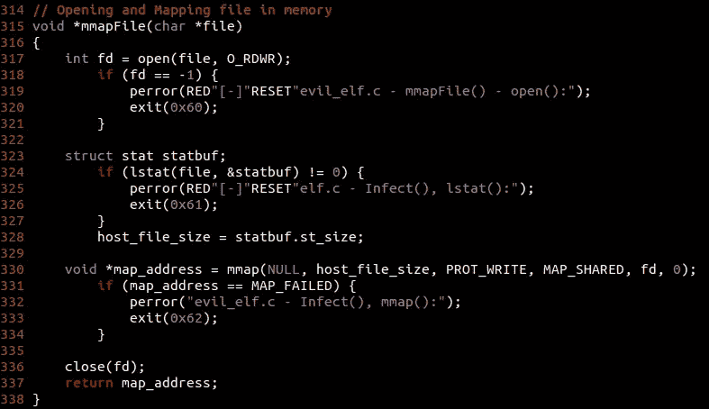*

*[映射主机](https://github.com/compilepeace/KAAL_BHAIRAV/blob/master/evil_elf.c)*

*函数`mmapFile()`接受主机路径作为参数，将主机映射到当前进程地址空间，并返回指向映射的主机二进制文件的第一个字节的指针。*

*   *(线**317**–**321**)以读写模式打开主机二进制文件*
*   *(Line**323**–**328**)`lstat()`获取关于主机的信息，特别是 mmap()要使用的主机二进制文件的大小(磁盘上的大小)。念`$ man stat`。*
*   *(Line**330**–**334**)`mmap()`将主机二进制映射到调用进程的虚拟地址空间(本例中为 Kaal Bhairav)。主机被映射到内核选择的地址(由 NULL 作为 mmap 的第一个参数指定)。**PROT _ 写入**这里描述了映射的内存保护，即映射中的页面可以被写入。 **MAP_SHARED** 标志指定一旦对映射进行任何修改，映射的更新将反映到磁盘上的文件中(此外，最好使用 msync())。阅读`$ man mmap`。*
*   *(行**336**–**337**)最后`close()`主机二进制并将地址返回到映射的主机二进制的第一个字节。*

## *LoadParasite() —内存中的毒药*

*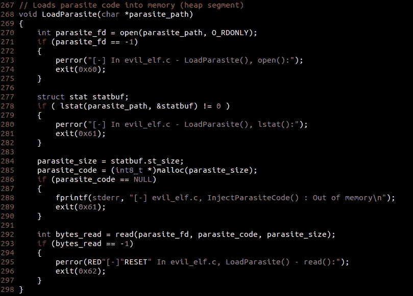*

*[装载毒丸](https://github.com/compilepeace/KAAL_BHAIRAV/blob/master/evil_elf.c)*

*这个想法是将寄生虫注入到主机映射中(它设置了 MAP_SHARED 标志)。为此，寄生代码需要放在进程地址空间中的某个地方，以便在适当的时候可以直接访问。`LoadParasite()`将包含寄生虫代码的文件的路径()作为参数，并将寄生虫放入定义*寄生虫 _ 大小*和*寄生虫 _ 代码*全局变量的内存中(在内存中存储寄生虫代码的大小和位置)。它是通过-*

*   *(Line**270**–**282**)以只读模式打开包含寄生虫代码的文件，并使用`lstat()`(之前用于`mmapFile()`)获取寄生虫文件的属性。*
*   *(行**284**–**290**)代码将寄生虫的大小放入*寄生虫 _ 大小*中，并通过`malloc()`在堆段上分配*寄生虫 _ 大小*字节，后者将分配空间的位置返回给*寄生虫 _ 代码*。`malloc()`返回的地址存储在`int8_t *`类型的寄生虫代码中(指向一个字节值的指针)。*
*   *(行**292**–**296**)最后我们执行`read()` syscall 从`parasite_fd`(由`open()`返回的寄生虫文件描述符)中读取*寄生虫大小*字节。*

***注意**:我们依靠堆段来加载寄生代码，因为它在程序执行结束之前一直是可访问的。如果我们将寄生代码加载到一个数组中(在堆栈段上为其分配空间)，一旦函数返回(在函数尾声期间)，它将与`LoadParasite()`的堆栈帧一起被销毁。*

## *GetPaddingSize() —舒适的庇护所！*

*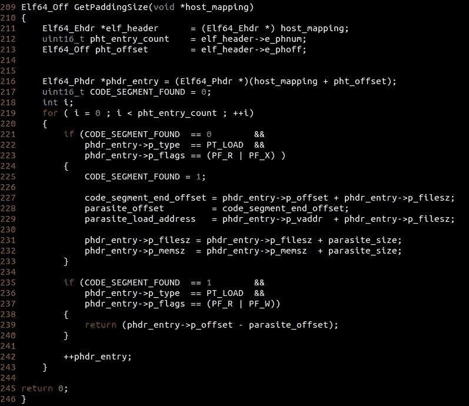*

*[解析 PHT](https://github.com/compilepeace/KAAL_BHAIRAV/blob/master/evil_elf.c)*

*到目前为止，我们已经将主机二进制映射到进程地址空间，并且我们的寄生代码已经在堆段中冷却。接下来，我们需要找到一个宿主二进制文件的映射，在那里我们的寄生代码可以安静地运行。函数`GetPaddingSize()`解析**P**program**H**eader**T**able(PHT )( host mapped @*host _ mapping*)以找到代码段和代码段之后的下一个段(通常是数据段)之间的填充大小，并返回填充大小(这让我们知道主机是否能够容纳寄生虫)。*

*   *(Line**211**–**213**)从 host_mapping(总是从二进制的第 0 个偏移量开始)获取 elf_header。从 elf header 中获取并存储 pht 的偏移量到名为 *pht_offset* 的变量中，并将程序头的数量(在 PHT 中)存储到名为 *pht_entry_count 的变量中。**
*   *(Line **216** 设置一个名为 *phdr_entry* 的变量，指向 PHT 中的第一个条目@ (host_mapping + pht_offset)*
*   *(Line**217**–**219**)将 **CODE_SEGMENT_FOUND** 置 0，表示是否找到代码段。然后，我们从第 0 个程序头开始遍历 PHT 的条目。*
*   *(行**221**–**225**)检查 **CODE_SEGMENT_FOUND** 是否为 0(即代码段尚未找到)以及 [elf.h](https://linux.die.net/man/5/elf) 中定义的`struct Elf64_Phdr`的段类型(由[p _ type](https://linux.die.net/man/5/elf)属性指定)是否为 [**PT_LOAD**](https://linux.die.net/man/5/elf) (即二进制的加载段之一)和如果这三个条件都为真，通过将 **CODE_SEGMENT_FOUND** 设置为 1，该段被标记为 CODE seg Patch parasite code，以将控制静默转移到原始代码段。*
*   *(Line**227**–**229**)这里的 *phdr_entry* 指向当前程序头，段的结束是通过将 **p_filesz** (磁盘上段的大小)加到 **p_offset** (当前段的偏移量)给出的。由于我们希望将寄生虫代码放在代码段本身的末尾，我们将*寄生虫 _ 偏移量*设置为*代码 _ 段 _ 结束 _ 偏移量*。对于 LSB 可执行文件，我们将代码段的*寄生虫 _ 加载 _ 地址*(即在主机二进制执行期间将发现寄生虫的位置)设置为(p_vaddr + p_filesz)。*
*   *(Line**231**–**232**)根据感染算法的第二步，我们通过 *parasite_size* 增加当前程序头的 *filesz* (磁盘上段的大小)和 *memsz* (内存中段的大小)属性。这样做是为了适应磁盘和内存中寄生虫。*
*   *(Line**235**–**240**)如果 **CODE_SEGMENT_FOUND** 设置为 1(即代码段已经被上述代码解析和修改)并且段类型( [elf.h](https://linux.die.net/man/5/elf) 中定义的`struct Elf64_Phdr`的`p_type`属性)设置为 PT_LOAD(即可加载段)并且段权限设置为读写(RW-)，则执行数据段的块。返回数据段偏移量减去
    代码段结束偏移量后得到的 padding_size(即 *p_offset* (数据段)*—*CODE _ segment _ end _ offset*)。**
*   **(行**242**–**245**)然后递增 *phdr_entry* 以指向下一个程序头条目。如果循环遍历所有条目，并且代码流不知何故到达行号 **245** ，这意味着我们没有进入数据段的 If 块，因此返回 0，这表示没有空间用于寄生代码。**

****注**:这里 PF_R、PF_W、PF_X 是描述段访问权限的宏，在`/usr/include/elf.h`中定义。 **PF_X** 为(1<<0)**PF _ W**为(1<<1)**PF _ R**为(1 < < 2)。如`[$ man 5 elf](https://linux.die.net/man/5/elf)`所述，我们可以通过对这些宏执行按位“或”运算来使用这些标志。**

## **PatchSHT() —我们的寄生虫万岁！**

**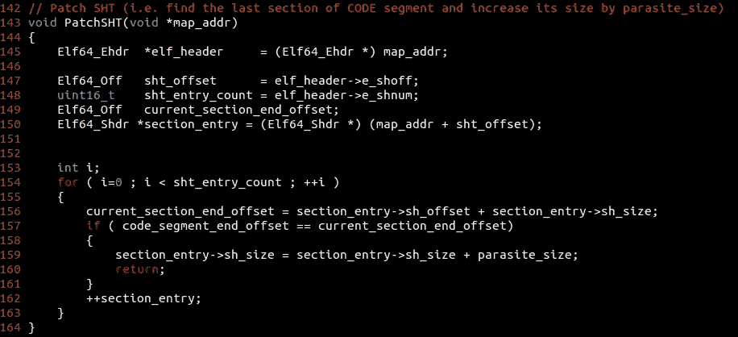**

**[解析 PHT](https://github.com/compilepeace/KAAL_BHAIRAV/blob/master/evil_elf.c)**

**我们在宿主体内发现了一个寄生虫的房间，但是我们如何消除它对不被扔出我们发现的庇护所的不安全感。存在二进制文件专用的工具(如`strip`)，它们不喜欢补充内容(即除了程序执行所必需的内容之外的任何内容)留在二进制文件中。`Strip`丢弃符号、调试信息和二进制文件中无助于程序执行的部分。像`strip`这样的工具经常被软件开发人员用来减少二进制文件的大小(在发布用于生产之前),也让逆向工程师的日子更难过。与此同时，它删除了任何不属于任何部分的代码/数据，这对我们的寄生虫来说似乎很可怕。为了使我们未来的木马主机条带安全，我们必须解析二进制文件的段标题表(SHT ),并将代码段的最后一段的大小增加*寄生虫 _ 大小*,以欺骗`strip`相信寄生虫是段的一部分。**

*   **(Line**145**–**150**)它从主机二进制文件的 elf 头设置 *sht_offset* (到段头表的偏移量)和*SHT _ entry _ count*(SHT 中的条目数)。将 *section_entry* (属于 [elf.h](https://linux.die.net/man/5/elf) 中定义的`Elf64_Shdr *`类型)定义为 SHT 的第一个条目。**
*   **(Line**153**–**162**)遍历 SHT，检查当前段结束偏移量(*current _ section _ end _ offset*)是否等于代码段结束偏移量(*code _ segment _ end _ offset*)。如果是代码段的最后一段，则增加其 *sh_size* 以容纳寄生代码。稍后，递增 section_entry 指针以指向 SHT 中的下一个条目。**

## **FindAndReplace() —修补寄生虫**

**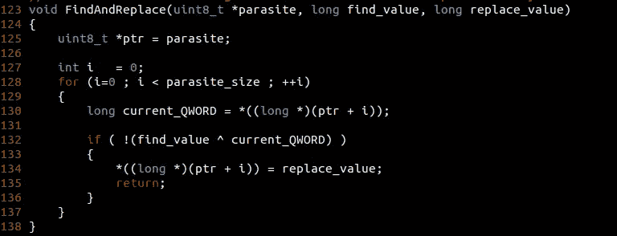**

**[evil_elf.c](https://github.com/compilepeace/KAAL_BHAIRAV/blob/master/evil_elf.c)**

**当攻击者感染一个二进制程序时，他打算劫持该二进制程序的代码流，让它做一些它不打算做的事情(由寄生虫执行的特技)。该过程的劫持部分可以通过不同的感染方法来完成，这取决于恶意软件作者使用的感染点。它可以在 main()执行之前完成(通过**入口点修改技术**或**劫持构造函数**)，在 main()执行之间完成(通过劫持库函数 **—中毒**或 **PLT/GOT 重定向**，通过**函数蹦床**感染)，也可以在 main()执行之后完成(**劫持析构函数**)。这里，我们重点关注第一种技术，即修改入口点来劫持主机二进制代码流。**

**在我们劫持了代码流并将代码流传输给寄生虫之后，寄生虫的责任是将代码流静默地传输回主机二进制代码的预期代码执行，使得代码被静默地执行而不产生任何噪声。要做到这一点，我们需要以某种方式让寄生虫知道它需要在执行后将代码流转移到哪里。我们的效用函数— `FindAndReplace()`为我们执行这个任务。它用主机二进制文件的 *original_entry_point* 替换一个占位符值(在寄生代码内部)。称之为- `FindAndReplace(parasite_code, 0xAAAAAAAAAAAAAAAA, original_entry_point);`。**

*   **(Line**125**–**128**)初始化一个指向寄生虫的指针`uint8_t *ptr`，并遍历寄生虫代码的每个字节。**
*   **(Line**130**–**135**)在 x86–64 位架构上，一个内存地址占用内存中 8 个字节的空间。请记住， *current_QWORD* 是一个长类型变量，存储一个 8 字节的值。`*if statement*` 通过对 *find_value* 和 *current_QWORD* (1 XOR 1 为 0) 进行异或运算来比较这些值，从而用 *replace_value* 覆盖 8 个字节的占位符并返回(即 *original_entry_point* )**

## **ElfParser:注入寄生代码并取消二进制映射**

**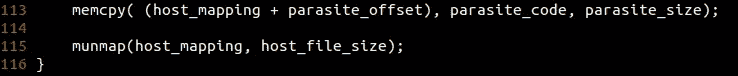**

**[evil_elf.c](https://github.com/compilepeace/KAAL_BHAIRAV/blob/master/evil_elf.c)**

**在`ElfParser()`、`memcpy()`中，将*寄生虫 _ 大小*字节从位置*寄生虫 _ 代码*(堆段中)复制到(*主机 _ 映射+寄生虫 _ 偏移量*)中，这是寄生虫的住处。`munmap()`从 Kaal Bhairav 的进程地址空间取消主机二进制映射，感染被写入磁盘。**

# **我心爱的双星生病了**

**恶心到(至少)表现出一种唐突的行为。直到我们学会制造寄生虫，感染过程才算完成。寄生虫是在我们劫持了主机的代码流后，通过定义什么是善或恶来完成感染的。在下一篇文章中，我们将讨论对于 **ET_EXEC** 和 **ET_DYN** 类型的二进制文件来说是不同的寄生设计(即对于 LSB 可执行文件和共享对象)。
elf infector 的完整源代码可以在[这里](https://github.com/compilepeace/KAAL_BHAIRAV)找到。**

**干杯，** 

*****Github**:[https://github.com/compilepeace](https://github.com/compilepeace)
**领英**:[https://www.linkedin.com/in/abhinav-thakur-795a96157/](https://www.linkedin.com/in/abhinav-thakur-795a96157/)***