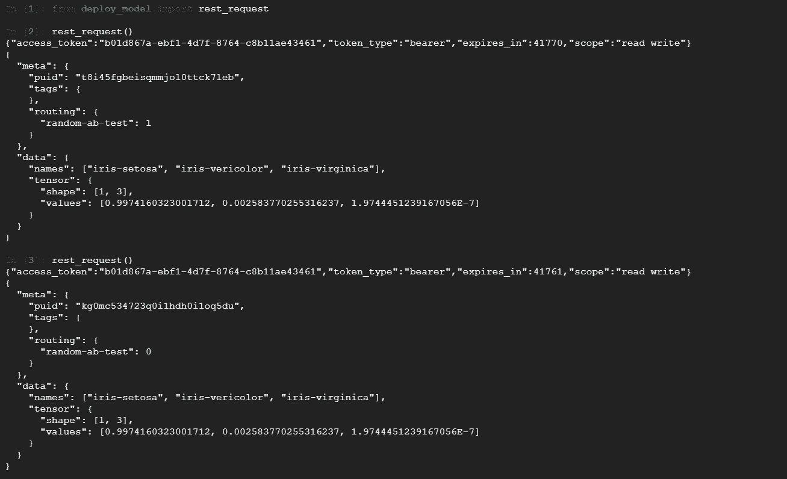

# 像老板一样管理 ML 部署:使用 Sklearn、Kubernetes 和 Seldon-core 部署您的第一个 AB 测试，只使用您的 Web 浏览器和 Google Cloud

> 原文：<https://medium.com/analytics-vidhya/manage-ml-deployments-like-a-boss-deploy-your-first-ab-test-with-sklearn-kubernetes-and-b10ae0819dfe?source=collection_archive---------0----------------------->


#模特老板:[https://github.com/SeldonIO/seldon-core](https://github.com/SeldonIO/seldon-core)

# 先看这个——总结

如果您对将机器学习模型部署为 REST APIs 感兴趣，但是仅仅提供端点已经不够好了，那么您可能已经准备好进行模型管理了。

就像洛基拥有米克一样，你，我的朋友，拥有[谢顿核心](https://github.com/SeldonIO/seldon-core/blob/master/readme.md)。

如果您想要一种简单的方法来部署流量，然后使用 AB 测试之类的东西将流量路由到模型，那么模型管理就是您的选择。当然，没有人能比米克自己更好地解释管理的必要性:

谢顿核心比米克好得多，你不用喝生鸡蛋

**本文是一个端到端的教程，涵盖了如何:**

*   用 scikit-learn 训练一个(非常)基本的机器学习模型
*   使用 seldon-core 作为 AB 测试服务和路由该模型
*   在 kubernetes 上部署整个工具包和一堆东西

换句话说，我们将花大部分时间穿越谢顿核心。但是作为您的数据科学业余爱好者，我将包括让它运行的每个步骤。只是不要让我解释它为什么有效。

**等等！！！我以前从未将模型部署为 REST API。我还应该读这个吗？**

如果您以前从未将 ML 模型作为 REST API 部署过，这完全没问题。先前的经验是**而不是**所要求的。谢顿核心为我们处理。万岁。

也就是说，如果你想要一个简单地在 kubernetes 上部署一个 ML 模型作为 REST API 的超级基础的例子，读一读除了我的关于这个主题的博客文章之外的任何东西，你就会很快熟悉了。

**等等！！！我不想要一个基本的例子。我想要一个真实的生产实例**

然后阅读丹尼尔·罗德里格斯的这个[合法的例子](/@danielfrg/polyaxon-argo-and-seldon-for-model-training-package-and-deployment-in-kubernetes-fa089ba7d60b)。专业人士就是这么做的。

继续前进。

**你只需要跟着做:**

*   现代网络浏览器
*   态度好

就像我的上一篇文章一样，我将在谷歌云上运行一切，因为它超级简单，而且我仍然有一堆免费积分。此外，我们可以使用 Google Cloud shell，这意味着我们甚至不必在本地运行终端会话。这可能看起来像一个愚蠢的约束，但我知道对我来说计算*有多难(这是一个技术术语，伙计们)，所以我想尽可能地减少认知开销。请随意评价我，看看我是否在乎…*

# 我们主题的快速介绍

借用比我聪明的人的话:

> 如果机器学习模型是在 Jupyter 笔记本上训练的，但从未部署过，它真的存在过吗？

当我明白的时候，让我再给你扔一个炸弹:

> 如果你不管理你的模型，你的模型会管理你…

我知道这听起来有多愚蠢，我(基本上)是在开玩笑。但是在我的胡言乱语中有一些真理。部署机器学习模型不仅困难，而且严重不足。尽管管理已部署的模型更加困难，但这是绝对必要的。那么一个女孩该怎么办呢？

嗯，这里没有“自由范围建模”——我们必须在野外控制和指导我们的模型，以免它们为我们的业务部门带来很少甚至没有 ROI。幸运的是，如果我们大胆行动，有一些可爱的开源项目随时准备为我们提供帮助。

如果您愿意在终端中键入一些命令，本教程将教您如何像老板(或至少像一个酷的中层经理)一样部署和管理 ML 模型。所以让我们开始吧。

以下是我们将涉及的内容(按顺序):

*   使用 GKE 在谷歌云上构建 kubernetes 集群
*   使用舵安装 seldon-core
*   使用 s2i 构建一个基本 ML 模型的 Docker 映像
*   使用 seldon-core 将我们的 AB 测试定义和部署为模型图

# 1.启动并连接到 GKE 的 Kubernetes 集群


我们用来移动码头集装箱的东西:【https://kubernetes.io/ 

让我们使用[谷歌云](https://console.cloud.google.com)来创建我们的 kubernetes 集群。有了所有的免费积分，它没有花费我任何东西，并且让我免去了在笔记本电脑上运行本地 kubernetes 实例的烦恼。此外，通过使用一个公共的基础设施，其他人可以更容易地跟进。当然，我们可以完全在他们基于网络的云外壳上工作，所以你不必在你的笔记本电脑上运行任何东西。

1.  使用左侧的汉堡菜单，选择 Kubernetes 引擎并单击“创建集群”


准备好来一次狂野之旅吧

2.保持默认设置不变，点击**创建**。谷歌云现在需要几分钟来启动我们的 kubernetes 集群。这是给自己拿一杯美味饮料的好时机。

3.现在点击**连接**按钮打开我们的云壳，选择**在云壳中运行。**


我们可以从本地机器 ssh，但是我太懒了


感谢谷歌

就这样，我们连接到正在运行的 kubernetes 实例-# suh-weet。


现在让我们开始行动吧

# 2.在 GKE 上安装舵和谢顿核心


我们如何在 kubernetes 上安装东西:[https://helm.sh/](https://helm.sh/)

我们用 helm 在 kubernetes 上安装东西。我认为 helm 是各种各样的 kubernetes 包管理器(相当于 Python 中的 pip 或 conda)。我想说更多关于赫尔姆的事，但我只知道这些。

**如何安装 Helm —输入 Jonathan Campos**

幸运的是，Jonathan Campos 写了一篇关于[如何在 GKE](/google-cloud/installing-helm-in-google-kubernetes-engine-7f07f43c536e) 上安装 helm 的精彩教程。我知道这是我的教程，当我读到这个宝石:

> 现在您已经看到了必要的代码，您可以偷懒，只需运行一个脚本来为您完成安装

我相信我会的，乔纳森。我相信我会的。

这是我们需要的乔纳森教程的[相关片段](https://github.com/jonbcampos/kubernetes-series/blob/master/helm/scripts/add_helm.sh)。

```
#!/usr/bin/env bash

echo "install helm"
# installs helm with bash commands for easier command line integration
**curl https://raw.githubusercontent.com/kubernetes/helm/master/scripts/get | bash**
# add a service account within a namespace to segregate tiller
**kubectl --namespace kube-system create sa tiller**
# create a cluster role binding for tiller
**kubectl create clusterrolebinding tiller \
    --clusterrole cluster-admin \
    --serviceaccount=kube-system:tiller** 
echo "initialize helm"
# initialized helm within the tiller service account
**helm init --service-account tiller**
# updates the repos for Helm repo integration
**helm repo update**

echo "verify helm"
# verify that helm is installed in the cluster
**kubectl get deploy,svc tiller-deploy -n kube-system**
```

这是怎么回事？谁在乎呢。打开一个文本编辑器，把这段代码粘贴进去，然后运行它。

我是这样做的。我创建了一个名为 *install-helm* 的目录，然后创建了一个名为 *install-helm.sh* 的文件。我的 shell 命令是:

```
mkdir install-helm
cd install-helm
vim install-helm.sh
#Enter insert mode in vim with "i"
#Paste your code
#Exit vim with ":x"
bash install-helm.sh
```

如果您看到类似下图的内容，那么您的安装运行成功


太好了，现在我们已经安装了头盔，让我们用它来安装谢顿核心

**用舵安装谢顿芯**

遵循 [seldon-core 安装材料](https://github.com/SeldonIO/seldon-core/blob/master/docs/install.md)，我们需要安装 *seldon-core-crd* 和 *seldon-core 组件*。

要从终端安装 seldon-core-crd，请运行:

```
helm install seldon-core-crd --name seldon-core-crd --repo https://storage.googleapis.com/seldon-charts \
     --set usage_metrics.enabled=true
```

要安装 seldon-core 组件，请运行:

```
helm install seldon-core --name seldon-core --repo https://storage.googleapis.com/seldon-charts
```

注意，如果你阅读了[安装文档](https://github.com/SeldonIO/seldon-core/blob/master/docs/install.md)，它们会指导你为 RBAC 和反向代理设置一些选项。我发现这令人困惑，所以我只是忽略了它，用默认值。幸运的是，一切正常。

如果你看到这样的信息，那么 seldon-core 安装成功。


非常欢迎你，谢顿核心

# 3.使用 s2i 构建一个基本 ML 模型的 Docker 映像

现在我们已经安装了 seldon-core，是时候将我们的模型构建为 Docker 映像，并将其传递给 seldon-core 进行部署和路由了。

**安装 s2i**

s2i 是一个方便的工具，可以将 Git repo(或者任何地方，我认为)中的代码转换成 Docker 映像。这为什么有用？记住:我们需要所有东西都存在 Docker 容器中，这样 Kubernetes 就可以处理所有繁重的部署和监控工作。

我们可以完成编写 Docker 文件和构建 Docker 映像的步骤，但是使用 s2i 我们不必这样做。三声欢呼！

```
# Download the installer
wget [https://github.com/openshift/source-to-image/releases/download/v1.1.12/source-to-image-v1.1.12-2a783420-linux-amd64.tar.gz](https://github.com/openshift/source-to-image/releases/download/v1.1.12/source-to-image-v1.1.12-2a783420-linux-amd64.tar.gz)# Unpack the installer
tar -xvf source-to-image-v1.1.12-2a783420-linux-amd64.tar.gz# Add the executable - s2i - to your path
  cp s2i ../.local/bin/
```

太棒了。我们快到 Python 部分了。接下来，我们需要安装一些依赖项。

**安装 Scikit-learn，GRPC 工具**

我们需要 scikit-learn，用于机器学习的规范 python 包。我们还将安装 grpc 工具，以防您稍后想要发出 rpc 请求(我将展示如何调用 REST 上的模型)

```
sudo pip install sklearn grpcio-tools
```

简单。现在让我们找到一个非常基本的 sklearn 示例，我们可以用它来进行我们的第一次 seldon 部署。

**克隆谢顿-核心示例**

幸运的是，谢顿的好人创造了一些我们可以利用的例子。让我们使用 git 克隆他们的示例 repo 并运行其中一个

```
# Clone the repo
git clone https://github.com/SeldonIO/seldon-core-launcher.git # cd into the example directory we want to run
cd seldon-core-launcher/seldon-core/getting_started/wrap-model
```

现在这些例子都是用 Jupyter 笔记本提供的。通常来说，这是个好消息。然而，我承诺我们将在谷歌云外壳中运行一切(这是我的整个“唯一的要求是一个网络浏览器和一个良好的态度”的事情)。

遗憾的是，我无法访问在我的谷歌云外壳中运行的 Jupyter 笔记本实例。如果您在其他地方运行这个示例，就不会有这个问题。

也就是说，这是我们简单的解决方法，这样我们就可以继续实现只有浏览器的梦想。我们将相关的代码片段写成 python 脚本，而不是笔记本！嘣！

创建一个名为`train_model.py`的基本脚本来训练我们的模型

```
#train_model.py
**import** **numpy** **as** **np**
**import** **os**
**from** **sklearn.linear_model** **import** LogisticRegression
**from** **sklearn.pipeline** **import** Pipeline
**from** **sklearn.externals** **import** joblib
**from** **sklearn** **import** datasets

**def** main():
    clf = LogisticRegression()
    p = Pipeline([('clf', clf)])
    print('Training model...')
    p.fit(X, y)
    print('Model trained!')

    filename_p = 'IrisClassifier.sav'
    print('Saving model in **%s**' % filename_p)
    joblib.dump(p, filename_p)
    print('Model saved!')

**if** __name__ == "__main__":
    print('Loading iris data set...')
    iris = datasets.load_iris()
    X, y = iris.data, iris.target
    print('Dataset loaded!')
    main()
```

我现在能听到抱怨了。Gus —没有训练/测试分割？没有标准化也没有超参数调优？这是什么机器学习的野蛮？你真没礼貌，先生！？

冷静点。这不是一个 ML 教程(即使是，我也不知道那些答案)。我们在这里学习如何使用有趣的图形部署模型，如 AB 测试、多臂 bandit 和所有好东西。让我们不要被基本的 ML 所困扰。现在已经够好了。

保存文件，然后通过以下方式运行它:

```
python train_model.py
```

您应该会在本地目录中看到一个名为 IrisClassifier.sav 的新文件。干得好！

**用 s2i 包装运行时代码**

现在我们有了一个训练好的模型，是时候定义一个函数来返回我们模型的预测了。这是事情开始变得有趣的地方。我们可以让 s2i 为我们构建模型服务框架，而不是使用 Flask 或 Tornado 这样的 web 框架来服务我们的代码。

我们所要做的就是将模型定义为一个类(如下例所示)。创建一个名为`IrisClassifier.py`的文件

```
#IrisClassifier.py
from sklearn.externals import joblib

class IrisClassifier(object):

    def __init__(self):
        self.model = joblib.load('IrisClassifier.sav')
        self.class_names = ["iris-setosa","iris-vericolor","iris-virginica"];
    # feature_names aren't needed 
    def predict(self,X,features_names):
        return self.model.predict_proba(X)
```

事情是这样的。当类被初始化时，我们的代码从磁盘加载我们之前训练的模型`IrisClassifer.sav`。然后，我们定义一个`predict`函数，它接受各种花的输入(这就是虹膜分类器的作用，尽管这对于理解本教程来说不是必需的),并返回花的分类概率。

如果这看起来很基本，那是因为它确实如此。我们没有定义路线或创建应用程序，我们只是编写了一个带有预测功能的简单类。不算太寒酸。

**用 s2i 构建 Docker 图像**

除了上面的类，s2i 还需要一个配置文件。这是我们告诉 s2i 如何为我们的模型服务的地方。如果你按照本教程前面的说明克隆了 seldon-core repo，这一切对你都是可用的。让我们通过运行`cat .s2i/environment`来看看 s2i 配置文件。您应该会看到下面的输出。这就是我们如何告诉 s2i 将我们的模型作为 Docker 容器中的 REST API。

```
$ #cat.s2i/environmentMODEL_NAME=IrisClassifier
API_TYPE=REST
SERVICE_TYPE=MODEL
PERSISTENCE=0
```

requirements.txt 文件也是必需的(幸好包括在内)。这是我们告诉 Docker 我们的模型需要运行哪些依赖项的地方。在这个例子中，你可以看到它非常小

```
$ cat requirements.txtscikit-learn==0.19.0
scipy==0.18.1
```

现在有了我们的环境和需求文件，我们可以运行 s2i builder 工具来构建服务于我们模型的 Docker 映像。以下是如何做到这一点。

首先，您需要一个 docker 映像存储库(docker 映像构建完成后，我们将在这里存储它)。Docker Hub 是一个很好的(免费的)方法。如果你还没有这样做，去 [Docker Hub](https://hub.docker.com) 创建一个免费账户。记住你的用户名，因为我们马上就要用到它。

第二，我们需要登录 docker。我们通过在命令行运行`docker login`来实现这一点。输入您的用户名和密码(与登录 Docker Hub 相同)，您就可以开始了。

现在让我们将环境变量`DOCKER_REPO`设置为 Docker Hub 用户名，然后像这样运行 s2i build 命令:

```
env DOCKER_REPO=gcav66 #Replace "gcav66" with your Docker Hub unames2i build . seldonio/seldon-core-s2i-python3 ${DOCKER_REPO}/sklearn-iris:0.1
```

我们在这里做的是使用一个预定义的谢顿核心 python3 docker 图像，然后添加我们的模型和依赖关系。细节没有你的手指敲击键盘重要。这是我们样板代码的结尾。

热辣迪吉！我们一直在前进

**将 Docker 图像推送到 Docker Repo**

现在，这一部分的最后一步是将我们新建的 Docker 映像推送到我们的 Docker Hub 帐户。下面是如何做到这一点:

```
docker push gcav66/sklearn-iris:0.1 #replace "gcav66" with the DOCKER_REPO environment variable or just hard code your Docker Hub username
```

嘣！现在，我们已经成功地将模型映像推送到 Docker Hub repo。我们终于准备好用谢顿核心部署它了。现在才是真正有趣的时候

# 4.使用 Seldon-core 将我们的 AB 测试定义为模型图

这是橡胶与路面相遇的地方。

我们需要做的第一件事是启用端口转发。点击“+”按钮，在 Google Cloud shell 中打开一个新的 Shell，如下所示


单击+按钮打开一个新的外壳

在这个新终端中，粘贴以下命令

```
kubectl port-forward $(kubectl get pods -l app=seldon-apiserver-container-app -o jsonpath='{.items[0].metadata.name}') 8002:8080
```

如果您看到如下所示的输出，那么它运行成功:

```
Forwarding from 127.0.0.1:8002 -> 8080
Forwarding from [::1]:8002 -> 8080
```

现在让我们创建一个新的 python 脚本`deploy.py`

粘贴以下代码:

```
**import** **requests**
**from** **requests.auth** **import** HTTPBasicAuth
**from** **proto** **import** prediction_pb2
**from** **proto** **import** prediction_pb2_grpc
**import** **grpc**
**try**:
    **from** **commands** **import** getoutput *# python 2*
**except** **ImportError**:
    **from** **subprocess** **import** getoutput *# python 3*

API_HTTP="localhost:8002"
API_GRPC="localhost:8003"

**def** get_token():
    payload = {'grant_type': 'client_credentials'}
    response = requests.post(
                "http://"+API_HTTP+"/oauth/token",
                auth=HTTPBasicAuth('oauth-key', 'oauth-secret'),
                data=payload)
    print(response.text)
    token =  response.json()["access_token"]
    **return** token

**def** rest_request():
    token = get_token()
    headers = {'Authorization': 'Bearer '+token}
    payload = {"data":{"names":["sepallengthcm","sepalwidthcm","petallengthcm","petalwidthcm"],"tensor":{"shape":[1,4],"values":[5.1,3.5,1.4,0.2]}}}
    response = requests.post(
                "http://"+API_HTTP+"/api/v0.1/predictions",
                headers=headers,
                json=payload)
    print(response.text)
```

现在这里有很多，我承认它看起来很可怕，但只有一个关键部分你需要注意——`payload`

```
payload = {"data":{"names":["sepallengthcm","sepalwidthcm","petallengthcm","petalwidthcm"],"tensor":{"shape":[1,4],"values":[5.1,3.5,1.4,0.2]}}}
```

我们所要做的就是告诉谢顿-核心:

*   我们功能的名称，例如“分离长度…”
*   我们特征的形状，例如[1，4](一行 4 列)
*   实际值，例如[5.1，3.5，1.4]

因此，当你用谢顿核心提供其他例子时，你很可能会发现自己正在编辑这个片段。如果您发送一个带有“名称”、“形状”和“值”的`payload`(后两个属于“张量”父项)，您就可以开始了。

再编辑一个讨厌的文件，我们就都准备好了。下一个任务是为谢顿核心定义我们的图表看起来像什么。

让我们从简单开始，将我们的模型部署为一个普通的 REST API。在我们掌握了 seldon-core 的部署技巧后，我们将加大赌注，建立我们的 AB 测试。我知道这是你来这里的目的，我不会让你失望的。

在您当前的目录中，您会发现一个名为`TMPL_deployment.json.`的文件

(如果您在云外壳中迷路，也不用担心，您需要进入的目录是* sel don-core-launcher/sel don-core/getting _ started/wrap-model *)

打开`TMPL_deployment.json`，让我们编辑一个值:

```
{
    "apiVersion": "machinelearning.seldon.io/v1alpha2",
    "kind": "SeldonDeployment",
    "metadata": {
        "labels": {
            "app": "seldon"
        },
        "name": "sklearn-iris-example"
    },
    "spec": {
        "name": "sklearn-iris-deployment",
        "oauth_key": "oauth-key",
        "oauth_secret": "oauth-secret",
        "predictors": [
            {
                "componentSpecs": [{
                    "spec": {
                        "containers": [
                            {
                                "image": "gcav66/sklearn-iris:0.1",
                                "imagePullPolicy": "IfNotPresent",
                                "name": "sklearn-iris-classifier",
                                "resources": {
                                    "requests": {
                                        "memory": "1Mi"
                                    }
                                }
                            }
                        ],
                        "terminationGracePeriodSeconds": 20
                    }
                }],
                "graph": {
                    "children": [],
                    "name": "sklearn-iris-classifier",
                    "endpoint": {
                        "type" : "REST"
                    },
                    "type": "MODEL"
                },
                "name": "classifier",
                "replicas": 1,
                "annotations": {
                "predictor_version" : "0.1"
                }
            }
        ]
    }
}
```

您必须更改的一个值是要从 Docker Hub 用户名中提取的图像的名称。

```
#Swap "gcav66" with your username
"image": "gcav66/sklearn-iris:0.1",
```

这就是改变。值得看一下`graph`键里面的数据。我们将很快在这里进行一些编辑，将我们的部署从基本端点更改为 AB 测试。但首先，让我们把这个东西运行起来。

我们通过运行以下命令来创建我们的谢顿部署:

```
kubectl apply -f TMPL_deployment.json
```

然后休息 30 秒，通过将这个粘贴到 shell 中来验证你的 seldon 应用程序是否正在运行

```
kubectl get seldondeployments sklearn-iris-example -o jsonpath='{.status}'
```

在输出中，如果您看到*replicas:1*您就可以开始了。这可能需要一两分钟，但应该不会超过这个时间。我们的模型终于部署好了。到达终点的时间到了。

现在，如果您还记得，我们正在 Google Cloud Shell 中运行这个完整的示例(所以我们可以只使用我们的 web 浏览器来运行一切)。这款出色工具的一个限制是它不容易支持运行 jupyter 笔记本(我知道我之前提到过这一点，但值得重复一遍)。因此，我们不再运行塞尔顿团队提供的笔记本单元，而是调用我们之前创建的`deploy_model.py` 脚本。

以下是如何做到这一点。通过键入:`ipython`打开 ipython shell

然后在新的 ipython shell 中，键入:

`from deploy_model import rest_request`

“deploy_model”对应于本地目录中的`deploy_model.py` 文件，而`rest_request`是我们定义的调用 API 的函数的名称。

然后键入`rest_request()`进行 API 调用:

```
In [**3**]: rest_request()
{"access_token":"b01d867a-ebf1-4d7f-8764-c8b11ae43461",
"token_type":"bearer",
"expires_in":43199,
"scope":"read write"}
{  "meta": 
{    "puid": "j64h9tqf404rv2j3ikc8r98sdf",    
"tags": {    },    
"routing": {    }  },  
"data": 
{    "names": ["iris-setosa", "iris-vericolor", "iris-virginica"],    "tensor": {      "shape": [1, 3],      "values": [0.9974160323001712, 0.002583770255316237, 1.9744451239167056E-7]    }  }}
```

给定我们的输入数据，模型返回预测第一个值(iris-setosa)是正确的分类结果(99%)

太棒了。您刚刚使用 seldon-core 部署并测试了您的第一个模型！但是您大老远跑来并不是为了停止一个基本的模型部署。让我们更新一下 AB 测试的模型图。

退出 ipython shell，通过运行以下命令来删除我们现有的部署:

```
kubectl delete -f TMPL_deployment.json
```

现在让我们创建一个新的模型图 json 文件`ab_test.json`

粘贴以下代码:

```
{
    "apiVersion": "machinelearning.seldon.io/v1alpha2",
    "kind": "SeldonDeployment",
    "metadata": {
        "labels": {
            "app": "seldon"
        },
        "name": "sklearn-iris-example"
    },
    "spec": {
        "name": "sklearn-iris-deployment",
        "oauth_key": "oauth-key",
        "oauth_secret": "oauth-secret",
        "predictors": [
            {
                "componentSpecs": [{
                    "spec": {
                        "containers": [
                            {
                                "image": "gcav66/sklearn-iris:0.1",
                                "imagePullPolicy": "IfNotPresent",
                                "name": "classifier-1",
                                "resources": {
                                    "requests": {
                                        "memory": "1Mi"
                                    }
                                }
                            }],
                        "terminationGracePeriodSeconds": 20
                    }},
                {
                    "metadata":{
                        "labels":{
                            "version":"v2"
                        }
                    },
                        "spec":{
                            "containers":[
                            {
                                "image": "gcav66/sklearn-iris:0.1",
                                "imagePullPolicy": "IfNotPresent",
                                "name": "classifier-2",
                                "resources": {
"requests": {
                                        "memory": "1Mi"
                                    }
                                }
                            }
                        ],
                        "terminationGracePeriodSeconds": 20
                                   }
                                   }],
                "name": "classifier",
                "replicas": 1,
                "annotations": {
                    "predictor_version": "v1"
                },
                "graph": {
                    "name": "random-ab-test",
                    "endpoint":{},
                    "implementation":"RANDOM_ABTEST",
                    "parameters": [
                        {
                            "name":"ratioA",
                            "value":"0.5",
                            "type":"FLOAT"
                        }
                    ],
                    "children": [
                        {
                            "name": "classifier-1",
                            "endpoint":{
                                "type":"REST"
                            },
                            "type":"MODEL",
                            "children":[]
                        },
                        {
                            "name": "classifier-2",
                            "endpoint":{
                                "type":"REST"
                            },
                            "type":"MODEL",
                            "children":[]
                        }
                    ]
                }
            }
        ]
    }
}
```

重要的是。我们告诉 seldon 我们想要运行哪个模型(两次都是我们无聊的 iris 分类器)，我们想要运行的图(abtest)，以及我们想要如何在每个部署的模型之间路由流量(随机)。

正如您所想象的，我们可以很容易地将它扩展到使用不同模型的其他模型路由场景。

现在让我们部署新的模型图:

```
kubectl apply -f ab_test.json
```

在稍长时间的等待之后(毕竟，seldon 必须部署*两个*模型，而不是一个)，我们通过运行来验证我们的模型已经部署

```
kubectl get seldondeployments sklearn-iris-example -o jsonpath='{.status}'
```

如果我们看到*replicas:1*我们都准备好发送一些针对 AB 测试的请求。

现在我们再次启动`ipython` shell 并重复我们之前的命令。请注意，如果您不想再次键入`from deploy_model import rest_request`和`rest_request()`，您可以使用键盘上的向上箭头。

现在您应该看到您的模型结果，这次被注释为被路由到我们两个部署模型中的一个



那不是很美吗！？

我们可以看到，在“routing”部分，seldon 将模型编号标注为“1”或“0”，表明我们的结果是从哪个模型返回的。

拍拍自己的背。使用 Kubernetes、Scikit-learn 和 Seldon-core，您只需使用 Google Cloud 和您的 web 浏览器就可以部署您的第一个 ML 模型图(AB 测试)。

最后一步。让我们拆除已部署的模型。几乎伤透了我的心(但我们不想从谷歌云招致额外的费用)

```
kubectl delete -f ab_test.json 
#To same goodbye for now
```

# 后续步骤

诚然，这是一个非常基本的例子。但是如果你已经走了这么远，也许你会愿意走得更远一点。我知道我计划为自己尝试一些不同的模型图。我计划尝试构建各种不同的模型，并使用 AB 测试和 multi-armed bandit 将流量路由到这些模型。我希望你能加入我——模特界现在是你的天下了！

这方面还有更多的内容。一如既往，

保持美丽