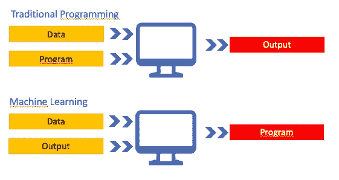
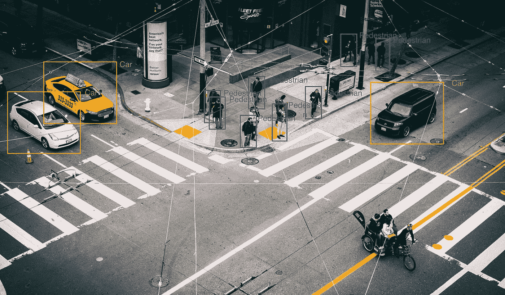
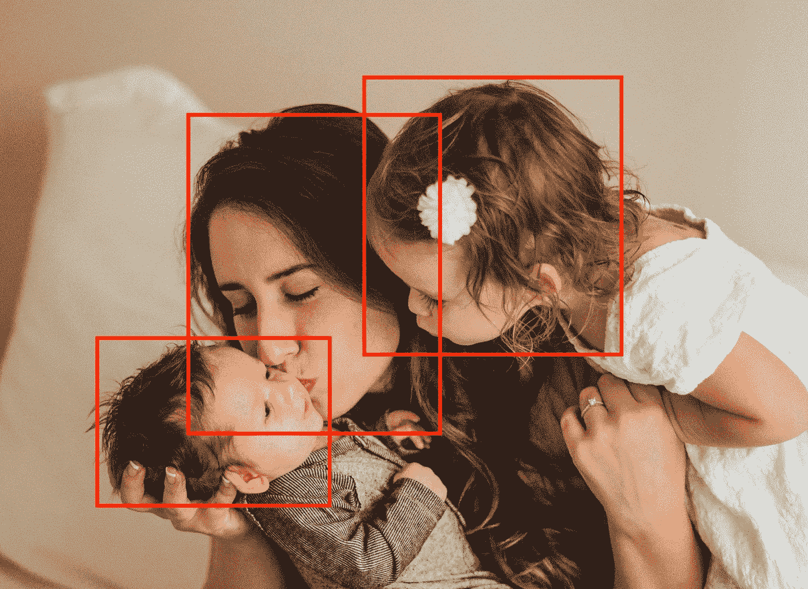
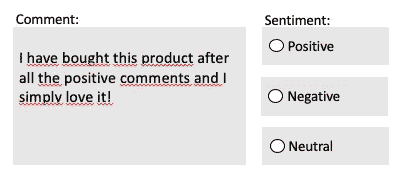

# 人工智能除雾管理指南—第 1 部分

> 原文：<https://medium.com/analytics-vidhya/managers-guide-to-demistify-a-i-part-1-a80f3c44883e?source=collection_archive---------17----------------------->

“就像 100 年前电力改变了几乎一切一样，今天我很难想到一个我认为人工智能在未来几年内不会改变的行业。”

*~斯坦福大学计算机科学兼职教授吴恩达*

在 [Unsplash](https://unsplash.com?utm_source=medium&utm_medium=referral) 上[paweczerwiński](https://unsplash.com/@pawel_czerwinski?utm_source=medium&utm_medium=referral)拍摄的照片

我的好奇心一直在问我…

它是如何工作的？我怎么知道这是不是 AI 能做到的？需要多长时间？第一步是什么？需要多少数据？它需要博士水平的专业知识吗？

作为一名创新经理，我日复一日地参加技术讲座，这让我感到困扰，因为我知道的不够多……我不知道我不知道的事情。并决定改变它。

经过一些自学，以及与人工智能从业者的交谈，我决定去攻读纳米学位，担任人工智能产品经理。这帮助我进一步为自己解开了 ML 的谜团，在某种程度上，我对评估人工智能商业案例的可能性和可行性感到更加自信——并且还可以自己构建一个简单的人工智能模型。

对于希望在业务中采用人工智能并希望了解更多信息的业务经理，我准备了这份 3 步指南，陪你一起踏上除雾之旅:

1.  理解开发人工智能模型的步骤
2.  使用 Google AutoML 构建您自己的人工智能原型
3.  建立正确的人工智能模型，避免偏见

这篇博文将集中在第一步。第二步和第三步将在接下来的文章中讨论。

理解开发一个人工智能模型所涉及的步骤将使你在建议人工智能解决问题的方法和评估它们时更有效率和自信。让我们从建立机器学习(ML)模型的步骤开始(改编自“[机器学习的 7 个步骤](https://towardsdatascience.com/the-7-steps-of-machine-learning-2877d7e5548e)”):

1.  识别问题
2.  收集数据
3.  准备这些数据
4.  训练模型
5.  估价
6.  预言；预测；预告

有两种方法可以创建 ML 模型:1)使用现有的现成模型(例如 Google AutoML)或 2)创建您的定制模型。现有的现成模型可用于最常见的用例。如果您的情况更具体，那么使用定制的 ML 模型可能会更好，尽管需要更多的资源。

为了简单起见，我们在这里将集中使用现有的 Auto ML 模型。对于定制模型，我们需要添加额外的步骤。这些将是“选择模型”，它将紧接在步骤#4“训练模型”之前，以及“超参数调整”，它通常紧接在步骤#6，“预测”之前。在 Auto ML 中，这些步骤由应用程序本身接管。

1.  **识别问题**

*在你开始你的 ML 原型之前，重要的是你正在寻找一个真正的客户或组织问题。*

如果你还没有确定，你可以按照我之前在[博客](/@aslisolmaz/i-have-used-the-nudge-theory-to-foster-digitalisation-dbee7d3facc8)中描述的方法来达到这个阶段。

**2。收集数据**

在 ML 中，你像教孩子一样向机器教授一切——看到一个球，指着它说“球”，过了一会儿，孩子指着它兴奋地大叫“球！”。收集数据是您收集的所有参考点，以教会机器(在本例中)什么是“球”。

传统编程创建输出，而 ML 创建程序。

现在孩子知道那种有弹性的、彩色的、圆形的东西是“球”。在这里，一台机器比一个孩子要原始得多，它既不能感觉也不能闻到周围的物体，也不能与周围的物体互动。它所能做的就是学会从图像和它周围的“环境”联系起来。所以你需要给机器输入大量不同颜色、大小和类型的球的图像，这样他就可以在不同的环境中学习(编程)球是什么。

**2。准备数据**

*这是准备数据告诉机器‘球，球，不是球，球，不是球，…’的过程。*

要做到这一点，你需要标记所有的图像球'是'，而不是球'否'。在图片上标记项目或将图片标记为是/否的过程称为“数据注释”或“标记”。目前，大部分数据标注过程都是由人工完成的，这也是构建人工智能模型中成本最高的项目之一。

**3。训练模型**

*教导机器某些参数以便它能够做出必要预测的过程在 ML 中被称为“训练 AI 模型”。*

为了训练模型，您需要将标记的数据上传到平台中(例如，Google AutoML、Amazon ML 等)。根据平台的不同，您可能需要提供有关数据训练的附加说明。平台会自动为你选择合适的学习算法。

**4。评估**

这就像一个小测验，你问机器你已经知道答案的问题——“这是一个球吗？”

根据正确答案的百分比，您可以决定是要进一步训练模型还是进入预测阶段。

**5。预测**

*预测是机器学习开始为你提供答案的一步，你开始从结果中受益。*

重要的是要注意，在许多情况下，如果输入数据不断发展，学习可能需要持续进行，在部署之后也是如此。

现在，我们来看一些 ML 将如何推动业务创新的例子:

**自动驾驶汽车**

1.  找出问题所在

当汽车自己行驶时，它们需要了解周围的环境，以决定下一步的行动——我周围是什么，是交通标志、汽车、行人等等。ML 能帮上什么忙？

所有这些都需要教给机器，就像教小孩子一样。应用流程的后续步骤:

2.收集数据

你可以从街道上找到很多照片，包括汽车、交通灯、行人等等。重要的是你要有一个平衡的、多样化的数据集，例如从不同的角度展示具有不同特征的物体。

3.准备好所有的数据

在上面标注所有物体->汽车、人、红绿灯、人、路面、站牌等。机器的例子越多，他就能更好地评估什么是什么。

改编自 [Yoel J Gonzalez](https://unsplash.com/@yoeljgonzalez?utm_source=medium&utm_medium=referral) 在 [Unsplash](https://unsplash.com?utm_source=medium&utm_medium=referral) 上的照片

最常用的标记图片中物体的技术被称为“包围盒”，这里更确切地说是“2D 盒”。

4.训练模型

如果您正在使用一个现有的模型，这是非常容易的。你只要按下“训练模型”按钮！几个小时后，你的数据将被训练。

这是汽车“学习”识别周围物体的方式，这是决策的重要输入。

5.评价

为了进行评估，您可以做一个小测试来评估模型的可靠性——展示一张图片，并要求机器识别汽车。根据结果，您可能需要优化您的模型。

6.预言；预测；预告

这是“部署”，你基本上把模型带到生活中。机器现在应该能够识别给定图像中的不同对象。

ML 的其他流行用例:

改编自[文森特·德莱格](https://unsplash.com/@leash_delegge?utm_source=medium&utm_medium=referral)在 [Unsplash](https://unsplash.com?utm_source=medium&utm_medium=referral) 上的照片

*   我们的手机在拍照时检测面部聚焦的方式
*   机器可以检测某些疾病的 x 射线

**利用情感分析保护品牌声誉**

1.  识别问题:

*对贵公司的脸书频道有很多评论。你想知道是否有问题，以便及时做出反应，不损害品牌声誉。ML 能帮上什么忙？*

这可以通过情感分析来实现。你如何去做:

2.收集数据

收集大量用户的评论，表达他们对某个品牌或产品的感受。

3.准备好所有的数据

对于收集的数据，标记句子是否表示“积极”、“消极”或“中性”情绪。

4.重复上面的步骤 4-6。

下次发布用户反馈时，机器会对其进行相应的分类，你可以只关注可能损害品牌声誉的负面情绪。

了解这些基础知识，机器学习模型实际上是如何被训练的，以及输入数据和输出是什么，帮助我回答了我脑海中的一些问题，并使 AI 除雾。不用说，整个 AI 过程并没有这里显示的那么简单。这篇博客旨在给你一个基本的理解，消除你可能遇到的复杂性。

这里有更多的自学资源，可以帮助你进一步揭开人工智能的神秘面纱:

*   来自 [Udacity](https://www.udacity.com/course/ai-product-manager-nanodegree--nd088) (ca。2 个月，无需编码)
*   来自 [EdX](https://www.edx.org/course/artificial-intelligence-ai) 的 AI 在线课程(基础 Python 知识为前提)
*   [来自谷歌云的人工智能冒险](https://www.youtube.com/playlist?list=PLIivdWyY5sqJxnwJhe3etaK7utrBiPBQ2)视频

关注我，在我的下一篇博文中听到更多实用的技巧，并增强你在业务中采用人工智能的能力:

*   [如何使用 Google AutoML 构建一个 ML 原型](https://link.medium.com/iKyKSiOV82)
*   [人工智能安全入门](https://link.medium.com/eIfNMye8Z3)