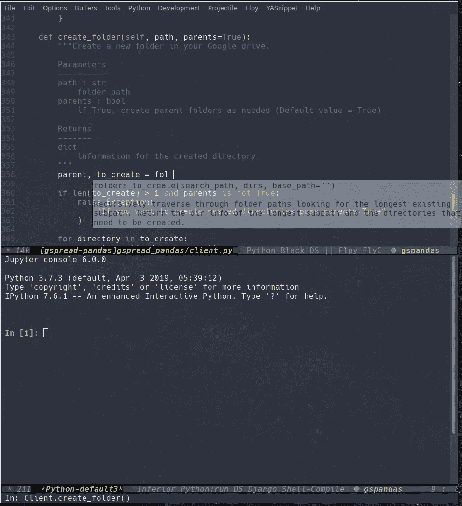

# 在 Emacs 中管理 Python 开发环境

> 原文：<https://medium.com/analytics-vidhya/managing-a-python-development-environment-in-emacs-43897fd48c6a?source=collection_archive---------7----------------------->



这是关于我的 Python 开发的两篇文章的第二部分。[点击此处查看第一部分。](/@aiguofer/my-python-development-and-daily-usage-setup-af8633ddef78)

我需要/想要从我的 IDE 中得到的主要东西是:

*   代码完成
*   证明文件
*   跳到定义
*   将区域/缓冲区发送到 REPL(口译语言)
*   代码问题的识别
*   自动格式化/组织/清理代码
*   基本重构(重命名变量)(很好)

我尝试过使用各种编辑器和 ide，但是我总是会发现一些我不喜欢的东西，然后回到 Emacs。我的主要问题倾向于使用不同的环境(一个用于 Java 的 IDE，一个用于 Python，一个用于 Web 开发，一个用于编辑配置文件/脚本等),并真正学习每个工具来充分利用它。我可以在 Emacs 中“上下文切换”,而不必切换工具。我可以获得我需要的大部分功能；尽管可能不像某些替代方案那样“完美”,但可扩展性使得在相同的舒适环境中使用几乎任何类型的文件/编程语言都很容易。在这里，我将具体谈谈我的 Python 设置，以及我是如何完成上述大部分内容的。

# 埃尔比

我在 Emacs 中用于 Python 开发的主要工具是 [Elpy](https://github.com/jorgenschaefer/elpy) 。这个伟大的工具照顾了我的大部分需求:代码完成(通过 jedi)，文档(显示函数定义)，跳转到 def，发送到 REPL，以及基本的重构。Elpy 通过 flymake 提供错误检查，但是我禁用了它，并使用 flycheck 来代替。这是我的 Elpy 配置:

```
(use-package elpy
    :straight t
    :bind
    (:map elpy-mode-map
          ("C-M-n" . elpy-nav-forward-block)
          ("C-M-p" . elpy-nav-backward-block))
    :hook ((elpy-mode . flycheck-mode)
           (elpy-mode . (lambda ()
                          (set (make-local-variable 'company-backends)
                               '((elpy-company-backend :with company-yasnippet))))))
    :init
    (elpy-enable)
    :config
    (setq elpy-modules (delq 'elpy-module-flymake elpy-modules))
    ; fix for MacOS, see [https://github.com/jorgenschaefer/elpy/issues/1550](https://github.com/jorgenschaefer/elpy/issues/1550)
    (setq elpy-shell-echo-output nil)
    (setq elpy-rpc-python-command "python3")
    (setq elpy-rpc-timeout 2)))
```

我最常用的快捷键是:

`elpy-shell-send-region-or-buffer` `C-c C-c`让我将代码发送到 REPL。如果一个区域被选中，它将发送该区域，否则它将发送整个缓冲区。

`elpy-doc` `C-c C-d`在新窗口中显示光标下的函数/类的文档。

`elpy-goto-definition` `M-.`转到光标下的函数/类的定义。这有助于我了解它是如何实现的，即使它是在第三方包中。

`elpy-nav-indent-shift-(left/right)` `M-(left/right)`将所选块向右或向左移动 1 级。这对于将代码块移入/移出 if 语句或循环非常有用。

`elpy-nav-(forward/backward)-block` `C-M-(n/p)`在代码块之间导航。这有助于在块/函数/类之间移动。

`elpy-nav-move-line-or-region-(up/down)` `M-(up/down)`上下移动整个代码块。这有助于移动代码。

# 公司

Elpy 使用公司模式完成代码。我对我的公司模式配置做了一些调整，所以我在这里分享一下:

```
(use-package company
  :straight t
  :diminish company-mode
  :init
  (global-company-mode)
  :config
  ;; set default `company-backends'
  (setq company-backends
        '((company-files          ; files & directory
           company-keywords       ; keywords
           company-capf)  ; completion-at-point-functions
          (company-abbrev company-dabbrev)
          ))(use-package company-statistics
    :straight t
    :init
    (company-statistics-mode))(use-package company-web
    :straight t)(use-package company-try-hard
    :straight t
    :bind
    (("C-<tab>" . company-try-hard)
     :map company-active-map
     ("C-<tab>" . company-try-hard)))(use-package company-quickhelp
    :straight t
    :config
    (company-quickhelp-mode))
)
```

除了设置默认的 company-backends(注意，当 Elpy 被启用时，缺省情况下这个完成列表是不活动的)之外，我没有做太多不同寻常的事情。然而，我也使用其他一些软件包来添加一些不错的功能。`company-statistics`帮助记录我最常用的补全，并使用这些信息来改进排序。`company-web`为 web 模式生成一些完成。`company-try-hard`让我使用`C-<tab>`在不同的公司后台列表中循环。当建议完成时,`company-quickhelp`在弹出窗口中给我文档。

# 保存时格式化/修复

有一些工具对自动格式化代码、文档和导入非常有帮助。我使用了其中的一些，并且让一些在保存时自动运行。这是我的配置:

```
(use-package buftra
    :straight (:host github :repo "humitos/buftra.el"))(use-package py-pyment
    :straight (:host github :repo "humitos/py-cmd-buffer.el")
    :config
    (setq py-pyment-options '("--output=numpydoc")))(use-package py-isort
    :straight (:host github :repo "humitos/py-cmd-buffer.el")
    :hook (python-mode . py-isort-enable-on-save)
    :config
    (setq py-isort-options '("--lines=88" "-m=3" "-tc" "-fgw=0" "-ca")))(use-package py-autoflake
    :straight (:host github :repo "humitos/py-cmd-buffer.el")
    :hook (python-mode . py-autoflake-enable-on-save)
    :config
    (setq py-autoflake-options '("--expand-star-imports")))(use-package py-docformatter
    :straight (:host github :repo "humitos/py-cmd-buffer.el")
    :hook (python-mode . py-docformatter-enable-on-save)
    :config
    (setq py-docformatter-options '("--wrap-summaries=88" "--pre-summary-newline")))(use-package blacken
    :straight t
    :hook (python-mode . blacken-mode)
    :config
    (setq blacken-line-length '88))(use-package python-docstring
    :straight t
    :hook (python-mode . python-docstring-mode))
```

`pyment`帮助我轻松创建文档字符串。我可以突出显示我的函数定义，`M-x py-pyment-region`，瞧，从我的函数定义创建了一个准系统 docstring。

`isort`帮助组织我的导入，并在保存时自动完成。我在这里使用了一些选项来很好地处理`black`。我也用`autoflake`，主要是扩展* imports，去掉不用的 imports。

`docformatter`帮助我格式化文档字符串，使它们在 88 列的限制内，并帮助保持整洁、有序和标准。这将在保存时自动运行。

`black`帮助我格式化代码，并在保存时自动启用。

`docstring`当文档字符串为 reStructuredText 或 Epydoc 格式时，有助于突出显示文档字符串。现在这已经没什么用了，因为我已经主要转换到 Numpy 风格了，但是当我在不能选择格式的代码上工作时，这样做还是不错的。

# Pyenv

在我之前的博客中，我解释了如何设置 pyenv 和 pyenv-version-alias。为了在 Emacs 中使用它，我派生并扩展了一个包来满足我的需求。我安装了它，并设置为:

```
(use-package pyenv
    :straight (:host github :repo "aiguofer/pyenv.el")
    :config
    (setq pyenv-use-alias 't)
    (setq pyenv-modestring-prefix " ")
    (setq pyenv-modestring-postfix nil)
    (setq pyenv-set-path nil)(global-pyenv-mode)
    (defun pyenv-update-on-buffer-switch (prev curr)
      (if (string-equal "Python" (format-mode-line mode-name nil nil curr))
          (pyenv-use-corresponding)))
    (add-hook 'switch-buffer-functions 'pyenv-update-on-buffer-switch))
```

这在模式行中给了我一个很好的显示，显示了当前活动的 pyenv 版本(使用别名，如果提供的话)。它还确保当我在缓冲区之间切换时，总是设置正确的 pyenv。不幸的是，这个挂钩并不总是有效，所以我有时不得不手动运行`pyenv-use-corresponding`(注意，这需要安装`switch-buffer-functions`)。

# 混杂的

我还对我的 Python 设置做了一些其他的调整。我在另一篇文章中描述了如何为每个 pyenv 版本生成一个 Jupyter 内核。当我处理一些 Python 代码时，我使用一些定制代码来确保使用正确的内核。如果我在做 Django 项目，它也会使用`django-admin`。我还修复了 comint 密码条目，以便在 Python shell 中调用`getpass`时，密码被“标上星号”。这是我的所有配置:

```
(use-package python
  :hook (inferior-python-mode . fix-python-password-entry)
  :config
  (setq python-shell-interpreter "jupyter-console"
        python-shell-interpreter-args "--simple-prompt"
        python-shell-prompt-detect-failure-warning nil)
  (add-to-list 'python-shell-completion-native-disabled-interpreters
               "jupyter-console")
  (add-to-list 'python-shell-completion-native-disabled-interpreters
               "jupyter")(defun fix-python-password-entry ()
    (push
     'comint-watch-for-password-prompt comint-output-filter-functions))(defun my-setup-python (orig-fun &rest args)
    "Use corresponding kernel"
    (let* ((curr-python (car (split-string (pyenv/version-name) ":")))
           (python-shell-buffer-name (concat "Python-" curr-python))
           (python-shell-interpreter-args (if (bound-and-true-p djangonaut-mode)
                                              "shell_plus -- --simple-prompt"
                                            (concat "--simple-prompt --kernel=" curr-python)))
           (python-shell-interpreter (if (bound-and-true-p djangonaut-mode)
                                         "django-admin"
                                       python-shell-interpreter)))
      (apply orig-fun args)))(advice-add 'python-shell-get-process-name :around #'my-setup-python)
  (advice-add 'python-shell-calculate-command :around #'my-setup-python)
)
```

# 结论

这个设置满足了我的大部分需求。我遇到的最大问题是 pyenv 版本在开放缓冲区之间切换时并不总是正确设置(因为没有“真正的”钩子用于缓冲区之间的切换)。我也有很多其他的 emacs 配置选项，所以请随意查看我的配置文件中的[。](https://github.com/aiguofer/dotfiles/blob/master/user/.emacs.d/init.el)