# 用 MLflow 管理机器学习生命周期

> 原文：<https://medium.com/analytics-vidhya/managing-machine-learning-life-cycle-with-mlflow-3bea291d771b?source=collection_archive---------0----------------------->


照片由 [Greg Ortega](https://unsplash.com/@antisocia1?utm_source=medium&utm_medium=referral) 在 [Unsplash](https://unsplash.com?utm_source=medium&utm_medium=referral) 上拍摄

机器学习项目的生命周期是复杂的。在《机器学习系统中隐藏的技术债务[](https://papers.nips.cc/paper/5656-hidden-technical-debt-in-machine-learning-systems.pdf)**一文中，Google 引用了 ***技术债务*** 的软件工程框架，解释了现实世界中 ML 系统的维护会产生巨大的成本。下图真实地描绘了真实的场景。**

**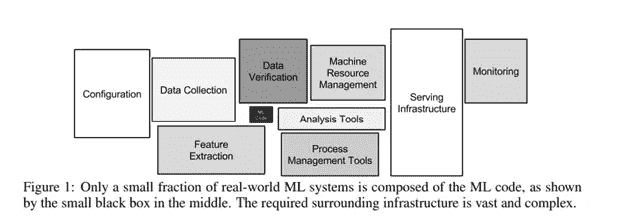**

**夹在中间的小黑盒，周围是大盒子，是**神奇的机器学习代码:)**为了在生产中运行这个神奇的代码，我们需要处理其他几个过程，例如数据收集、验证、特征提取/生成、过程管理、部署、服务基础设施、监控等。**

**除此之外，当 ML 系统处于探索阶段时，一组数据科学家/ML 工程师密切关注不同模型的指标和性能，以获得优化的模型。捕获并与其他团队共享这些度量和分析，或者跟进业务以共享模型，需要一个健壮的模型沿袭系统(存储、版本化、可再现性)。除此之外，一旦证明了模型的价值，那么还需要一些工具，包括计算和部署框架，以支持模型在生产中的执行。如果模型的性能下降，则还需要及时跟踪它，并根据更改的数据集进行相应的重新训练。这整个过程使得 ML 项目的整个生命周期比软件开发生命周期更复杂。**

**传统软件和机器学习开发的区别可以总结如下。**

**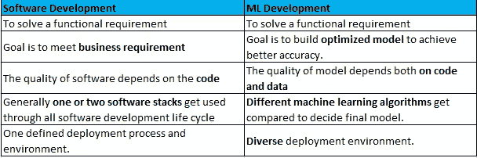**

**记住这些事实，许多企业创建了他们自己的平台来支持分析模型开发的整个生命周期，但是保持一个高效和专注的工程和平台团队也是要付出代价的。这类平台的例子有谷歌的 Tensorflow、脸书的 FBLearner 和优步的米开朗基罗。但是对于这些平台来说，也存在一些挑战**

*   ***有限或小套算法支持。***
*   ***不可共享的代码。***
*   ***与通常不能满足所有需求的企业基础设施紧密结合。***

**因此，为了解决上述所有问题，Databricks 开源了名为 **MLflow** 的库。MLflow 的目标不仅支持复杂的 ML 生命周期，而且还提供用户友好的 API 来缓解常见的挑战，如模型可再现性、可共享的工件和跨语言支持。**

# **MLflow**

**根据 MLflow [**文件**](https://www.mlflow.org/docs/latest/index.html#)**

> **MLflow 是一个管理端到端机器学习生命周期的开源平台。**

**MLflow 的设计理念是模块化和基于 API 的。其功能分为 4 个部分**

1.  ****跟踪****
2.  ****项目****
3.  ****型号****
4.  ****注册表****

**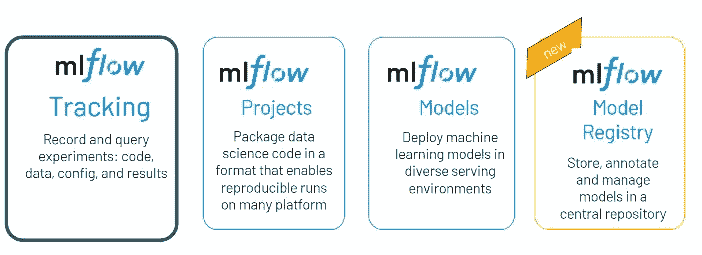**

**资料来源:databricks.com/mlflow**

**让我们详细了解上述各个组件，稍后我们将看到它们的实现。**

# **1.跟踪**

**MLflow 跟踪是 MLflow 的元存储，是获取模型细节的集中场所。它使用 HTTP 协议在客户端应用程序和跟踪服务器之间建立连接。跟踪服务器捕获模型的以下细节，并使用后端存储来记录实体和工件。**

*   **测井参数**
*   **代码版本**
*   **韵律学**
*   **工件(模型和数据文件)**
*   **运行的开始和结束时间**
*   **作为附加信息的标签和注释**

**默认情况下 **MLflow tracking 后端存储**使用本地文件系统并创建 **mlruns 目录**来捕获实体和工件。**

**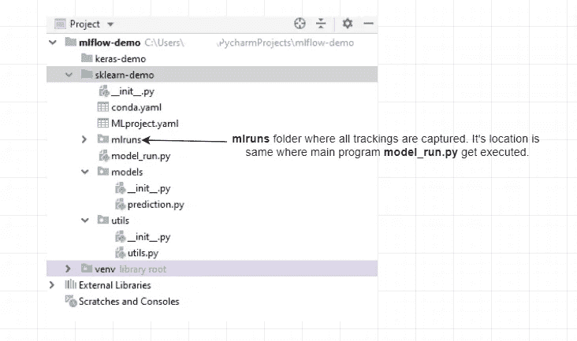**

**mlruns 文件夹的**文件结构****

**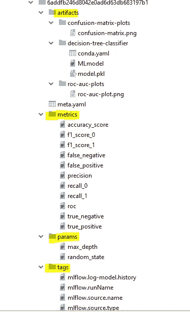**

**对于生产用例，MLflow 提供了不同的存储选项来存储工件和元数据。**

****神器- >** 亚马逊 S3、Azure Blob、谷歌云存储、Databricks DBFS**

****元数据->**SQL store(PostgreSQL、MySQL、SQL Lite、SQL Server 等)，定制实体 metastore 的 MLflow 插件模式等。**

# **2.项目**

**MLflow 项目只不过是一个支持模型可再现性的组织和打包的代码。为了组织项目的文件和文件夹，MLflow 提供了一个名为**ml project**(YAML 文件)的文件，可以根据数据科学项目的要求进行配置。在 MLproject 中，我们还可以为项目执行配置 **docker 容器**和 **Kubernetes** 。**

**它还提供了命令行工具和 API 来执行项目和创建工作流。**

****MLproject** 的一个典型例子是这样的**

```
**name**: sklearn-demo
**conda_env**: conda.yaml
**entry_points**:
  **model_run**:
    **parameters**:
      **max_depth**: int
      **max_leaf_nodes**: {**type**: int, **default**: 32}
      **model_name**: {**type**: string, **default**: **"tree-classification"**}
      **run_origin**: {**type**: string, **default**: **"default"** }
    **command**: **"python model_run.py -r {max_depth} {max_leaf_nodes}   {model_name}"**
```

**在上面的例子中，一个 **conda** 环境被定义为 **conda.yaml** ，它负责为项目设置依赖关系。**

****构建 MLflow 项目的步骤****

**1-创建一个 MLproject 文件[定义项目的入口点]**

**2-为所有 python 依赖项创建一个 conda.yaml 文件。**

**3-创建一个 python 项目，并将 MLproject 和 conda.yaml 文件保存在根目录中(或者保存主执行器的任何其他位置)**

**4-将 python 项目推送到 GitHub**

**测试本地项目和 git hub**

****本地测试→** mlflow 运行。-P <参数>**

****github 测试→** mlflow 运行 git:// <项目-url > < param >**

**MLproject 可以有一个包含不同入口点(生产工作流)的多步骤项目。同样的例子可以在 [**多步示例中找到。**](https://github.com/mlflow/mlflow/blob/master/examples/multistep_workflow/MLproject)**

# **3.模型**

**模型定义了以不同的**【风格】**保存 ML 模型的约定。**

**根据文件**

> **口味是使 MLflow 模型强大的关键概念:它们是部署工具可以用来理解模型的约定，这使得编写与来自任何 ML 库的模型一起工作的工具成为可能，而不必将每个工具与每个库集成**

**换句话说，味道的目的是-**

*   **为不同的系统使用相同的内存格式**
*   **为了避免跨系统通信的开销(序列化和反序列化)**
*   **为了提供常见的可共享功能**

**风味通常有两种类型——**

1.  **内置风格(适用于所有流行的机器学习算法和库)**
2.  **定制口味**

**下面的库作为**内置风格**提供，但是也可以使用 python_function 包装在**自定义风格**下。**

*   **H2O**
*   **克拉斯**
*   **MLeap**
*   **PyTorch**
*   **sci kit-学习**
*   **MLlib**
*   **张量流**
*   **开放式神经网络交换**
*   **MXNET 胶子**
*   **XGBoost**
*   **LightGBM**

****定制风味****

**可以为模型创建自定义风格。**

**[**创建 python 自定义风格的文档。**](https://mlflow.org/docs/latest/models.html#custom-python-models)**

**一旦 mlflow 项目被执行，在**工件文件夹**中 **MLmodel** 文件被创建。下面是 python_function 风格相同的例子。**

```
artifact_path: decision-tree-classifier
flavors:
  python_function:
    data: model.pkl
    env: conda.yaml
    loader_module: mlflow.sklearn
    python_version: 3.6.5
  sklearn:
    pickled_model: model.pkl
    serialization_format: cloudpickle
    sklearn_version: 0.23.1
run_id: 10c75a05fb124eddbf2b13b458e9a26e
utc_time_created: '2020-06-19 11:53:55.328301'
```

# **4.模型注册表**

**ML 模型管理是大型组织中的常见问题。为了解决模型管理方面的挑战，构建了模型注册组件。**

**MLflow 模型注册组件管理机器学习模型的整个生命周期，并提供**

*   ****集中模型存储:**注册模型的存储。**
*   ****模型谱系:**实验和运行细节**
*   ****模型版本化:**跟踪注册模型的版本。**
*   ****模型阶段:**为每个模型版本分配预设或自定义的阶段，如“试运行”和“生产”来表示模型的生命周期。在将模型部署到生产应用程序之前，最佳实践通常是在临时环境中对其进行测试。这个 [**环节**](https://mlflow.org/docs/latest/registry.html#transitioning-an-mlflow-models-stage) 有助于理解**模型阶段转换的工作流程。****
*   ****对注册模型的 CRUD 操作:**对模型的创建、更新、删除、存档、列表等操作。**

# **从头开始构建 MLflow 项目**

**完整的代码可以在我的 [**github**](https://github.com/saurabh2mishra/mlflow-demo) **上找到。**在 GitHub 中，我添加了一个mlflow-demo 项目，演示一个 scikit-learn 和 Keras 模型。然而，在本演练中，我将演示 scikit-learn 项目及其执行。**

**演示项目 **sklearn-demo** 的结构如下。项目的结构可以根据用例需求重新安排和配置。这只是一个例子。**

**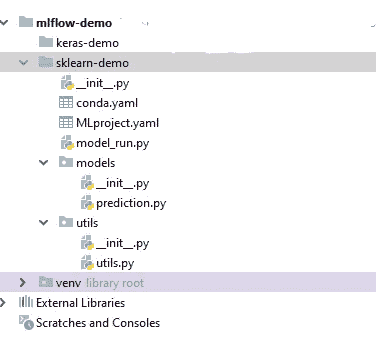**

****先决条件-** 要复制下面的示例，先决条件是必不可少的。但是，如果设置了 conda 环境并且提到了依赖项，那么它会自动创建一个环境来执行 mlflow 项目。**

*   **所需的 python 版本应为 3.5 以上**
*   **安装 mlflow，numpy，pandas，scikit-learn，scikit-plot，matplotlib，seaborn。**

****步骤 1-****

**为项目设置创建**conda . YAML**&**ml project . YAML**文件。这两个文件是 **mlflow 的项目**组件的一个重要方面，由工作流执行组成，如入口点、要执行的命令、依赖项等。**

****conda.yaml****

```
**name**: sklearn-demo
**channels**:
  - defaults
**dependencies**:
  - python=3.7.6
  - **pip**:
    - mlflow==1.8.0
    - numpy=1.18.5
    - pandas=1.0.4
    - scikit-learn==0.23.1
    - scikit-plot==0.3.7
    - matplotlib==3.2.1
    - seaborn==0.10.1
```

**conda.yaml 文件非常容易理解。 **name** 是项目名称，dependencies 是 python 的版本，而 **pip** 列出了执行项目所需的所有库。**

****MLproject.yaml****

```
**name**: sklearn-demo
**conda_env**: conda.yaml**entry_points**:
  **model_run**:
    **parameters**:
      **max_depth**: int
      **max_leaf_nodes**: {**type**: int, **default**: 32}
      **model_name**: {**type**: string, **default**: **"tree-classification"** }
      **run_origin**: {**type**: string, **default**: **"default"** }
    **command**: **"python model_run.py -r {max_depth} {max_leaf_nodes} {model_name}"**
```

**MLproject 也很容易理解。**

*   ****名称:**任何项目名称**
*   ****conda_env:** 这是公寓 YAML 文件的名称(它应该与上面定义的 conda 文件名相同)**
*   ****entry_points:** 文件中的一个重要键。它是代码的执行点。在 parameters 部分，我们可以定义所有的命令行参数，我们需要传递这些参数来执行主脚本。我们可以设置默认值，也可以依靠用户来设置。根据项目设置， **model_run** 的名称可以是任何名称，默认名称是 **main。****

**因此，我们的项目将继续进行。**

****第二步-****

**在模型模块中创建一个 python 文件(prediction.py )(可以在任何地方创建；只是为了使它模块化，我一直把它放在模型里面)。**

**代码相当简单，让我们一步一步地理解它**

*   **创建一个类 **TreeModel** ，它是 DecisionTreeClassifier 模型的包装器类。该类有一个名为 **create_instance** 的类方法，它接受参数来创建 DecisionTreeClassifier 的实例。**
*   **TreeModel 还有 3 个属性，名为 **data、Model、**和 **params** ，为分类器提供数据集、模型和加载参数。**
*   **所以，TreeModel 类中的重要方法是 **mlflow_run。**这个方法为我们捕获**工件、度量、**和**图做了很多事情。**使用 **python 上下文**对于一次性获取所有需要的指标也很重要。**

**理解这些方法很重要，并且可以用于所有类型的模型。**

> *****mlflow.log_param(key，value):*** 捕捉当前运行下的一个参数。如果没有运行处于活动状态，此方法将创建一个新的活动运行。**
> 
> *****ml flow . Log _ params(params):***记录当前运行的一批 params(param _ name 的字典)。如果没有运行处于活动状态，此方法将创建一个新的活动运行。**
> 
> *****mlflow.log_metric(key，value，step=None):*** 记录给定运行的模型度量。如果没有运行处于活动状态，此方法将创建一个新的活动运行。**
> 
> *****【ml flow . Log _ metrics(metrics，step=None):*** 记录当前运行的多个度量**
> 
> *****ml flow . Log _ artifact(local _ path，artifacts_path=None):*** 将本地文件或目录记录为当前活动运行的工件。如果没有运行处于活动状态，此方法将创建一个新的活动运行。**
> 
> *****ml flow . Log _ artifacts(local _ path，artifacts_path=None):*** 将本地文件或目录记录为当前活动运行的工件。如果没有运行处于活动状态，此方法将创建一个新的活动运行。**

**另一个 **utils** 模块有一些通用功能(绘制混淆矩阵和 roc)用于整个项目。用下面的内容创建一个 utils.py 文件。**

****第三步-****

**在这一步中，我们将创建我们的主执行器(model_run.py ),它将作为 mlflow 条目的驱动程序。**

**model_run 接受 max_depth 超参数并执行 TreeModel。**

**就是这样。一切都准备好了，我们可以走了！！！**

**现在，要查看 mlflow 记录的详细信息，我们可以直接执行我们的程序，如***python model _ run . py***或 ***mlflow run。-P max_depth=5*** 从命令行提示。**

**让我们看看 mlflow 是如何捕获所有工件和元数据的。有许多方法可以检查记录的详细信息。本地 mlflow 捕获 mlruns 文件夹中的所有工件、沿袭和度量(在解释理论时，我已经在教程的开头演示并附上了截图)。但是 mlflow 还附带了方便的 UI 命令，丰富了用户体验。**

**转到命令提示符，导航到 **mlruns 文件夹**并键入**

```
**mlflow ui**
```

**一个本地浏览器[http://kubernetes . docker . internal:5000](http://kubernetes.docker.internal:5000)将会提示，通过点击它，我们可以探索关于 ML 运行的所有有用的细节。**

**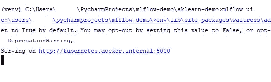**

**本地 MLflow 的主页。在这里，每个**运行**(生成文件夹和文件的代码的单独执行)和**实验**(运行组的名称)被注册。**

**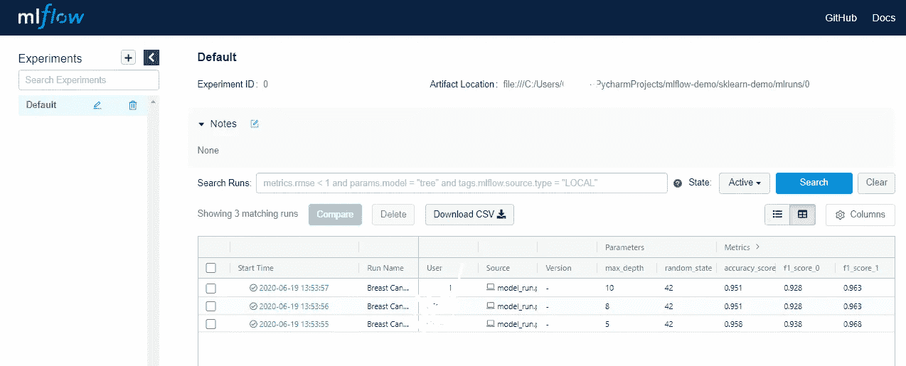**

**让我们检查第一次运行。单击第一次运行，将出现以下页面。**

**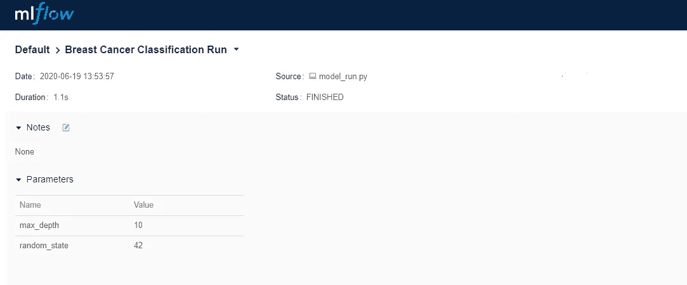****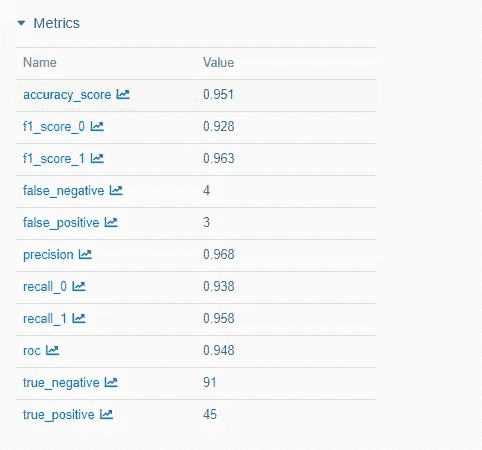**

**如果我们向下滚动一点，我们可以看到我们的文物**

**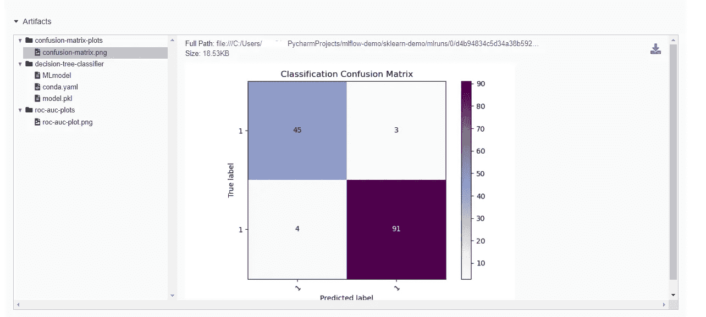**

**同样，让我们检查一下这个实验的 ROC 曲线**

**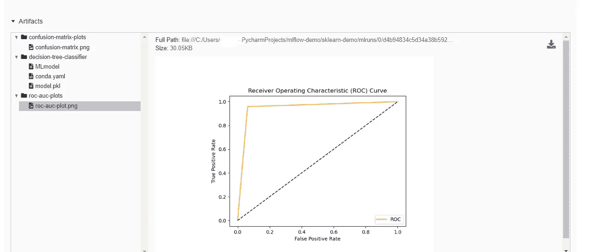**

**也可以并排看到不同实验的对比。这个特性对于追踪结果和特性对模型性能的影响非常有帮助。**

**进入主页，点击**比较**，选择不同的型号运行。**

**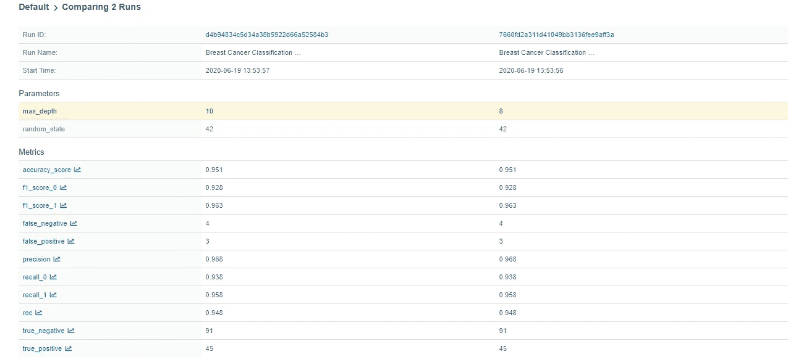**

**因此，我们可以看到 MLflow 提供了许多很酷的功能，只需几行代码，我们就可以实现所有复杂的事情，而这些事情在 MLflow 出现之前是困难和繁琐的。**

# **MLflow API 的一些亮点**

**MLflow API 设计良好，并定期添加新功能。检查 API 是否与新特性和变化同步是值得的。但是，我想强调 MLflow 的几个有趣的特性**

*   **在我写这篇博客的时候，MLflow API **不仅是关于 Python** 的，它还支持 **Java、**和 **R** 编程语言。很快 **Scala** 也将成为 API 的一部分。REST API 也是可用的，它有助于实验、运行、日志参数、度量和工件的创建、列表和获取操作。**
*   **自动记录值得用于深度学习模型。正如我们所知，深度学习模型在模型的训练期间捕获几个参数/超参数，并且每个值并不总是能够通过使用 mlflow.log_metric 来记录。进行手动捕获可能会导致错过一些重要的指标。因此，简单来说，MLflow 带有自动日志记录。它使用起来非常简单，只要启用它就能确保捕获和记录每一个可能的指标。自动记录功能可用于 Keras、Tensorflow、Gluon、LighGBM、XGBoost 和 Spark **。**访问 [**文档**](https://mlflow.org/docs/latest/tracking.html#tensorflow-and-keras-experimental) 和 [**我的 github**](https://github.com/saurabh2mishra/mlflow-demo/blob/master/keras-demo/models/prediction.py) 查看它的用法。**
*   **本地文件系统上的模型跟踪有利于实验的目的。为了跟踪生产中的模型，**最好将所有元数据、数据、工件保存在云存储或 SQL 数据库中**，并使用**单独的专用服务器**来更好地跟踪和维护。**

**还有更多可用的特性可以在文档中研究，并根据不同的用例使用。**

# **结论**

**总的来说，我们已经看到了 MLflow 的强大功能，也了解到无论使用哪种框架、哪种编程语言来开发模型，MLflow 都能够提供一个健壮的机制，只需几行代码就可以跟踪模型的开发、调整、打包和可再现性。这是机器学习武器库中的必备工具。**

# **参考**

**[https://papers . nips . cc/paper/5656-hidden-technical-debt-in-machine-learning-systems . pdf](https://papers.nips.cc/paper/5656-hidden-technical-debt-in-machine-learning-systems.pdf)**

**强烈推荐这 3 个系列的 MLflow 研讨会**

**[https://www.youtube.com/playlist?list = PLTPXxbhUt-yw jdg 318 nmsxrqtgzfwq 2 ZC](https://www.youtube.com/playlist?list=PLTPXxbhUt-YWjDg318nmSxRqTgZFWQ2ZC)**

**[www.mlflow.org](https://www.mlflow.org/docs/latest/index.html)**

**[https://databricks.com/product/managed-mlflow](https://databricks.com/product/managed-mlflow)**