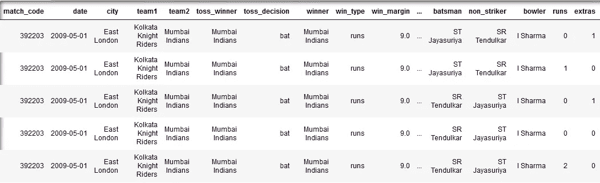
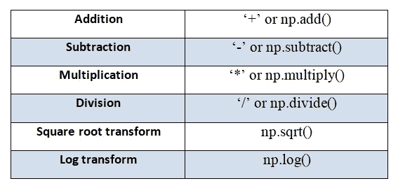

# 使用 Numpy 操作数据

> 原文：<https://medium.com/analytics-vidhya/manipulating-data-with-numpy-1bb9baaccfbf?source=collection_archive---------14----------------------->


收集和存储大量信息以供最终分析的行为由来已久。然而，今天的数据来自各种来源和格式，这使得清理、操作和链接变得很困难。数据可以是一些文本文档、数值的集合、图像、音频剪辑的集合或者其他东西。不管数据的类型如何，将它转换成数字数组肯定会帮助我们分析它。

如果你想一想，图像基本上是表示像素网格上特定位置的红色、绿色和蓝色变化的数字。音频剪辑可以是强度对时间的一维数组，文本可以转换成二进制格式。因此，数值数组的存储和争论是一个重要的方面。

NumPy 或 Numerical Python 是一个仅适用于 Python 的模块，用于处理数值数组。它支持大型多维数组和矩阵，以及对这些数组进行运算的大量数学函数。NumPy 数组看起来类似于 Python 列表。然而，与列表相比，它们提供了更有效的存储、速度和操作。下面列出了一些值得注意的差异:

*   **可以存储在列表和数组中的数据类型:**

Python 列表可以存储不同类型的数据，因为它是动态类型的。它可以填充任何类型的数据。而 NumPy 数组被创建为同构数组。

*   **与列表相比，数组的数据存储效率:**

Python 是一种动态类型语言，与其他静态类型语言相比，存储整数时会有开销。存储在静态类型语言(如 C)中的整数基本上是内存中某个位置的标签，其字节编码一个整数值。另一方面，Python 整数是指向内存中某个位置的指针，该位置包含所有 Python 对象信息，包括包含整数值的字节。因此，在植入级别，数组包含指向数据块的指针。而且，由于列表的异构性，它包含一个指向指针块的指针，而指针块又指向 python 对象块。与列表相比，数组占用的内存要少得多。

*   **数组和列表的数学运算:**

对数组中存在的每个元素执行数组上的数学运算。但是，这对列表不起作用。在 python 列表上执行数学运算时，你肯定会得到一个错误。数组使得对大量数字数据的操作非常快，通常比列表更有效。

Numpy 数组是一个统一值的数组，单精度数字每个占用 4 个字节，双精度数字占用 8 个字节。因此，数组使得对大量数字数据的操作非常快，并且通常比列表有效得多，列表要求每个指针至少 4 个字节加上 16 个字节，即使是最小的 Python 对象也是如此；4 用于类型指针，4 用于引用计数，4 用于值，内存分配器四舍五入到 16。

## ***1 —创建 Numpy 数组:***

例如，我将使用 NumPy 分析印度超级联赛(IPL)的数据集。印度超级联赛(IPL)是印度的职业 T20 板球联赛，每年 4 月至 5 月由代表印度城市的球队进行比赛。这是世界上参加人数最多的板球联赛，在所有体育联赛中排名第六。它有来自世界各地的球员组成的球队，非常具有竞争性和娱乐性，球队之间有很多势均力敌的比赛。

数据下载自[https://CRIC sheet . org/% C2 % A0(数据](https://cricsheet.org/%c2%a0(data)))。分析的目的是找出哪些因素影响了一个团队的胜利，以及这种影响有多大。同时，它将帮助您解决 NumPy 问题。

这里是`ipl_matches_small.csv`文件的前几行和前几列的快照，我将在整个演示中使用它:



ipl_matches_small.csv 快照

我们将从导入别名为 np 的包 numpy 开始。

```
import numpy as np
```

创建数组最简单的方法是使用`np.array`将 python 列表转换成数组。如果我们想显式设置数组的数据类型，我们可以使用`dtype` 关键字。下面指定一维和二维数组以供参考。

```
array_1 = np.array([1,2,3,4,5], dtype='float')  #Creates a 1-D arrayarray_2 = np.array([[1,2,3,4,5],[6,7,8,9,10]])  #Creates a 2-D array
```

如上所述，与 Python 列表不同，NumPy 仅限于包含相同类型的数组。当类型不匹配时，如果可能，NumPy 将向上转换。(这里，整数将向上转换为字符串)

```
In[1]: np.array([2, 5, 'two', 'five'])Out[1]: array([ '2', '5', 'two', 'five'])
```

既然已经了解了创建数组的基本知识，我们将尝试加载数据集来对其进行分析。我使用了 *genfromtxt* 函数，该函数将文件的每一行从字符串格式转换为适当的数据类型。 *genfromtxt* 比 *loadtxt* 等函数更快更简单的好处是，它能够将丢失的数据考虑在内。

*genfromtxt* 的默认数据类型为 *float* 并将所有非数值转换为 *nan* 。因此，数据类型被指定为*字符串。*关键字`delimeter`指定了列之间应该如何分隔。这里，逗号**(，)**被用来分割列。

## 2 —阵列描述:

每个数组都有形状、大小和维数等特征。借助以下特性，您可以获得 Numpy 数组及其元素的必要信息。

> 形状:

它返回一个由数组维度组成的元组，即告诉我们每个维度中有多少项，可以使用`ndarray`对象的`.shape`属性找到。

> 尺寸:

给出数组的维数。

> 尺寸:

它指定数组中的总项数。更准确地说，它是数组的`.shape`属性的元素的乘积。

> 数据类型:

它告知数组中数据的类型。因为 Numpy 数组由同类数据组成

> 项目大小:

Itemsize 表示数组中每个元素的字节数。

```
Shape of the data set is:  (1451, 23)
The dimension of the dataset is:  2
Size of the data set is:  33373
Data type of the dataset is:  <U21
The number of bytes in each element of the array is:  84
```

如图所示，数据集包含 1452 个数据点和 23 个要素，总大小为 33373。它有一个包含 21 个字符字符串的结构化数据类型。

## 3 —从数组中访问元素:

Numpy 中的索引非常类似于 Python 的列表标准索引。在一维数组中，可以通过在方括号中声明索引来访问第 n 个元素，就像列表中所做的那样。此外，可以使用负索引从数组末尾开始索引。

在多维数组中，可以指定一个逗号分隔的索引元组来访问所需的元素。

下面，我尝试访问了关于第一场 IPL 比赛中第一个球的信息，以及参加该比赛的球队。

```
1st match, 1st over, 1st ball:
 ['392203' '2009-05-01' 'East London' 'Kolkata Knight Riders'
 'Mumbai Indians' 'Mumbai Indians' 'bat' 'Mumbai Indians' 'runs' '9.0' '1'
 '0.1' 'Mumbai Indians' 'ST Jayasuriya' 'SR Tendulkar' 'I Sharma' '0' '1'
 '1' 'wides' '' '' '']
========================================
Team 1 Kolkata Knight Riders
Team 2 Mumbai Indians
```

## 4 —访问子阵列:

Numpy 数组的切片也类似于 Python 列表的切片。通过在方括号中指定索引并使用由冒号(:)标记的*切片*符号来访问子数组。它遵循`array[start:stop:step]`的相同模式。如果这些值中的任何一个没有被提及，那么它们将采用`start=0, stop=size of the array, step=1`的默认值

多维子数组是由逗号分隔的多个切片。

为了理解切片的概念，让我们试着找出数据集中所有参加比赛的独特球队。

英超联赛所有赛季涉及的不同球队将从数据集中的两列获得，即 *team1* 和 *team2。*这可以使用如下所示的数组切片轻松实现。如果您观察 *team1* 和 *team2* 的数据集，您会注意到团队名称重复出现，因为数据包含每次投球和每次跑垒的信息。光是切片就能给我们提供参赛队伍的名字和代表。为了避免这种情况，我使用了 NumPy 函数 *unique* 来访问唯一的团队。

```
['Chennai Super Kings' 'Deccan Chargers' 'Kings XI Punjab'
 'Kolkata Knight Riders' 'Mumbai Indians' 'Pune Warriors'
 'Rajasthan Royals']
```

> 布尔索引:

Numpy 数组可以使用标准的 Python*x【obj】*语法进行索引，其中 *x* 是数组， *obj* 是语法。

我们将尝试找出该队在所有赛季中赢得比赛的总次数。

```
Number of matches where Mumbai Indians has won the toss:  2
```

## 5 —阵列的整形:

了解如何重塑 NumPy 数组以使您的数据满足特定 Python 库的期望是很重要的。例如，一些库，如 scikit-learn，可能需要将输出变量(y)的一维数组整形为一个二维数组，其中一列和每行的结果。

只要多重因子产生相同数量的元素，数组的维数就可以在执行过程中改变。

我们可以尝试对可用数据集中的前四行和前四列进行整形，使其显示由两列和多行组成的组。

```
print("Subarray: \n", data_ipl[:4,:4])
print("Reshaped subarray: \n", data_ipl[:4,:4].reshape(8,2))Subarray: 
 [['392203' '2009-05-01' 'East London' 'Kolkata Knight Riders']
 ['392203' '2009-05-01' 'East London' 'Kolkata Knight Riders']
 ['392203' '2009-05-01' 'East London' 'Kolkata Knight Riders']
 ['392203' '2009-05-01' 'East London' 'Kolkata Knight Riders']]
Reshaped subarray: 
 [['392203' '2009-05-01']
 ['East London' 'Kolkata Knight Riders']
 ['392203' '2009-05-01']
 ['East London' 'Kolkata Knight Riders']
 ['392203' '2009-05-01']
 ['East London' 'Kolkata Knight Riders']
 ['392203' '2009-05-01']
 ['East London' 'Kolkata Knight Riders']]
```

## 6 —矢量化:

矢量化是 NumPy 的一种能力，通过它我们可以对整个数组而不是单个元素执行操作。在 Python 中，对任何对象进行循环都会有很大的开销。NumPy 中的矢量化运算将内部循环委托给高度优化的 C 和 Fortran 函数，从而使 Python 代码更简洁、更快速。

```
# Finding the datapoints where the kind of wicket is 'caught'data_ipl[data_ipl[:,21]=='caught']array([['392203', '2009-05-01', 'East London', ..., 'ST Jayasuriya',
        'caught', 'MN van Wyk'],
       ['392203', '2009-05-01', 'East London', ..., 'Harbhajan Singh',
        'caught', 'AB Dinda'],
       ['392203', '2009-05-01', 'East London', ..., 'SR Tendulkar',
        'caught', 'BB McCullum'],
       ...,
       ['335987', '2008-04-21', 'Jaipur', ..., 'B Lee', 'caught',
        'Kamran Akmal'],
       ['335987', '2008-04-21', 'Jaipur', ..., 'M Kaif', 'caught',
        'KC Sangakkara'],
       ['335987', '2008-04-21', 'Jaipur', ..., 'Kamran Akmal', 'caught',
        'PP Chawla']], dtype='<U21')
```

显然，上面的指令返回整个数组，而不仅仅是一个元素，因为它比较了每个 wicket 类型为“catched”的数据点。

我们还可以对整个数组执行不同的矢量化算术运算。下面提到了其中的一些。



矢量化算术运算

## 7 —广播:

如果你操作的数组大小不一样，就不可能进行元素操作。在这种情况下，NumPy 执行广播来尝试匹配元素。本质上，广播包括几个步骤:

*   如果数组没有相同的秩，则在较低秩数组的形状前面加上 1，直到两个形状具有相同的长度。
*   如果两个数组在一个维度上具有相同的大小，或者其中一个数组在该维度上的大小为 1，则称这两个数组在该维度上兼容。
*   如果这些阵列在所有维度上都兼容，则它们可以一起广播。
*   广播后，每个数组的行为就好像它的形状等于两个输入数组的形状的元素最大值。
*   在任何维度中，如果一个数组的大小为 1，而另一个数组的大小大于 1，则第一个数组的行为就好像是沿着该维度复制的一样。

```
arr_1 = np.arange(5)
arr_1 + 5array([5, 6, 7, 8, 9])
```

我们可以把它看作是将值`5`复制到数组`[5, 5, 5, 5, 5]`中，并将结果相加的操作。NumPy 广播的优势在于，这种价值的复制实际上不会发生，但当我们思考广播时，这是一个有用的心理模型。

为了更好地理解矢量化和广播，让我们试着对数据集进行一点管理。我们将尝试创建一个过滤器，只过滤那些击球手得了 6 分的记录。此外，我们将尝试找出谁的总得分最高。

```
Batsman and number of sixes scored by them: 
 [['AC Gilchrist' '1']
 ['BJ Hodge' '3']
 ['CH Gayle' '1']
 ['DR Smith' '4']
 ['DS Kulkarni' '2']
 ['Harbhajan Singh' '2']
 ['IK Pathan' '1']
 ['JD Ryder' '1']
 ['JP Duminy' '4']
 ['K Goel' '2']
 ['KC Sangakkara' '1']
 ['Kamran Akmal' '1']
 ['M Manhas' '1']
 ['M Vijay' '1']
 ['MEK Hussey' '1']
 ['MS Dhoni' '1']
 ['PR Shah' '2']
 ['R Bhatia' '1']
 ['RA Jadeja' '1']
 ['RG Sharma' '1']
 ['RR Raje' '1']
 ['S Badrinath' '1']
 ['SC Ganguly' '1']
 ['SR Tendulkar' '6']
 ['SR Watson' '6']
 ['ST Jayasuriya' '4']
 ['SV Samson' '2']
 ['TL Suman' '2']
 ['Y Venugopal Rao' '1']
 ['Yuvraj Singh' '3']]
Batsman who scored maximum runs: SR Tendulkar
```

这里，指令`np.where(data_ipl[:,16]=='6')`返回**所有**击球手已经得了 6 分的数据点。函数 *column_stack* 用于显示数据，基本上将两个 1D 数组的列堆叠在一起，形成一个 2D 数组。将每个击球手与得分的 6 分联系起来会更容易些。另外， *argmax* 的聚合函数返回`arr_01`中所有计数中最大值的位置。

在本演练中，只描述了最少的一组功能。我真诚地希望它对 NumPy 及其效率有足够的了解。如果您已经很好地掌握了 NumPy，并且想更深入地研究它，下面是一些可能有用的资源。

[](http://cs231n.github.io/python-numpy-tutorial/#numpy) [## Python Numpy 教程

### 斯坦福 CS231n 课程材料和笔记:视觉识别的卷积神经网络。

cs231n.github.io](http://cs231n.github.io/python-numpy-tutorial/#numpy)  [## Python 数据科学手册

### 该网站包含 Jake VanderPlas 的 Python 数据科学手册的全文；该内容可在…上获得

python NumPy 数组的搭便车指南](https://jakevdp.github.io/PythonDataScienceHandbook/) 

参考资料:

*   Python 数据科学手册——Jake Vander plas。
*   python NumPy 数组的搭便车指南— Deepak K [Daksh] Gupta。
*   SciPy。org—[https://docs.scipy.org/doc/](https://docs.scipy.org/doc/)
*   使用 Numpy 进行数组编程—[https://realpython.com/numpy-array-programming/](https://realpython.com/numpy-array-programming/)