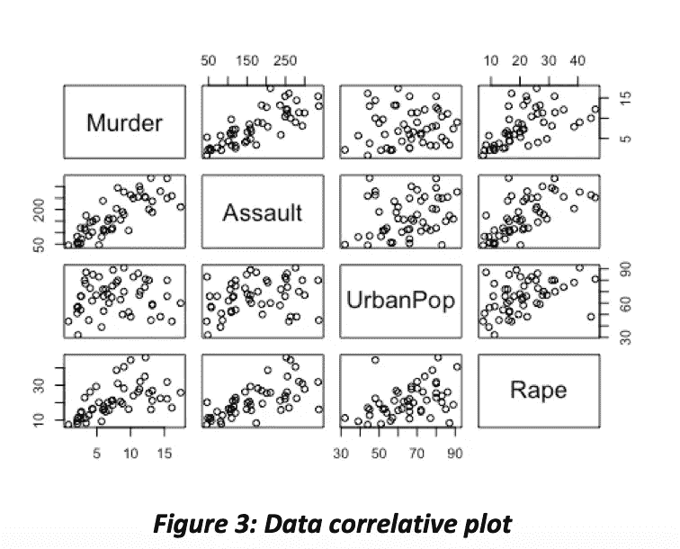

# 应用主成分分析法改进制造过程

> 原文：<https://medium.com/analytics-vidhya/manufacturing-process-improvement-by-application-of-principal-component-analysis-pca-c5dd094d0679?source=collection_archive---------4----------------------->

制造过程中最重要的活动是生产调度和质量控制，如图 1 所示。他们将涉及复杂性和不确定的行动。调度工作的复杂性是由于制造过程中存在大量的变量和不可控因素。即使在生产计划中准备好了好的调度措施或有效的方法，它们也可能是不够的，因为在实际情况中每天都有不可控的参数。管理团队需要找到减轻或解决这个问题的方法。决策支持工具可以被提供为智能生产工具，以在生产计划中提供真正简单和快速的决策，并有效地控制制造过程。

在这里，我试图提出一个智能的决策支持工具来做好生产计划的工作，基于统计多变量参数方法作为主成分分析(PCA)。该方法已应用于实际生产过程中，与常规方法相比，生产计划的准确性有了很大的提高。

**主成分分析**

主成分分析是一种统计方法，用于总结观察或一组数据。主成分分析是一种无监督的学习方法，因此它简单，对技术要求不高。通常，PCA 用于可视化和分析数据。首先，我们必须减去每个特征，然后确定特征的协方差。接下来，我们计算特征协方差的特征值分解。最后，PCA 将数据转换成新的数据集作为“主成分(PCs)”，因此每个 PC 是正交的。主成分分析的结果由距中心平均值的距离来衡量，然后根据分数来考虑。

为了研究 PCA 代码，USArrests 是一个 50 行 50 个州和 4 列谋杀、攻击、城市警察和强奸的数据集，用于分析美国的危险犯罪。如图 2 和图 3 所示，每一列都有不同的范围，因此很难分析数据。

R 程序中许多包可用于 PCA，例如 PCA()、prcomp()和 princomp()。在这个分析中，我使用 prcomp()构建 PCA 模型，PCA 模型总结为图 4。

对数据应用 PCA 后，数据的范围将与图 5 所示的范围相同。然后，我可以在将来使用这些数据来操作其他模型。

**使用 PCA 的例子**

PCA 采用环境生命周期评估方法来减少温室气体排放，PCA 被用作关注可持续性绩效的有效得分(Park 等人，2015 年)。

在蛋白质色谱技术中，五氯苯甲醚被用于改进工艺、预测操作和产品质量(Hou 等人，2010 年)。将树脂、色谱过程和纯化周期的数据收集在一个表格中，并在 PCA 工具中进行分析。数据分析师应用于模型中的所有 PC，并选择两个具有最高 R2 的 PC，以确定最佳子集回归方法。然后，回归模型结果提供了合适的方程，公司可以使用该方程进行未来预测。

**认证后活动的好处**

主成分分析适用于分析多维或多种数据特征。PCA 用于减少不相关的特征。此外，主成分分析是一种适应性强的多功能工具，可以与其他方法配合使用。

**申请制造**如图 6 所示。

**减少库存**:通常情况下，库存是制造的一个重要部分，因为在生产过程中，制造商必须为原材料、零部件和成品准备一些空间或房间。不幸的是，这会使产品成本增加。财务报表中显示的存货费用对公司的净利润也有负面影响。因此，在库存部门应用 PCA 将有助于降低公司的费用。

生产调度:实现高效率和成功运作的重要因素之一是计划或调度。大多数情况下，数据分析师使用主成分分析来填充整个过程的重要特征，然后使用拟合模型，如线性模型、逻辑模型、神经网络模型等。为产品线测试和创建最佳计划模型。

质量控制:产品的错误或缺陷是一件糟糕的事情。许多过程都与产品有关，因此每个状态的数据都应该被监视和收集。为了提高产品质量，必须解决产生误差的工位。制造商可以应用 PCA 对需要关注的严重状态或过程进行排序。然后，结果将分别显示数据组。一些数据超出了一定的置信度，这意味着它们失控或出错。在状态分析之后，制造商可以很好地计划改进或修复一些错误。

**总结**

为了改进制造过程，制造商可以使用主成分分析来制定生产计划，产品质量控制，以及制造更好的生产线。最后，公司将获得更多的利益或利润，降低生产成本。

**参考**

纽约州帕克市、佐治亚州埃吉尔梅兹市、马萨诸塞州库丘克瓦尔市，2015 年。一个新的基于生命周期的生态效率分析主成分分析框架:以美国制造业和运输业为例。清洁生产杂志 92，327–342。

侯，江，2010。使用预测性主成分分析工具改进蛋白质 A 色谱的过程分析技术。生物技术和生物工程，第 108 卷，第 1 卷，第 59-68 页。