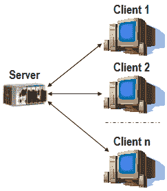
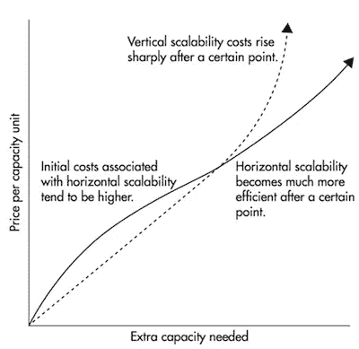
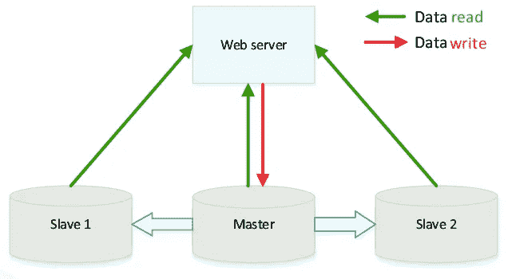

# 分布式系统——多面神

> 原文：<https://medium.com/analytics-vidhya/many-face-god-distributed-system-f05737ec978d?source=collection_archive---------1----------------------->

## 分布式系统领域简介

随着不断增长的技术扩张，分布式系统得到了更广泛的应用，并受到所有大型技术公司的崇拜。如今，我们交互的大多数应用程序实际上都是由像一个系统一样运作的计算元素系统提供服务的。在讨论分布式系统时，人们会想到各种各样的问题，比如什么是分布式系统，为什么要使用它们等等。
为了理解分布式系统，我们首先需要知道在此之前是什么，以及为什么需要这样的系统。

**分布式系统之前的时代——独狼**

多个客户端访问一台服务器

在分布式系统出现之前，曾经有一个单独的系统*不*与其他系统通信并且独立运行。这意味着当您从服务器请求一个资源时，它总是会到达一个特定的节点/系统来为该请求提供服务。

很容易理解，这样的系统将无法生存，因为当许多请求开始到达服务器时，其 CPU 使用率将会增加，系统将会崩溃。有一句名言— **当大雪纷飞，寒风凛冽的时候，孤狼死亡，但狼群存活。**

因此，人们开始意识到，单个系统无法满足所有到达服务器的请求，他们需要能够扩展以满足服务器负载的系统。

但是，一个真正的问题可能会出现在人们的脑海中，如果您的 CPU 负载正在增加或 RAM 变得太低，为什么不努力增加我们机器的容量(通常称为垂直扩展)并承担管理分布式系统的负载(这非常棘手，并且有其自身的问题)？

**为什么更喜欢水平扩展(分布式方式)而不是垂直扩展(升级系统)**

的确，管理分布式系统是一个充满陷阱和地雷的复杂话题。部署、维护、同步和调试分布式系统是一件令人头疼的事情，那么为什么还要去那里呢？

**垂直扩展**虽然不错，但在特定点之后，您会发现即使最好的硬件也不足以满足足够的流量，更不用说不切实际的托管了。

**水平扩展**简单来说就是增加更多的计算机，而不是升级单台计算机的硬件，因此**理论上它有无限的扩展潜力。**

**成本是系统无法在某个阈值后垂直扩展的一个重要因素。**

在某个点之后，垂直扩展变得非常昂贵

**容错-** 分布式系统更可取的一个好理由。由 10 个节点组成的集群总是比任何配置的单台机器容错能力更强。

**低延迟-** 通过像 [CDN](https://www.cloudflare.com/learning/cdn/what-is-a-cdn/) 这样的系统，内容从离你最近的节点获取，从而减少了从服务器获取资源的时间。

**分布式系统如何工作**

在当今世界，几乎所有的大公司都在通过分布式系统运行他们的服务。如果你曾经在线玩过多人游戏，预定过出租车，在脸书上发过帖子，流过网飞秀，或者在亚马逊上买过书——你都是依靠分布式系统来完成的。

一个 ***分布式系统*** 只不过是多个节点以某种方式相互对话，同时也执行它们的操作。节点可以是从成熟的系统到小型传感器设备的任何东西，只要它是自主的并且有办法与其他节点通信。

然而，要使分布式系统工作，你需要运行在这些节点上的软件被特别设计成同时运行在多台计算机上，并处理随之而来的问题。事实证明这并非易事。我们将在其他即将发布的帖子中详细讨论这些软件。

让我们通过一个例子来理解分布式系统的工作原理。假设一个网站使用一个数据库系统，该系统当前包含一个节点，其处理请求的能力为 x。现在，您网站的负载加倍，这反过来增加了数据库负载，我们当前的单个系统无法处理它。我们的应用程序会立即开始性能下降，这将会被我们的用户注意到。

现在让我们通过分布式系统来解决这个问题。最初，看起来很直观，我们需要做的只是在集群中添加一个节点，boom 请求由两个服务器处理，问题就解决了。但是看起来很简单，这很棘手，需要处理各种情况。

在典型的 web 应用程序中，读取信息通常比插入或修改旧信息要频繁得多。

分布式系统中有一种方法可以提高读取性能，这就是所谓的**主从**策略。在这里，您创建了两个新的数据库服务器，它们与主服务器同步。这些新的从设备将**只从这些新的实例中读取**。

只在主机上写入，从所有主机上读取

因此，现在每当插入新信息时，请求将总是被重定向到主数据库，主数据库将与所有从数据库异步同步以更新数据。

恭喜，现在我们可以执行 3 倍的读取查询了！这不是很好吗？

**但是等等，这里是你进入分布式系统陷阱的地方**

我们立即失去了关系数据库的**酸**保证中的 ***C*** ，**代表一致性**。

当我们在主数据库中插入一条记录时，有可能在从数据库同步期间，有人请求从该从数据库中读取数据，并被告知过时的数据。这是您在提高绩效的同时进行的权衡。您可以通过延迟您的写操作来解决这个问题，让用户等到数据库同步后再处理任何请求，但是如上所述，这会影响性能。在分布式系统中，进行这样的权衡是很常见的。关于分布式系统中的权衡，有一个著名的定理叫做 **CAP 定理**。我会在随后的文章中详细介绍。

现在我们已经为读操作扩展了我们的系统，但是如果我们想为写操作扩展它，我们可以通过使用多个 masters 来实现，但是这肯定会产生很多问题，比如产生冲突(例如插入两个具有相同 ID 的记录)。

您可能已经注意到，尽管在后台似乎有多个系统处理客户端请求，但是对于一个客户端来说，它似乎总是由一个系统来处理，这就是分布式系统的魅力所在。

这只是分布式系统的一个应用，在现实世界中还有很多其他的应用分布式系统的方式，比如 HDFS、队列系统、Map Reduce 等等。你应该阅读这些来更清楚地了解它们是如何工作的。

到目前为止，您应该对一个简单的分布式系统是什么样子，以及为什么要继续使用它有了一个非常清晰的概念。

我知道这篇文章很短，但是有很多关于分布式系统的内容要在一篇文章中介绍，因此我将在后续文章中进一步介绍。不要忘记关注以获取更多文章的更新。

瓦拉·摩根利斯！！

感谢您阅读本文，并请提供您的反馈和意见。