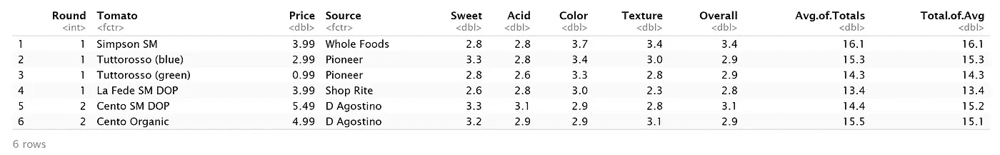
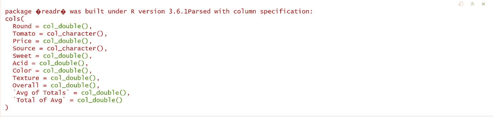
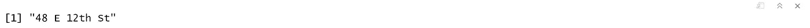

# 将数据读入 R-1 的多种方式

> 原文：<https://medium.com/analytics-vidhya/many-ways-of-reading-data-into-r-1-52b02825cb27?source=collection_archive---------3----------------------->

> T 本系列面向希望使用 r 快速了解数据科学的数据科学初学者，涵盖了构建数据科学项目所需的统计学和机器学习高级概念的所有基础知识。
> 
> 每当有人想在数据科学领域开始职业生涯时。我们有大量的在线资源。但大部分内容本质上都是零碎的。写这个系列是为了用 r 全面介绍统计学和机器学习中的所有重要课题。
> 
> 本系列假设您了解 R 编程的基础知识，包括 R 数据结构、控制语句、循环和创建必要的 R 函数。如果你真的是 R 的新手，并且正在寻找 R 的基础知识，请仔细阅读我们讨论过 R 基础知识的以下系列—[R 基础知识— 1](https://medium.com/p/4273a71fb885/edit)
> 
> 这篇文章的内容是我在 IIM-B 时代得到的几本书的要点。
> 
> 人人为我——贾里德·p·兰德
> 
> 实用数据科学与 R — Nina Zumel 和 John Mount
> 
> 文中讨论的所有代码块都以 R markdown 的形式出现在 [*Github 链接*](https://github.com/viveksrinivasanss/Data_Science_Using_R) 中。


任何数据科学项目的第一步都是将数据加载到环境中。与 R 中的所有东西一样，有许多方法可以获取数据。本文主要关注将数据加载到 R 环境中的不同方式。以下是一些最常见的方法。

*   从 CSV 数据中读取
*   从数据库读取
*   r 二进制文件
*   R 中包含的数据
*   来自其他统计工具的数据
*   从网站提取数据
*   从 S3 自动气象站读取数据

## 从 CSV 数据中读取

从 CSV 文件中读取数据的最佳方式是使用`read.table.`。使用`read.csv`可能很有吸引力，但这比它的价值更麻烦，它所做的只是用一些预设的参数调用`read.table`。使用`read.table`的结果是一个`data.frame.`

任何 CSV 都可以，但是出于解释的目的，让我们在[http://www.jaredlander.com/data/Tomato%20First.csv](http://www.jaredlander.com/data/Tomato%20First.csv)使用一个极其简单的 CSV。让我们使用`read.table.`将数据读入 R

```
url <- "[http://www.jaredlander.com/data/Tomato%20First.csv](http://www.jaredlander.com/data/Tomato%20First.csv)"
tomato <- read.table(file = url, header = TRUE, sep = ",")
head(tomato)
```



第二个参数`header`，表示数据的第一行包含列名。第三个参数给出了分隔数据单元格的分隔符。例如，改变这个`“ \t ” or “ ; ”`允许它读取其他类型的文件。

一个经常使用的未知参数是`stringAsFactors.`，将其设置为`False`(默认为`True`)可以防止`characters`列被转换为`factor`列。这节省了计算时间—如果是包含许多字符列的大型列数据，并且这些字符列包含许多唯一值，那么这种情况可能会非常严重。

`read.table,`还有许多其他的参数，最有用的是`quote`和`colclasses`，分别指定用于封闭单元格的字符和每列的数据类型。

有时 CSV 构建得很差，在调用中使用了信元分隔符。在这种情况下，应使用`read.csv2`或`read.delim2`代替`read.table`。r 的内置`read.table`命令可以读取最分离的值格式。

使用`read.table`将大文件读入内存可能会很慢，幸运的是，还有其他选择。读取大型 CSV 和其他文本文件的两个最突出的函数分别是 Hadley Wickham 的`readr` 包中的`read_delim`和 Matt Dowle 的`data.table`包中的`fread` 。两者都非常快，都不会自动将`character` 数据转换为`factors` 。

`readr` 包提供了一系列读取文本文件的函数。最常用的是`read_delim` ，用于读取分隔文件，如`CSVs`。它的第一个参数是要读取的文件的完整文件名或`URL` 。默认情况下，`col_names` 参数被设置为`TRUE` ，以指定文件的第一行保存列名。

```
library(readr)
theUrl <- “[http://www.jaredlander.com/data/TomatoFirst.csv](http://www.jaredlander.com/data/TomatoFirst.csv)"
tomato2 <-read_delim(file=theUrl, delim=’,’)
```



当执行`read_delim` 时，显示一条消息，显示列名和它们存储的数据类型。可以使用`head`显示数据。`read_delim`，以及`readr`中所有的数据读取函数，返回一个`tibble`，是`data.frame`的扩展。最明显的视觉变化是显示元数据，例如行数和列数以及每列的数据类型。`tibbles` 还智能地只打印屏幕上能容纳的行数和列数。


`readr` 中有 helper 函数，是 read_delim 的包装器，预置了特定的分隔符，比如`read_csv` 和`read_tsv`。

另一个快速读取大数据的选项是`data.table`包中的`fread` 。第一个参数是要读取的文件的完整文件名或`URL` 。`header` 参数表示文件的第一行保存列名，而`sep` 指定字段分隔符。该函数有一个默认设置为 FALSE 的`stringsAsFactors` 参数。

```
library(data.table)
theUrl <- "[http://www.jaredlander.com/data/TomatoFirst.csv](http://www.jaredlander.com/data/TomatoFirst.csv)"
tomato3 <-fread(input=theUrl, sep=',', header=TRUE)
```

这也比`read.table`快，并产生一个`data.table`对象，它是`data.frame`的扩展。这是另一个在`data.frame` s 基础上改进的特殊对象。read_delim 或`fread` 都是快速、有能力的函数，因此决定使用哪个取决于`dplyr` 或`data.table`是否更适合数据操作。

## 从 Excel 中读取

`Excel` 可能是世界上最流行的数据分析工具，虽然这有好处也有坏处，但这意味着`R`用户有时会被要求阅读`Excel` 文件。幸运的是，对于任何需要使用 Excel 数据的人来说，Hadley Wickham 的软件包`readxl`使得阅读`Excel` 文件变得容易，包括`.xls` 和`.xlsx`。

主函数是`read_excel`，从单个 Excel 表中读取数据。与`read.table`、`read_delim` 和`fread`不同，read_excel 不能直接从互联网上读取数据，因此必须先下载文件。我们可以通过访问浏览器来做到这一点，或者我们可以留在 R 中使用`download.file`。

```
download.file(url='[http://www.jaredlander.com/data/ExcelExample.xlsx',destfile='../data/ExcelExample.xlsx'](http://www.jaredlander.com/data/ExcelExample.xlsx',destfile='../data/ExcelExample.xlsx'), method='libcurl')
```

下载文件后，我们检查 Excel 文件中的工作表。

```
library(readxl)
excel_sheets(‘../data/ExcelExample.xlsx’)
```


默认情况下,`read_excel` 读取第一个工作表，在本例中是保存番茄数据的工作表。结果是一个`tibble` 而不是传统的`data.frame`。通过提供作为`number` 的纸张位置或作为`character`的纸张名称，可以指定要读取的纸张。

```
wineXL1 <- read_excel('../data/ExcelExample.xlsx', sheet=2)
head(wineXL1)
```


因为 wineXL1is 是一个`tibble` ，所以只打印适合屏幕的列(在本例中是页面)。这将根据终端设置的宽度而变化。

## 从数据库中读取

可以说，数据库存储了世界上绝大多数的数据。无论是`Mircrosoft SQL Server`、`DB2`还是`Microsoft Access`中的大多数，都提供了一个`ODBC`连接。最流行的开源数据库有`RPostgreSQL` 和`RMySQL`这样的包。没有特定包的其他数据库可以使用更通用的、名称更恰当的`RODBC` 包。数据库连接可能很困难，所以编写了`DBI` 包，以便在使用不同数据库时创建统一的体验。

设置一个`database` 超出了本文的范围，所以我们使用一个简单的`SQLite` 数据库，尽管这些步骤对于大多数数据库来说是相似的。首先，我们使用`download.file`下载数据库文件。

```
download.file("[http://www.jaredlander.com/data/diamonds.db](http://www.jaredlander.com/data/diamonds.db)",destfile = "../data/diamonds.db", mode='wb')
```

因为`SQLite` 有自己的`R`包，`RSQLite`，我们使用它来连接我们的数据库，否则，我们将使用`RODBC`。

```
library(RSQLite)
```

为了连接到数据库，我们首先使用`dbDriver`指定驱动程序。该函数的主要参数是`driver`的类型，如`“SQLite”`或`“ODBC”`。

```
drv <- dbDriver('SQLite')
class(drv)
```

然后，我们用`dbConnect`建立到特定数据库的连接。第一个论点是驱动力。最常见的第二个参数是用于`database`的`DSN3` 连接字符串，或者用于`SQLite` 数据库的文件路径。附加参数通常是数据库`username`、`password`、`host` 和`port`。

```
con <- dbConnect(drv, '../data/diamonds.db')
class(con)
```

现在我们已经连接到了数据库，我们可以使用`DBI` 包中的函数了解更多关于数据库的信息，比如表中的`table` 名称和`fields` 。

```
dbListTables(con)
dbListFields(con, name='diamonds')
```


此时，我们已经准备好使用`dbGetQuery`在数据库上运行查询。这可以是任意复杂度的任何有效的`SQL` 查询。`dbGetQuery` 返回一个普通的`data.frame`，就像其他的一样。好在`dbGetQuery` 有`stringsAsFactors` 的说法。同样，将此设置为`FALSE` 通常是一个好主意，因为这将节省处理时间并保持字符数据为`character`。

```
longQuery <- "SELECT * FROM diamonds, DiamondColors WHERE diamonds.color = DiamondColors.Color"
diamondsJoin <-dbGetQuery(con, longQuery,stringsAsFactors=FALSE)
head(diamondsJoin)
```


从数据库读取的第一步是创建一个`DSN`。这与操作系统不同，但会产生该连接的字符串名称。

虽然没有必要，但最好使用`dbDisconnect`关闭`ODBC` 连接，尽管当 R 关闭或我们使用`dbConnect`打开另一个连接时，它会自动关闭。一次只能打开一个连接。

## r 二进制文件

当与其他 R 程序员一起工作时，传递数据或任何 R 对象(如变量和函数)的一个好方法是使用`RData`文件。这些二进制文件表示任何类型的 R 对象。它们可以存储单个或多个对象，并且可以在 Windows、Mac 或 Linux 之间顺利传递。

首先，让我们创建一个 RData 文件，删除创建它的对象，然后将它读回 r。

```
save(tomato, file= "data/tomato.rdata")
rm(tomato)#  Check if it still exist
head(tomato)
```


现在让我们从`RData`文件再次加载它。

```
load("data/tomato.rdata")# Check if it exist now
head(tomato)
```


现在让我们创建多个对象并将它们存储在单个`RData`文件中，移除它们，然后再次加载它们。

```
n <- 20
r <- 1:10
w <- data.frame(n,r)# lets check them out
head(w)
```


```
# save them
save(n,r,w, file="data/multiple.rdata")# delete them
rm(n,r,w)# now load them back from rdata
load("data/multiple.rdata")# print out n and r
n
r
```


## R 中包含的数据

除了外部数据源之外，R 和一些包都附带了数据，所以我们很容易就有数据可以使用。只要我们知道要做什么，访问这些数据就很简单。例如，`ggplot2`带有一个关于`diamonds`的数据集。可以使用如下数据函数加载

```
require(ggplot2)
data(diamonds)
head(diamonds)
```


要查找可用数据的列表，只需在控制台中键入 data()。R 中可用的样本数据集如下。


## 从网站提取数据

信息经常分散在`tables`、`divs`、`spans` 或其他`HTML` 元素中。作为一个例子，我们将一家受欢迎的纽约比萨饼店`Ribalta`的菜单和餐馆细节放入一个 HTML 文件中。地址和电话号码存储在有序列表中，区域标识符存储在 spans 中，商品和价格存储在表格中。

我们使用 Hadley Wickham 的`rvest` 包将数据提取为可用的格式。可以使用`read_html`直接从 URL 或光盘读取文件。这创建了一个保存所有`HTML`的`xml_document` 对象。

```
library(rvest)
ribalta <- read_html('[http://www.jaredlander.com/data/ribalta.html'](http://www.jaredlander.com/data/ribalta.html'))
class(ribalta)
ribalta
```


通过研究`HTML` ，我们看到地址存储在一个`span`中，这是一个有序列表的元素。首先，我们使用`html_nodes` 来选择`ul` 元素中的所有`span` 元素。

遵循一个高度嵌套的`HTML` 元素层次结构可能是麻烦和脆弱的，所以我们通过指定它的`class`来识别我们感兴趣的元素，在本例中是`’street’`。在`HTML`中，`class` 用`period (.)`表示，`ID` 用`hash (#)`表示。我们没有让 html_nodes 搜索一个`span`，而是让它搜索任何带有`class` ‘street’的元素。

```
ribalta %>% html_nodes('.street') %>% html_text()
```



在这个特定的文件中，很多信息存储在带有`class ’food-items’`的表中，所以我们指定 html_nodes 应该搜索所有带有类`’food-items’`的表。由于存在多个表，我们使用`magrittr` 包中的`extract2` 函数指定第六个表。使用`html_table`最终提取数据并存储在`data.frame`中。在这种情况下，表没有标题，所以`data.frame`的列有通用名称。

```
ribalta %>%
  html_nodes('table.food-items') %>%
  magrittr::extract2(5) %>%
  html_table()
```


## 来自其他统计工具的数据

在理想世界中，除了 R 之外，永远不需要其他工具，但在现实中，数据有时会被锁定在专有格式中，如 SAS、SPSS 或 Octave 中的格式。`foreign`包提供了许多类似于`read.table`的功能，可以从其他工具读入。

下面给出了从常用统计工具中读取数据的部分函数列表。这些函数的参数通常类似于`read.table`。这些函数通常以`data.frame`的形式返回数据，但并不总是成功。

*   read.spss — SPSS
*   read.dta — Stata
*   read.ssd — SAS
*   read.octave —八度
*   read.mtp — Minitab
*   read.systat — Systat

虽然`read.ssd`可以读取 SAS 数据，但需要有效的 SAS 许可证。这可以通过使用`Revolution Analytics`中的`Revolution` 及其`RevoScaleR`封装中的特殊`RxSasData`功能来回避。

## 解读美国气象学会 S3 分会

从`AWS S3`读取数据的一种常见方式是使用客户端包`aws.s3`。`aws.s3`是一个用于`AWS S3` REST API 的简单客户端包。虽然其他包目前将 R 连接到了`S3`，但是它们做得不完全(仅将一些 API 端点映射到 R ),并且大多数实现依赖于`AWS`命令行工具，用户可能没有在他们的系统上安装这些工具。

这个包裹还没有开始运送。要安装最新的开发版本，您可以从`cloudyr drat`库安装。

```
*# latest stable version*
**install.packages**("aws.s3", repos = **c**("cloudyr" = "http://cloudyr.github.io/drat"))*# on windows you may need:*
**install.packages**("aws.s3", repos = **c**("cloudyr" = "http://cloudyr.github.io/drat"), INSTALL_opts = "--no-multiarch")
```

一旦完成，你就可以使用[示例](https://github.com/cloudyr/aws.s3#code-examples)中描述的功能访问 S3(假设你有正确的权限)。

> 如果您没有访问密钥和秘密密钥，请点击[链接](https://aws.amazon.com/blogs/security/wheres-my-secret-access-key/)获取您的凭证。

例如，列出如下文件对我很有用:

```
Sys.setenv("AWS_ACCESS_KEY_ID" = "XXXXXXXXX",
           "AWS_SECRET_ACCESS_KEY" = "yyyyyyyy",
           "AWS_DEFAULT_REGION" = "us-west-1")library("aws.s3")
bucketlist()# To get listing of all objects in a public bucketfiles <- get_bucket(bucket = 'bucket name')
```

对地区规格可能有点挑剔。`bucketlist()`将从所有区域返回桶，但是所有其他函数都需要指定一个区域。如果没有明确指定，并且无法自动检测到正确的区域，则依赖默认的`"us-east-1"`。

从 S3 读取对象并将对象写入`S3`的一些常用函数如下。

```
*# save an in-memory R object into S3*
**s3save**(mtcars, bucket = "my_bucket", object = "mtcars.Rdata")*# `load()` R objects from the file*
**s3load**("mtcars.Rdata", bucket = "my_bucket")*# get file as raw vector*
**get_object**("mtcars.Rdata", bucket = "my_bucket")
*# alternative 'S3 URI' syntax:*
**get_object**("s3://my_bucket/mtcars.Rdata")*# save file locally*
**save_object**("mtcars.Rdata", file = "mtcars.Rdata", bucket = "my_bucket")*# put local file into S3*
**put_object**(file = "mtcars.Rdata", object = "mtcars2.Rdata", bucket = "my_bucket")
```

读取数据是任何分析的第一步；所以这是任何数据分析项目中最重要的一步。在本文中，我们已经广泛地讨论了将数据读入 R 环境的一些最常见的方法。在我们的下一篇文章中，我们将看到如何使用 r 分析数据并生成高质量的支持图形。

[*R—2 中的统计可视化*](/@viveksrinivasan/statistical-visualization-in-r-2-9e9070bcdecf)

> 一定要通过评论和分享文章来分享你的想法和支持。