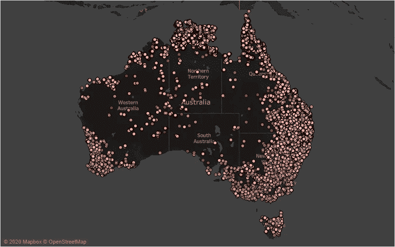
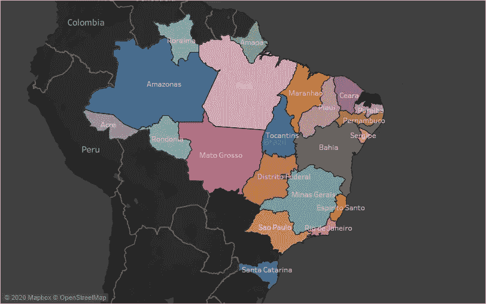
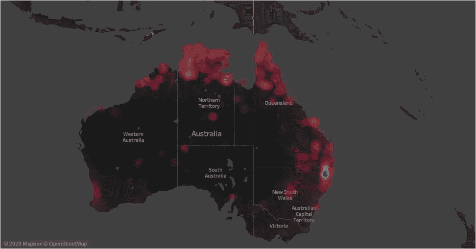
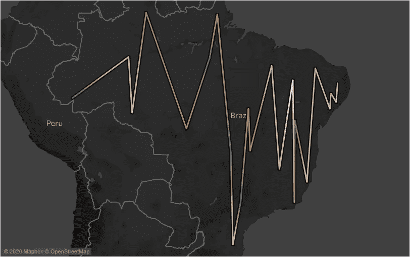
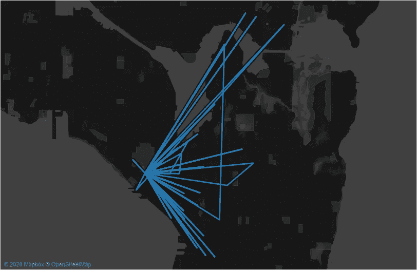

# 用 Tableau 绘制地图

> 原文：<https://medium.com/analytics-vidhya/map-plot-with-tableau-d6f6e1bc94d7?source=collection_archive---------7----------------------->

这篇文章是关于用点分布图、填充图、密度图、流量图和蜘蛛图来分析地理数据。有各种工具可用于地图绘制，但我们将使用 Tableau。

首先，逐一描述每个地图，然后解释实现的过程。

## 点分布图

在点分布图中，每个点代表一段数据。点分布图可用于可视化数据的位置和聚类。

## Choropleth **地图**

一种 Choropleth 地图，也称为填充地图。在这张地图中，不同的颜色用来代表不同的区域，每种颜色都有确定的值。这种类型的地图适用于显示比率数据。

## 密度图

密度图或热图用于显示数据聚类的趋势。它用于表示收集的数据在哪里或多或少地集中。例如，人口分布可以很容易地从热图中看到。

## 流程图

流程图用于连接一段时间内地图上的路径。例如，它可以随着时间的推移在地图上追踪风暴。

## 蜘蛛地图

该地图用于显示起点与不同目的地之间的联系。例如，在地铁站中，不同的车站连接在一起，通过蜘蛛图显示在地图上。

绘制不同种类地图的逐步指南。每一节的末尾都有一个简短的 GIF 作为指导。

**点分布图**

1.  首先上传带有经纬度的数据集。
2.  将纬度和经度分别从度量值拖动到行和列中。
3.  单击标记类型下拉列表任意尺寸至标记，以更改点类。
4.  *处理大数据，用于表示地图上的每个点。标出聚集度量(工具栏>分析>聚集度量)。*

**Choropleth 地图**

1.  首先上传带有经纬度的数据集。
2.  将纬度和经度分别从度量值拖动到行和列中。
3.  单击标记类型下拉列表将任意尺寸下拉至标记，以更改填充颜色类别。颜色和标签用于配置地图上的位置数据。
4.  从标记的下拉菜单中选择地图。

**密度图**

1.  首先上传带有经纬度的数据集。
2.  将纬度和经度分别从度量值拖动到行和列中。
3.  单击标记类型下拉列表，然后单击密度。

**流程图**

1.  首先上传带有经纬度的数据集。
2.  将纬度和经度分别从度量值拖动到行和列中。
3.  单击标记类型下拉列表单击线。
4.  在“标记”框中，从路径上的维度中拖动所需字段。

**蜘蛛图**

1.  首先上传带有经纬度的数据集。
2.  将纬度和经度分别从度量值拖动到行和列中。
3.  单击标记类型下拉列表单击线。
4.  在“标记”框中，将必填字段从路径上的维度中删除。
5.  在“筛选器”框中，将必填字段拖放到表单维度中。
6.  在“过滤器”菜单上，选择“通配符”并在值栏上提及起点。

> 以上情节可以从 Github 库[https://github.com/jhalani1999/map_plot_tableau](https://github.com/jhalani1999/map_plot_tableau)下载