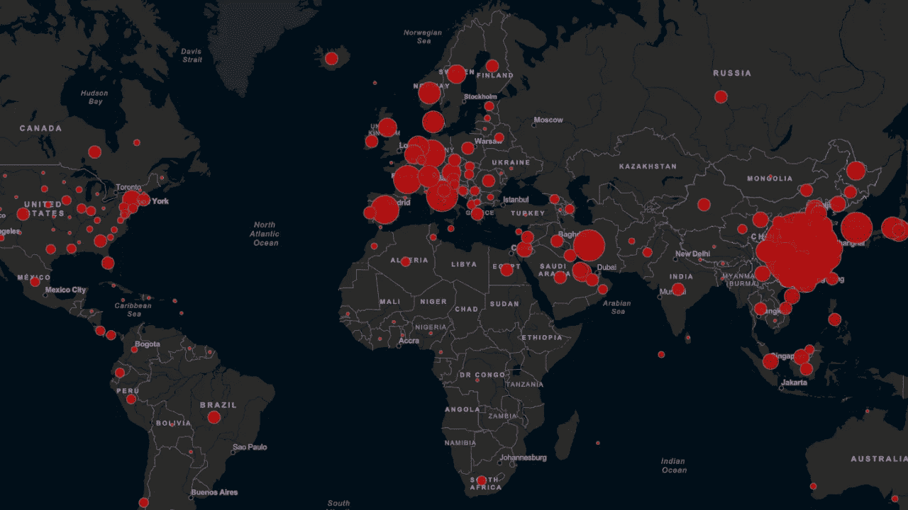

# 绘制和可视化新冠肺炎的传播

> 原文：<https://medium.com/analytics-vidhya/mapping-and-visualizing-the-spreading-of-covid-19-19553342142e?source=collection_archive---------8----------------------->

[https://www . T3 . com/news/best-coronavirus-maps-to-update-you-about-the-global-cases-of-新冠肺炎](https://www.t3.com/news/best-coronavirus-maps-to-update-you-about-the-global-cases-of-covid-19)

2020 年 1 月 23 日，中国中央政府在湖北省武汉市和其他城市实施封锁，以隔离 2019 年冠状病毒疾病爆发的中心(新冠肺炎)。

然而，鉴于目前的流动性和全球化，这种疾病不可避免地蔓延到其中心之外，导致世卫组织定义为…