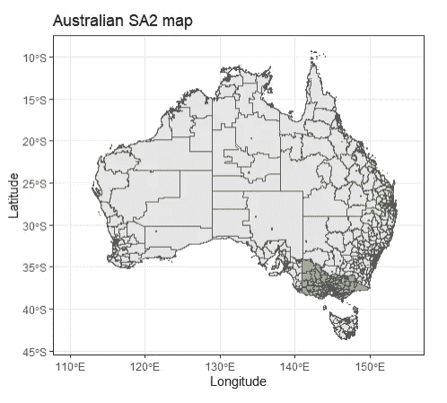
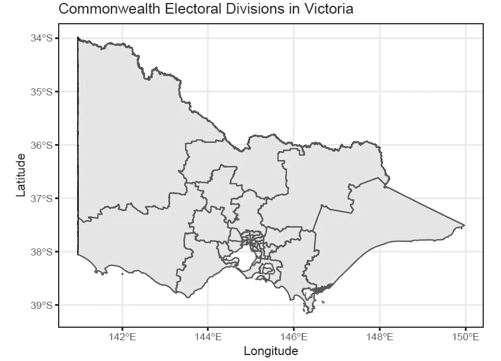
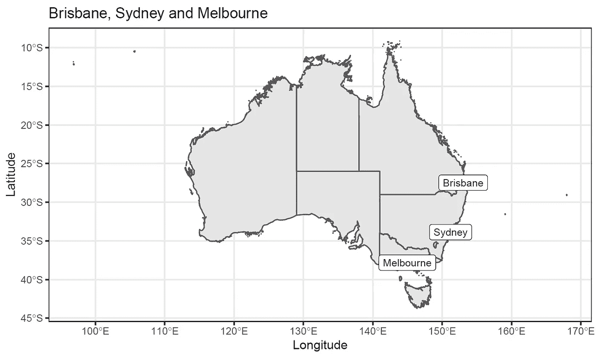
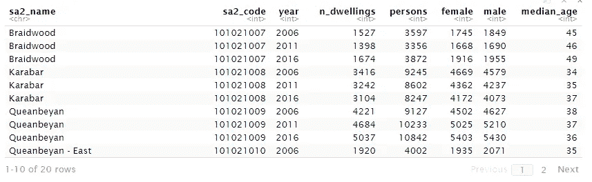
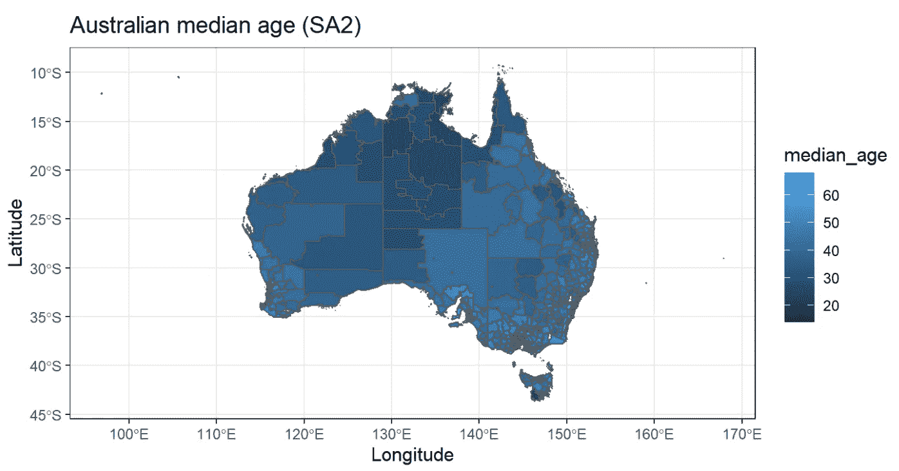
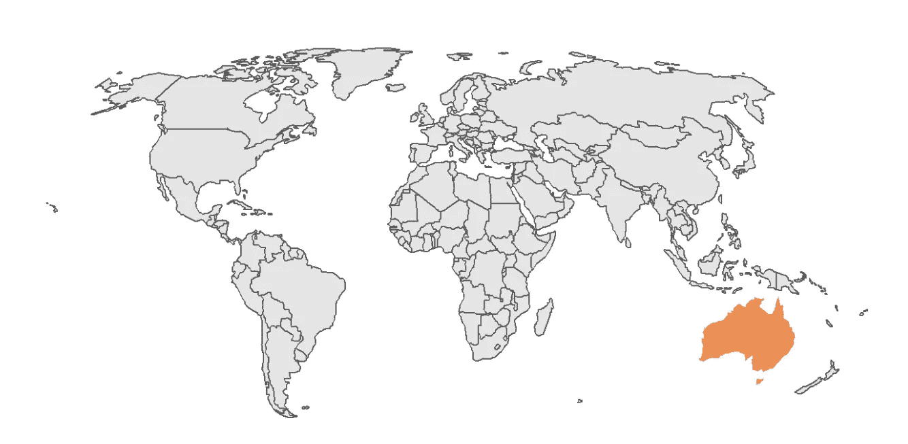
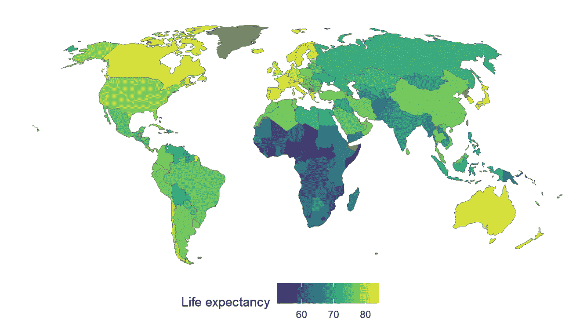
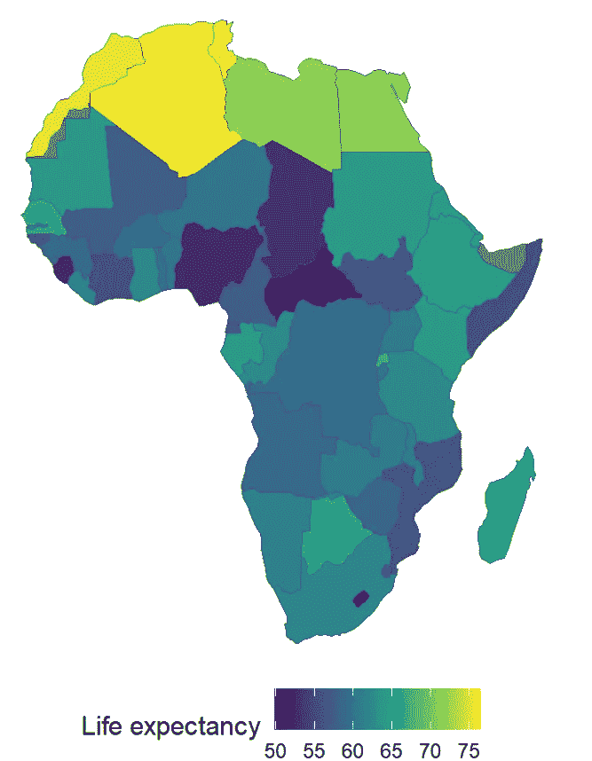

# R 中的映射介绍

> 原文：<https://medium.com/analytics-vidhya/mapping-australia-in-r-6ce092c48b49?source=collection_archive---------6----------------------->

# 0.0 简介

我喜欢地图。我也是一个 r 迷。

在过去的几个月里，我一直在探索如何最好地使用澳大利亚统计局的 R 和数据创建澳大利亚地图。这是我学到的。

首先，澳大利亚统计局定期更新他们的地理位置。他们都可以很容易地访问[这里](https://www.abs.gov.au/AUSSTATS/abs@.nsf/DetailsPage/1270.0.55.001July%202016?OpenDocument)。

您将需要下载“ESRI Shapefile 格式”(例如，ESRI Shapefile 格式的统计区域二级(SA2) ASGS Ed 2016 数字边界)。SA 或统计区域是澳大利亚统计局将国家划分为便于分析的区域的方式。

第二，有无数的软件包来帮助空间可视化。这里有一个不完整的列表，对下面的例子很有用。

```
#install spatial packages
install.packages("plyr")
install.packages("dplyr")
install.packages("ggplot2")
install.packages("rgdal")
install.packages("tmap")
install.packages("ggmap")
install.packages("sf")
install.packages("ggspatial")
install.packages("rlang")
install.packages("broom")
install.packages("tidyverse")
install.packages("readxl")
install.packages("raustats")
install.packages("purrr")
install.packages("Census2016")#load spatial packages
library(plyr)
library(dplyr)
library(ggplot2)
library(rgdal)
library(tmap)
library(ggmap)
library(dplyr)
library(sf)
library(ggspatial)
library(rlang)
library(broom)
library(tidyverse)
library(readxl)
library(raustats)
library(purrr)
library("Census2016")
```

# **1.0 将 shapefiles 导入 R**

用于 R(“SF”)的[简单特性包提供了处理空间数据的所有基本要求。](https://cran.r-project.org/web/packages/sf/index.html)

```
#Use the sf package to import shapefiles
install.packages("sf")
library(sf)#Select the location where the ASGS files are saved
AUS_SA2_shp <- read_sf("K:/Alteryx/ASGS","SA2_2016_AUST")
AUS_CED_shp <- read_sf("K:/Alteryx/ASGS","CED_2016_AUST")#Check the data imported correctly
head(AUS_SA2_shp)
head(AUS_CED_shp)
```

# 2.0 使用 ggplot 制作简单的空间地图

使用 ggplot2 和 geom_sf 函数制作 shapefile 的地图非常简单。此外，多个 shapefiles 可以用单独的属性绘制在一个绘图中。在下面的例子中，SA2 横跨澳洲的地图和维多利亚 SA2 的地图(绿色)都绘制在同一个图表上。

```
library(ggplot2)
library(dplyr)#Read in the SA2 shapefile downloaded from the ABS
AUS_SA2_shp <- read_sf("K:/Alteryx/ASGS","SA2_2016_AUST")#filter the Australian SA2 shapefile for only Victoria
AUS_SA2_VIC_shp <- AUS_SA2_shp %>%
    filter(STE_CODE16 == 2)#plot a map of Australia (grey) and a map of Victoria (green)
ggplot() +
  geom_sf(data=AUS_SA2_shp)+
  geom_sf(data=AUS_SA2_VIC_shp,fill = "#A5D46A")+
  ggtitle("Australian SA2 map") +
          xlab("Longitude") +
          xlim(110,155)+
          ylab("Latitude") + 
          theme_bw()
```



# 3.0 绘制两个形状文件的交集图

通常 shapefiles 有不同的地理位置，您想要找出它们重叠的地方(形式上:intersect)。使用 st_intersect 函数很简单。以下脚本绘制了英联邦选举部门(即投票选民)的 shapefile 和维多利亚的 shapefile 的交集。

```
#import a shapefile of state boundaries
AUS_STATE_shp <- read_sf("K:/Alteryx/ASGS","STE_2016_AUST")#import a shapefile of Australian electorates
AUS_CED_shp <- read_sf("K:/Alteryx/ASGS","CED_2016_AUST")#check the imports worked
head(AUS_STATE_shp)
head(AUS_CED_shp)#filter the shapefile for Victoria only
AUS_STATE_VIC_shp <- AUS_STATE_shp %>%
filter(STE_CODE16==2)#run a spatial intersection for the state of Victoria and all electorates
VIC_CED <- st_intersection(AUS_STATE_VIC_shp, AUS_CED_shp)#plot this intersecting shapefile
ggplot() +
  geom_sf(data=VIC_CED)+
  ggtitle("Commonwealth Electoral Divisions in Victoria") +
          xlab("Longitude") +
          ylab("Latitude") + 
          theme_bw()ggsave("C:/Users/Charles F Coverdale/Desktop/VIC_CED.pdf",units="cm",dpi=200, device="pdf")
```



# 4.0 在 shapefile 上绘制单个特征(如城市)

除了绘制单个 shape file 或 shape file 的交叉点，还可以在地图上绘制特征(如某个点)。

在下面的示例中，选择的首府城市(及其标签)被绘制在澳大利亚各州的地图上。

```
#import a shapefile of state boundaries
AUS_STATE_shp <- read_sf("K:/Alteryx/ASGS","STE_2016_AUST")#make a new dataset of cities in Australia (google the locations)
AUS_cities <- tribble(
  ~city, ~lat, ~long, 
  "Brisbane",-27.4698, 153.0251,
  "Sydney", -33.8688, 151.2093,
  "Melbourne", -37.8136, 144.9631)#check it looks okay
AUS_cities#convert those two columns to geometry column with the st_as_sf() function. Google Maps uses the coordinate reference system 4326 (the GPS system).AUS_cities_geometry <- AUS_cities %>% 
  st_as_sf(coords = c("long", "lat"), crs = 4326)#check it looks right
AUS_cities_geometryggplot() +
  geom_sf(data=AUS_STATE_shp)+
  geom_sf(data=AUS_cities_geometry, size=3)+
  geom_sf_label(data =AUS_cities_geometry, aes(label = city))+
  ggtitle("Brisbane, Sydney and Melbourne") +
  xlab("Longitude") +
  ylab("Latitude") + 
  theme_bw()ggsave("C:/Users/Charles F Coverdale/Desktop/3_capital_cities.pdf",units="cm",dpi=200, device="pdf")
```



# 5.0 在地图上绘制外部数据源(如人口普查)

制图带来的绝大部分好处是可视化跨区域变量。在 R 中，这涉及到基于一个公共字段将两个数据集连接在一起。以下示例涉及将人口普查数据(SA2 级别)连接到 shapefile，然后生成地图。

```
#Get the census data (already by SA2) by using the Census2016_wide_by_SA2_year function in the Census2016 packagecensus2016_wide <- Census2016_wide_by_SA2_year
head(census2016_wide,n=20)#Select the key demographic columns (first 8 columns)
census_short <- census2016_wide[,1:8]
head(census_short,n=20)#Filter for data from the 2016 year
census_short_2016 <- census_short %>%
    filter(year==2016)head(census_short_2016)
```

该软件包中的人口普查数据格式相对简洁。



接下来，我们将人口普查数据加入 shapefile。

```
#Join the two sf (SA2 and census) by their common field.
SA2_shp_census_2016 <- inner_join(AUS_SA2_shp,census_short_2016,
                        by = c("SA2_NAME16" = "sa2_name"))#check the format                        
head(SA2_shp_census_2016)#Plot a map that uses census data 
 ggplot() + 
 geom_sf(data = SA2_shp_census_2016, 
       aes(fill = median_age, border=NA)) +
 ggtitle("Australian median age (SA2)") +
 xlab("Longitude") +
 ylab("Latitude") + 
 theme_bw() +
 theme(legend.position = "right",
     legend.title = element_text("Median age"))ggsave("C:/Users/Charles F Coverdale/Desktop/median_age_map.png",
units="cm",dpi=200, device="png")
```



# 6.0 世界舞台上的澳大利亚

能够在世界地图上突出显示各个国家是很有用的。坐标参考系统和地图投影(广义上说，世界是什么样子取决于你对地球形状的假设)在这里开始变得重要起来。

首先，我们导入整个世界的形状文件。

接下来，我们过滤掉南极洲(对于绘制人口变量或类似的东西，它在世界地图上几乎从来没有用)。

第三，我们为我们选择的国家创建一个单独的 shapefile 层(在这个例子中是澳大利亚)。

```
#download a world map (e.g. "Admin 0 – Countries"):
[https://www.naturalearthdata.com/downloads/110m-cultural-vectors/](https://www.naturalearthdata.com/downloads/110m-cultural-vectors/)#read in the worldmap shapefile using read_sf
world_map <- read_sf("C:/Users/Charles F Coverdale/Desktop/go_bag/R code/ne_110m_admin_0_countries.shp")
world_map#remove Antarctica
world_sans_antarctica <- world_map %>% 
  filter(ISO_A3 != "ATA")#check the data structure
world_sans_antarctica#create a world map plot to test is looks right
ggplot() + 
  geom_sf(data = world_sans_antarctica)+
  theme_minimal()#Create a new dataframe by filtering for Australia by ISO alpha 3 code
world_AUS <- world_sans_antarctica %>%
  filter(ISO_A3 == "AUS")#plot a map with both a world shapefile and an Australia shapefile 
#here we use the Robinson coordinate reference system for accuracyggplot() + 
  geom_sf(data = world_sans_antarctica) +
  geom_sf(data=world_AUS, fill = "#EC8E55", color = "white")+
  coord_sf(crs = 54030)+
  theme_void()
```



# 7.0 在世界地图上绘制外部数据源(如世界银行)

就像在 5.0 中一样，也可以将外部数据集链接到世界地图。

Andrew Wheiss 为他的大学班级做了一个很好的例子，他从世界银行下载了世界发展指标，并把它们标在世界地图上。

下面是将预期寿命映射到全局 shapefile 的代码的简化版本。

```
#download "Admin 0 – Countries" from [https://www.naturalearthdata.com/downloads/110m-cultural-vectors/](https://www.naturalearthdata.com/downloads/110m-cultural-vectors/)#read in the world map shapefile
world_map <- read_sf("C:/Users/Charles F Coverdale/Desktop/ne_110m_admin_0_countries.shp")#remove Antarctica
world_sans_antarctica <- world_map %>% 
  filter(ISO_A3 != "ATA")#check the plot works
ggplot() + 
  geom_sf(data = world_sans_antarctica)+
  theme_minimal()#get latest data from the World Bank
install.packages("WDI")
library(WDI)#choose the development indicators for 2017
indicators <- c("SP.DYN.LE00.IN")wdi_raw <- WDI(country = "all", indicators, extra = TRUE, 
               start = 2017, end = 2017)#check the data structure
head(wdi_raw)#extract the life expectancy column
wdi_clean_small <- wdi_raw %>% 
  select(life_expectancy = SP.DYN.LE00.IN, iso3c)#check the data structure
head(wdi_clean_small)#join the shapefile and life expectancy data set together
world_map_with_life_expectancy <- world_sans_antarctica %>% 
  left_join(wdi_clean_small, by = c("ISO_A3" = "iso3c"))#produce a map of life expectancy across the world
ggplot() + 
  geom_sf(data = world_map_with_life_expectancy, 
          aes(fill = life_expectancy),
          size = 0.25) +
  coord_sf(crs = 54030) +  # Robinson
  scale_fill_viridis_c(option = "viridis") +
  labs(fill = "Life expectancy") +
  theme_void() +
  theme(legend.position = "bottom")
```



该地图可以进一步细分为单个地区或洲。澳大利亚大陆没什么可看的(也就是说，没有各州的细分)，所以让我们试试非洲吧。

```
#start with the data "world_sans_antarctica_fixed from the previous set
#filter for the UN region called "Africa"
world_Africa <- world_sans_antarctica_fixed %>% 
                     filter(REGION_UN == "Africa")#check the data looks good
world_Africa#produce the map (same function as previously)
ggplot() + 
  geom_sf(data = world_Africa, 
          aes(fill = life_expectancy),
          size = 0.25) +
  coord_sf(crs = 54030) +  # Robinson
  scale_fill_viridis_c(option = "viridis") +
  labs(fill = "Life expectancy") +
  theme_void() +
  theme(legend.position = "bottom")
```



# 8.0 后续步骤

在 R 中，你还可以用贴图做无数的事情，包括 gganimate、R shiny 和各种面包裹方法。

查看[我的 github](https://github.com/charlescoverdale) 或[网站](http://www.charlescoverdale.com)的未来帖子。