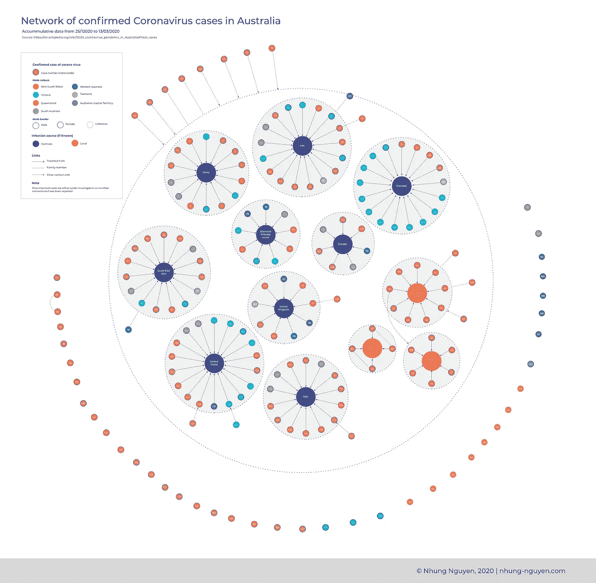
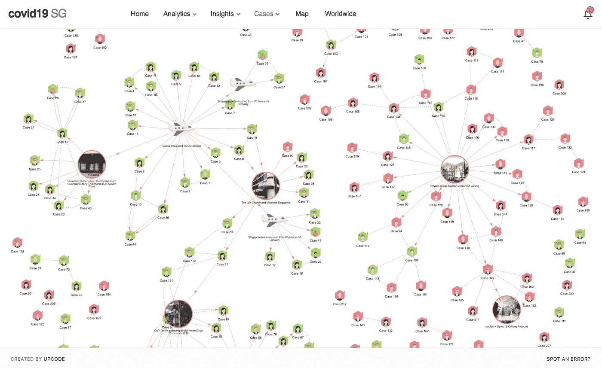
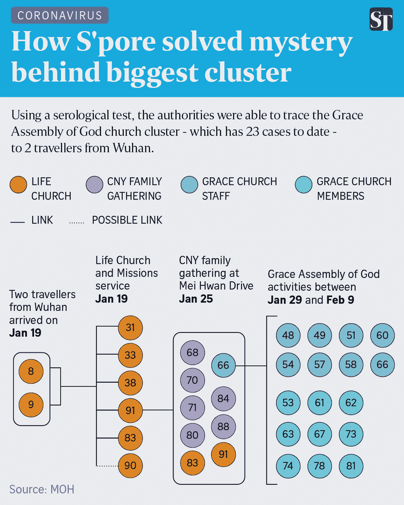
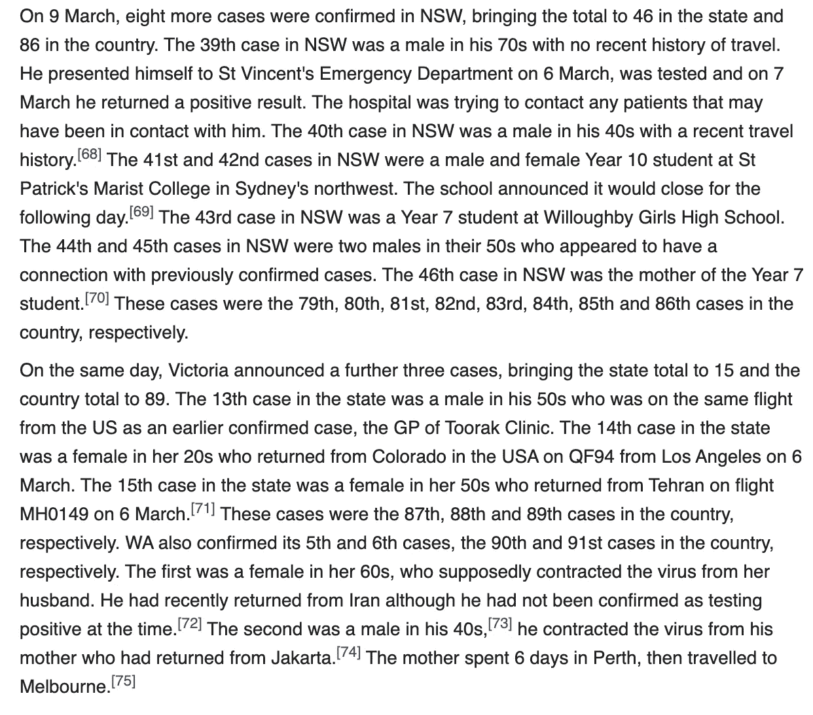
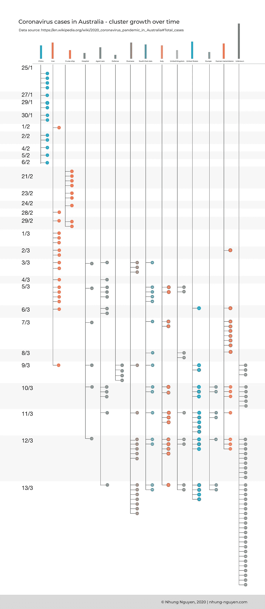
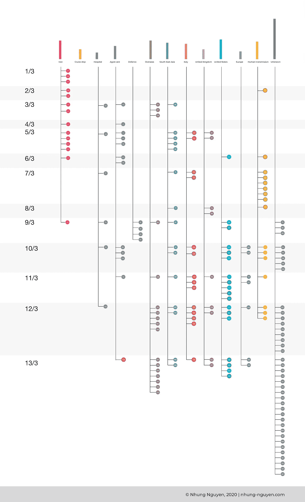

# 澳大利亚冠状病毒病例群集图

> 原文：<https://medium.com/analytics-vidhya/mapping-clusters-of-coronavirus-cases-in-australia-76927ebf4526?source=collection_archive---------12----------------------->

这个周末，当人们忙于争夺卫生纸或意大利面时，我决定将全部精力投入到可视化澳大利亚确诊冠状病毒病例网络中。

*免责声明:这纯粹是作为一个数据呆子的个人追求，与我的工作无关。所表达的观点仅代表我个人，并不代表我的雇主的观点或意见。*

根据[公开可用的数据，](https://en.wikipedia.org/wiki/2020_coronavirus_pandemic_in_Australia#Total_cases)我能够将 2020 年 1 月 25 日至 2020 年 3 月 13 日的 198 个病例分成 11 组，并看到病例之间的一些传播联系。



# 动机

当我的一位同事在不同的新冠肺炎仪表板上分享了一篇文章时，我看到这个关于新加坡当前病例的出色的[冠状病毒仪表板](https://co.vid19.sg/cases)，产生了一股数据嫉妒。



我最感兴趣的是不同感染群的网络可视化和每个病例的细节以及它们是如何联系在一起的。我随后发现，通过血清学检测和接触追踪，新加坡当局能够追踪并找到其冠状病毒群之一的传染源😮。



[https://www . straits times . com/Singapore/grace-assembly-coronavirus-mystery-solved-mega-cluster-linked-to-2-Wuhan-tourists-via-a](https://www.straitstimes.com/singapore/grace-assembly-coronavirus-mystery-solved-mega-cluster-linked-to-2-wuhan-tourists-via-a)

## 问题

对于澳大利亚的案例，我们能做同样的事情吗？我决定利用公开可用的数据找出以下问题的答案:

*   澳大利亚有哪些不同的冠状病毒群？
*   这些案件之间有什么联系？
*   我们能追踪群集间的感染途径吗？
*   这些集群是如何随着时间的推移而增长的？

# 数据收集

我希望澳大利亚确诊冠状病毒病例的数据集结构良好，每小时更新一次，并拥有我需要的所有信息(就像韩国的这个一样)，但可惜没有😿！

我能找到的最新的详细信息是在维基百科的页面上，贡献者每天从公共卫生来源获取数据，并记录澳大利亚的总病例数。我很高兴在州卫生部门报告的一些病例中找到了🕵的联系追踪信息🙌。问题？这只是密集的文字，很难理解😭。不相信我？试着遵循这个:



[https://en . Wikipedia . org/wiki/2020 _ 冠状病毒 _ 疫情 _ 澳洲#总数 _ 病例](https://en.wikipedia.org/wiki/2020_coronavirus_pandemic_in_Australia#Total_cases)

如果我能把文本中的数据映射成更有结构的东西会怎么样？——我这个顽固无知的数据呆子想道。当我开始这项任务时，只有大约一百行。

所以我开始为澳大利亚的每个确诊病例制作电子表格。(⚠️Don't 曾经用疫情试过这个！)例如像这样的条目…

> 1 月 25 日，首例确诊病例在 [Victoria](https://en.wikipedia.org/wiki/Victoria_(Australia)) 宣布，他是一名 50 多岁的中国公民，于 1 月 19 日从[广东](https://en.wikipedia.org/wiki/Guangzhou)广州乘坐[中国南方航空【CZ321 航班前往](https://en.wikipedia.org/wiki/China_Southern_Airlines)[墨尔本](https://en.wikipedia.org/wiki/Melbourne)。

被翻译成:

```
Case_id: 1;
Confirmed_date: 25/01/2020;
State:VIC;
Gender: Male;
Age: 50-59;
Infection-source:China; 
Infection-type: Overseas;
Associated_flight: CZ321;
URL: [https://www2.health.vic.gov.au/about/media-centre/MediaReleases/first-novel-coronavirus-case-in-victoria](https://www2.health.vic.gov.au/about/media-centre/MediaReleases/first-novel-coronavirus-case-in-victoria);
```

每当提到案件之间的联系时，如果可能的话，我会试着把它们联系在一起。似乎有两种主要联系类型:(1)确诊患者的家庭成员，和(2)与确诊患者有密切接触。

例如，该描述提到了新发现病例和先前病例之间的联系:

> 该国的第 31 例病例和新南威尔士州的第 7 例病例是一名 41 岁的妇女， [[37]](https://en.wikipedia.org/wiki/2020_coronavirus_pandemic_in_Australia#cite_note-age31st-38) 是新南威尔士州第 5 例确诊病例的近亲，该患者是一名最近从伊朗返回的男子

*   注意:新南威尔士州的第五例确诊病例是澳大利亚的第 27 例确诊病例

编码为:

```
edge_id: 12;
type: family_member;
source: 31;
destination: 27;
additional_info: The 31st case in the country and the seventh case in NSW, a 41-year-old woman,[[37]](https://en.wikipedia.org/wiki/2020_coronavirus_pandemic_in_Australia#cite_note-age31st-38) was a close relative of the fifth confirmed NSW case, a man who recently returned from Iran;
```

## 挑战和限制:

*   事实上，准确地绘制出这些链接是非常困难的，因为虽然我的 case_id 被记录为整个澳大利亚的计数，但链接通常来自每个州的卫生当局，他们引用的病例编号是他们自己州的(即全国第 31 例是新南威尔士州的第 8 例，依此类推)。最后，我为 state_case_id 添加了一列，以确保链接正确。
*   不同状态和不同日期之间的信息是不完整和不一致的。最初，有很多关于案件的细节报道，但后来的案件没有很多细节，导致数据缺失。
*   有时，案件之间的联系来自我自己在综合不同来源(权威报告和媒体报道)时的简化推理，可能是完全错误的。
*   手动完成这项工作需要花费大量的时间和精力。数据输入本身可能有很多错误，我还没有机会仔细检查每一个条目。案件每天都在增加，而且已经到了不可能跟踪每一项记录的地步。

# 结果

从数据中能发现什么？让我们回顾一下我最初的问题:

*   澳大利亚有哪些不同的冠状病毒群？
*   这些案件之间有什么联系？
*   我们能追踪群集间的感染途径吗？
*   这些集群是如何随着时间的推移而增长的？

## 簇

从电子表格中，我设法将 25/1 到 13/3 的案件分成 11 组:

*   🇺🇸美国:18 例
*   🇮🇷伊朗:17 例
*   🗺海外:17 宗
*   🌏东南亚:15 例
*   中国🇨🇳:14 例
*   意大利🇮🇹14 例
*   👴多萝西·亨德森·洛奇老年护理:12 例
*   🇬🇧联合王国:9 例
*   🛳钻石公主号游轮:9 起案件
*   🇪🇺欧洲:7 例
*   🏥莱德医院:6 例
*   🎖辩护:4 起案件

以及 16 例人类传播病例(已知与澳大利亚先前确诊的病例有联系)和 39 例未知病例，其感染源正在调查中，或近期无旅行史且与先前病例无接触。


## 案件之间的联系

在这些病例中，你可以看到来自海外的受感染患者如何将疾病传播给与他们生活在一起或有密切接触的人。但是数据有限。

## 感染途径

遗憾的是，我没能像我最初希望的那样追踪到任何感染途径。除了 Dorothy Henderson Lodge 老年护理机构和 Ryde 医院之间的一些已知联系，因为它们彼此相距不远，并且有医生访问老年护理机构或居民去医院。

有趣的是观察病毒最初是如何从一名回国的旅行者传播到当地社区的，但就我个人的数据来看，没有明显的联系。

## **集群随时间增长**

我想看看每个集群是否会随着时间的推移而发生变化会很有趣，这在下面的可视化中有所体现。随着图表的深入，很难知道会发生什么，但从整体上看，澳大利亚的情况从 3 月初开始有所好转。



这是从 2020 年 1 月 3 日到 2020 年 3 月 13 日的时间线，中国集群不在画面中…



# 最后

虽然我没有追踪到任何感染途径，但不知何故我还是很满意😊为了能够理解数据，查看不同的聚类，并全面了解所有案例以及它们如何随着时间的推移而演变。

如果我有更多的时间，观想肯定会得到改善(我可以找到很多东西来修复它们！)但这已经是一个相当耗时的练习了。

看看公众是否对及时收集更多有用的结构化数据更感兴趣，以更好地了解病毒如何传播及其速度，以及哪种干预措施有效，这将是一件有趣的事情。

# PS:世界各地的冠状病毒群

对接触追踪和聚集感染感兴趣？这里有一些更酷的观想给你👇

[](https://graphics.reuters.com/CHINA-HEALTH-SOUTHKOREA-CLUSTERS/0100B5G33SB/index.html) [## 2019 年冠状病毒:韩国集群

### 冠状病毒如何在韩国教堂和医院爆发

graphics.reuters.com](https://graphics.reuters.com/CHINA-HEALTH-SOUTHKOREA-CLUSTERS/0100B5G33SB/index.html) [](https://multimedia.scmp.com/infographics/news/world/article/3073962/coronavirus-clusters/index.html) [## 世界各地的冠状病毒群

### 识别聚集性是对抗任何传染病的一个重要部分。诊断出的患者群…

multimedia.scmp.com](https://multimedia.scmp.com/infographics/news/world/article/3073962/coronavirus-clusters/index.html)