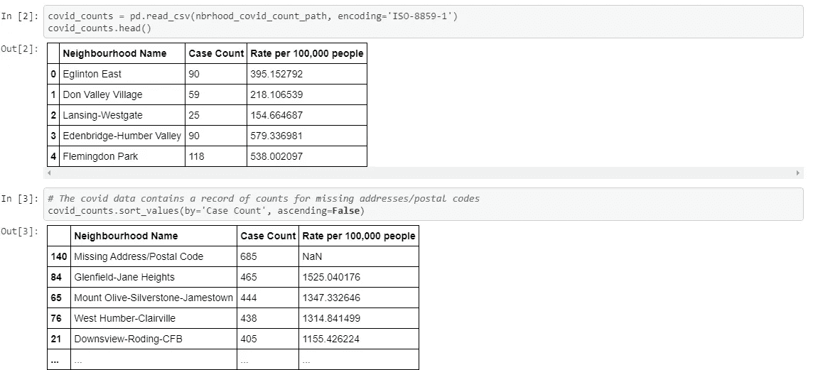
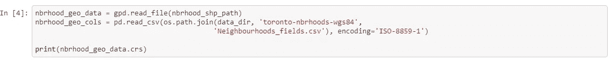
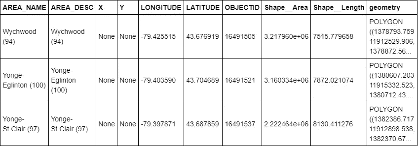
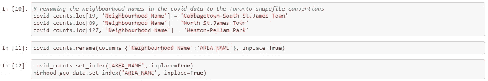
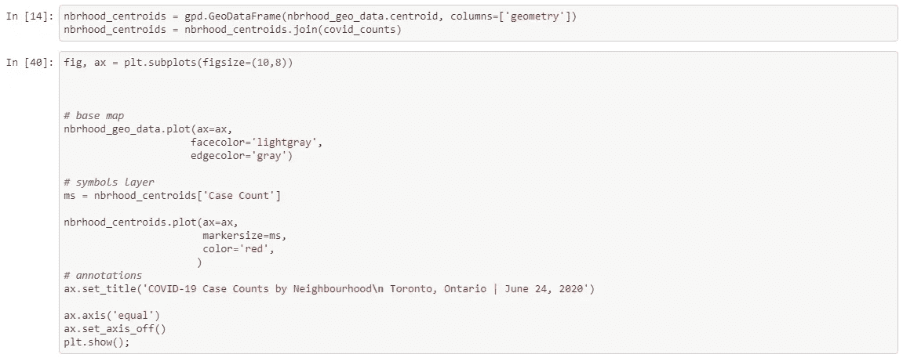
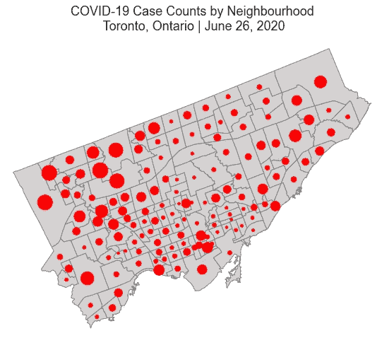
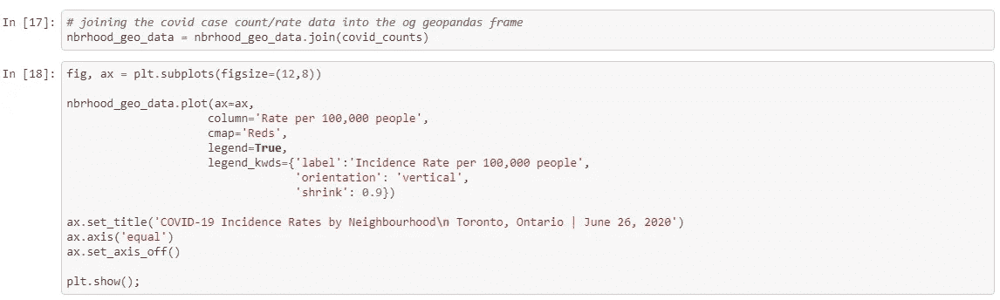
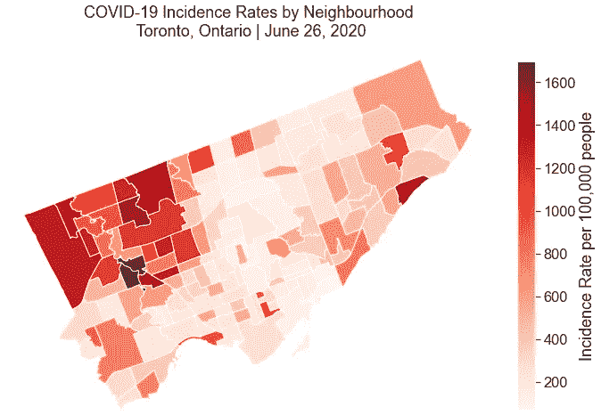
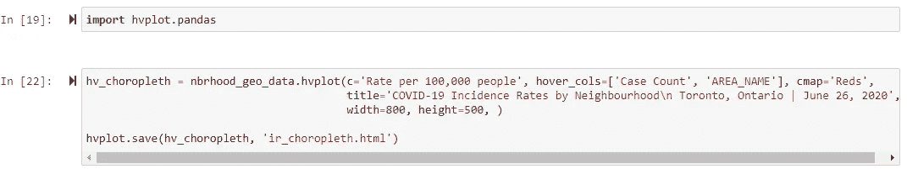

# 用 Python 绘制新冠肺炎感染地图:GeoPandas 简介

> 原文：<https://medium.com/analytics-vidhya/mapping-covid-19-infections-in-toronto-with-python-an-introduction-to-plotting-with-geopandas-9e7a3b721c39?source=collection_archive---------13----------------------->

利用来自多伦多开放数据门户的数据，我准备了一份使用 Python 简单绘制矢量数据的简介。这篇文章不会教你如何重现我们在网络上看到的一些一流的交互式仪表盘(比如我最喜欢的约翰·霍普斯金大学的仪表盘)。相反，本文将向初学者介绍如何使用 Python 中的 GeoPandas 库，并制作两种地图:比例符号和 choropleth 地图。

# **一、什么是 GeoPandas？**

GeoPandas 是一个开源 python 项目，旨在使地理空间数据更易于使用。它本质上是用于数据分析的 Pandas 库的扩展，并为操纵和绘制地理空间数据提供了一个用户友好的界面(来源:【https://geopandas.org/】T4)。

虽然存在更强大、更复杂的 GIS 软件，但 GeoPandas 对任何对 Python 有基本了解的人都是开放的，可以实现基本的可视化任务。

# **二。数据**

地理空间数据可以在多伦多市的开放数据门户[这里](https://open.toronto.ca/dataset/neighbourhoods/)找到。在**下载数据**下拉菜单下，选择以‘shape file’格式下载数据。下载后，您会发现六个文件，它们都很重要，但是您只会与**进行交互。Python 中的 shp** 文件。这是包含 140 个多伦多街区的地理坐标的形状文件。邻域边界被表示为由纬度和经度坐标定义的**多边形**。这是**矢量**数据的一个例子——它使用点和线段来识别地球上的位置。我们将使用该数据集来创建底图。

新冠肺炎的数据可以从多伦多的互动数据仪表板上下载，该仪表板于今年早些时候向公众发布。我们将可视化的数据反映了 2020 年 6 月 26 日多伦多所有 140 个街区的新冠肺炎情况。对于每个邻域，我们都有两个数据点:

1.  **病例数:**新冠肺炎病例总数(导致死亡或康复的病例包括在此数中)

2.**每 10 万人发病率:**每 10 万人确诊的新增病例数

## 如何下载新冠肺炎数据:

1.  跟随这个[链接](https://www.toronto.ca/home/covid-19/covid-19-latest-city-of-toronto-news/covid-19-status-of-cases-in-toronto/)
2.  在交互式数据面板中，导航至“新冠肺炎多伦多街区地图”
3.  选择“下载 Excel 数据”
4.  在 excel 文档中，导航至“按社区分类的病例数”选项卡，并将电子表格导出为. csv 文件

一旦所有东西都下载完毕，我们就可以开始用 Python 打开这些文件了。我为这个教程创建了一个 Jupyter 笔记本，你可以在这里查看它的全部内容[。](https://github.com/silent-j/toronto-mapping/tree/master/toronto-covid-nbrhoods)

# **三世。加载和准备数据**

在这之前的第一步是确保在您的环境中安装了必要的 Python 库。我们将使用以下内容:

*   [地质公园](https://geopandas.org/install.html)
*   [熊猫](https://pandas.pydata.org/getting_started.html)
*   [Matplotlib](https://matplotlib.org/users/installing.html)
*   [hVPlot](https://hvplot.holoviz.org/getting_started/index.html)

如果您还没有安装这些包，那么您需要花一些时间在您的 python 环境中获得这些包及其需求。

一旦安装完毕，您就可以开始加载数据了:

1.  将新冠肺炎数据加载到熊猫数据框架中。我们可以按照案件数量递减的顺序对街区进行排序

这个数据集实际上包含了一个额外的行，用于地址/邮政编码无法识别的情况。它将被自动忽略，所以没有必要删除它

2.使用 GeoPandas 将 shapefile 数据加载到地理数据框架中。地理数据框架需要 Shapely 对象形式的地理数据。通过 GeoPandas 访问的几何操作实际上是由 Python 中的另一个地理空间库 Shapely 执行的。

数据字段标签实际上位于单独的。名为“Neighbourhoods _ fields.csv”的 csv 文件。您需要将这些标注与地理数据框相结合

在此地理数据框架中，我们使用面对象来描绘邻域的边界

3.在一些小的数据争论之后，通过邻域索引两个数据框。

数据集的不一致是一个令人痛苦的现实。**下载新数据集时，请确保对数据进行辩论并执行“质量检查”,以确保感兴趣的变量格式正确。**在这种情况下，更改某些街区的名称以符合基本地图的街区惯例是一个不容错过的重要步骤。

**四。创建比例符号图**

比例符号地图使用不同大小的符号来显示定量数据。它们有助于以快速、直接的方式了解位置内的数量。我们将使用新冠肺炎案例的原始计数来演示如何使用 GeoPandas 绘制这些地图。

1.  我们的每个邻域多边形都包含一个称为“质心”的属性，即多边形计算中心的 X，Y 坐标。你可以得到一系列多边形的形心。GeoSeries 的“质心”属性。
2.  使用新冠肺炎数据框连接邻域质心的地理系列。

3.创建地图:

*   绘制多伦多街区的基本地图。多边形的边和面颜色可以通过 GeoPandas 的**进行调整。plot()** 。
*   使用邻域质心绘制符号图层。我使用原始案例计数作为参数“标记大小”的参数，但是您可以很容易地计算每个质心的有意义的统计数据，并使用它来代替。

**基准:**北美基准 1983 | **投影:**朗伯保形 Conal 2SP | **权威:** EPSG 3161

先说这个地图非常明显的弊端。你可以看到城市中哪些地区的新冠肺炎病例数量较高，但你不一定知道这些地区的名称。这张地图也缺少信息丰富的图例。人们可以更进一步，使用 Matplotlib 创建一个定制的图例，但是这需要一些繁琐的注释。如果我们能够以另一种方式来表示数据，以补充这张地图，那就更容易了。

我们还使用新冠肺炎案例的*计数*来改变我们符号的大小。这种类型的统计数据所带来的信息的价值在理解新冠肺炎在一个地理位置中的实际流行程度方面是有限的。幸运的是，我们下载的多伦多市数据集也为我们提供了一个信息率，我们将在下一节探讨。

# 动词 （verb 的缩写）创建 Choropleth 地图

Choropleth 地图是一种专题地图，它根据给定地理区域的综合统计数据对地图区域进行着色。在本节中，我们将在 choropleth 图中展示每 100，000 人中的发病率。提醒一下，这一统计数据是某一地区每 100，000 人中发现的新病例数。发病率在流行病学领域被广泛用于测量疾病的频率。

创建 choropleth 地图没有太多的步骤；GeoPandas 让这变得非常简单。

1.  调用**。包含邻近面的地理数据框架中的 plot()** 方法(在上一节中，我们将其用作底图)

*   matplotlib 轴被传入**‘ax’**参数，以便我们访问 matplotlib 的后端进行注释。
*   将感兴趣的列(病毒发生率)作为'**列'**'参数的参数进行传递，以让 GeoPandas 知道应根据此统计数据的比例进行着色
*   将包含图例的布尔参数设置为**真**，并对图例在图中的显示方式进行一些调整。

2.最后，为最终产品添加一个合适的标题并关闭图形轴。

*   制图原则表明，地图标题应该向浏览者传达高层次的信息。任何无法传达的信息应在其他地方传达(即地图图例)。

**基准:**北美基准 1983 | **投影:**兰伯特保形 Conal 2SP | **权威:** EPSG 3161

这种 choropleth 和比例符号图之间的可解释性差异是显而易见的。利用图中一侧的颜色条，您可以看到多伦多西北部的新冠肺炎感染率明显高于中部和市区(东部的一个斯卡伯勒街区除外)。

与之前的地图相比，这张地图在用户友好性方面胜出，因为我们可以清楚地看到每个区域的边界和解释阴影的信息性图例(或“颜色条”)。

实际上不知道街区名称的缺点仍然存在。然而，我找到了一个简单而有效的解决方案。

# 不及物动词奖金部分！**将 GEOPANDAS CHOROPLETH 转换为交互式地图**

如果您的 Python 环境中安装了 **hvplot** 库，那么您可以轻松地将 choropleth 转换成动态可视化。只需要几行简单的代码。这个库也允许你将你的交互视觉保存为 HTML 格式，使其易于嵌入。

生成的地图将看起来像我们以前的 choropleth，但是使用 hVPlot 绘图功能允许交互性。将鼠标悬停在每个居民区上方将显示姓名、病例数和每 100，000 人中的发病率。

交互式 choropleth 已发布到 GitHub 页面，可通过点击以下链接访问:

 [## 互动合唱团

silent-j.github.io](https://silent-j.github.io/toronto-mapping/toronto-covid-nbrhoods/docs/) 

敬请关注更多 GeoPandas 制图技巧的后续教程！