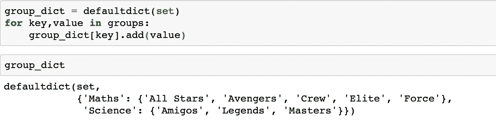

# 将关键字映射到字典中的多个值

> 原文：<https://medium.com/analytics-vidhya/mapping-keys-to-multiple-values-in-a-dictionary-b5022de9dd0e?source=collection_archive---------1----------------------->

## 多学科的简明介绍

# 什么是字典？

字典可以定义为一组*键:值对*，其中键对于给定的字典是唯一的。

# 什么是多点？

Multidict 是一个字典，其中几个值映射到一个键。

这里，关键字' *d'* 具有 2 个元素，关键字' *e'* 具有 3 个元素。

# 创建一个多部门

假设你有一个包含三种蔬菜和五种水果的元组。

每一个都提到了它们各自类别。

只看这些对，很难知道哪些是蔬菜，哪些是水果。因此，我们想很好地分类，这样我们就可以清楚地看到哪些是蔬菜，哪些是水果。

最好的方法是创建一个如下的多 ic。

多部门的例子

你如何能制作如上所示的字典？

做这件事有困难的方法和容易的方法。首先，我将解释困难的方式，这样你就知道里面实际发生了什么。

## **硬道:**

首先我们创建一个名为 food_dict 的空字典。

然后，在 for 循环中，我们将元组逐个解包为键和值。

在这个 for 循环中发生了两件事。

首先，在遍历*对*时，我们检查这个键是否已经存在于我们的 *food_dict* 字典中。如果它不在字典中，我们创建一个新的键和一个映射到该键的空列表。

其次，我们在每次迭代中将每个值附加到它们各自的键上。

输出如下所示。

现在让我们来看看简单的方法。

## **简单易行:**

最简单的方法是使用*集合*库中的 *defaultdict* 。

defaultdict 内部发生的情况是，当您试图查找一个键时，如果这个键不在字典内部，它将创建一个新条目，而不是抛出一个错误。

然后，如下图所示，你可以创建一个多点。

在这里，多个值存储在一个列表中。您也可以为此使用一套。选择取决于你希望你的字典是什么样的。

如果希望值按添加顺序排列，请使用列表。

如果您只需要唯一的值，并且它们的添加顺序不重要，请使用集合。

举个例子，假设你有值对，每个学生都指出了他们所属的组的主题和名称。

您想知道每个主题的唯一组名。

为了做到这一点，你可以用一个集合容器创建一个多点。

现在，您可以清楚地看到每个主题有哪些独特的组名。

注意:您必须使用相关的方法来向容器添加值。对于列表 ***使用追加*** 方法，对于集合 ***使用添加*** 方法。