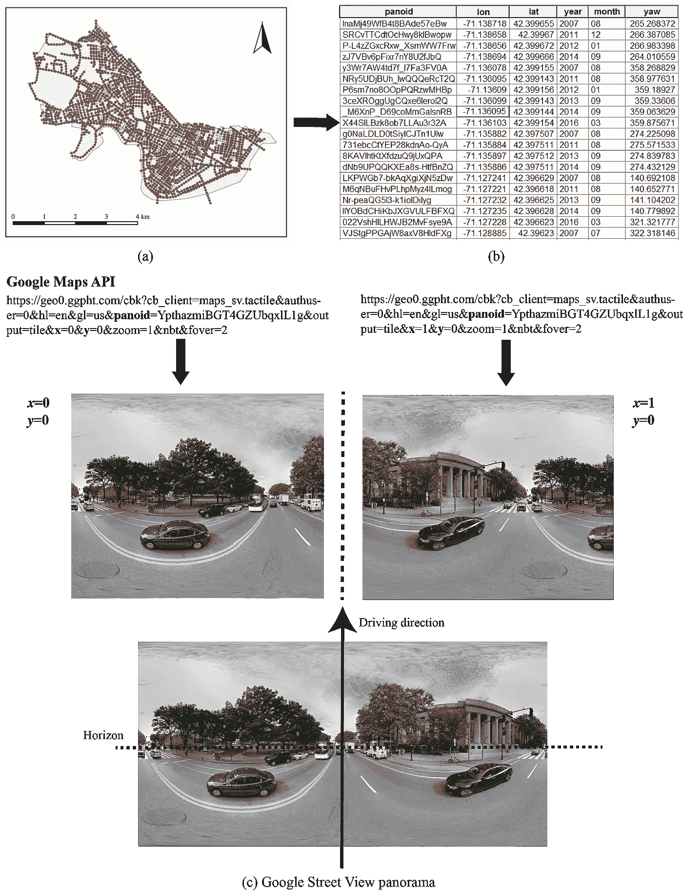
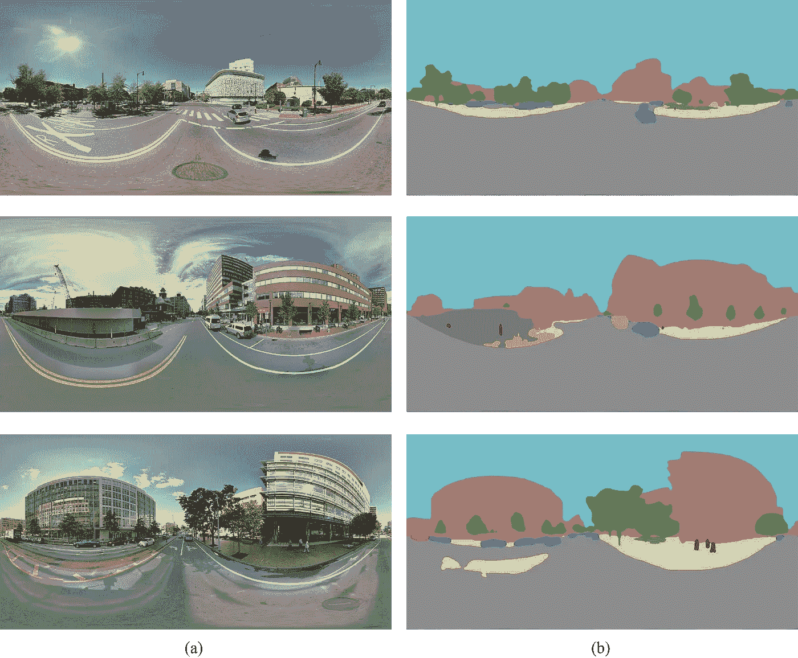
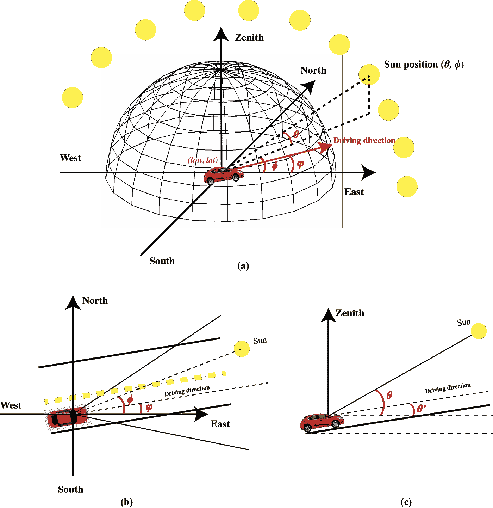
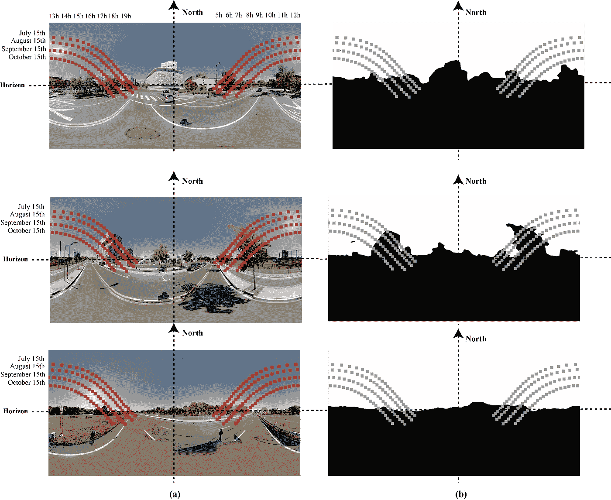
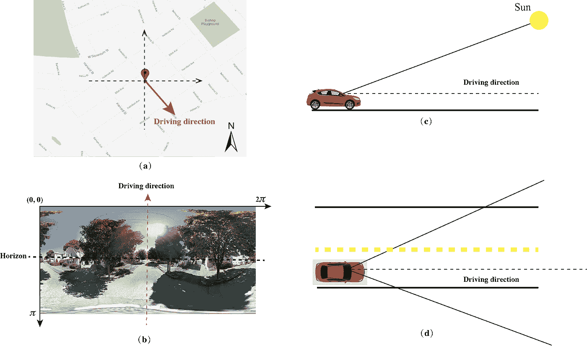
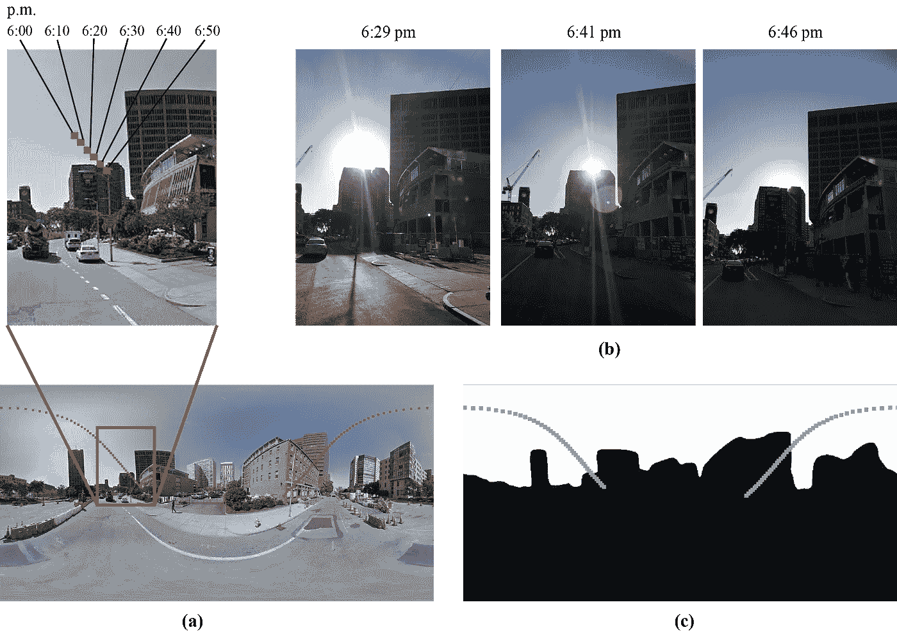

# 使用谷歌街景绘制阳光眩光(驾驶时耀眼的阳光)

> 原文：<https://medium.com/analytics-vidhya/mapping-sun-glare-dazzling-sun-while-driving-using-google-street-view-81c69f1e8238?source=collection_archive---------8----------------------->

试想一下，每当你在日出时间从西向东行驶或在日落时间从东向西行驶时，你是否会感到刺眼的阳光遮住了你的眼睛，使驾驶变得超级困难？我猜很多人都想知道耀眼的太阳在何时何地出现。当我在波士顿与自由互助保险公司开会时，我有了预测太阳眩光发生的想法。然后我考虑如何预测它。我已经在城市应用程序中使用谷歌街景图像很多年了，我以前的项目 Treepedia 是一个很好的项目。然后我意识到谷歌街景可能是预测和绘制太阳眩光发生的完美数据集，因为谷歌街景图像与司机的视角相似，这些图像实际上是由汽车收集的。这里是向你展示如何使用谷歌街景和深度学习来预测和绘制太阳眩光的教程。

**第一步。数据准备**

为了收集谷歌街景图像，我们需要首先沿着街道生成样本点。街道地图可以从市政府或 TIGER([https://www . census . gov/geographies/mapping-files/time-series/geo/TIGER-line-file . html](https://www.census.gov/geographies/mapping-files/time-series/geo/tiger-line-file.html))网站上找到。我们可以将每个街道分割成 40 米的距离，以便创建样本站点。我已经为 [Treepedia](http://senseable.mit.edu/treepedia) 项目开发了一个[代码](https://github.com/mittrees/Treepedia_Public/blob/master/Treepedia/createPoints.py)来创建以前的样本网站。我们可以重用这些代码来创建街道上的示例站点。**图 1** (a)显示了沿马萨诸塞州剑桥街道生成的样本地点。基于这些创建的样本站点的坐标，我们可以使用谷歌街景元数据应用编程接口(API)进一步收集 GSV 全景的元数据(**图 1** (b))。

**图 1。**剑桥 GSV 全景采集的工作流程，(a)创建的样本站点，(b)GSV 全景的元数据，(c)使用谷歌地图 API 采集的一个样本站点的 GSV 全景。

**第二步。使用 PSPNet 进行图像分割**

街道级图像中的不同物体会对耀眼的阳光产生不同的影响。例如，天空不会阻挡阳光，而建筑物和树木会阻挡阳光。因此，我们需要从街道级图像中识别不同的对象，以便预测太阳眩光的发生。人工智能的最新进展使得从 GSV 全景图中准确识别街道上的障碍物成为可能。在这项研究中，我们使用金字塔场景解析网络(PSPNet)，这是一个在 ADE20K 数据集上训练的深度卷积神经网络，来分割 GSV 全景图。Github 上有很多实现的 PSPNet 资源库。我建议用 MIT CSAIL 维护的代码( [link](https://github.com/CSAILVision/semantic-segmentation-pytorch) )。

**图二。**使用金字塔场景解析卷积神经网络(PSPNet)对 GSV 全景图进行图像分割的结果。

**第三步。太阳眩光预测**

我们准备好了一切。然后，我们可以通过在分段的谷歌街景图像上叠加太阳路径来预测太阳眩光。我们可以使用开源 python 模块- [Pysolar](https://pysolar.readthedocs.io/en/latest/) 来计算任何给定时间和位置的太阳位置。下图是太阳位置和驱动器的几何模型。

**图 3。**太阳位置和车道上车辆位置的几何模型

太阳位置和车辆的几何模型可以使用街道级图像来建模。下图显示了太阳位置在谷歌街景图像上的叠加。如果太阳的位置在非天空像素上，那么我们可以说太阳被遮挡了。

**图 4。**7 月 15 日、8 月 15 日、9 月 15 日和 10 月 15 日的太阳路径，位于研究区域三个地点的圆柱形谷歌街景全景图(a)和分段圆柱形全景图(b)上。

通常情况下，太阳眩光发生在太阳处于驾驶员的视野范围内，同时太阳没有被遮挡。如果我们假设驾驶员的水平和垂直视角是 50 度。因此，如果出现太阳眩光，必须满足三个规则，(1)。相对水平角小于 25 度，(2)太阳和驾驶员之间的相对垂直角小于 25 度，(3)阳光没有被障碍物阻挡，这意味着太阳位置被投影在天空像素上。

**图 5。**将某一时刻的太阳位置投影到柱面 GSV 全景图上的几何模型。

基于生成的谷歌街景图像分割结果和太阳位置模型，我们可以很容易地使用这三个规则来预测太阳眩光图。我已经使用超过 30 万张谷歌街景图像生成了整个佛罗里达州的太阳眩光发生地图。这里有一个视频展示了佛罗里达州高速公路上的太阳眩光地图。

佛罗里达州的太阳眩光地图

日落时分，我用 iPhone 在马萨诸塞州剑桥的微软大楼周围拍照，并验证了结果。在这里你可以看到谷歌街景图像上预测的太阳位置和我拍摄的日落照片的对比。

**图 6。**GSV 全景图上预测的太阳路径与 2018 年 7 月 5 日三个不同时间点在同一地点拍摄的三张照片的对比，(a)GSV 全景图上 7 月 5 日的太阳路径，(b)同一地点不同时间拍摄的三张照片，7 月 5 日的太阳路径在分段的 GSV 全景图上的叠加，黑色部分代表遮挡像素，白色部分代表天空像素。

验证结果表明，该方法能够准确估计出太阳眩光被遮挡的时间点，误差小于 3 min，进一步证明了基于 GSV 全景图的方法能够以较高的精度估计出太阳光的遮挡情况。

**参考**

(2019 年)李，谢，蔡，黄碧云，邱，赵，赵等。使用谷歌街景预测和测绘太阳眩光发生的新方法。*交通研究 C 部分:新兴技术*， *106* ，132–144。