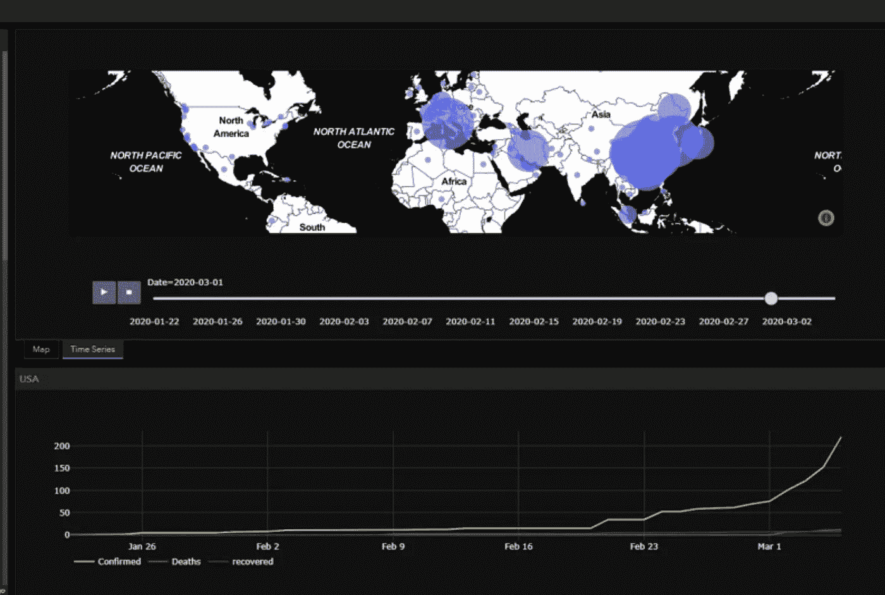
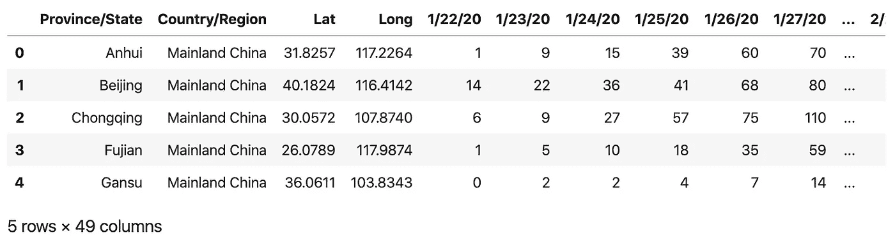
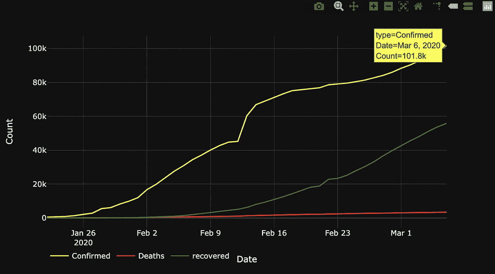
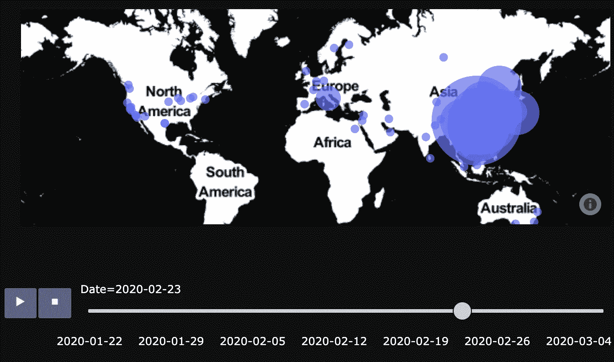

# 用 python 和 Plotly 绘制新冠肺炎冠状病毒传播图

> 原文：<https://medium.com/analytics-vidhya/mapping-the-spread-of-coronavirus-covid-19-d7830c4282e?source=collection_archive---------7----------------------->



在这篇文章中，我将分享我最近在 python 和 Plotly 中学习可视化的经验。通过这个示例，我将回顾以下技能:

*   如何将网络上的 csv 文件读入熊猫数据框架(df)
*   如何使数据帧*【整齐】*
*   如何在 plotly 中创建时间序列图
*   如何在 plotly 中创建动画时空地图

# 第一部分。准备数据

在这一部分中，我将展示如何从遍布全球的冠状病毒库中获取数据。[这个知识库](https://github.com/CSSEGISandData/COVID-19)由约翰·霍普金斯大学提供，是[这个伟大可视化](https://www.arcgis.com/apps/opsdashboard/index.html#/bda7594740fd40299423467b48e9ecf6)背后的数据源。

```
# Starting the required libraries
import numpy as npimport geopandas as gpd
import pandas as pd
from functools import reduce
```

**1.1。下载数据**
主存储库在两个独立的文件夹中包含两组 csv 文件。一个文件夹包含每日 csv 文件，另一个文件夹包含每日数据的时间序列。在这里，我使用的是三个熊猫数据框架中的*确诊、死亡和恢复*病例数的时间序列数据。

```
#### Part 1 : Preparing the data# 1.1 Downloading csv into dataframe
df_confirmed = pd.read_csv('[https://raw.githubusercontent.com/CSSEGISandData/COVID-19/master/csse_covid_19_data/csse_covid_19_time_series/time_series_19-covid-Confirmed.csv'](https://raw.githubusercontent.com/CSSEGISandData/COVID-19/master/csse_covid_19_data/csse_covid_19_time_series/time_series_19-covid-Confirmed.csv'))
df_deaths = pd.read_csv('[https://raw.githubusercontent.com/CSSEGISandData/COVID-19/master/csse_covid_19_data/csse_covid_19_time_series/time_series_19-covid-Deaths.csv'](https://raw.githubusercontent.com/CSSEGISandData/COVID-19/master/csse_covid_19_data/csse_covid_19_time_series/time_series_19-covid-Deaths.csv'))
df_recovered = pd.read_csv('[https://raw.githubusercontent.com/CSSEGISandData/COVID-19/master/csse_covid_19_data/csse_covid_19_time_series/time_series_19-covid-Recovered.csv'](https://raw.githubusercontent.com/CSSEGISandData/COVID-19/master/csse_covid_19_data/csse_covid_19_time_series/time_series_19-covid-Recovered.csv'))
```

**1.2。整理数据**
我第一次了解到*整理数据*的想法时，我真的很欣赏它，并认为它很棒。如果你为了你的分析，特别是可视化的目的，使你的数据整洁，你将有希望为你自己节省很多时间和挫折。我第一次了解到它是通过这套绝妙的套装和它的创造者 T21·哈德利·威克姆。你可以在这里了解更多关于*整理数据* [的想法。](https://r4ds.had.co.nz/tidy-data.html)

我记得，一个整洁的数据集的第一条规则，可能也是最重要的一条规则是，每一行代表一个也是唯一一个观察值。让我们看一下我们的一个数据帧，看看它是否整洁:

```
df_confirmed.head(5)
```



这个数据框整齐吗？

我们的数据框架有 49 列，其中 45 列包含特定一天某个地方的确诊病例数。

> 整洁吗？

记住*‘一排 _ 一观察’*的规律，我想你知道答案。那么让我们继续:
让我们创建一个列来存储日期，并将数字放在另一个适当的列中。然后我们将把三个 ddataframes 合并成一个，使用*[‘省/州’，‘国家/地区’，‘纬度’，‘长’，‘日期’]*作为键*。*

```
# 1.2 Tidying the data
# Using melt() command in pandas (similar to gather() in R's tidyr)id_list = df_confirmed.columns.to_list()[:4]
vars_list = df_confirmed.columns.to_list()[4:]confirmed_tidy = pd.melt(df_confirmed, id_vars=id_list,\
     value_vars=vars_list, var_name='Date', value_name='Confirmed')
deaths_tidy = pd.melt(df_deaths, id_vars=id_list,\
     value_vars=vars_list, var_name='Date', value_name='Deaths')
recovered_tidy = pd.melt(df_recovered, id_vars=id_list,\
     value_vars=vars_list, var_name='Date', value_name='recovered')# 1.3 Merging the three dataframes into one
data_frames = [confirmed_tidy, deaths_tidy, recovered_tidy]          
df_corona = reduce(lambda left, right: pd.merge(left, right, on =\
               id_list+['Date'], how='outer'), data_frames)# 1.4 Each row should only represent one observation
id_vars = df_corona.columns[:5]
data_type = ['Confirmed', 'Deaths', 'recovered']
df_corona = pd.melt(df_corona, id_vars=id_vars,\
          value_vars=data_type, var_name='type', value_name='Count')
df_corona['Date'] = pd.to_datetime(df_corona['Date'],\ 
            format='%m/%d/%y', errors='raise')
```

让我们检查组合的数据帧是否整齐:

```
df_corona.head(5)
```


tidyed 数据帧

新的数据帧是否遵循规则*‘一行一观察’*？
如果是的话，我们可以继续前进，开始创建可视化。

# 第二部分。形象化

在这一部分中，我将展示如何使用 python 中令人惊叹的 [plotly](https://plot.ly/python/) 包来创建漂亮的交互式可视化效果。一个时间序列图和一个新冠肺炎随时间发展的动画地图。我们将使用 [*plotly.express*](https://plot.ly/python/plotly-express/) 库。与使用标准的 plotly 库相比，这使得工作变得更加容易。虽然，和往常一样，它没有标准库灵活。让我们开始:

**2.1。时间序列图**
让我们创建一个确诊、死亡和痊愈病例总数的时间序列图，类似于这个漂亮的[约翰霍普金斯仪表盘](https://www.arcgis.com/apps/opsdashboard/index.html#/bda7594740fd40299423467b48e9ecf6)中的那个。

首先对每个日期的值求和:

```
corona_sums = df_corona.groupby(['type', 'Date'],\
                     as_index=False).agg({'Count':'sum'})
```

和时间序列图:

```
import plotly_express as px
def plot_timeseries(df):
    fig = px.line(df, x='Date', y='Count', color='type',\
             template='plotly_dark')

    fig.update_layout(legend_orientation="h")
    return(fig) fig = plot_timeseries(corona_sums)
fig.show()
```



新冠肺炎案例的时间序列图

2.2.动画时间序列图
现在让我们创建确诊病例的空间时间序列。这样我们就可以看到病毒是如何随着时间在全世界传播的。这里我使用气泡图，气泡的大小与确诊病例数成比例。

```
import plotly_express as px# Selecting only the Confirmed cases
tsmap_corona = df_corona[df_corona['type']=='Confirmed']
tsmap_corona['Date'] = tsmap_corona['Date'].astype(str)
```

为了控制气泡的大小，我在下面的代码中创建了一个分类列，并将气泡的大小与七类数据相关联。在这里，我硬编码了箱的切割值。这是为了防止添加新的材料到这个职位。我建议使用标准方法来计算这个切割值。[在这里](https://www.axismaps.com/guide/data/data-classification/)您可以了解更多关于在地图上可视化数据的数据分类。同样在 python 中这样做，你可以考虑使用 [*mapclassify*](https://github.com/pysal/mapclassify) 库。

```
# Classifying data for visulalization
to_Category = pd.cut(tsmap_corona['Count'], [-1,0,105, 361, 760,\
            1350, 6280, 200000], labels=[0, 1, 8, 25, 40, 60, 100])
tsmap_corona = tsmap_corona.assign(size=to_Category)
```

我们的动画空间时间序列图创建如下:

```
fig_time= px.scatter_mapbox(data_frame=test2,lat='Lat',lon='Long',\ 
        hover_name= 'Country/Region', hover_data=['Province/State',\
        'Count'], size='size', animation_frame='Date',\
       mapbox_style='stamen-toner', template='plotly_dark', zoom=1,\
       size_max=70)
fig_time.show()
```



新冠肺炎确诊病例的动画时空情节

就是这样。我希望这篇文章对你有用。我会很感激你的想法，建议和对这篇文章的任何评论。

**T22【巴巴克】T23**