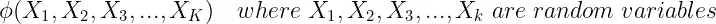
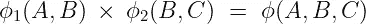
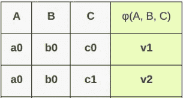
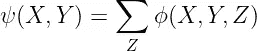
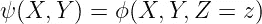
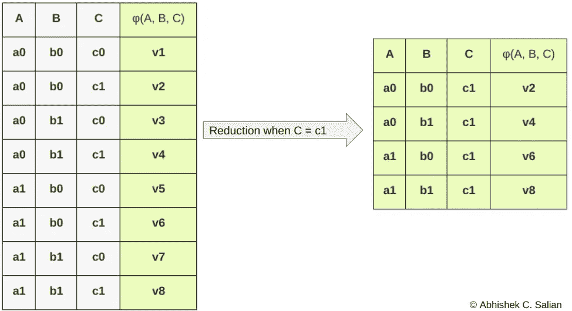
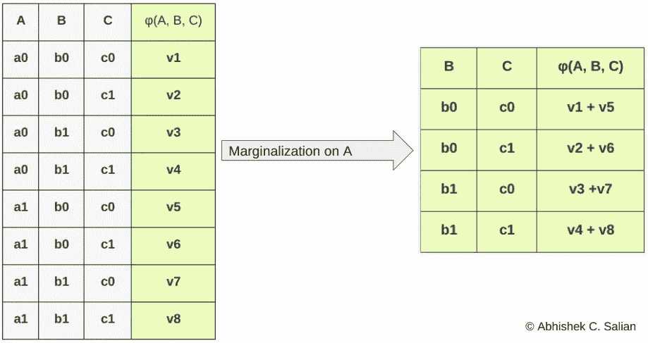

# 理解概率论中的边缘化与归约

> 原文：<https://medium.com/analytics-vidhya/marginalization-vs-reduction-c421dabddffe?source=collection_archive---------11----------------------->

## 在这篇文章中，我将讨论概率论中边缘化和归约的区别

如果你曾经使用过[概率图形模型(PGM)](https://en.wikipedia.org/wiki/Graphical_model) 你可能会遇到概率空间中的边缘化和减少因素，或者一般来说，这些概念中的许多都被引入了概率论。我们经常混淆边缘化和减少，或者说，我们大多数人认为这是一回事，但它肯定不是一回事。那么有什么不同呢？什么是边缘化？什么是还原？所以这个问题的所有答案都将在这篇文章中得到解答

在深入区别之前，让我们先看一下各种术语的定义

# 因素

因子类似于程序设计中的函数，即它有参数并返回值。现在因子中的自变量是随机变量，并返回自变量的结果值。条件概率分布(CPD)是一种因素。

> 因子是定义高维空间分布的最基本的积木。

这就是我们用数学方法表达因子的方式

现在在这个因子上，我们可以做一些类似乘积、边缘化和缩减的操作。对于要素的乘积，我们就不多深入了。下面是因子乘积运算的数学表达式，我们可以有“N”个随机变量。

导致共同分配的两个因素的乘积

因子的示例

> 注意:-有时因子值可能未标准化(即不在范围[0，1]内)，但总体概念和操作保持不变

# 排斥

边缘化是对变量 X 求和的过程，该变量与其他变量如 Y、Z 等具有联合分布。

考虑到 3 个随机变量，我们可以用数学方法表示它

长度 H.S 是 Z & R.H.S 的边缘分布，是将 Z 边缘化的联合分布的总和

你可以参考[维基百科](https://en.wikipedia.org/wiki/Marginal_distribution)来获得更多关于边缘化的理解

# 减少

这种减少可以定义为给定一个随机变量的某个值，其他剩余变量的联合分布是什么。

数学上，

上式是给定 Z = z 时 X & Y 的联合分布

让我们借助一个例子来理解这一点

在下图中，我们可以看到只有 C = c1 的行被考虑，其余的被丢弃，这就是归约操作

这是当 C = c1 时 scope = {A，B，C}的因子的减少，其中 A，B，C 是二进制随机变量

现在在下图中，我们可以看到 C 上的边缘化是如何在 B 和 C 的联合分布中增加价值的

这是一个 scope = {A，B，C}的因子在 C 上的边缘化，其中 A，B，C 是二元随机变量

所以这都是关于边缘化和减少。我希望这篇文章对你有用。

谢谢你。

## 参考

[1]达芙妮·柯勒和 Nir Friedman 的《概率图形模型原理和技术》