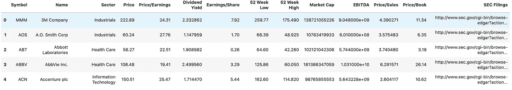
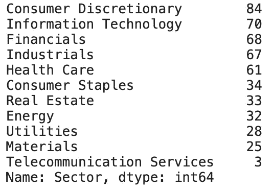
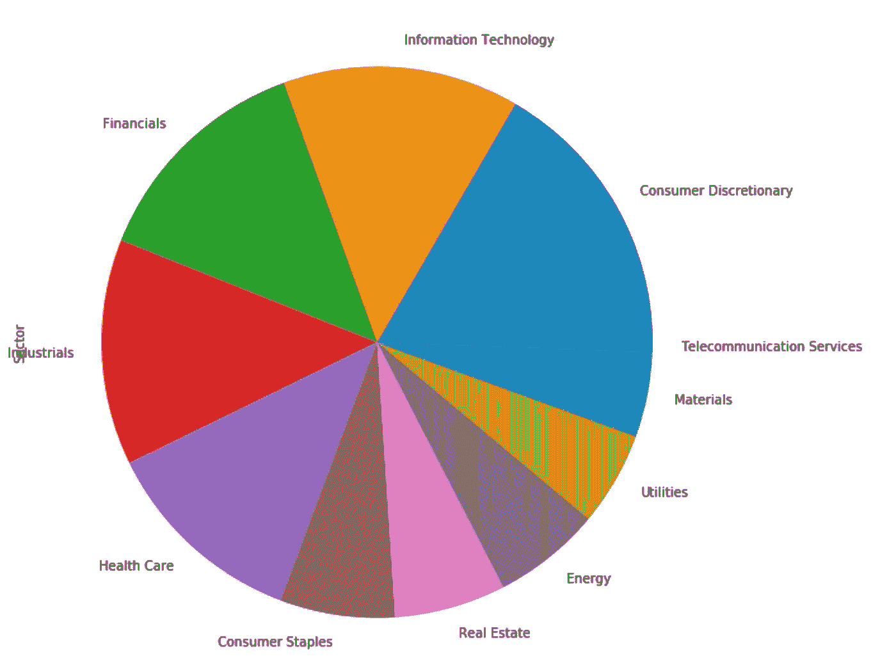
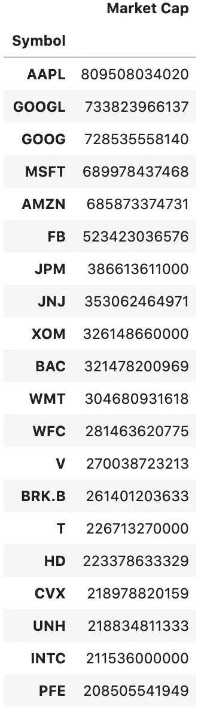
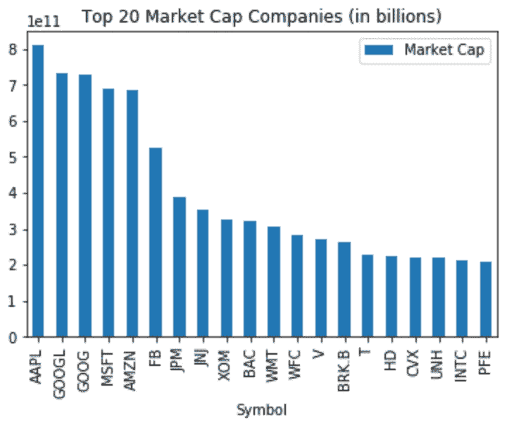
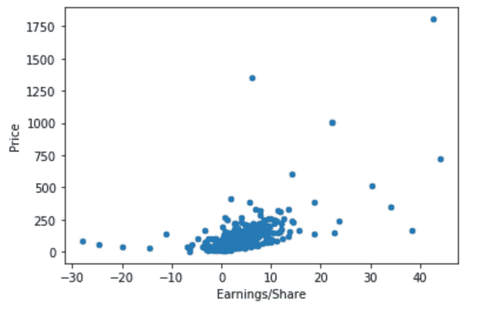

# 用 Python 进行市场分析和数据清理

> 原文：<https://medium.com/analytics-vidhya/market-analysis-and-data-cleaning-with-python-1e22930cc081?source=collection_archive---------6----------------------->

在本文中，您将了解如何从 Excel 或 CSV 文件导入和清理数据，以及如何使用 Python 可视化市场数据的一些基本步骤。

首先，我想指出在分析股票和提取信息时需要记住的两个要点。第一个你可能已经听说过，那就是数据的质量决定了你的好坏。如果您提取的数据很容易访问，您应该假设许多其他人正在使用相同的信息。第二，你 90%的时间将用于清理和理解行和列是如何格式化的。

**导入&将 CSV 读取为熊猫数据帧**:

了解数据文件在计算机上的位置很重要，这样 python 才能正确无误地读取路径。我喜欢将文件路径复制并粘贴到我的 IDE 中，而不是键入它。

```
import pandas as pd
from pathlib import Path
%matplotlib inline# Set the path
file_path = Path('../Resources/sp500_companies.csv')# Read in the CSV as a DataFrame
sp500_companies_csv = pd.read_csv(file_path)
sp500_companies_csv.head()
```



接下来，我们将统计 S&P 中每个行业的公司数量，并用饼图表示结果。

```
sector_count = sp500_companies_csv['Sector'].value_counts()
```



```
# Plot a pie chart from the distribution of company sectorssector_count.plot(kind='pie', figsize=[10,10])
```



**注:**

抓取股票信息的方法有很多。快速简单的方法是去谷歌搜索工作表，在你想要的时间范围内获得每日“收盘”价格。然后保存并下载为 CSV 格式。

```
 =GOOGLEFINANCE(“MRNA”,”Close”,”01/02/2015", “12/8/2020”,”DAILY”)or=GOOGLEFINANCE("INDEXSP:.INX","Close","10/30/2015", "11/30/2020","DAILY")
```

你可以使用像“yfinance”这样的 API，他们有一个 python 库，你可以在他们的网站上安装和查看文档…我将在未来的文章中更详细地介绍这一点。

下面的链接很好地列出了使用“yfinance”库的步骤。(【https://algotrading101.com/learn/yfinance-guide/】T4)

其他流行的 API:

*   羊驼
*   Quandl
*   量子乌托邦
*   格子 SDK

回到我们的例子，让我们从我们的 S&P 数据集中过滤前 20 大市值公司的数据。您可以通过使用。loc

```
# Grab the `Symbol` and `Market Cap` columns
market_cap = sp500_companies_csv.loc[:, ['Symbol', 'Market Cap']]# Set the 'Symbol' as the index
market_cap.set_index(market_cap['Symbol'], inplace=True)# Drop the extra 'Symbol' column
market_cap.drop(columns=['Symbol'], inplace=True)# Filter down to 20 companies with the largest market caps
top_20_market_cap2222 = market_cap.nlargest(20, 'Market Cap')# Display the DataFrame
top_20_market_cap
```



**绘制市值前 20 的公司:**

```
top_20_market_cap.plot(kind='bar', title='Top 20 Market Cap Companies (in billions)')
```



```
# Plot a scatter plot to display the relationship between price vs. earnings/sharesp500_companies_csv.plot(kind='scatter', x='Earnings/Share', y='Price')
```



首先…

*如果你觉得这篇文章有用，欢迎在*[*GitHub*](https://github.com/scottandersen23/Medium_Blog/tree/main/Articles)*上下载我的个人代码。你也可以直接在 scottandersen23@gmail.com 给我发邮件，在*[*LinkedIn*](https://www.linkedin.com/in/scott-andersen-3208897b/)*上找到我。有兴趣了解更多关于数据分析、数据科学和机器学习应用的信息吗？跟我上* [*中*](/@scottandersen23) *。*

感谢阅读。