# 🍎市场篮子分析🍞-可视化关联规则挖掘

> 原文：<https://medium.com/analytics-vidhya/market-basket-analysis-association-rule-mining-with-visualizations-cda24d537019?source=collection_archive---------6----------------------->

# 1.概观

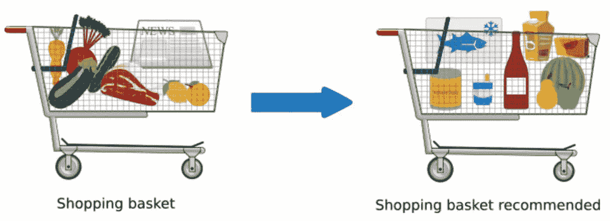

# 介绍

> 电脑比我们更了解我们的时代已经到来。我们的设备非常强大，它知道我们现在正在做什么，以及我们将来要做什么。人工智能的以下应用称为市场购物篮分析，它广泛用于零售商店，该应用预测我们可能会购买的密切相关的商品以及我们购买的产品。
> 
> ***项目明细:***
> 
> *在本项目中，我们使用* [*杂货数据集*](https://www.kaggle.com/heeraldedhia/groceries-dataset) *，该数据集包含 38765 行人们从杂货店购买的订单。数据集只有一个 csv 文件。*
> 
> *在上面的这些数据集中，我用可视化分析了数据集，并在 Apriori 算法的帮助下执行了规则挖掘。我从来没有意识到或质疑自己为什么这些物品被严密地保存在超市里，以为这是为了方便顾客，但我不知道这有商业影响。*
> 
> *您也可以在我的 GitHub wall*[*GitHub 页面*](https://github.com/BenRoshan100/Market-Basket-Analysis) *获取此代码。*

# 本笔记本的目标

*   获取和清理数据
*   使用 Apriori 算法执行 A-规则挖掘
*   可视化项目之间的关联结果

# 2.导入库

# 3.获取数据

```
groceries=pd.read_csv('../input/groceries-dataset/Groceries_dataset.csv')
print(f'Groceries_dataset.csv : **{**groceries.shape**}**')
groceries.head()
```

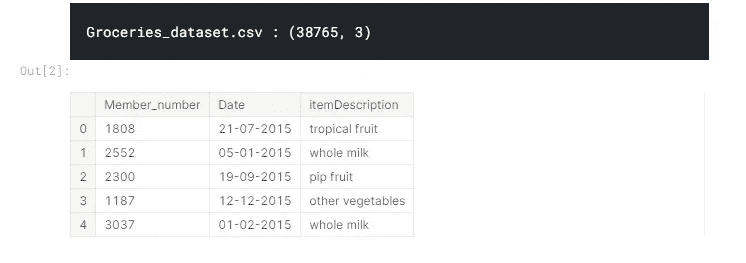

根据数据集信息，它具有以下特征:

*   **Member_number:** 这类似于在购买交易后提供给客户的客户 id
*   日期:这是进行购买/交易的日期
*   **物品描述:**所购买物品的名称

📌查看非空记录的数量及其数据类型非常重要。日期通常没有日期时间格式。

```
groceries.info()
```

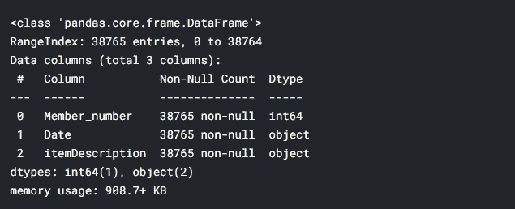

从这些信息中我们可以看出

*   我们在数据集中没有任何空记录。嘭！
*   日期列是一种对象数据类型。小嘭！

# 4.预处理

## 重命名列

```
*#Renaming the columns to simple words*
groceries.rename(columns = {'Member_number':'id','itemDescription':'item'}, inplace = True)
```

## 日期信息

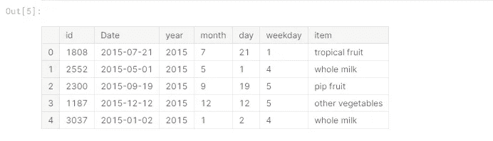

# 6.关联规则挖掘与 Apriori 算法

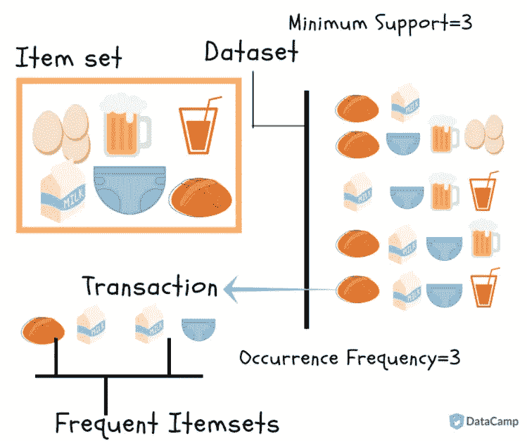

来源:数据营

## 什么是购物篮分析？

> 你是否曾经逛过超市，想知道所有的区域和货架都是以产品相关的方式设计的？就像你可以在附近的货架上买到面包和黄油；牙刷和牙膏放在同一个架子上。这些产品是相关联的。如果你买了一把刷子，你买浆糊的可能性就很高。这些都是营销策略，让你装满篮子的产品及其相关项目，从而增加销售收入。很少有商家在相关商品中引入折扣，或者将两种商品组合在一起以较低的价格销售，以促使您购买该商品+与之相关的商品

## 什么是关联规则挖掘？

> *关联规则挖掘是一种用于揭示物品之间关联的技术，其中我们购买的物品被表示为 X- > Y*
> 
> *这里 X 是我们购买的物品，Y 是我们最有可能购买的物品(更像 if- > then)也叫做*

*   x 先行词
*   y 向结果

> 关联规则挖掘有助于设计项目的关联规则。这些规则是借助三个术语形成的

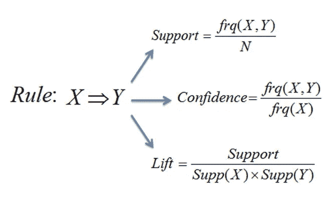

> *1。* ***支持:*** *表示物品的受欢迎程度，如果一件物品购买频率较低，那么它在关联中会被忽略。*
> 
> *2。* ***置信度:*** *它讲述了 X 被买入时，买入 Y 的可能性。听起来更像是条件概率。事实上是的！但是它没有检查 Y 的流行度(频率)来克服我们得到的提升。*
> 
> *3。* ***提举:*** *它兼具了信心和支持。大于 1 的提升值表明前提条件的存在增加了给定交易中结果条件发生的可能性。Lift 低于 1 表示购买先行项会减少在同一交易中购买后件的机会。*
> 
> *例如，假设有 100 名顾客，其中 10 人买了牛奶，8 人买了黄油，6 人两样都买了。我们需要检查购买牛奶的关联= >购买黄油的关联*

*   支持= P(牛奶和黄油)= 6/100 = 0.06
*   信心=支持度/P(黄油)= 0.06/0.08 = 0.75
*   lift =置信度/P(牛奶)= 0.75/0.10 = 7.5

## 什么是先天的？

> *Apriori 算法使用频繁项集来获取关联规则，但前提是*

*   频繁项目集的所有子集必须是频繁的
*   类似地，在非频繁子集的情况下，它们的父集也是非频繁的，该算法以这样的方式工作，即设置最小支持值，并且对频繁项目集进行迭代。如果项目集和子集的支持度低于阈值，则忽略这些项目集和子集，直到无法删除为止。

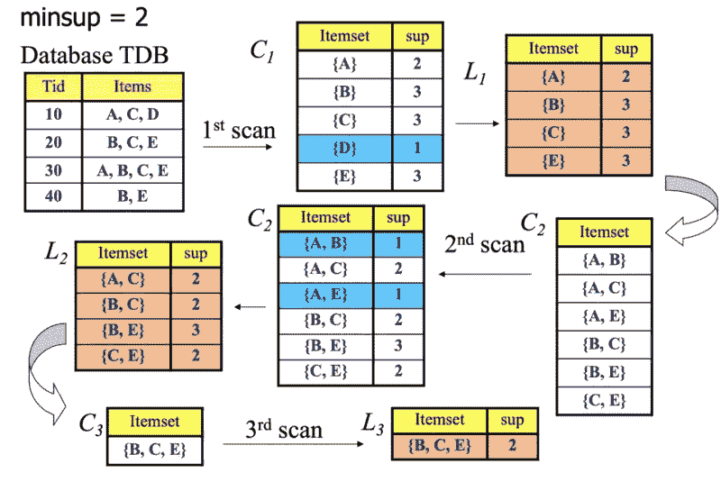

> *计算这些所选项目集(规则)的后期提升，如果该值低于阈值，则规则被删除，因为如果我们采用所有规则，算法可能需要时间来编译*

## 准备数据

> *在进行 apriori 之前，我们必须准备稀疏矩阵格式的数据，其中产品在列中，id 作为索引。最初我们根据购买的数量进行分组，后来我们用 0 和 1 进行编码*

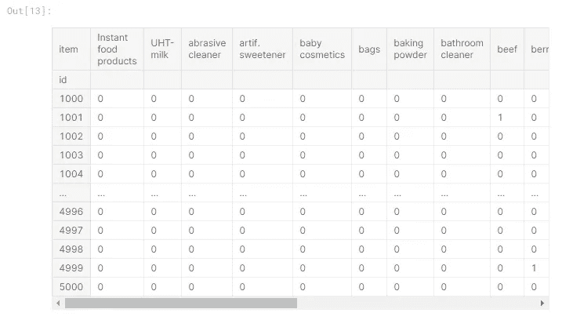

## 应用先验知识

> *这里我们应用 apriori 算法，得到所有的频繁项集(以 70%作为支持度阈值),并应用关联规则函数导出使用提升度量的规则*

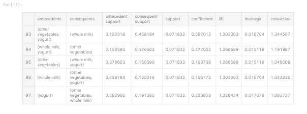

## 构建动态函数来定制规则

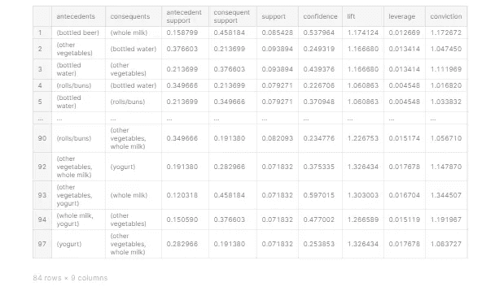

## 7.可视化结果

> *表格形式的结果不会对我们的算法传达太多的洞察力，所以让我们将规则可视化*

## *指标之间的关系*

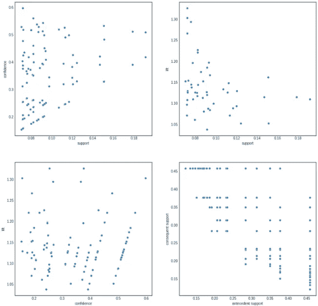

## 洞察力

*   支持和信心有一个暗淡的线性关系，这意味着最频繁的项目有一些其他项目与之相关联
*   当它上升时，当它超过 0.10 时，这种关系在支持中被压扁，在信任中没有关系
*   在前向和后向支持关系中，没有线性关系，而是相反，当后向支持增加时，前向支持减弱——我们可以把这种现象看作是当购买黄油的数量增加时，面包的数量减弱吗？

## 规则网络图

> *在这里，我们制作了指定数量的规则的网络图，从中我们可以看到连接到规则*的前因和后果

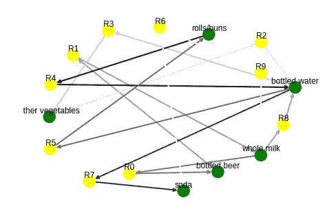

## 洞察力

*   借助于网络图来形象化比用表格形式来看更简单
*   指向规则(黄色圆圈)的箭头来自前提，而从规则圆圈出来的箭头指向结果。

## 使用热图的关联强度

> *我们已经发现了物品之间的关联，如果我们不知道它们之间关系的强度又有什么用呢*

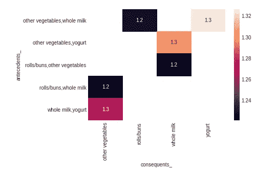

## 洞察力

*   酸奶、牛奶和蔬菜之间有着紧密的联系
*   卷包子和全脂奶高度相关。

# 8.结论

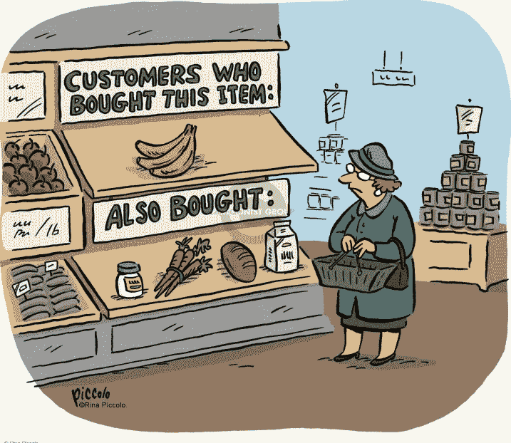

*   用 **Apriori 算法**建立的模型
*   人们认为 apriori 算法在关联规则应用中是有效的，并且每次都给出恒定的结果

> *在本次分析中，没有用任何测试数据对模型进行评估，应在评估中加入以下观点。*

*   异常迹象的检测(稀有物品)-可以帮助推动该物品与相关物品
*   支持和信心的重要性与提升的平衡
*   可视化的模型可解释性

请访问我的 [Kaggle 笔记本](https://www.kaggle.com/benroshan/market-basket-analysis)，它有所有在数据集上执行的 EDA