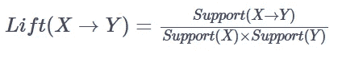

# PYTHON 中的购物篮分析

> 原文：<https://medium.com/analytics-vidhya/market-basket-analysis-in-python-8c857d0d357d?source=collection_archive---------3----------------------->


# 购物篮分析有什么用？

1.  构建一个推荐引擎。
2.  完善产品推荐。
3.  交叉销售产品。
4.  改善库存管理。
5.  追加销售产品。

让我们理解如何使用本文中解释的用例。

```
#Loading packages
import numpy as np
import pandas as pd
from mlxtend.frequent_patterns import apriori
from mlxtend.frequent_patterns import association_rules#Reading Data 
retaildata = pd.read_excel('online_retail.xlsx')
retaildata.head()
```


```
retaildata.shape(541909, 8)
```

该数据记录了 8 个变量的 541909 个观察值。

然而，对于这种数据，在用于进一步分析之前，需要进行一些预处理。

# 预处理步骤

这包括:

1.  删除多余的空格
2.  删除重复项
3.  将发票号转换为字符串值
4.  删除信用交易

```
#Cleaning the data
retaildata['Description'] = retaildata['Description'].str.strip() 
retaildata.dropna(axis=0, subset=['InvoiceNo'], inplace=True) 
retaildata['InvoiceNo'] = retaildata['InvoiceNo'].astype('str')
retaildata = retaildata[~retaildata['InvoiceNo'].str.contains('C')] 
retaildata.head()
```


```
retaildata.shape(532621, 8)
```

现在数据已经准备好用于 8 个变量的 532621 个观察值。

```
retaildata['Country'].value_counts()United Kingdom          487622
Germany                   9042
France                    8408
EIRE                      7894
Spain                     2485
Netherlands               2363
Belgium                   2031
Switzerland               1967
Portugal                  1501
Australia                 1185
Norway                    1072
Italy                      758
Channel Islands            748
Finland                    685
Cyprus                     614
Sweden                     451
Unspecified                446
Austria                    398
Denmark                    380
Poland                     330
Japan                      321
Israel                     295
Hong Kong                  284
Singapore                  222
Iceland                    182
USA                        179
Canada                     151
Greece                     145
Malta                      112
United Arab Emirates        68
European Community          60
RSA                         58
Lebanon                     45
Lithuania                   35
Brazil                      32
Czech Republic              25
Bahrain                     18
Saudi Arabia                 9
Name: Country, dtype: int64
```

检查基于国家人口统计的值，可以看到英国在交易数量上居首位。

现在让我们对数据进行子集划分，仅包括 1185 笔澳大利亚交易，如下所示:

```
#Separating transactions for Australia
transaction_basket = (retaildata[retaildata['Country'] =="Australia"]
          .groupby(['InvoiceNo', 'Description'])['Quantity']
          .sum().unstack().reset_index().fillna(0)
          .set_index('InvoiceNo'))
```

接下来，我们对这些值进行编码，1 表示交易的存在，否则为 0，然后继续进行购物篮分析。

```
#Converting all positive values to 1 and everything else to 0
def encode_units(x):
    if x <= 0:
        return 0
    if x >= 1:
        return 1

transaction_basket_sets = transaction_basket.applymap(encode_units)

#Removing "postage" as an item
transaction_basket_sets.drop('POSTAGE', inplace=True, axis=1)#Viewing the transaction basket
transaction_basket.head()
```


# 关键步骤

购物篮分析包括:

1.  构建关联规则
2.  识别经常一起购买的物品

关联规则解释了以下关系:


重要的关联规则如下:

支持

它决定了产品的购买频率:


信心

它测量 Y 中的项目在包含 X 的交易中出现的频率，如下所示:


电梯

它告诉我们商品 Y 与商品 x 一起购买的可能性有多大。Lift > 1 表示这些商品有可能一起购买，并强调关联规则更擅长预测结果，而不仅仅是假设。因此，提起< 1 signifies a poor association rule.



# Market Basket Analysis and making recommendations

In this section let us find out the most frequent items by setting a minimum support threshold of 0.7 and then generate rules using the lift metric as seen below:

```
#Generating frequent itemsets
frequent_itemsets = apriori(transaction_basket_sets, min_support=0.07, use_colnames=True)#Generating rules
rules = association_rules(frequent_itemsets, metric="lift", min_threshold=1)#viewing top 100 rules
rules.head(10)
```


Let us now consider the first rule where the antecedent is the ’36 PENCILS TUBE RED RETROSPOT’ and the consequent is the ‘RED RETROSPOT CAKE STAND’. To begin with this is a strong rule as it has a lift value > 1。

```
transaction_basket_sets['36 PENCILS TUBE RED RETROSPOT'].sum()4transaction_basket_sets['RED RETROSPOT CAKE STAND'].sum()4
```

在查看这种前因后果规则的交易篮时，可以说购买“36 支铅笔管红色追溯点”的 4 个人也是购买“红色追溯点蛋糕架”的人。

可以建议将这些物品放在一起，增加销售数量。

# 针对结果可视化一个先行 lhs 项目的结果

```
# Viewing results for one antecedent lhs item against consequents 
import seaborn as sns
import matplotlib.pyplot as plt

# Replacing the sets with strings
rules['antecedents_'] = rules['antecedents'].apply(lambda a: ','.join(list(a)))
rules['consequents_'] = rules['consequents'].apply(lambda a: ','.join(list(a)))

# Transforming the dataframe of rules into a matrix using the lift metric
pivot = rules.pivot(index = 'antecedents_',columns = 'consequents_', values= 'lift')

# Generating a heatmap
sns.heatmap(pivot, annot = True)
plt.yticks(rotation=0)
plt.xticks(rotation=90)
plt.show()
```


注意:这种可视化可以为其他规则定制，这些规则的每个结果都有一个以上的前提。