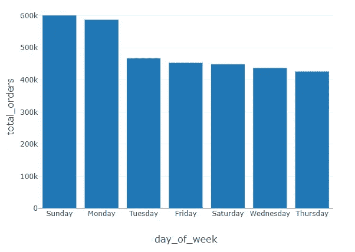

# 使用 Spark 对 Instacart 的 300 万份订单进行购物篮分析。

> 原文：<https://medium.com/analytics-vidhya/market-basket-analysis-on-3-million-orders-from-instacart-using-spark-24cc6469a92e?source=collection_archive---------2----------------------->

*使用****FP-growth****算法分析超市产品之间的关联*


世界各地的超市都在使用数据挖掘技术来分析用户的购买模式，以使他们的业务更有效率，从而增加他们的业务，同时满足客户的需求。其中一个应用是确定哪些商品是消费者倾向于一起购买的，并分析“如果-那么”模式，以了解消费者是否购买了 A，哪些是 B，以便向消费者推荐。这有助于他们将正确的产品放在正确的通道上，从而帮助消费者回忆起他们的需求。这有助于消费者根据自己的需求储备冰箱和家居用品，同时减少购买时间。

在这个项目中，我将使用来自 Kaggle 的 **Instacart 的真实数据集，其中包含来自 20 万用户的 300 万份杂货订单的数据。对于每个用户，根据他们从 Instacart 购买的次数，大约有 4 到 100 个不同的订单。以下是数据集的链接:**

[https://www . ka ggle . com/c/insta cart-market-basket-analysis/data](https://www.kaggle.com/c/instacart-market-basket-analysis/data)

我将展示 spark 上的实现，因为它在 **Databricks** 上运行非常快，因为它使用分布式进程内计算，即使在如此大的数据集上也只需很少的时间。幸运的是，我们在 **spark** 上已经有了 **FP(频繁模式挖掘)库**，因此我将使用它来理解模式。我们开始吧。

**注** : Databricks 提供用户免费使用他们的社区平台。所以，请随意复制代码，看看模式挖掘的魔力。

让我们从将所有文件导入 spark 数据框开始:

```
*#checking the files we have in the databricks file system*

%fs ls /FileStore/tables
```


```
*#enabling arrow just for a backup if pandas is needed at any point of time*
**import** **numpy** **as** **np**
**import** **pandas** **as** **pd** *#Importing all the available files into the spark dataframe*
aisles = spark.read.csv("/FileStore/tables/aisles.csv", header=**True**, inferSchema=**True**)
departments = spark.read.csv("/FileStore/tables/departments.csv", header=**True**, inferSchema=**True**)
order_products_prior = spark.read.csv("/FileStore/tables/order_products__prior.csv", header=**True**, inferSchema=**True**)
order_products_train = spark.read.csv("/FileStore/tables/order_products__train.csv", header=**True**, inferSchema=**True**)
orders = spark.read.csv("/FileStore/tables/orders.csv", header=**True**, inferSchema=**True**)
products = spark.read.csv("/FileStore/tables/products.csv", header=**True**, inferSchema=**True**)

*# Create Temporary Tables to work using sql like commands*
aisles.createOrReplaceTempView("aisles")
departments.createOrReplaceTempView("departments")
order_products_prior.createOrReplaceTempView("order_products_prior")
order_products_train.createOrReplaceTempView("order_products_train")
orders.createOrReplaceTempView("orders")
products.createOrReplaceTempView("products")
```

# 以下是所有文件的数据字典:

# 1)订单(340 万行，20.6 万用户):

order_id:订单标识符

user_id:客户标识符

eval_set:该订单属于哪个评估集(请参见下面描述的评估集)

order_number:该用户的订单序号(1 =第一个，n =第 n 个)

order_dow:下订单的那一天

order_hour_of_day:一天中下订单的时间

days_since_prior:自上次订单以来的天数，上限为 30 天(order_number 的 NAs = 1)

# 2)产品(50k 行):

产品标识:产品标识符

产品名称:产品的名称

aisle_id:外键

部门标识:外键

# 3)过道(134 排):

过道标识:过道标识

过道:过道的名称

# 4)部门(21 行):

部门标识:部门标识

部门:部门的名称

# 5)订单 _ 产品 _ _ 集(30m+行):

order_id:外键

产品标识:外键

add_to_cart_order:每个产品添加到购物车的顺序

重新订购:如果该用户过去订购过该产品，则为 1；否则为 0，其中 SET 是以下四个评估集之一(订单中的 eval_set):

“之前”:用户最近订单之前的订单(约 320 万份订单)

“培训”:提供给参与者的培训数据(约 13.1 万份订单)

“测试”:为机器学习竞赛保留的测试数据(约 75k 订单)

现在让我们利用。在 spark 中展示函数，做一些基本的探索性数据分析，熟悉数据。

```
*#Top 5 orders in the orders dataframe*
orders.show(n=5)
```


```
products.show(n=5)
```


```
order_products_train.show(n=5)
```


```
order_products_prior.show(n=5)
```


```
departments.show(n=5)
```


```
aisles.show(n=5)
```


现在让我们来看看订单总数在一周的不同日子里有什么不同。

```
%sql
select 
  count(order_id) **as** total_orders, 
  (case 
     when order_dow = '0' then 'Sunday'
     when order_dow = '1' then 'Monday'
     when order_dow = '2' then 'Tuesday'
     when order_dow = '3' then 'Wednesday'
     when order_dow = '4' then 'Thursday'
     when order_dow = '5' then 'Friday'
     when order_dow = '6' then 'Saturday'              
   end) **as** day_of_week 
  **from** **orders**  
 group by order_dow 
 order by total_orders desc
```



Instacart 的大部分订单都是在周日或者周一下的。似乎人们在周末娱乐结束后会想起他们的需求。玩笑归玩笑，让我们也看看一天中的时间分布，以分析大多数用户从 Instacart 下单的时间。

```
%sql
select 
  count(order_id) **as** total_orders, 
  order_hour_of_day **as** hour 
  **from** **orders** 
 group by order_hour_of_day 
 order by order_hour_of_day
```


正如我们在上面的条形图中看到的，大多数订单都是在上午 10 点至下午 4 点之间下单的。这让我有点惊讶，因为我原本以为高峰会在办公时间之外。现在，让我们看看哪个部门在产品数量方面领先。

```
select countbydept.*
  **from** (
  -- **from** **product** table, let's count number of records per dept
  -- **and** then sort it by count (highest to lowest) 
  select department_id, count(1) **as** counter
    **from** **products**
   group by department_id
   order by counter asc 
  ) **as** maxcount
inner join (
  -- let's repeat the exercise, but this time let's join
  -- products **and** departments tables to get a full list of dept **and** 
  -- prod count
  select
    d.department_id,
    d.department,
    count(1) **as** products
    **from** **departments** d
      inner join products p
         on p.department_id = d.department_id
   group by d.department_id, d.department 
   order by products desc
  ) countbydept 
  -- combine the two queries's results by matching the product count
  on countbydept.products = maxcount.counter
```


个人护理部**和食品部**紧随其后的是**食品部**和**冷冻部**在产品数量上领先。现在，让我们想象一下，哪些产品是唯一订单数量最多的产品，这意味着获得最受欢迎的产品。

```
%sql
select count(opp.order_id) **as** orders, p.product_name **as** popular_product
  **from** **order_products_prior** opp, products p
 where p.product_id = opp.product_id 
 group by popular_product 
 order by orders desc 
 limit 10
```


香蕉、草莓和菠菜最受欢迎。事实上，大多数顶级产品看起来都是健康的。美国什么时候变得这么健康了？

接下来，我们必须准备好我们的数据，它可以被输入到**模式挖掘(FP 增长)算法**中。我们需要每一行都有一篮子一起订购的商品。让我们在输入算法之前创建一个篮子数据框架。

```
*# Organize the data by shopping basket*
**from** **pyspark.sql.functions** **import** collect_set, col, count
rawData = spark.sql("select p.product_name, o.order_id from products p inner join order_products_train o where o.product_id = p.product_id")
baskets = rawData.groupBy('order_id').agg(collect_set('product_name').alias('items'))
baskets.createOrReplaceTempView('baskets')rawData.show(5)
baskets.show(5)display(baskets)
```


```
print((baskets.count(), len(baskets.columns)))(131209, 2)
```

我们总共有大约 1，31，209 篮商品。现在让我们将这些数据输入 spark 中的 FPGrowth 算法。在此之前，让我们弄清楚一些术语-

# 1)支持:

这个度量提供了一个项目集在所有事务中出现频率的概念。直观地说，对于任何篮子 A，support 测量包含该篮子作为子集的事务的百分比。

# 2)自信:

这个度量定义了在购物车已经有先行词的情况下，在购物车上出现结果的可能性。直观地说，假设有一个篮子{a，b，c}有一个 support 's '，那么如果我们进行分析({a}意味着{b，c})，置信度就是包含{b，c}的{a，b，c}的交易的百分比。

# 3)电梯:

在计算{Y}给定{X}出现的条件概率时，取消对结果的支持(频率)的控制。电梯是超市用来放置产品的最重要的参数。把它想象成{X}对我们的信心的*提升*,因为{Y}在车上。换句话说，提升是在知道{X}存在的情况下将{Y}放在购物车上的概率比在不知道{X}存在的情况下将{Y}放在购物车上的概率的增加。

参考理解这些术语:

[https://towards data science . com/association-rules-2-aa9a 77241654](https://towardsdatascience.com/association-rules-2-aa9a77241654)

让我们将最小支持度设置为 0.001，这意味着对于我们的分析，我们将分析的任何篮子都应该至少出现 0.001* 1，31，209 ( 131)次，以便在我们的频繁模式分析中加以考虑。

```
%scala
**import** **org.apache.spark.ml.fpm.FPGrowth**

// Extract out the items 
val baskets_ds = spark.sql("select items from baskets").**as**[Array[String]].toDF("items")

// Use FPGrowth
val fpgrowth = new FPGrowth().setItemsCol("items").setMinSupport(0.001).setMinConfidence(0)
val model = fpgrowth.fit(baskets_ds)%scala
// Display frequent itemsets
val mostPopularItemInABasket = model.freqItemsets
mostPopularItemInABasket.createOrReplaceTempView("mostPopularItemInABasket")
```

现在，让我们看看最常见的一篮子商品。

```
%sql
select items, freq **from** **mostPopularItemInABasket** where size(items) > 2 order by freq desc limit 20
```


现在，让我们使用 FP-growth 算法的关联规则属性来分析 if-then 关联，并查看不同项目的置信度和提升值。**对于有助于 Instacart 的规则，提升值应该是> 1。**

```
%scala
// Display generated association rules.
val ifThen = model.associationRules
ifThen.createOrReplaceTempView("ifThen")%sql
select * **from** **ifThen** where lift > 1 order by lift desc
```


从上表中我们可以看到，lift 值的递减规律，如果有人购买[“草莓大黄酸奶”]，他购买[“蓝莓酸奶”]的几率非常高

按照置信度的顺序显示会导致以下结果。

注意:Lift 量化了因前因而独一无二的关联的力量，而 confidence 仅仅是有前因时后果发生的概率。

```
%sql
select antecedent **as** `antecedent (**if**)`, consequent **as** `consequent (then)`, confidence **from** **ifThen** order by confidence desc limit 20
```


参考:[https://S3 . us-east-2 . Amazon AWS . com/data bricks-Denny lee/notebooks/Market+Basket+Analysis+using+insta cart+Online+杂货+Dataset.html](https://s3.us-east-2.amazonaws.com/databricks-dennylee/notebooks/Market+Basket+Analysis+using+Instacart+Online+Grocery+Dataset.html)