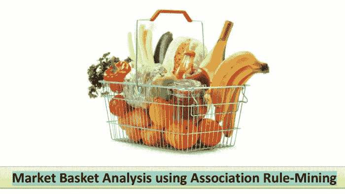

# 基于关联规则挖掘的购物篮分析

> 原文：<https://medium.com/analytics-vidhya/market-basket-analysis-using-association-rule-mining-64b4f2ae78cb?source=collection_archive---------9----------------------->

使用 Python 在数据库中进行无监督学习和知识发现

最近，我有机会做一个基于市场篮子分析的项目，我在这里分享我的经验。

什么是购物篮分析？

购物篮分析是大型零售商使用的基本技术之一，以揭示…