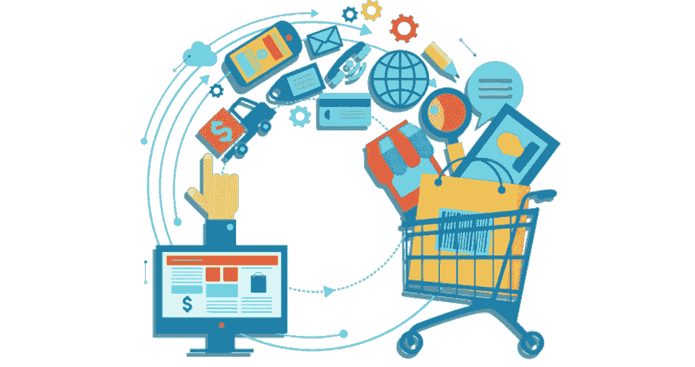
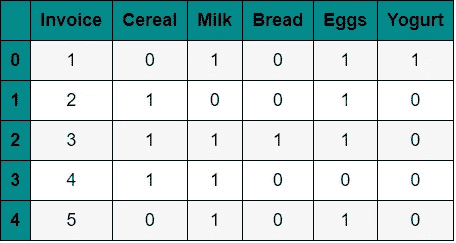
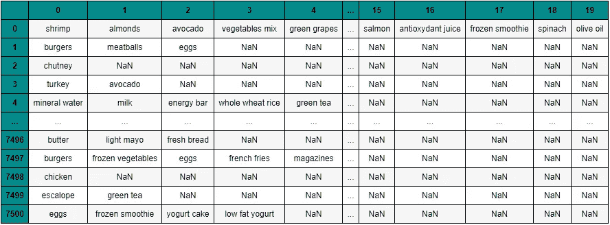
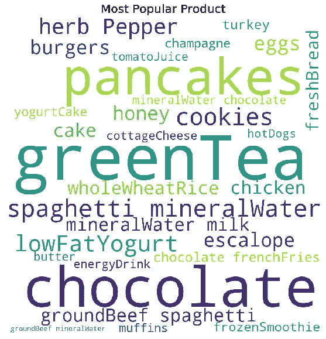
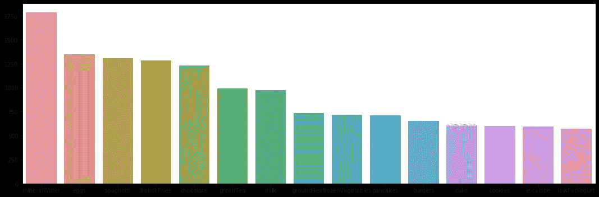
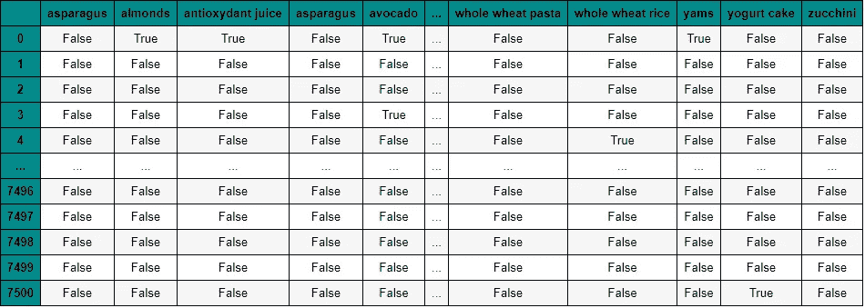
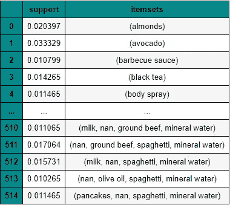
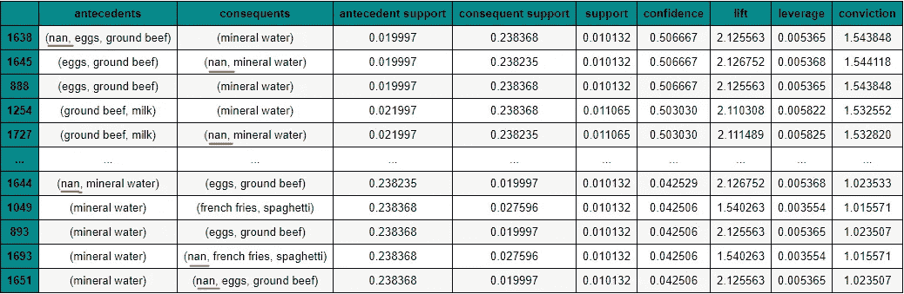
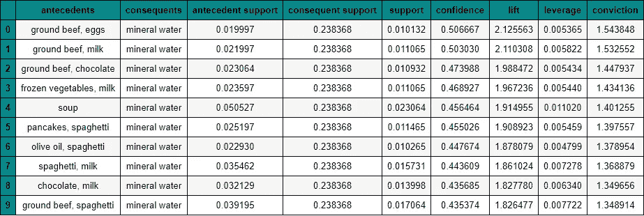

# 基于 Apriori 算法的购物篮分析

> 原文：<https://medium.com/analytics-vidhya/market-basket-analysis-with-apriori-algorithm-d2b9dfba6360?source=collection_archive---------8----------------------->



资料来源:clip.cookdiary.net

大家好，这次我想分享一个关于关联规则挖掘的分析。关联规则挖掘是一种发现项目组合之间关联规则的数据挖掘技术。你明白了吗，伙计？例如，来自超市购买分析的关联规则是了解顾客有多大可能购买牛奶和麦片。有了这种分析，超市老板可以安排商品的摆放或设计针对某些组合商品的打折营销活动。

关联规则挖掘成为零售业中常见的分析方法。关联规则挖掘也称为术语*购物篮分析、*，我们可以在我们的分析中获得与三个重要参数(**支持度**、**置信度**、&、升力良好结合的信息

最大的零售公司的一个例子是亚马逊，它已经应用于分析客户的购买习惯，通过发现客户放在他们的“*篮子*”中的不同商品之间的关联。在预处理这个数据集之前，让我先介绍一下我在这个分析中使用的算法。

# Apriori 算法

Apriori 算法用于发现数据集中一个或多个项目之间的关系模式，该算法假设频繁项目集的任何子集都必须是频繁的。下面我们来可视化一个例子！

这里是一个由四个发票(交易)组成的数据集。每张发票都是 0 和 1 的组合，其中 0 代表没有某个项目，1 代表有该项目。



就像我之前说的，关联规则的重要性可以由三个参数决定。

1.  **Support** 是包含特定项目组合的事务相对于数据库中事务总数的百分比。

支持(谷物)=(涉及葡萄的交易)/(总交易)

2.**置信度**是条件概率的度量。假设左手边的物品(**前因**)被购买，那么右手边的物品(**后果**)也将被购买。

置信度(**前因** = > **后果** ) =(同时涉及**前因**和**后果**的交易)/(仅涉及**前因**的交易)

**信心**((牛奶、鸡蛋)= >酸奶)= **支持**(牛奶&鸡蛋&酸奶)/ **支持**(牛奶&鸡蛋)

3. **Lift 是**它是所有项目一起发生的概率除以**前因**和**后果**的乘积，就好像它们彼此独立地发生一样

Lift( **前因** = > **后果** ) = Confidence( **前因**，**后果** ) / Support( **后果**

因此，客户同时购买**前因**和**后果**的可能性是单独购买的机会的“提升价值”倍。

*   **Lift(前因= >后果)** = 1 表示项集内没有相关性。
*   **Lift(antecedent =>outcome)**>1 表示项目集内部存在正相关关系，即项目集中的产品， **antecedent** *，*和**outcome**更有可能一起购买。
*   **Lift(antecedent =>outcome)**<1 表示项目集内部存在负相关，即项目集中的产品， **antecedent** *，*和**outcome**不可能一起购买。

# apriori 算法简介

这个数据集是我从 kaggle 获得的，包含了顾客在超市购买不同杂货的信息。我有大约 7000 行数据。在使用 apriori 算法进行建模之前，让我们先研究一下这个数据集。



我有大约 7500 行数据，用于为每个组合项创建关联规则。

## 探索性数据分析



我用文字云和 30 个项目限制这个图像。



我用 seaborn plot 制作这个图。

从这个图中，我得出结论，这个交易主要是矿泉水，以及一些基本需求(可能是早餐)，如鸡蛋、意大利面和薯条。

## apriori 算法是如何工作的？

首先，我将为这个分析获取所有的“缺失值”,并尝试在结果的最后处理它。第一步使一个频繁项集的所有子集必须是频繁的，用*频率表*对每个事务进行处理。



交易编码器频率表的结果

下一步是构建 apriori 模型，您可以在 mlxtend 包中更改 apriori 模型的所有参数。我将尝试使用参数**最小支持**进行建模。这意味着支持大于参数将显示在结果中。

```
**from** mlxtend.frequent_patterns **import** apriori**frequent_itemsets**= **apriori**(data, **min_support** = 0.01, use_colnames = True)
```



结果中有很多缺失值，所以我无法对缺失值的项集做出结论。

在我尝试处理丢失的值之前，我将生成最低支持度至少为 1%的*frequency _ items sets*,因为这是一个更有利的支持度，可以向我们显示更多的结果。



关联规则的结果为每个项集但有许多遗漏值。

## 最终关联规则结果

从上面的关联规则结果来看，有许多遗漏的值。我无法将项目集与缺少的值组合起来。因此，我将尝试处理前件和后件中每个项目集缺少的值。他们俩的结果是一个*冷冻群。*

> frozenset()方法返回一个不可变的 frozenset 对象，该对象用给定 iterable 中的元素初始化。

我将把不可变的 frozenset 改为项目集列表，然后尝试为每个有缺失值的项目集检测缺失值( **drop nan values** )。



对于每个关联规则项集的最终结果，我从最高置信度值到最低置信度值排序(按降序排序)。我取前 10 个项目集。

从结果来看，关联规则“if**ground beef&eggs**then**mineral water**”的提升是 2.12，因为置信度是 50%(该数据集的最高置信度)。这意味着购买**碎牛肉&鸡蛋**的消费者购买矿泉水的可能性是随机选择的消费者的 2.12 倍。更大的升力意味着更有趣的规则。高支持度的关联规则是潜在有趣的规则。类似地，高可信度的规则也是有趣的规则。所以，你可以得出关联规则中三个参数最高的结论。

> **成果及应用:**
> 
> 交叉销售可以通过捆绑销售项目/产品来改善
> 
> 促销活动可以提高顾客不买的商品的销量
> 
> 商店布局可以修改，这样当某些项目/产品放在一起时，销售额可以提高。

以上都是我的看法，希望大家能对这个数据集有所感悟。我做的每一个模型都还有很多错误和缺点。关于这些数据的更多细节，代码，和更多的可视化你可以通过点击这个链接[https://github.com/Anugrahn](github.com/Anugrahn/Data-Science-Practice)到达我的 github。随便问，让我们开始讨论家伙！

谢谢，我希望你们喜欢它。下一个故事再见。祝您愉快！:)

来源:

1.  来自*kaggle.com*的数据集购物篮优化
2.  来自*mlx tend&frozenset python*的原始文档
3.  菜篮子分析入门从[*https://towardsdatascience.com/*](https://towardsdatascience.com/market-basket-analysis-978ac064d8c6)*&*[https://datapenchant.com/market-basket-analysis/](https://datapenchant.com/market-basket-analysis/)