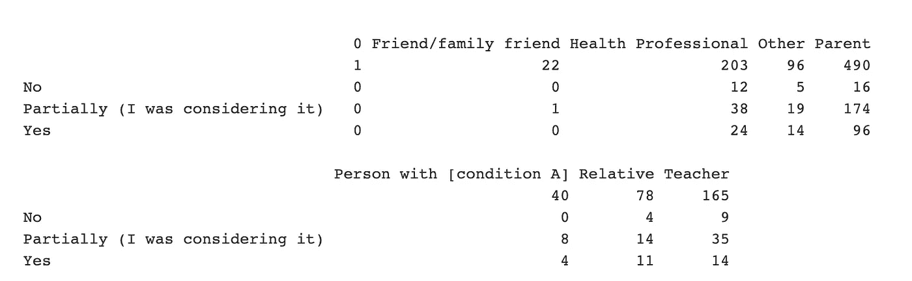
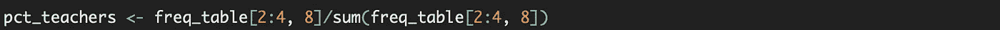
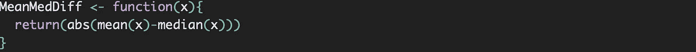

# 使用 R part2 进行营销分析

> 原文：<https://medium.com/analytics-vidhya/marketing-analysis-using-r-part2-4e864036fbc5?source=collection_archive---------29----------------------->

大家好，我们可能都知道 table()是研究我们数据集的一个有用函数。还可以用来计算双向频率表！

下面是一个使用我们的(第 1 部分)营销数据集来分析按用户配置文件分类的购买意向(intentWasPlanningToBuy)的示例。

有了双向频率表后，你可能会有更多的问题，比如有购买意向的家长或教师的比例是多少？这里，我省略了意图不明的观察(空白)。我以教师为例:

很容易看出，2:4 表示我们想要保留的三行，因为我们省略了第一行(空白)。8 表示名为“教师”的第八列变量。在分母中，我们将所有的值相加，以得出最终打算购买的教师的百分比。

我想在这里讨论的另一个有用的工具叫做匿名函数。有时候，我们需要编写定制的函数。例如，如果您想要计算一个向量的平均值和中值之间的绝对差值。您可能需要创建一个如下所示的函数:

如果要计算第 38 到 45 列的 MeanMedDiff，可以使用 apply()并设置 MARGIN = 2 来表示列。(边距=1 表示行)

然而，你不必先写一个函数并给它一个名字。可以直接在 apply()内部编写，而不需要调用函数名，这也是为什么称之为匿名函数的原因。

您可以看到，我们在 apply()中将函数名替换为它的算法。看起来非常简单易学。请随意在您的营销数据集中试用它们！谢谢你。